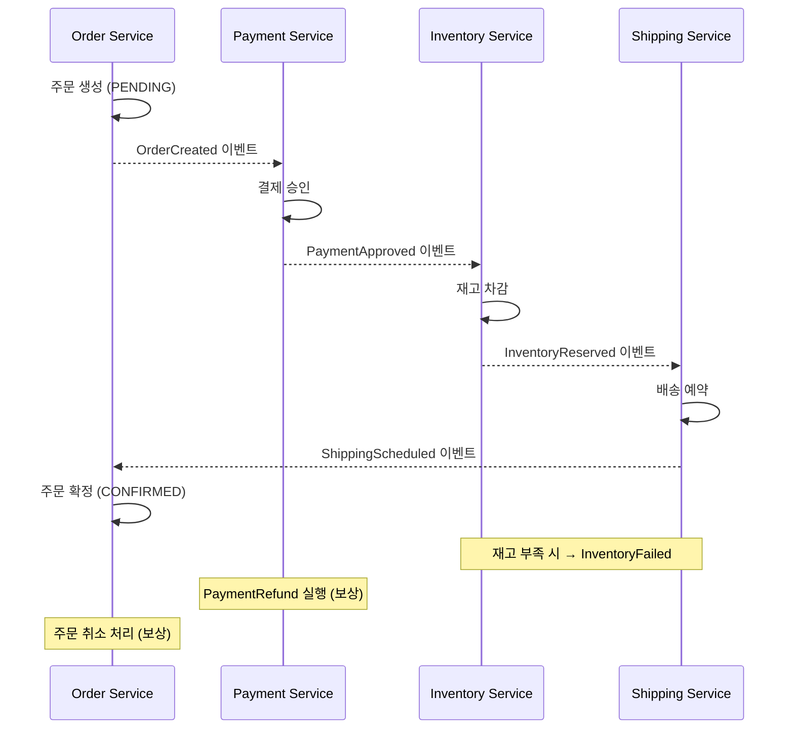

### Saga 패턴 — 분산 트랜잭션의 현실적 대안, 그리고 Choreography vs Orchestration의 갈림길

MSA로 쪼갠 순간 우리는 ACID를 잃는다. 주문 서비스가 결제 서비스, 재고 서비스, 배송 서비스와 각기 다른 DB를 쓰는 순간 "주문 생성 → 결제 승인 → 재고 차감 → 배송 요청"을 하나의 트랜잭션으로 묶을 방법이 없다. 2PC(Two-Phase Commit)를 쓰면 되지 않냐고? 이론적으로는 가능하지만 실무에서는 거의 죽은 패턴이다. Coordinator가 SPOF가 되고, Prepare 단계에서 모든 참여자의 락이 걸려 가용성이 급락하며, Kafka·Redis·NoSQL 같은 XA 미지원 시스템과는 아예 붙지 않는다. **Saga는 "긴 트랜잭션을 로컬 트랜잭션의 연쇄로 쪼개고, 실패 시 보상 트랜잭션(Compensating Transaction)으로 되돌린다"는 아이디어**로 이 문제를 우회한다.

#### 핵심 아이디어: 원자성을 포기하고, 최종 일관성을 얻는다

Saga는 1987년 Hector Garcia-Molina 논문에서 나온 개념이다. 원본 아이디어는 이렇다.

```
T1 → T2 → T3 → T4 → T5  (정상 흐름)

T3에서 실패하면?
T1 → T2 → T3(실패) → C2 → C1  (보상 트랜잭션 역순 실행)
```

여기서 중요한 건 **각 Ti는 로컬 트랜잭션으로 이미 커밋됐다**는 점이다. 롤백이 불가능하니 "논리적 취소"를 수행하는 Ci를 명시적으로 설계해야 한다. 결제를 취소하는 게 아니라 "환불"을, 재고를 원복하는 게 아니라 "재입고"를 실행하는 식이다. 이 지점에서 도메인 모델링이 뒤틀린다. 취소 불가능한 액션(이메일 발송, 외부 API 호출)은 어떻게 보상할 것인가? → **Semantic Compensation(의미적 보상)**: 발송 취소 이메일을 다시 보낸다. 또는 **Pivot Transaction(피벗 트랜잭션)** 이후 단계는 보상 없이 재시도만 하도록 설계한다. 이 둘의 구분이 Saga 설계의 첫 갈림길이다.

#### 두 가지 구현 방식

Saga를 구현하는 방법은 크게 두 가지다. 이 선택이 시스템의 성격을 결정한다.

**1. Choreography(코레오그래피) — 이벤트 기반 분산 조율**

각 서비스는 이벤트를 발행하고, 관심 있는 서비스가 구독해서 다음 액션을 수행한다. 중앙 조정자가 없다.



**2. Orchestration(오케스트레이션) — 중앙 조정자가 지휘**

Saga Orchestrator라는 별도 컴포넌트가 각 서비스에 명시적으로 커맨드를 보내고 응답을 받아 다음 스텝을 결정한다.

```
┌──────────────────────────────────────────┐
│         Order Saga Orchestrator          │
│   (상태머신: 각 스텝의 성공/실패 관리)   │
└──────────────────────────────────────────┘
       │        │         │          │
       ▼        ▼         ▼          ▼
   ┌────────┐ ┌────────┐ ┌────────┐ ┌────────┐
   │Order   │ │Payment │ │Inventory│ │Shipping│
   │Service │ │Service │ │Service  │ │Service │
   └────────┘ └────────┘ └────────┘ └────────┘

정상: ExecutePayment → ExecuteReserve → ExecuteShipping
실패: Orchestrator가 역순으로 CompensatePayment / CompensateReserve 호출
```

#### 트레이드오프: 어떤 걸 언제 쓸 것인가

| 관점 | Choreography | Orchestration |
|---|---|---|
| **결합도** | 낮음 (이벤트만 알면 됨) | 중간 (Orchestrator가 도메인 흐름을 안다) |
| **가시성** | 낮음 — "지금 어디까지 왔지?" 추적이 지옥 | 높음 — Orchestrator 상태만 보면 됨 |
| **순환 의존** | 발생 위험 (A→B→C→A 이벤트 루프) | 없음 (중앙 지휘) |
| **테스트 용이성** | 어려움 (전체 흐름이 코드에 없음) | 쉬움 (Orchestrator 단위 테스트 가능) |
| **참여 서비스 확장** | 쉬움 (구독만 추가) | Orchestrator 수정 필요 |
| **적합한 스텝 수** | 2~4개 | 5개 이상, 조건 분기 다수 |
| **디버깅** | 분산 트레이싱 없으면 실질적으로 불가 | 상태머신 로그 조회로 해결 |

**시니어 관점의 판단 기준**:
- **스텝이 3개 이하이고, 흐름이 선형이며, 각 팀이 독립적으로 배포한다** → Choreography
- **스텝이 많고, 조건 분기(예: VIP 고객은 재고 확인 스킵)가 있으며, "지금 상태 뭐임?" 문의가 CS로 들어온다** → Orchestration

#### 실제 사례

**Uber (Cadence/Temporal)**: 라이드 매칭·결제·정산이 얽힌 복잡한 워크플로우를 관리하기 위해 Cadence라는 Orchestration 프레임워크를 자체 개발했다(현재 Temporal로 오픈소스화). 이유는 명확하다 — 라이드가 취소되면 어디까지 진행됐고 어떤 보상을 해야 하는지 코드로 명시하지 않으면 CS 대응이 불가능하다. 상태머신을 "코드처럼 짜고, 워크플로우 엔진이 영속화"하는 방식으로 접근했다.

**Netflix**: 마이크로서비스 초기에는 이벤트 기반 Choreography로 시작했지만, 서비스가 700개를 넘어가면서 "이벤트 그래프의 순환 참조"가 발생해 Conductor라는 Orchestration 엔진을 도입했다. 이는 "MSA 초기 → Choreography, 규모 확장 후 → Orchestration"이라는 흔한 진화 경로를 보여준다.

**Amazon 주문 처리**: Step Functions로 Orchestration을 구현한다. 결제 실패 시 재시도 정책, 배송 실패 시 창고 전환 로직 등 조건 분기가 20개를 넘어가는 시나리오에서 이벤트 기반은 유지보수가 불가능하다는 결론에서 나온 선택이다.

#### 언제 Saga를 쓰면 안 되는가

1. **강한 일관성이 반드시 필요한 도메인** — 금융 정산의 원장 기록, 재고의 물리적 이동 같은 영역. 최종 일관성으로 몇 초라도 흔들리면 안 되는 곳은 애초에 하나의 서비스로 묶어라(모듈러 모놀리스가 나은 선택).
2. **보상이 의미적으로 불가능한 액션 뒤에 다른 스텝이 오는 경우** — 이메일 발송 후 실패 시 "발송 취소 이메일"이 사용자 경험을 더 망친다면 Saga 자체가 잘못된 선택이다. 이런 액션은 반드시 마지막 단계로 배치하라.
3. **참여 서비스가 2개뿐인 경우** — 그냥 동기 호출 + 트랜잭셔널 Outbox로 충분하다. Saga의 복잡도를 감당할 필요가 없다.

#### 반드시 함께 가는 설계 요소

- **멱등성(Idempotency)**: 보상 트랜잭션이 재시도돼도 안전해야 한다. `refund_id`를 유니크 키로 두고 중복 요청을 걸러라.
- **Outbox 패턴**: 로컬 DB 커밋과 이벤트 발행의 원자성을 확보해야 Saga의 각 스텝이 신뢰 가능해진다.
- **분산 트레이싱**: 특히 Choreography에서는 `traceId`(Correlation ID)를 이벤트에 심지 않으면 실서비스에서 디버깅 자체가 불가능하다.
- **Saga 상태 조회 API**: 사용자와 CS가 "내 주문 지금 어디까지 왔어?"를 물을 때 답할 수 있어야 한다. Orchestrator가 있다면 자연스럽고, Choreography라면 Saga Log를 별도로 쌓아야 한다.

> 💡 **왜 중요한가**: Saga는 "ACID를 포기한 세계에서 비즈니스 일관성을 유지하는 유일한 실용적 방법"이며, Choreography와 Orchestration 중 무엇을 고르는가는 팀 규모·도메인 복잡도·운영 가시성의 트레이드오프를 종합한 아키텍트의 판단이다.
