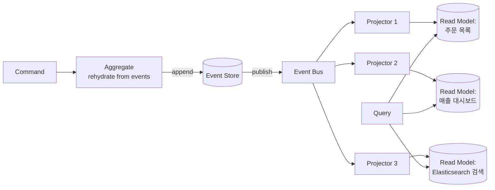

### Event Sourcing — "현재 상태"가 아니라 "일어난 사건들"을 저장하는 관점의 전환

전통적인 CRUD는 **최종 상태**를 저장한다. `orders` 테이블의 한 행은 "지금 이 주문의 모습"이다. `UPDATE`가 실행되는 순간, 이전 값은 사라진다. Event Sourcing(ES)은 이 전제를 뒤집는다. 상태는 저장하지 않는다. **상태를 만들어낸 이벤트들의 시퀀스**를 append-only로 저장하고, 현재 상태는 그 이벤트들을 재생(replay)해서 계산한다.

```
[전통 CRUD]
orders 테이블
┌────┬────────┬──────────┐
│ id │ status │ total    │
├────┼────────┼──────────┤
│ 42 │ PAID   │ 30,000   │  ← 지금 이 순간의 스냅샷만 존재
└────┴────────┴──────────┘

[Event Sourcing]
event_store (append-only)
┌────────┬─────────────────┬──────────────────────────┬─────────┐
│ seq_no │ aggregate_id    │ event_type               │ payload │
├────────┼─────────────────┼──────────────────────────┼─────────┤
│ 1      │ order-42        │ OrderCreated             │ {...}   │
│ 2      │ order-42        │ OrderItemAdded           │ {...}   │
│ 3      │ order-42        │ OrderItemAdded           │ {...}   │
│ 4      │ order-42        │ DiscountApplied          │ {...}   │
│ 5      │ order-42        │ OrderPaid                │ {...}   │
└────────┴─────────────────┴──────────────────────────┴─────────┘
current_state = fold(events, initialState, apply)
```

#### 상태를 어떻게 복원하는가

Aggregate는 자신의 이벤트들을 처음부터 순서대로 apply해서 현재 상태를 재구성한다.

```java
public class Order {
    private OrderId id;
    private OrderStatus status;
    private Money total = Money.ZERO;
    private List<DomainEvent> uncommittedEvents = new ArrayList<>();

    public static Order rehydrate(OrderId id, List<DomainEvent> history) {
        Order order = new Order();
        order.id = id;
        history.forEach(order::apply);
        return order;
    }

    public void addItem(Item item) {
        applyAndRecord(new OrderItemAdded(id, item, Instant.now()));
    }

    private void applyAndRecord(DomainEvent event) {
        apply(event);
        uncommittedEvents.add(event);
    }

    private void apply(DomainEvent event) {
        switch (event) {
            case OrderCreated e -> this.status = OrderStatus.CREATED;
            case OrderItemAdded e -> this.total = this.total.add(e.item().price());
            case OrderPaid e -> this.status = OrderStatus.PAID;
            default -> throw new IllegalStateException("Unknown event: " + event);
        }
    }
}
```

핵심은 `apply()`가 **결정적(deterministic)**이라는 점이다. 같은 이벤트 시퀀스는 항상 같은 상태를 만든다. 이 특성이 ES의 모든 힘의 원천이다.

#### 왜 이런 짓을 하는가 — 얻는 것

1. **감사 로그가 공짜다**. "이 주문의 배송지가 언제 바뀌었지?"에 대한 답이 이미 저장되어 있다. 규제 산업(금융, 의료, 공공)에서는 이것 하나로 채택 이유가 충분하다.
2. **시간 여행(Temporal Query)**. "2026-04-01 시점의 이 계좌 잔액은?" 같은 질문에 답할 수 있다. 이벤트를 그 시점까지만 replay하면 된다.
3. **버그 재현과 디버깅**. 프로덕션 이벤트를 스테이징에 replay해서 그 상태를 그대로 재현할 수 있다.
4. **새로운 뷰의 소급 생성**. "지역별 매출 대시보드"라는 요구가 나중에 들어와도, 과거 이벤트를 replay해서 새 read model을 만들 수 있다. CRUD였다면 "그 데이터는 없어요"라고 답해야 한다.
5. **[[도메인 이벤트]]의 자연스러운 확장**. 이미 도메인이 이벤트를 발행하고 있다면, 그것을 그냥 저장소로 승격시키는 것뿐이다.

#### 무엇을 포기하는가 — 잃는 것

1. **쿼리의 복잡도 폭발**. "총 주문 금액이 10만원 이상인 고객 목록"을 event_store에서 뽑을 수 없다. 이벤트를 다 재생해야 나온다. → 그래서 **CQRS가 사실상 강제된다**. Write 모델(이벤트 저장)과 Read 모델(투영된 뷰 테이블)을 분리한다.
2. **이벤트 스키마 진화의 지옥**. 3년 전 배포한 `OrderItemAdded` 이벤트에 `warehouseId` 필드가 없었다. 지금 replay하면 어떻게 되는가? Upcasting, versioning, weak schema 등의 전략이 필요하고, 이건 **영원히 유지해야 할 부담**이다. 이벤트는 지울 수 없다.
3. **최종 일관성(Eventual Consistency)**. 이벤트가 쌓이고 Read Model이 갱신되기까지 시간 지연이 생긴다. "주문을 만들고 바로 목록에 안 보인다"는 UX 문제를 해결해야 한다.
4. **스냅샷 없이는 성능 붕괴**. 이벤트가 10만 개 쌓인 aggregate를 매번 처음부터 replay할 수 없다. N개마다 스냅샷을 저장하는 최적화가 필수다.
5. **GDPR "잊혀질 권리"와의 충돌**. Append-only 원칙과 "개인정보를 삭제하라"는 요구가 정면 충돌한다. Crypto-shredding(암호화 키 파기)이 실무 해법이지만 설계가 복잡해진다.

#### CQRS + ES의 전체 구조



Write 경로: `Command → Aggregate 재수화 → 도메인 로직 → 새 이벤트 append`.
Read 경로: `Query → Projector가 미리 만들어놓은 Read Model 조회`.
두 경로가 **완전히 다른 저장소**를 쓴다는 게 CQRS의 본질이고, ES는 Write 쪽 저장 방식이다.

#### 실제 사례

- **LMAX Exchange**: 초저지연 금융 거래소. 모든 거래 명령을 이벤트로 저장하고 in-memory에서 replay해 마이크로초 단위 처리. ES 없이는 감사와 재현이 불가능한 도메인.
- **Walmart / Wehkamp**: 대규모 이커머스에서 재고·주문 도메인에 부분 적용. 재고의 "왜 지금 이 숫자인가"를 추적하기 위해서.
- **Nordstrom, JP Morgan**: 규제 준수와 감사 요구가 강한 도메인에서 EventStoreDB, AxonServer 같은 전용 스토어를 채택.
- **은행 원장(Ledger)**: 실은 **원조 Event Sourcing**이다. 은행이 계좌 잔액을 저장하지 않고 거래 내역(입금/출금 이벤트)을 저장하고 잔액을 계산해온 방식이 500년 전부터의 회계 원칙이다.

반면 **Netflix, Uber** 등은 전사적으로 ES를 채택하지 않았다. 특정 서비스(결제, 배차 이력)에만 국한해서 쓴다. "모든 것을 ES로"는 거의 항상 실패 사례로 남는다.

#### 시니어의 판단 기준 — 언제 쓰고 언제 쓰면 안 되는가

**써야 하는 신호**
- 감사·규제·컴플라이언스가 도메인의 1급 요구사항이다 (금융, 결제, 의료, 원장)
- "왜 이 상태가 되었는가"라는 질문에 자주 답해야 한다
- 미래에 어떤 read view가 필요할지 모른다 (예측 불가능한 분석 요구)
- 이미 도메인 이벤트를 풍부하게 정의하고 있고, 팀이 이벤트 사고에 익숙하다
- Aggregate 단위가 명확하다 ([[DDD Aggregate]]의 경계가 잘 잡혀 있다)

**쓰면 안 되는 신호**
- CRUD로 충분한 도메인 (관리자 페이지, 마스터 데이터)
- 팀이 "왜 이렇게 복잡하지?"라고 3주 안에 물을 것 같다
- 요구사항이 "빠르게 리스트 페이지, 검색, 필터"에 집중되어 있다 (Read 중심 시스템)
- 스키마가 앞으로 격변할 예정이다 (이벤트 versioning 부담을 감당 못 함)
- GDPR/PIPA 규제와의 상충 설계를 감당할 여력이 없다

**중간 지대**: 일부 aggregate만 ES로, 나머지는 CRUD로. 이게 실무에서 가장 많은 선택이다. "결제 원장은 ES, 상품 카탈로그는 CRUD" 같은 식으로 도메인 특성에 맞게 섞는다.

> 💡 **왜 중요한가**: Event Sourcing은 "상태를 저장한다"는 30년의 관성을 뒤집는 관점의 전환이며, 감사·시간여행·유연한 read model이라는 강력한 힘을 주지만 스키마 진화 부담과 최종 일관성이라는 영구적 세금을 요구하기에, 반드시 필요한 도메인에만 국소적으로 적용해야 한다.
