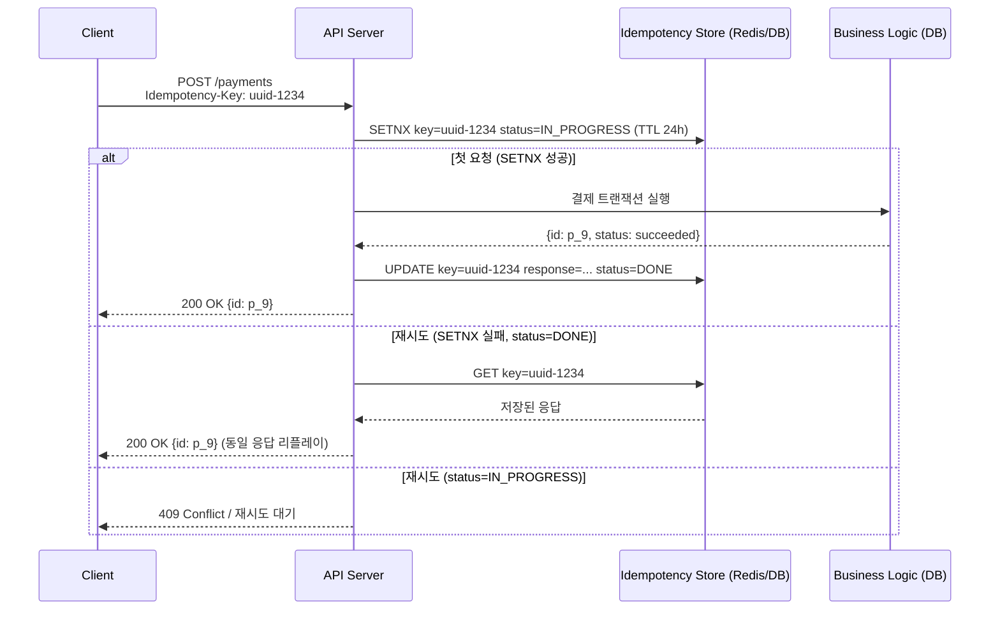

### 멱등성(Idempotency) 설계 — "네트워크는 반드시 거짓말한다"는 전제에서 출발하는 API 계약

분산 시스템에서 "요청을 한 번만 처리했다"는 문장은 사실 성립하지 않는다. 클라이언트는 타임아웃이 나면 재시도하고, 로드밸런서는 5xx가 뜨면 다른 노드로 다시 보내고, 메시지 브로커(Kafka/RabbitMQ)는 at-least-once 를 기본 보장으로 삼는다. 즉 "같은 요청이 두 번 이상 도착한다"는 것은 예외가 아니라 **정상 동작**이다. 이 전제 위에서 "몇 번 도착해도 결과가 같다"를 만드는 설계가 멱등성(Idempotency)이다.

**HTTP 메서드의 착각부터 걷어내기.** RFC 7231은 GET/PUT/DELETE 를 "idempotent"라 정의하지만, 이건 *메서드 의미론* 상의 약속일 뿐 *구현이 저절로 멱등해진다*는 뜻이 아니다. `PUT /users/1 {name: "A"}` 는 몇 번 호출해도 최종 상태가 같아 보이지만, 그 사이 다른 요청이 끼어 있으면 lost update 가 난다. POST 는 정의상 non-idempotent 지만, 결제·주문처럼 **가장 멱등해야 하는 API가 하필 POST** 인 경우가 대부분이다.

```
[Client] --POST /payment { amount: 10000 }--> [Server]
   |                                              |
   |                                          [DB에 결제 기록]
   |         X (타임아웃, 응답 유실)            |
   |                                              |
   |--(60초 후) 재시도 POST /payment----------> [Server]
                                                  |
                                    ❓ 새 결제? 같은 결제?
```

**표준 해법: Idempotency-Key 헤더.** Stripe 가 사실상 업계 표준으로 만든 방식이다. 클라이언트가 UUID 같은 고유 키를 헤더로 실어 보내고, 서버는 `(key, request_hash, response)` 를 저장한다. 같은 키의 두 번째 요청이 오면 저장된 응답을 그대로 리플레이한다.



**설계 시 반드시 결정해야 할 4가지 축.**

1. **키의 범위(Scope).** 사용자별인지, 테넌트별인지, 글로벌인지. Stripe 는 (API Key, Idempotency-Key) 조합. 이 결정을 안 하면 A 사용자가 만든 키를 B 가 재사용해 응답을 훔치는 사고가 난다.
2. **요청 본문 해시 검증.** 같은 키에 *다른* payload 가 오면? Stripe 는 `422 Unprocessable Entity` 를 반환한다. 저장된 request hash 와 다르면 거부 — 이걸 안 하면 클라이언트 버그가 조용히 데이터 오염으로 이어진다.
3. **저장 기간(TTL).** 24시간이 관례. 너무 짧으면 지연된 재시도가 중복 처리로 새고, 너무 길면 저장소가 무한 증식한다.
4. **In-progress 상태 처리.** 첫 요청이 아직 실행 중일 때 두 번째가 오면? `409` 로 즉시 거절할지, 첫 요청 완료를 기다렸다가 같은 응답을 줄지. 후자가 UX 는 좋지만 서버 자원이 묶인다.

**서버 내부에서 멱등성을 "보장"하는 3가지 층.**

| 계층 | 기법 | 예시 |
|------|------|------|
| API 게이트웨이 | Idempotency-Key 저장/리플레이 | Stripe, PayPal, AWS SDK 요청 |
| 애플리케이션 | 자연 키 유니크 제약, `INSERT ... ON CONFLICT` | `orders(external_order_id UNIQUE)` |
| 메시지 컨슈머 | 처리한 message_id 를 outbox/inbox 테이블에 기록 | Kafka + inbox pattern |

특히 컨슈머 쪽 멱등성은 자주 놓친다. Kafka 는 at-least-once 라 같은 이벤트를 두 번 소비할 수 있다. `event_id` 를 처리 완료 테이블에 유니크 저장하고, 트랜잭션 내에서 함께 커밋해야 한다("consumer inbox pattern"). 이걸 안 하면 결제 이벤트 재소비로 이중 청구가 난다.

**실제 사례.**

- **Stripe**: Idempotency-Key 를 공개 API 계약으로 승격시켰다. SDK 가 자동으로 UUID 를 붙이고, 네트워크 실패 시 재시도를 자동화한다. 이게 없었다면 결제 이중 처리 클레임을 서비스팀이 매일 손으로 해결해야 했을 것.
- **AWS SQS**: FIFO 큐는 `MessageDeduplicationId` 로 5분 창 안의 중복을 서버가 제거해준다. 하지만 5분을 넘긴 재시도는 여전히 컨슈머 몫.
- **Kubernetes**: 선언적 API 자체가 멱등성이다. `kubectl apply` 를 100번 해도 최종 상태는 하나. reconciliation loop 가 "현재 상태 → 목표 상태" 를 계속 수렴시키므로 개별 요청의 중복이 무해하다.
- **토스/카카오페이 같은 국내 PG**: 가맹점 주문번호(`orderId`)를 자연 멱등키로 강제한다. 같은 orderId 로 승인 요청이 여러 번 와도 최초 승인 결과만 유효.

**언제 쓰고, 언제 쓰면 안 되는가.**

**써야 하는 경우** — 결제/송금/재고 차감 같은 비가역·비멱등 side-effect API, 외부 시스템(SMS 발송, 이메일, PG) 호출, 메시지 브로커 컨슈머, 재시도가 예상되는 모든 쓰기 API. 특히 **네트워크 경계를 넘는 쓰기**는 무조건 멱등성 설계가 필요하다고 봐야 한다.

**과설계인 경우** — 순수 조회 API(GET 은 이미 멱등), 내부 서비스 간 idempotent-by-design 호출(예: 상태 upsert), 최종 사용자가 재시도를 만들 수 없는 배치성 작업. 여기에 Idempotency-Key 저장소를 얹으면 관리 부담만 늘고 이득이 없다.

**시니어 관점의 핵심.** 멱등성은 "예쁜 기능"이 아니라 **분산 시스템의 무결성 최소 조건**이다. Saga·Outbox·Event Sourcing 이 아무리 잘 설계돼도, 각 단계의 로컬 연산이 멱등하지 않으면 재시도·복구·재처리 시나리오가 전부 무너진다. "at-least-once 전달 + 멱등한 처리 = effectively-once" 라는 등식이 분산 시스템에서 유일하게 실현 가능한 exactly-once 모델이며, 이 등식의 오른쪽 항을 책임지는 것이 멱등성 설계다. 설계 초기에 "이 API 가 두 번 오면?" 을 매번 묻지 않으면, 프로덕션에서 "왜 결제가 두 번 됐지?" 를 새벽에 묻게 된다.

> 💡 **왜 중요한가**: 분산 시스템에서 exactly-once 는 신화이고, 실현 가능한 유일한 방법은 "at-least-once 전달 + 멱등한 처리"인데 그 오른쪽 항을 만드는 유일한 도구가 멱등성 설계다.
