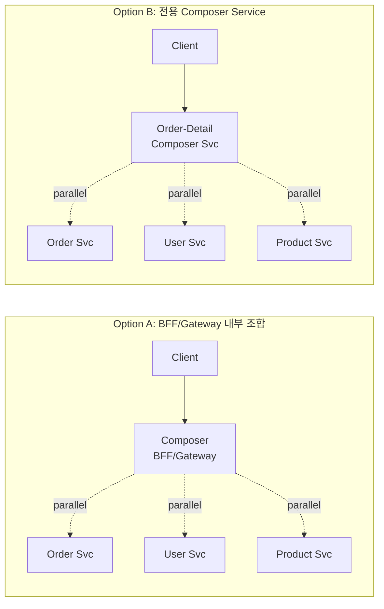

### API Composition 패턴 — MSA에서 JOIN이 사라진 세계, "N번의 호출"을 어떻게 다룰 것인가

모놀리스에서는 `SELECT o.*, u.name, p.title FROM orders o JOIN users u JOIN products p ...` 한 줄이면 끝나던 조회가, MSA에서 서비스별로 DB를 쪼갠(Database per Service) 순간부터 실행 불가능해진다. 주문 서비스는 상품명을 모르고, 사용자 서비스는 주문을 모른다. 이 상황에서 "주문 상세 화면"을 어떻게 만들 것인가 — 이것이 MSA 조회의 근본 문제다.

**API Composition**은 이 문제에 대한 가장 직관적이고 정직한 답이다. **여러 서비스를 호출해 애플리케이션 레이어에서 조합(compose)한다.** JOIN을 DB가 아니라 코드에서 수행한다.

#### 두 가지 조합 지점: In-Process vs Composer Service



두 방식의 핵심은 **"어디서 조합할 것인가"**의 위치 선택이다. 클라이언트 다양성이 크고 화면별 응답 스키마가 다르면 BFF가 유리하다. 조합 로직 자체가 복잡한 비즈니스 규칙을 담고 있다면(예: "VIP 사용자에게만 프리미엄 상품 상세 노출") 전용 Composer 서비스가 낫다.

#### 구현의 핵심은 병렬화와 부분 실패 처리

```java
// Reactor 예: 병렬 호출 + 부분 실패 허용
public Mono<OrderDetailDto> getOrderDetail(Long orderId) {
    Mono<Order> order = orderClient.get(orderId);            // 필수
    Mono<User> user = order.flatMap(o ->
        userClient.get(o.userId())
                  .onErrorReturn(User.UNKNOWN));             // 실패 시 fallback
    Mono<List<Product>> products = order.flatMap(o ->
        productClient.getBatch(o.productIds())
                     .timeout(Duration.ofMillis(200))
                     .onErrorReturn(List.of()));             // 타임아웃 허용

    return Mono.zip(order, user, products)
               .map(t -> OrderDetailDto.of(t.getT1(), t.getT2(), t.getT3()));
}
```

시니어 관점의 세 가지 함정:

1. **직렬 호출 지옥.** 초보 구현은 `order → user → product`를 순차 호출한다. 각 50ms면 총 150ms. `Mono.zip` / `CompletableFuture.allOf`로 병렬화하면 max(50) = 50ms. 하지만 **의존성이 있는 호출**(user_id를 order에서 뽑아야 user 조회 가능)은 병렬화 불가 — DAG를 그려서 병렬 가능한 계층을 찾아야 한다.

2. **가용성의 곱셈 법칙.** 4개 서비스를 조합하면 가용성은 `0.999^4 ≈ 99.6%`로 떨어진다. 각 서비스별로 **circuit breaker + fallback 정책**을 정하지 않으면 "한 개 죽으면 전체 화면 안 뜸" 상태가 된다. 위 코드처럼 non-critical 필드는 `User.UNKNOWN` 같은 sentinel로 대체하는 것이 실무의 정답.

3. **N+1 문제 재현.** 주문 목록 100건에 각각 상품을 조회하면 REST 호출 100번. Batch API(`getBatch(ids)`)를 강제 규약으로 만들지 않으면 응답 시간은 카운트다운 파티가 된다.

#### 트레이드오프: API Composition vs CQRS 읽기 모델

| 관점 | API Composition | CQRS 읽기 모델 (materialized view) |
|---|---|---|
| **데이터 신선도** | 실시간 (호출 시점 최신) | eventually consistent (수 ms~수 초 지연) |
| **응답 시간** | max(N개 호출) + 오버헤드 | 단일 DB 조회 (빠름) |
| **구현 복잡도** | 낮음 (호출 + 조합) | 높음 (이벤트 파이프라인 + 뷰 관리) |
| **가용성** | AND 조건 (하나 죽으면 전체 위험) | 뷰 DB만 살아있으면 됨 |
| **비용** | 서비스 간 트래픽 증가 | 저장소 중복 + 파이프라인 운영 |
| **적합한 조회 패턴** | 단순 lookup, 소량 필드 조합 | 복잡한 필터/정렬/집계, 대량 스캔 |

즉, **모든 조회를 CQRS로 미리 만들 필요는 없다.** "화면 하나 띄우려고 Kafka 컨슈머와 Elasticsearch 뷰를 만들 것인가?"라는 질문에 대부분의 답은 "일단 Composition으로 시작하고, 성능 병목이 실측되면 그때 뷰를 만든다"이다.

#### 실제 사례

- **Netflix**: BFF(Falcor/GraphQL) 계층에서 수십 개 마이크로서비스를 조합해 화면당 하나의 응답을 만든다. 각 서비스는 Hystrix(현 resilience4j)로 감싸 부분 실패를 허용하고, 실패한 필드는 UI에서 "이 부분은 지금 표시할 수 없어요"로 degrade한다.
- **Amazon 상품 상세 페이지**: 가격, 재고, 리뷰, 추천, 배송 예정일이 각기 다른 서비스에서 온다. 병렬 조합 + 필드별 fallback으로 "리뷰 서비스가 죽어도 구매 버튼은 살아있음"을 보장한다.
- **당근마켓 초기 아키텍처**: 게시글 목록은 Composition으로, 검색은 별도 Elasticsearch 뷰(CQRS)로 나눈 하이브리드. 조회 패턴별 적합한 도구를 골라 쓴 사례.

#### 언제 쓰고 언제 쓰면 안 되는가

**써야 할 때**
- 조합할 서비스가 **3~5개 이하**이고 각각의 응답 크기가 작을 때
- 데이터 **신선도가 중요**할 때 (재고, 가격, 잔액)
- 조회 패턴이 **단순 lookup** (ID로 찾아서 이어붙이기)일 때
- MSA 전환 초기 — CQRS 뷰 인프라를 구축할 여력이 없을 때

**쓰면 안 될 때**
- **대량 데이터 필터/정렬** (예: "지난달 매출 상위 100 상품") — In-memory sort는 재앙
- **호출 계층이 3단 이상 깊어짐** (order → user → org → tenant → policy...) — DAG가 나무처럼 자라면 CQRS로
- **가용성 SLA가 매우 높은 경로** (결제 조회 등) — 곱셈 법칙에 발목 잡힘
- **재시도가 부담스러운 downstream** (외부 유료 API 호출을 조합에 넣는 것은 금물)

시니어의 판단 기준은 결국 **"이 조회의 P99를 몇 ms로 잡을 것인가, 그리고 실측이 그 예산을 넘는가"**이다. 예산 안이면 Composition으로 충분하고, 넘기 시작하면 CQRS 읽기 모델로 이동한다. 처음부터 CQRS를 깔고 시작하는 것은 대부분의 팀에게 조기 최적화다.

> 💡 **왜 중요한가**: MSA의 조회 문제에 대한 첫 번째 답은 항상 API Composition이어야 하며, CQRS 읽기 모델은 그것이 실측 성능 예산을 초과할 때 꺼내는 다음 카드다.
