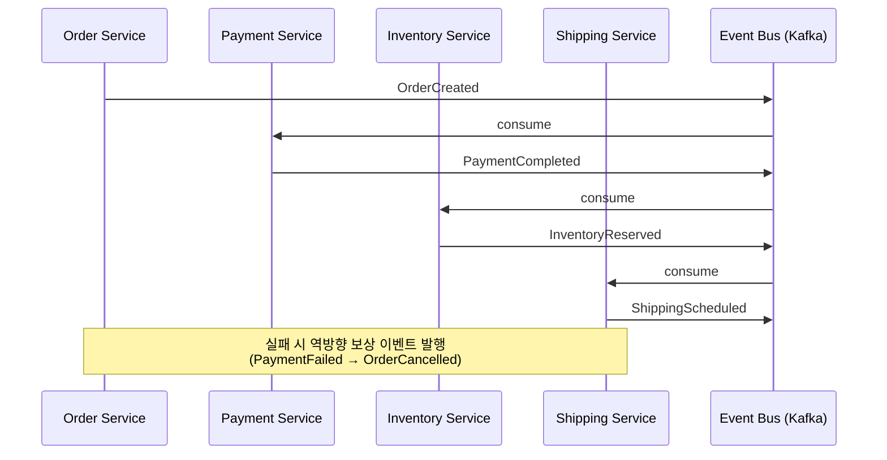
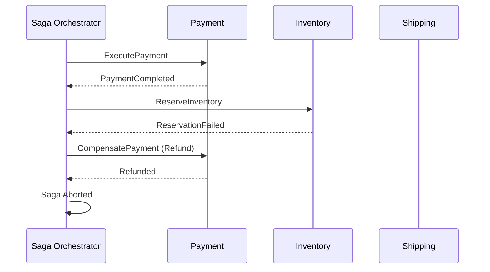

### Saga 패턴: 마이크로서비스 분산 트랜잭션의 현실적 해법

마이크로서비스 환경에서 여러 서비스에 걸친 데이터 일관성을 보장하기 위해 2PC(Two-Phase Commit)는 가용성·확장성 측면에서 부적합합니다. **Saga 패턴**은 긴 비즈니스 트랜잭션을 **로컬 트랜잭션의 시퀀스**로 분해하고, 실패 시 **보상 트랜잭션(Compensating Transaction)** 으로 되돌리는 방식으로 결과적 일관성(Eventual Consistency)을 달성합니다.

---

#### 1. 두 가지 구현 방식

##### (1) Choreography (안무형) — 이벤트 기반 분산 협업



- 각 서비스는 이벤트를 구독·발행하며 자율적으로 동작
- **중앙 조정자 없음** → 결합도 낮음, 그러나 흐름 추적 어려움

##### (2) Orchestration (지휘형) — 중앙 코디네이터 주도



- **상태 머신(State Machine)** 으로 흐름 명시적 관리 (예: AWS Step Functions, Temporal, Camunda)
- 가시성·디버깅 유리, 그러나 오케스트레이터가 단일 장애점이 될 위험

---

#### 2. 트레이드오프 비교

| 항목 | Choreography | Orchestration |
|---|---|---|
| **결합도** | 낮음 (이벤트 계약만 공유) | 중앙 코디네이터에 의존 |
| **흐름 가시성** | 분산되어 추적 어려움 | 한 곳에서 전체 흐름 파악 |
| **순환 의존 위험** | 높음 (이벤트 폭주 가능) | 낮음 |
| **운영 복잡도** | 분산 추적(Jaeger/OpenTelemetry) 필수 | 코디네이터 모니터링으로 충분 |
| **적합 상황** | 참여 서비스 3개 이하, 단순 흐름 | 5개 이상 또는 분기·재시도 정책 복잡 |

---

#### 3. 반드시 풀어야 할 4가지 난제

1. **멱등성(Idempotency)**: 네트워크 재시도로 같은 명령이 중복 도착 → `idempotency_key`를 DB unique 제약과 함께 사용
2. **격리성 부재(Lack of Isolation)**: ACID의 'I'가 없음 → **Semantic Lock**(상태 필드로 `PENDING` 표시), **Commutative Update**(가산/감산), **Pessimistic View**(읽기 시점 제한) 등으로 보완
3. **보상 불가능한 작업**: 이메일 발송, 외부 결제 등 → Saga의 **마지막 단계로 배치**하거나 **Pivot Transaction** 이후로 미룸
4. **Outbox Pattern**: 로컬 DB 커밋과 이벤트 발행의 원자성 보장 → 같은 트랜잭션에서 `outbox` 테이블에 기록 후 Debezium/CDC로 Kafka 발행

```
┌──────────────┐    ┌──────────────┐    ┌──────────────┐
│  Service DB  │───▶│ Outbox Table │───▶│   Debezium   │───▶ Kafka
└──────────────┘    └──────────────┘    └──────────────┘
   (단일 트랜잭션으로 비즈니스 데이터 + 이벤트 기록)
```

---

#### 4. 실제 사례

- **Uber Cadence/Temporal**: 라이드 매칭, 결제, 알림 등 수십 개 단계의 워크플로우를 Orchestration Saga로 처리. 워커가 죽어도 상태가 영속화되어 재개 가능.
- **Netflix Conductor**: 미디어 인코딩 파이프라인에서 수백 개 마이크로서비스 호출을 DAG 기반 오케스트레이션으로 관리.
- **Airbnb**: 예약 플로우에서 결제·재고·알림을 Choreography + Outbox로 결합. 2019년 도입 후 결제 불일치 인시던트가 분기당 두 자릿수에서 한 자릿수로 감소.
- **쿠팡**: 주문 생성 → 재고 차감 → 결제 → 배송 준비를 Kafka 기반 Choreography로 처리하되, 실패율 높은 외부 PG 결제 단계는 Orchestrator로 감싸 하이브리드 구조 적용.

---

#### 5. 의사결정 체크리스트

- [ ] 트랜잭션 참여 서비스가 4개 이상인가? → Orchestration 고려
- [ ] 보상 로직이 비즈니스적으로 가능한가? (환불, 재고 복구 등)
- [ ] Outbox 또는 Transactional Messaging이 갖춰져 있는가?
- [ ] 분산 추적과 Saga 상태 대시보드가 준비되었는가?
- [ ] 멱등성 키 설계와 중복 메시지 처리 전략이 명세화되었는가?

> 💡 **왜 중요한가**: 분산 시스템에서 데이터 일관성은 "보장하는 것"이 아니라 "설계로 받아들이는 것"이며, Saga는 그 트레이드오프를 명시적으로 관리하는 가장 검증된 도구입니다.
