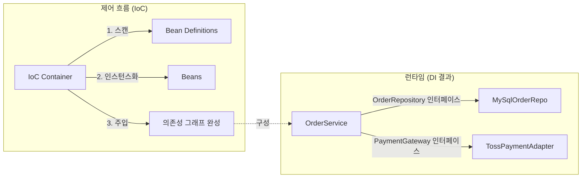

### DI·IoC·DIP 삼형제 — 의존성의 방향을 뒤집는다는 것

레이어드 아키텍처에서 Service가 Repository를 "쓴다"고 말할 때, 정확히 **누가 누구를 알고 있는가**는 아키텍처의 품질을 결정합니다. 오늘은 이 질문의 뿌리인 IoC(제어의 역전), DI(의존성 주입), DIP(의존성 역전 원칙) 세 개념을 정리합니다. 흔히 뭉뚱그려 부르지만, 각각 다른 층위의 이야기입니다.

---

#### 1. 세 개념의 층위 구분

| 개념 | 층위 | 한 줄 정의 |
|---|---|---|
| **IoC** (Inversion of Control) | **패러다임** | 제어 흐름의 주인을 내가 아닌 프레임워크/컨테이너에게 넘긴다 |
| **DI** (Dependency Injection) | **기법/메커니즘** | 필요한 객체를 내가 `new` 하지 않고, 외부에서 넣어준다 |
| **DIP** (Dependency Inversion Principle) | **설계 원칙** | 상위 정책이 하위 세부사항에 의존하지 말고, 둘 다 추상에 의존하라 |

세 개는 자주 함께 쓰이지만 **DI 없이 DIP만 지킬 수도 있고**(수동 팩토리), **DI를 쓰면서도 DIP를 어길 수도 있습니다**(구현체를 직접 주입받는 경우). 시니어 관점에선 이 구분을 흐리는 순간 설계 리뷰가 산으로 갑니다.

---

#### 2. DIP: "화살표를 뒤집는다"의 진짜 의미

전통적인 절차식 사고에서 상위 모듈은 하위 모듈을 직접 호출합니다.

```
[Before DIP]                       [After DIP]

  OrderService                       OrderService
       │                                  │
       ▼                                  ▼
  MySqlOrderRepo              «interface» OrderRepository
                                          ▲
                                          │
                                   MySqlOrderRepo
```

왼쪽에서는 `OrderService`가 `MySqlOrderRepo`를 **컴파일 타임에 안다**. DB를 Postgres로 바꾸거나 테스트에서 인메모리로 갈아끼우려면 상위 코드를 건드려야 합니다.

오른쪽에서는 `OrderService`도, `MySqlOrderRepo`도 **똑같이 `OrderRepository` 인터페이스에 의존**합니다. 화살표가 하위에서 위로 뒤집혔죠. 이게 "의존성 역전"의 문자 그대로의 의미입니다.

**핵심**: 인터페이스는 **상위 모듈(OrderService) 쪽에 소유권이 있다.** `OrderRepository`는 `com.example.order.domain` 패키지에 있어야지, `com.example.persistence.mysql` 패키지에 있으면 안 됩니다. 이걸 반대로 두는 순간 DIP는 형식만 남고 실질은 사라집니다.

---

#### 3. IoC 컨테이너와 DI의 관계



Spring, NestJS, Guice, Dagger 같은 IoC 컨테이너는 결국 **의존성 그래프를 대신 조립해주는 도구**입니다. `new OrderService(new MySqlOrderRepo(dataSource))`를 개발자 대신 해주는 것이죠. 컨테이너가 없어도 `main()`에서 손으로 조립하면 됩니다(이걸 **Pure DI** 또는 **Composition Root** 패턴이라고 부릅니다).

---

#### 4. 주입 방식별 트레이드오프

Spring에서 가장 자주 논쟁되는 지점. 시니어 리뷰에서 확실히 정리해둬야 합니다.

**생성자 주입 (Constructor Injection)** — 기본값으로 삼아야 함
```java
@Service
public class OrderService {
    private final OrderRepository orderRepository;
    private final PaymentGateway paymentGateway;

    public OrderService(OrderRepository orderRepository, PaymentGateway paymentGateway) {
        this.orderRepository = orderRepository;
        this.paymentGateway = paymentGateway;
    }
}
```
- ✅ `final` 보장 → 불변성, 스레드 안전
- ✅ 순환 의존성이 있으면 **기동 시점에 즉시 실패** (문제를 숨기지 않음)
- ✅ 프레임워크 없이도 테스트 가능 (`new OrderService(mock, mock)`)
- ❌ 생성자 파라미터가 늘어나면 코드 스멜이 드러남 — **이건 단점이 아니라 신호다**. SRP 위반을 감춰주지 않는다.

**필드 주입 (`@Autowired` on field)** — 프로덕션 코드에서 지양
```java
@Service
public class OrderService {
    @Autowired private OrderRepository orderRepository;  // ❌
}
```
- ❌ 리플렉션 없이 생성 불가 → 단위 테스트에서 프레임워크 의존
- ❌ `final` 불가 → 런타임에 뒤바뀔 위험
- ❌ 순환 의존성이 **조용히 통과**되어 프로덕션에서 터짐
- ✅ 코드가 짧아 보임 (유일한 장점, 그리고 함정)

**세터 주입 (Setter Injection)** — 진짜 선택적 의존성일 때만
- 로깅 데코레이터, 옵셔널 캐시 어댑터 등 **없어도 동작해야 하는** 경우로 한정.

**시니어 리뷰의 실전 규칙**: 필드 주입이 코드에 있다면 정당한 이유(레거시, 순환 의존성 우회)를 커밋 메시지나 주석에서 요구합니다. "짧아서"는 이유가 아닙니다.

---

#### 5. 실제 사례: 왜 이 회사들은 이 선택을 했는가

**Netflix (Guice → Spring 하이브리드)**
Netflix는 초기 자체 IoC 프레임워크 Governator를 만들다가 결국 Spring Boot로 수렴했습니다. 이유는 IoC 자체의 우수성보다 **에코시스템의 중력** — Actuator, Micrometer, 자동 구성 — 이 컸기 때문. IoC 컨테이너 선택은 순수 기술 결정이 아니라 **주변 도구의 가용성**이 좌우한다는 교훈.

**Uber (Fx, Dagger의 Go/Java 사용)**
Uber는 백엔드 Go 서비스에서 `uber-go/fx`라는 자체 DI 프레임워크를, 안드로이드에서 Dagger를 표준화했습니다. 이유는 **수백 개의 마이크로서비스가 동일한 구성 패턴**을 갖도록 강제하기 위해서. IoC의 진짜 가치는 개별 서비스의 편의가 아니라 **조직 전체의 일관성**이라는 관점.

**LINE·카카오·토스**
Java/Kotlin 백엔드 대다수가 Spring Boot 기반이며, 사내 표준으로 **생성자 주입만 허용**하는 컨벤션을 명문화한 조직이 많습니다. Lombok의 `@RequiredArgsConstructor`가 이 컨벤션과 결합해 사실상 표준.

**의도적으로 DI 컨테이너를 안 쓰는 사례**
- **Go 커뮤니티**: `main.go`에서 손으로 조립하는 Pure DI가 관용구. `wire`(Google)는 컴파일 타임 코드 생성으로 리플렉션을 피함.
- **DHH의 Basecamp/HEY**: Rails 세계는 컨벤션 오버 컨피규레이션으로 IoC 컨테이너 자체를 회의적으로 봄. "필요하면 `new`" 철학.

---

#### 6. 언제 쓰고, 언제 쓰면 안 되는가

**써야 할 때**
- 팀 규모가 3명 이상, 서비스가 6개월 이상 살 예정 — 조립 로직이 곧 병목이 됩니다
- 테스트 대역(Mock, Fake)이 자주 필요한 도메인 (결제, 외부 API 연동)
- 환경별 구성 스위칭이 잦음 (로컬 H2 / 스테이징 RDS / 프로덕션 Aurora)
- 프레임워크의 트랜잭션·AOP·관찰성 인프라를 활용해야 함

**쓰지 말아야 할 때 (또는 최소화)**
- **CLI 도구, 배치 스크립트, 람다 단발성 함수** — 부팅 오버헤드(Spring 5~7초)가 실행 시간보다 큼. GraalVM Native Image도 있지만 복잡도 대비 이득 계산 필요.
- **극도의 저지연 시스템** (HFT, 게임 서버 틱 처리) — 리플렉션·프록시 오버헤드가 도메인적으로 허용 안 됨
- **의존성 그래프가 진짜로 얕은 프로젝트** — 도메인 서비스 3개짜리에 컨테이너를 두는 건 오버엔지니어링
- **팀이 IoC를 "마법"으로 여기는 단계** — DI 없이 손으로 조립하는 법을 모른 채 Spring을 쓰면 순환 의존성·프록시 이슈에서 무너집니다

---

#### 7. 시니어가 자주 놓치는 함정

1. **인터페이스 소유권의 방향**: `OrderRepository` 인터페이스를 인프라 패키지에 두면 DIP가 무너집니다. 도메인이 인프라를 참조하는 순간, 모듈 분리·헥사고날 전환이 불가능해집니다.
2. **"구현체가 하나뿐이니 인터페이스 안 만들어도 되지 않나?"**: 테스트 대역이 두 번째 구현체입니다. 그리고 미래의 어댑터 교체까지 감안하면, 도메인 경계의 포트는 인터페이스로 두는 게 기본.
3. **`@Autowired`가 있으면 DI라고 착각**: `@Autowired`는 DI 도구일 뿐, 그 안에 구체 클래스를 주입받고 있다면 DIP는 없습니다.
4. **`@Component`를 만능 스캐너로 남발**: 조립 지점을 명시적으로 통제하는 `@Configuration` 클래스가 큰 시스템에선 훨씬 안전합니다. 어떤 빈이 언제 어떤 조건으로 만들어지는지 grep 한 번으로 추적 가능해야 함.
5. **순환 의존성을 세터/필드 주입으로 우회**: 이건 병을 진통제로 덮는 짓. 순환은 거의 항상 **책임 경계가 잘못 그어진 신호**입니다. Extract Service, 이벤트 발행, 또는 상위 오케스트레이터 도입으로 풀어야 합니다.

---

> 💡 **왜 중요한가**: 레이어드 아키텍처의 코드가 "왜 유지보수 가능한가"에 대한 답은 결국 DIP이며, DI 컨테이너는 그 원칙을 대규모로 관리하기 위한 도구일 뿐 — 도구와 원칙을 혼동하는 순간 프레임워크는 있는데 아키텍처는 없는 코드가 만들어진다.
