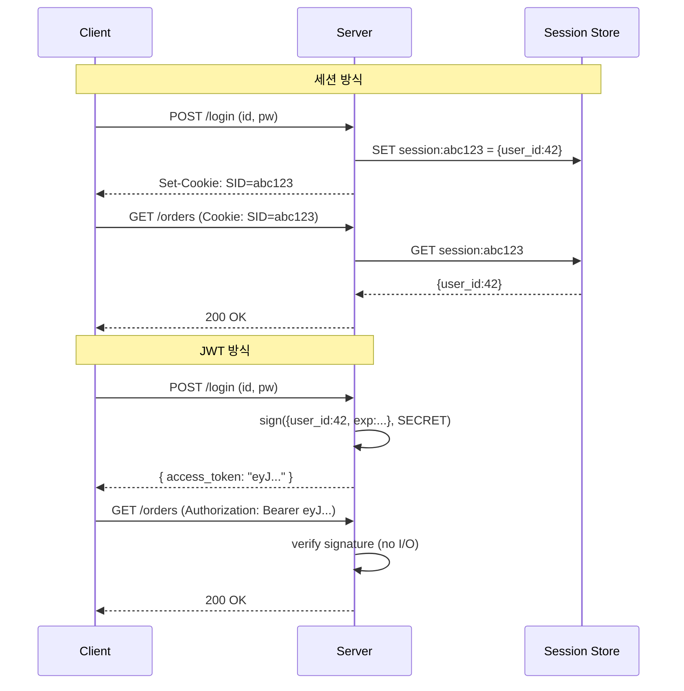

### 세션 vs JWT 인증 구조 — "상태를 어디에 둘 것인가"의 문제

인증 방식을 고른다는 건 결국 **"로그인 상태(state)를 서버가 들고 있을 것인가, 클라이언트에게 넘길 것인가"**의 선택이다. 세션과 JWT의 대립은 기술이 아니라 아키텍처 결정이며, 단일 서버 모놀리스에서도 이 결정이 뒷단 확장 경로를 좌우한다.

---

#### 1. 두 방식의 본질적 차이

**세션 기반 인증**은 서버가 진실의 원천이다. 로그인 성공 시 서버 메모리(또는 Redis/DB)에 `session_id → user_info` 매핑을 저장하고, 클라이언트는 그 `session_id`가 담긴 쿠키만 들고 다닌다. 매 요청마다 서버는 저장소를 조회해 "이 세션이 살아있는지" 확인한다.

**JWT(JSON Web Token)**는 토큰 자체가 진실을 담는다. 서명된 JSON을 클라이언트에게 넘기고, 서버는 저장 없이 요청 때마다 서명만 검증한다. 사용자 정보가 토큰 안에 들어있어 DB 조회 없이 인증이 끝난다.

```
[세션 방식]
Client ──(session_id 쿠키)──> Server ──(조회)──> Session Store (Redis)
                                                    │
                                                    └─ {user_id: 42, role: "admin", ...}
                     서버가 상태 소유. Stateful.

[JWT 방식]
Client ──(JWT 토큰)──> Server ──(서명 검증만)──> ✅
    │
    └─ eyJhbGc... payload에 {user_id: 42, role: "admin", exp: ...} 내장
                     클라이언트가 상태 소유. Stateless.
```

핵심 차이는 **"로그아웃 즉시성"**과 **"조회 비용"**의 트레이드오프다. 세션은 저장소에서 지우면 그 순간 끝나지만, JWT는 서명이 유효한 한 만료 전까지 서버가 막을 방법이 없다(별도 블랙리스트를 만들지 않는 이상). 대신 JWT는 매 요청마다 저장소를 안 두드려도 된다.

---

#### 2. 요청 흐름 비교



JWT 흐름에서 저장소 왕복이 사라지는 게 보인다. 초당 수천 건 요청에서 이 차이는 유의미하다. 반대로 세션 흐름의 마지막 두 줄에서 `DEL session:abc123` 한 줄만 추가하면 즉시 로그아웃이다.

---

#### 3. 트레이드오프 정리

| 항목 | 세션(쿠키) | JWT |
|---|---|---|
| 서버 상태 | Stateful (Redis/DB 필요) | Stateless |
| 확장성 | 세션 스토어가 병목·SPOF | 서버 무한 스케일아웃 용이 |
| 로그아웃 | 즉시 (스토어에서 삭제) | 지연 (만료까지 유효) |
| 토큰 크기 | 32~64B (session ID만) | 500B~2KB (payload 포함) |
| 보안 사고 대응 | 세션 전체 무효화 1줄 | 블랙리스트/키 로테이션 필요 |
| CSRF 취약 | 자동 쿠키 전송 → 취약 | Bearer 헤더 → 상대적 안전 |
| XSS 취약 | HttpOnly 쿠키로 방어 가능 | localStorage 저장 시 노출 |
| 권한 변경 반영 | 즉시 (스토어에서 갱신) | 만료 후 재발급까지 지연 |
| 크로스 도메인 | 쿠키 정책상 까다로움 | 헤더 기반이라 자유로움 |

여기서 시니어가 자주 놓치는 지점: **JWT가 "stateless"라는 말은 이상론에 가깝다.** 실전에서는 강제 로그아웃, 비밀번호 변경 후 기존 토큰 무효화, 관리자 권한 회수 같은 요구사항이 반드시 들어오고, 그 순간부터 블랙리스트 저장소가 필요해진다. 그러면 결국 "저장소 없는 인증"이라는 JWT의 원래 매력이 무너진다.

---

#### 4. 실제 사례

- **은행·증권·헬스케어 (Toss, 카카오뱅크의 코어 뱅킹 등)**: 세션 기반 유지. 즉시 로그아웃, 이상거래 발생 시 관리자에 의한 강제 세션 종료, 감사(audit) 요구사항 때문에 서버가 인증 상태를 완전히 통제해야 한다. "5초 안에 그 사용자 로그아웃시켜" 같은 규제 대응이 JWT로는 불가능하다.

- **Netflix, Uber, 대부분의 마이크로서비스 조직**: JWT (혹은 OAuth2 액세스 토큰) 채택. 수십~수백 개 서비스가 세션 스토어를 공유하는 게 병목이 되기 때문. 각 서비스가 서명만 검증하면 되므로 서비스간 인증 전파가 단순해진다.

- **GitHub API, Stripe API**: 장기 토큰(PAT/API Key) + 짧은 액세스 토큰 하이브리드. 서버-투-서버 통신에서는 세션 쿠키가 부적합해서 어차피 토큰형이 강제된다.

- **Facebook 초창기(2010년 전후)의 결정**: 로그인 세션은 여전히 서버 측 세션으로 유지하되, 내부 서비스간 호출은 서명된 토큰으로 처리. "사용자 대면 = 세션, 서비스간 = 토큰"의 이중 구조는 지금도 흔한 실무 패턴이다.

---

#### 5. 언제 쓰고 언제 쓰면 안 되는가

**세션을 써야 하는 경우**
- 웹 브라우저 기반의 전통적 서비스 (SSR 포함)
- 즉시 로그아웃/권한 회수가 규제·비즈니스적으로 필수 (금융, 의료, 관리자 콘솔)
- 트래픽이 단일 Redis 클러스터로 충분히 감당되는 규모 (~수백만 DAU까지 무리 없음)
- 로그인 이력, 동시 접속 제어, "다른 기기에서 로그아웃" 같은 기능이 필요

**JWT를 써야 하는 경우**
- 모바일 앱, SPA에서 쿠키 정책 이슈를 피하고 싶을 때
- 여러 도메인/서비스에 걸친 SSO 또는 서비스간 인증
- 인증 서버와 리소스 서버가 물리적으로 분리 (OAuth2 리소스 서버 패턴)
- 짧은 만료(5~15분) + Refresh Token 조합으로 "지연 로그아웃"이 허용되는 도메인

**JWT를 쓰면 안 되는 경우 (자주 잘못 선택되는 케이스)**
- 단일 모놀리스 서버 + 단일 웹 클라이언트인데 "요즘 JWT가 트렌드"라서 도입 — 이 경우 세션이 압도적으로 단순하고 안전하다.
- payload에 민감 정보(주민번호, 잔액 등)를 넣는 경우. JWT는 서명은 하지만 **암호화가 아니다.** Base64 디코딩만 하면 다 보인다.
- 로그아웃이 즉시 반영되어야 하는데 블랙리스트 인프라 없이 도입한 경우 — 사실상 로그아웃 없는 서비스가 된다.

---

#### 6. 시니어 관점의 실전 팁

1. **"stateless가 미덕"이라는 신화를 경계하라.** 사용자 인증은 본질적으로 상태를 가진다. JWT는 상태를 옮겼을 뿐이지 없앤 게 아니다.
2. **하이브리드가 정답인 경우가 많다.** Access Token(JWT, 15분) + Refresh Token(서버 저장, DB 기반) 조합이면 두 방식의 장점을 대부분 챙길 수 있다.
3. **payload는 최소한으로.** JWT에 role 배열, 조직 계층까지 다 넣으면 헤더가 부풀고, 권한 변경 반영이 지연된다. `user_id`와 최소 클레임만 담고 상세는 서버에서 조회하는 게 낫다.
4. **모놀리스에서 시작하는 서비스라면 일단 세션.** MSA로 갈 때 JWT/OAuth2로 마이그레이션하는 편이, 처음부터 오버엔지니어링하는 것보다 실패율이 낮다.

> 💡 **왜 중요한가**: 인증 방식은 단순한 라이브러리 선택이 아니라 "서버의 상태 소유권"을 결정하는 아키텍처 판단이며, 이 결정이 이후 확장·보안·규제 대응 경로를 통째로 규정한다.
