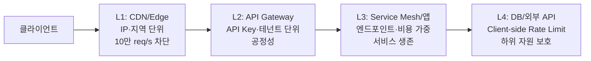

### Rate Limiting — "무제한 트래픽은 없다"는 전제에서 다시 짓는 API 방어선

MSA에서 Circuit Breaker가 "내가 부르는 하위 서비스"를 지키는 방패라면, Rate Limiting은 "나를 부르는 상위 트래픽"으로부터 자신을 지키는 방패다. 두 패턴은 방향만 반대일 뿐 동일한 철학을 공유한다 — **"자원은 유한하고, 유한한 자원을 유한하게 다뤄야 시스템이 살아남는다"**. 그런데 실무에서 Rate Limiting은 "Nginx에서 IP당 100req/s 걸면 끝"이라는 얕은 이해로 소비되는 경우가 많다. 이 글은 그 층위를 넘어, **알고리즘 선택 → 배치 위치 → 분산 상태 관리 → 클라이언트 대응**까지를 아키텍처 관점에서 재조명한다.

---

#### 왜 Rate Limiting인가: "공정성"과 "생존"의 이중 문제

Rate Limiting은 두 가지 서로 다른 문제를 동시에 푼다. 하나는 **자원 공정 배분(fairness)** — 한 테넌트가 API를 폭식해서 다른 테넌트가 굶는 상황을 막는 것. 다른 하나는 **시스템 생존(survival)** — DDoS든 광고 유입이든, 처리 가능한 임계치를 넘는 트래픽이 들어왔을 때 전체가 멜트다운되지 않도록 잘라내는 것.

이 두 목적은 정책이 다르다. 공정성은 **테넌트/사용자 단위**로 걸어야 하고, 생존은 **서비스/엔드포인트 단위**로 걸어야 한다. 실무에서 자주 실패하는 이유가 여기 있다 — 한 축에만 걸어놓고 다른 축이 뚫린다. 예를 들어 사용자당 100 req/s만 걸어두면, 사용자 10만 명이 동시에 몰릴 때 서비스는 여전히 죽는다.

---

#### 4대 알고리즘: 무엇을 언제 쓰는가

```
Fixed Window       Sliding Window Log    Token Bucket         Leaky Bucket
─────────────      ──────────────────    ─────────────         ────────────
[100 |    ]        [t1,t2,...tn]         [●●●●●○○○○○]         →→[queue]→→
 0~60s              최근 60s 요청 log     capacity=10           고정 rate로
 카운터 리셋시                             refill=2/s            비움
 순간 200 req
 통과 위험

간단/저비용        정확/메모리 폭발       버스트 허용/표준       평활화/지연 발생
```

**Fixed Window (고정 윈도우)**: 1분 단위로 카운터를 리셋. 구현이 가장 쉽지만 "경계 문제"가 있다 — 59초에 100회, 61초에 다시 100회를 허용하면 실제로는 2초 안에 200회가 통과한다. **저가치 트래픽 방어용**으로만 써야 한다.

**Sliding Window Log**: 각 요청의 타임스탬프를 저장하고 최근 N초 이내 요청 수를 센다. 정확하지만 트래픽이 많을수록 메모리가 O(N)으로 증가한다. **작은 대상(관리 API, 로그인 시도)**에만 적합.

**Token Bucket (토큰 버킷)**: 버킷에 초당 R개씩 토큰이 채워지고, 요청은 토큰 1개를 소모. 버킷이 비면 거부. **버스트를 자연스럽게 허용**하기 때문에 사용자 UX와 자원 보호 사이의 균형이 가장 좋다. AWS API Gateway, Stripe, GitHub API가 모두 이 방식이다.

**Leaky Bucket**: 요청을 큐에 넣고 고정된 속도로 처리. **트래픽을 평활화(smoothing)**하는 데 강점이 있지만, 큐 자체가 지연을 만든다. 실시간성이 중요한 API보다는 **비동기 작업 디스패처**에 어울린다.

시니어의 실무 기본값은 **Token Bucket**이다. 나머지는 특수 상황에서 골라 쓴다.

---

#### 어디에 걸 것인가: 4-layer 방어선

Rate Limiting은 한 곳에만 두면 안 된다. **다층 방어(defense in depth)** 관점으로 배치해야 한다.



- **L1 (Edge)**: Cloudflare, AWS WAF, Fastly 계층. 비용이 가장 싼 지점에서 명백한 악성 트래픽을 잘라낸다. IP·ASN·지역 단위.
- **L2 (API Gateway)**: Kong, Envoy, Spring Cloud Gateway. 인증 이후이므로 **테넌트/API Key 단위 공정성**을 여기서 강제한다.
- **L3 (서비스 내부)**: Resilience4j RateLimiter나 Bucket4j로 **엔드포인트별·비용 가중 제한**. 예: `/search`는 무겁고 `/health`는 가벼우므로 다른 정책.
- **L4 (하위 호출)**: 자신이 외부 API(결제, LLM API)를 부를 때 **스스로 조절**. 여기서 안 걸면 하위 서비스가 죽고, Circuit Breaker가 뒤늦게 발동한다.

**실제 사례** — Stripe는 API Key당 100 read/s, 100 write/s를 기본으로 하되, 엔드포인트별 비용을 다르게 매긴다(`/charges/search`는 read 1회지만 실제 비용이 크므로 더 무거운 카운트). Netflix는 Zuul → Concurrency Limiter로, 고정된 요청 수가 아닌 **동시 처리 중인 요청 수**를 조절해 응답시간이 늘어나면 자동으로 스로틀링 강도가 강해지도록 설계했다(adaptive rate limiting).

---

#### 분산 환경의 진짜 문제: "카운터를 어디에 둘 것인가"

단일 인스턴스라면 in-memory 카운터로 끝난다. 하지만 앱이 수십 대로 스케일아웃되면, **글로벌 카운터의 일관성**이 문제가 된다.

세 가지 선택지:

1. **Redis 중앙 집중 (동기)** — 모든 요청마다 Redis INCR + EXPIRE. 정확하지만 Redis가 SPOF가 되고 RTT가 지연으로 쌓인다. QPS가 낮거나 정확성이 절대적인 경우에만.
2. **로컬 카운터 + 주기적 동기화 (Sliding Window Counter)** — 각 인스턴스가 자신의 몫만큼 로컬로 소진하고 초당/N초당 Redis와 sync. 약간의 초과 허용을 감수하는 대신 지연이 없다. 대규모 API 게이트웨이의 표준.
3. **Rate Limit Token 사전 분배** — 중앙에서 "이 인스턴스는 초당 50개"를 할당. 부하 분포가 균등하지 않으면 낭비가 발생.

Envoy의 Global Rate Limit Service, AWS API Gateway의 Usage Plan이 모두 (1)~(2)의 하이브리드다. **완벽한 정확성은 거의 요구되지 않는다는 것**을 기억하는 게 시니어의 감각이다 — "10만 req/s 제한"에서 100req 오차는 무의미하지만, Redis 라운드트립 5ms는 사용자에게 즉각 체감된다.

---

#### 클라이언트를 위한 예의: 429와 Retry-After

거절할 때도 방식이 있다. HTTP 429 Too Many Requests와 함께 **반드시** 다음 헤더를 제공해야 한다.

```
HTTP/1.1 429 Too Many Requests
Retry-After: 30
X-RateLimit-Limit: 100
X-RateLimit-Remaining: 0
X-RateLimit-Reset: 1719900000
```

이 정보가 없으면 클라이언트는 **재시도 폭풍(retry storm)**을 만든다 — 거절당한 100개 클라이언트가 즉시 재시도하면 상황이 더 나빠진다. **Exponential Backoff + Jitter**를 문서화해두고, SDK를 제공한다면 그 로직을 내장하는 것이 서버 측 아키텍트의 책임이다.

---

#### 트레이드오프와 언제 쓰면 안 되는가

| 관점 | 이득 | 대가 |
|------|------|------|
| **정확한 분산 카운터 (Redis 동기)** | 공정성 보장 | 지연 + SPOF |
| **로컬 근사 (Sliding Counter)** | 저지연·고가용 | 약간의 초과 허용 |
| **엔드포인트별 세밀 제한** | 자원 보호 극대화 | 정책 관리 복잡도 폭발 |
| **비용 가중 카운팅** | 실제 부하 반영 | 클라이언트가 예측 어려움 |

**쓰면 안 되는 경우**:
- **내부 서비스 간 통신 (Trusted zone)** — 여기서는 Bulkhead와 Circuit Breaker가 정답이다. Rate Limit을 걸면 정상 트래픽마저 잘려나가 오히려 가용성이 떨어진다.
- **엄격한 SLA를 계약한 유료 파트너 API** — 한도를 넘긴 요청을 잘라내면 계약 위반이다. 이때는 **큐잉 + 백프레셔**로 처리해야 한다.
- **인증되지 않은 공개 API에서 IP만 기준으로 걸 때** — NAT/모바일 캐리어 뒤 수천 명이 하나의 IP를 공유한다. **디바이스 지문 + 행동 분석**과 결합해야 한다.

**꼭 써야 하는 경우**:
- 공개 API를 제공하는 모든 서비스 (특히 유료 티어가 있는 경우)
- LLM/결제/외부 SaaS를 호출하는 서비스 — 자신을 위해서라기보다 **하위 자원의 쿼터를 넘지 않기 위해**
- 로그인·비밀번호 재설정·OTP 발송 등 **남용 시 비용이 폭증하는 엔드포인트**

---

#### 시니어의 관점

Rate Limiting을 "숫자로 자르는 스위치"로 보면 얕은 도구다. 시니어의 시각에서 이것은 **트래픽 계약(traffic contract)을 코드로 표현하는 방법**이다 — "우리 서비스는 이 정도 부하까지 감당하고, 그 이상은 이런 방식으로 거절한다"를 명시적으로 만든다. 이 계약이 없으면 시스템은 조용히 저품질로 미끄러진다(latency 증가 → 타임아웃 → 재시도 → 폭주). Rate Limit은 **저품질 상태로 미끄러지는 대신 명시적으로 거절하는 선언**이다.

그리고 이 계약은 **Circuit Breaker(하위 보호)·Bulkhead(격리)·Backpressure(흐름 제어)**와 함께 하나의 세트다. 넷 중 어느 하나만 있으면 나머지 셋의 부재가 시스템을 죽인다. Lv4에서 이 네 패턴을 따로 배우지만, 실무에서는 **동시에 설계해야 하는 하나의 방어 체계**로 보는 감각이 필요하다.

> 💡 **왜 중요한가**: Rate Limiting은 트래픽을 자르는 도구가 아니라, "우리 서비스가 감당 가능한 부하의 계약"을 코드로 선언하는 아키텍처적 장치다.
