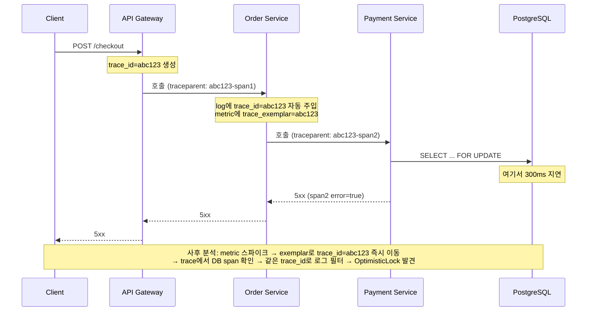

### Observability의 세 기둥이 "따로 놀면" 왜 무용지물인가 — 상관관계(Correlation)로 다시 짓는 관측 가능성

MSA와 클라우드 네이티브로 넘어오면서 "모니터링(Monitoring)"이 아니라 "관측 가능성(Observability)"이라는 단어가 자리를 잡았다. 차이는 명확하다. **모니터링은 "이미 알고 있는 문제"를 감시**하는 것이고(CPU 90%, 응답시간 1초 초과 등), **Observability는 "몰랐던 문제"의 원인을 시스템 외부에서 추론**할 수 있는 능력이다. 그리고 그 능력은 흔히 세 기둥(Three Pillars) — Metrics, Logs, Traces — 로 이야기된다. 하지만 시니어의 관점에서 진짜 중요한 것은 이 셋을 "개별적으로 잘 수집하는 것"이 아니라, **셋을 하나의 사건(request/incident)으로 꿰어내는 상관관계(correlation)** 다.

### 세 기둥은 각자 다른 질문에 답한다

```
┌─────────────────────────────────────────────────────────────┐
│                    하나의 요청이 실패했다                       │
└─────────────────────────────────────────────────────────────┘
         │                    │                    │
         ▼                    ▼                    ▼
   ┌──────────┐         ┌──────────┐         ┌──────────┐
   │ METRICS  │         │  TRACES  │         │   LOGS   │
   └──────────┘         └──────────┘         └──────────┘
   "얼마나 자주       "이 요청은        "그 순간 정확히
    실패하는가?"      어디서 느려졌나?"   무슨 일이 있었나?"

   집계된 숫자          요청의 여정         원시 이벤트
   (aggregated)      (per-request path)    (raw context)

   저비용·저해상도     중비용·중해상도      고비용·고해상도
   (수개월 보관 가능)  (샘플링 필수)       (며칠~수주 보관)
```

- **Metrics**: 시계열 숫자. "지난 5분간 checkout API의 p99 지연이 800ms → 3s로 튀었다"는 **추세**를 준다. 카디널리티(태그 조합 수)가 폭증하면 비용이 기하급수적으로 오르는 것이 함정 — Prometheus에서 `user_id`를 라벨로 붙이면 시스템이 무릎을 꿇는다.
- **Traces**: 하나의 요청이 서비스 A→B→C→DB를 거치며 각 span에서 얼마나 걸렸는지를 트리 구조로 보여준다. **"어디서" 느려졌는가**에 답한다. 다만 모든 요청을 저장하면 파산하므로 **샘플링 전략**(head-based 1%, tail-based 에러/느린 것만, adaptive 등)이 실무의 승부처다.
- **Logs**: 그 순간의 문맥(context). "결제 취소 시 재고 롤백에서 `OptimisticLockException`이 발생했다"는 **원인의 세부사항**을 준다. 가장 비싸고 가장 부정확한(비구조화·중복·누락) 신호다.

### 진짜 문제: 세 신호가 "같은 사건"임을 어떻게 증명하는가

세 기둥을 각기 다른 도구(Datadog, Grafana, ELK)에 심어놓기만 하면 장애 발생 시 이런 일이 벌어진다.

1. Metrics 대시보드에서 오전 10:37에 에러율 5% 튐을 발견
2. "그럼 그 순간 트레이스를 보자" — 하지만 트레이스 시스템에 넘어가면 시간 필터만 있고, **어떤 트레이스가 실패한 것인지 특정할 방법이 없음**
3. 로그로 가면 이번엔 "그 트레이스의 로그"를 찾을 수 없음 — 로그와 트레이스가 서로를 모른다

이걸 해결하는 것이 **Trace ID / Span ID의 전 계층 전파**다. OpenTelemetry(OTel)가 사실상의 표준이 된 이유이기도 하다.



핵심은 세 가지다.

- **Trace context 전파**: W3C `traceparent` 헤더를 모든 서비스 간 호출(HTTP, gRPC, Kafka 메시지 헤더)에 반드시 얹는다. Kafka producer/consumer, 배치 job까지 — 여기서 한 곳이라도 끊기면 트레이스는 그 뒤부터 "다른 요청"이 된다.
- **로그에 trace_id 자동 주입**: MDC(Mapped Diagnostic Context)를 이용해 SLF4J/Logback 로그 라인마다 `trace_id`, `span_id`가 붙게 한다. Spring Boot에서 `micrometer-tracing`을 쓰면 자동이다.
- **Metric ↔ Trace 연결(Exemplars)**: Prometheus의 `exemplar` 기능은 히스토그램 버킷의 "그 값을 만든 실제 요청의 trace_id"를 함께 저장한다. Grafana에서 지연 스파이크 점을 클릭하면 그 지연을 만든 실제 트레이스로 바로 점프한다. 이게 있느냐 없느냐가 MTTR을 10배 가른다.

### 트레이드오프: "다 저장하면 파산, 안 저장하면 실명"

| 접근 | 장점 | 단점 | 언제 쓰나 |
|---|---|---|---|
| 100% 저장 | 놓치는 것 없음 | 트래픽의 30~50%가 관측 비용으로 나감 | 저 QPS·고 가치 시스템(결제 코어) |
| Head-based 샘플링 (예: 1%) | 예측 가능한 비용 | 드문 에러 놓침 | 대부분의 웹 트래픽 |
| Tail-based 샘플링 | 에러·느린 요청은 100%, 성공은 1% | 수집 파이프라인이 복잡·비쌈(collector에 버퍼링) | 대규모 MSA (수천 서비스) |
| 구조화 로그 없이 free-text | 개발 편함 | 대규모에서 grep 지옥, 상관관계 불가 | 절대 쓰지 말 것 |

**카디널리티 폭발**도 실무의 흔한 사고다. `http_requests_total{user_id="...", url="/api/orders/12345"}` 같은 라벨을 붙이면 시계열 개수가 사용자 수 × URL 수만큼 폭증한다. 원칙: **높은 카디널리티 정보는 Trace/Log에, 낮은 카디널리티 집계만 Metric에.** Netflix, Uber가 반복적으로 공유한 교훈이다.

### 실제 사례

- **Netflix**의 Atlas(메트릭) + Mantis(스트리밍 이벤트) + Edgar(트레이스) 조합은 각 툴에서 같은 요청을 상관 추적하도록 처음부터 설계됐다. 장애가 나면 SRE가 하나의 dashboard에서 metric 스파이크 → trace → log로 이동하는 데 초 단위가 걸린다.
- **Uber**는 자체 트레이싱 시스템 **Jaeger**를 오픈소스화했다(현재 CNCF). MSA 3000개 이상 규모에서 head-based로는 답이 안 나와 tail-based 샘플링과 adaptive sampling을 고안했다.
- **Shopify**는 Black Friday 트래픽을 감당하기 위해 관측 스택을 통째로 OpenTelemetry로 이전 — 벤더 락인 회피와 span/log/metric의 통합이 목적이었다.
- 반면 **초기 스타트업**이 처음부터 OTel Collector·Tempo·Loki·Mimir 풀스택을 세우는 것은 대개 오버킬이다. Datadog SaaS 하나로 시작해 비용 곡선이 꺾일 때 자체 구축을 검토하는 것이 현실적이다.

### 시니어의 관점: 언제 쓰고, 언제 쓰면 안 되는가

**쓸 때**
- 서비스가 3개를 넘어가면 트레이스는 협상 불가다. 한 요청의 여정을 사람이 머리로 재구성할 수 없기 때문이다.
- 장애 사후분석(post-mortem)에서 "왜 그랬는지 모르겠다"가 반복된다면 이는 도구 부족이 아니라 **상관관계 부재**의 신호다. Trace ID 전파부터 손보라.
- SLO 기반 운영으로 넘어가려 한다면 **에러 예산(error budget)** 을 계산할 metric 없이는 시작조차 못 한다.

**쓰지 말거나 미룰 때**
- 서비스가 1~2개, 트래픽 QPS 10 미만: 애플리케이션 로그와 클라우드 제공 기본 메트릭으로 충분하다. 세 기둥 풀스택을 세우면 관측 비용이 인프라 비용을 넘어선다.
- Trace를 "모든 것을 다 보관"하는 방식으로 도입: 6개월 뒤 청구서를 보고 후회한다. 처음부터 샘플링 전략을 정하라.
- 관측 데이터를 대시보드만 만들고 **알람과 SLO에 연결하지 않는 경우**: 대시보드는 장애 후에 열리고, 알람은 장애 전에 울린다. 알람 없는 관측은 장식이다.
- 개발자가 로그 라인에 `trace_id`, `user_id`, `request_id` 등 **문맥(context)** 을 넣지 않는 문화: 도구를 아무리 좋은 걸 써도 상관관계는 실패한다. 관측 가능성은 인프라가 아니라 **코드 컨벤션**의 문제다.

결국 Observability의 성숙도는 "어떤 툴을 쓰느냐"가 아니라 "장애 발생 시 metric 알람 → 관련 trace → 해당 log까지 몇 번의 클릭으로, 몇 초 안에 도달할 수 있는가"로 측정된다. 그 흐름을 못 만들면 아무리 비싼 SaaS를 도입해도 결국 사람이 눈으로 찾아 헤맨다.

> 💡 **왜 중요한가**: 관측 가능성의 진짜 가치는 세 기둥을 각각 잘 수집하는 것이 아니라, Trace ID를 축으로 metric·log·trace를 하나의 사건으로 꿰어 MTTR을 초 단위로 줄이는 데 있다.
