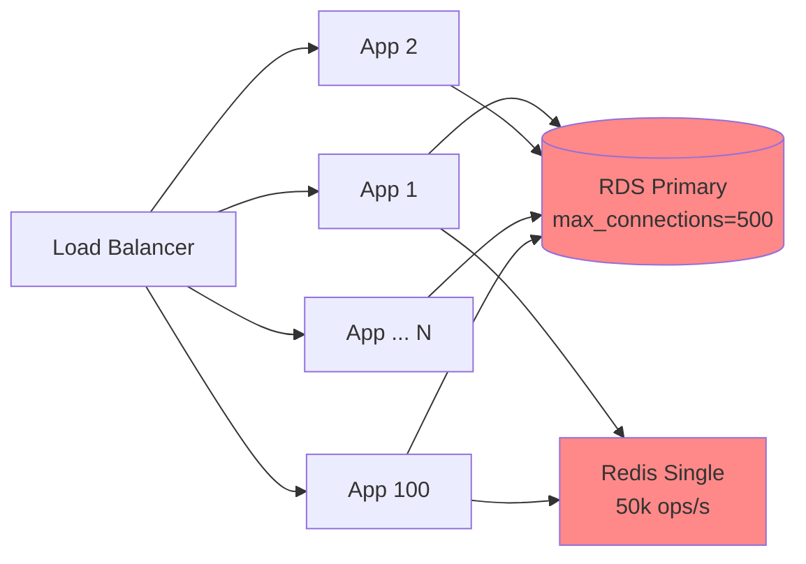

### Auto Scaling의 함정 — "인스턴스를 늘리면 처리량도 는다"는 착각과, 스케일링이 실제로 실패하는 지점들

Auto Scaling은 클라우드 네이티브의 상징적인 약속이다. "부하가 오르면 인스턴스를 자동으로 늘리고, 부하가 빠지면 자동으로 줄인다." AWS ASG, Kubernetes HPA/VPA/Cluster Autoscaler, KEDA — 도구는 넘쳐나고, 설정도 어렵지 않다. HPA에 `targetCPUUtilizationPercentage: 70` 한 줄만 넣으면 "확장성 있는 시스템"이 되었다고 믿는다.

그러나 시니어라면 이 약속이 **매우 좁은 조건에서만 성립한다**는 사실을 안다. 실제 프로덕션에서 Auto Scaling이 무용지물이 되거나, 오히려 장애를 증폭시키는 순간은 놀랍도록 자주 온다. 이 글은 "Auto Scaling을 켰다"는 안심 뒤에 숨어 있는 네 가지 근본적인 함정을 다룬다.

---

#### 함정 1: 스케일 아웃보다 부하 상승이 빠르다 — "Scale-out lag"

Auto Scaling의 대전제는 "부하 증가 속도 < 인스턴스 준비 속도"다. 이 부등식이 깨지는 순간, Auto Scaling은 존재하지 않는 것과 같다.

```
[t=0s]   RPS  1,000 → 정상, 인스턴스 5대
[t=10s]  RPS 10,000 → HPA가 CPU 90% 감지
[t=30s]  HPA 결정 (metrics 스크레이프 15s + 결정 15s)
[t=45s]  새 Pod 스케줄링 → 이미지 pull (10-60s)
[t=90s]  컨테이너 시작 → JVM warm-up (30-120s)
[t=120s] readiness probe 통과, 트래픽 수신 시작
         ↑
         이 2분 동안 기존 5대는 이미 죽었다
```

Java 애플리케이션의 경우 특히 잔인하다. Spring Boot 앱이 JIT warm-up을 거쳐 정상 응답 속도(P99 < 100ms)에 도달하려면 통상 60~180초가 걸린다. 그런데 트래픽은 초 단위로 튄다. 티켓팅, 라이브 커머스, 뉴스 속보 트래픽은 30초 안에 10배가 오른다.

**실제 사례**: 2019년 Slack 대규모 장애의 원인 중 하나는 이 "scale-out lag"이었다. 인증 서비스가 스케일 아웃되는 동안 기존 인스턴스에 요청이 몰려 연쇄 타임아웃이 발생했고, 새 인스턴스가 뜨자마자 밀린 요청이 한꺼번에 몰려 다시 죽는 **thundering herd**가 반복됐다.

**대응 전략**:
- **Pre-warming**: 예측 가능한 트래픽(광고, 오픈 시간)은 스케줄 기반으로 사전 확장 (`KEDA CronScaler`, AWS Predictive Scaling)
- **Over-provisioning headroom**: CPU 70%가 아니라 40~50%를 타겟으로 설정. 여유분이 곧 시간을 벌어준다
- **Warm pool**: AWS의 Warm Pool처럼 미리 부팅된 인스턴스를 대기시키기
- **GraalVM Native Image / CRaC**: JVM warm-up 자체를 제거

---

#### 함정 2: CPU는 거짓말한다 — 잘못된 스케일링 지표

HPA의 기본 지표는 CPU 사용률이다. 그러나 대부분의 백엔드 서비스에서 **CPU는 진짜 병목이 아니다**.

| 서비스 유형 | 진짜 병목 | CPU 기준 스케일링의 결과 |
|---|---|---|
| DB 프록시 | 커넥션 풀 | CPU 30%인데 커넥션 고갈로 응답 불가 |
| 외부 API 게이트웨이 | I/O 대기 | CPU 20%인데 스레드 풀 포화 |
| WebSocket 서버 | 동시 연결 수 | CPU 10%인데 파일 디스크립터 한계 |
| 배치 컨슈머 | Kafka lag | CPU 60%인데 lag 100만 건 누적 |

CPU 기준 HPA는 이런 서비스에 대해 **"괜찮다고 착각하는 계기판"**이 된다. 지표가 임계값에 닿지 않으므로 스케일 아웃이 트리거되지 않고, 정작 사용자는 타임아웃을 맞고 있다.

**대응**: 커스텀 메트릭 기반 스케일링. Kubernetes에서는 Prometheus Adapter + KEDA가 표준이 됐다.

```yaml
apiVersion: keda.sh/v1alpha1
kind: ScaledObject
metadata:
  name: order-consumer
spec:
  scaleTargetRef:
    name: order-consumer
  triggers:
  - type: kafka
    metadata:
      bootstrapServers: kafka:9092
      consumerGroup: order-group
      topic: orders
      lagThreshold: "1000"   # 진짜 병목 지표
```

Netflix는 자사 스케일링 시스템 Scryer에서 **"RPS per instance"**를 핵심 지표로 삼는다. CPU는 부차적이다. "이 인스턴스가 몇 개의 요청을 처리하고 있는가"가 곧 용량이기 때문이다.

---

#### 함정 3: 스케일 아웃해도 병목은 그대로 — 공유 의존성의 저주

이것이 Auto Scaling의 **가장 치명적인 함정**이다. 애플리케이션 인스턴스를 100대로 늘려도, 뒤에 있는 것들이 함께 늘어나지 않으면 아무 소용이 없다.



App이 100대인데 각각 커넥션 풀 20개를 열면 → DB 커넥션 요구량 2,000. RDS `max_connections=500`이라면 → 1,500개의 요청은 커넥션 획득에서 막힌다. 스케일 아웃이 **오히려 DB를 죽이는 무기**가 된다.

**시니어의 진단 체크리스트**:
1. DB 커넥션 풀이 인스턴스 수 × 풀 크기로 선형 증가하는가? PgBouncer 같은 커넥션 풀러가 앞단에 있는가?
2. Redis, ElastiCache는 단일 노드인가? Cluster mode인가?
3. 외부 API rate limit이 있는가? 100대가 동시에 호출하면 429가 쏟아지지 않는가?
4. S3, SQS 같은 관리형 서비스도 계정/파티션 단위 quota가 있다 — 인지하고 있는가?

**실제 사례**: 2021년 Roblox 3일 장애의 근본 원인 중 하나가 이것이었다. Consul 클러스터가 서비스 등록 요청 폭증에 대응해 노드를 추가했지만, Consul 자체의 leader election과 replication이 병목이었다. 애플리케이션 스케일 아웃이 오히려 Consul을 더 빠르게 죽였다.

---

#### 함정 4: 스케일 인의 잔인함 — "누구를 죽일 것인가"

스케일 아웃은 로그로 자주 회고되지만, 스케일 인(축소)은 조용히 문제를 만든다. 부하가 빠질 때 인스턴스를 종료하는 과정에서 다음이 자주 실패한다.

- **In-flight 요청 종료**: 처리 중인 HTTP 요청, 카프카 컨슈머의 미커밋 오프셋, WebSocket 연결이 강제 종료됨
- **Graceful shutdown 시간 부족**: `terminationGracePeriodSeconds` 기본 30초. 그러나 배치 작업이 10분 걸린다면?
- **Sticky session 붕괴**: 세션 저장소가 인메모리라면 사용자가 로그아웃당함
- **Warm-up 손실**: 캐시가 채워진 인스턴스를 죽이고, 다시 부하가 오면 콜드 캐시로 시작

```
스케일 인 트리거
     ↓
Pod에 SIGTERM 전송
     ↓
preStop hook 실행 (연결 드레이닝, LB 등록 해제)
     ↓
readiness probe fail 전파 대기 (LB가 트래픽 끊는 데 5~30초)
     ↓
애플리케이션의 graceful shutdown
     ↓
terminationGracePeriodSeconds 초과 → SIGKILL (강제 종료)
```

**대응**:
- `preStop` hook에 `sleep 15` — LB가 endpoint 변경을 인지할 시간을 벌기
- 컨슈머는 반드시 커밋 후 종료. Spring Kafka의 `ContainerStoppedEvent` 활용
- **stabilization window**: HPA v2의 `behavior.scaleDown.stabilizationWindowSeconds: 300` — 5분간 부하가 꾸준히 낮아야 스케일 인. 짧게 튀는 저부하로 인스턴스를 죽이지 않기

---

#### 시니어의 관점: Auto Scaling을 켜기 전에 던져야 할 질문들

Auto Scaling은 "일단 켜두면 좋은 것"이 아니다. **부하 패턴과 시스템 구조에 맞아야 이득**이다.

**켜는 것이 정당한 경우**:
- 부하가 예측 불가능하고 변동성이 크다 (사용자 트래픽, 이벤트 기반 잡)
- 상태가 없는 서비스이거나, 상태를 외부화(Redis, DB)했다
- 병목이 애플리케이션 CPU/메모리에 있고, 뒤단(DB, 외부 API)은 여유가 있다
- 인스턴스 시작 시간이 부하 상승 속도보다 빠르다 (혹은 pre-warming이 가능하다)

**켜면 안 되거나, 신중해야 하는 경우**:
- 부하가 예측 가능하다 (스케줄 기반 프로비저닝이 더 저렴하고 안전)
- 뒤단이 스케일링을 지원하지 않는다 (레거시 Oracle, 온프레미스 DB)
- 인스턴스 warm-up이 5분 이상 걸린다 (스케일링해도 늦다 → over-provisioning이 답)
- 스테이트풀 서비스 (DB, Kafka broker) — Auto Scaling ≠ Scale-out이다. Vertical scaling이나 파티션 재분배가 필요하다

**Auto Scaling은 만병통치약이 아니라, "충분히 큰 baseline capacity + 안전 마진" 위에 얹는 추가 방어선이다.** baseline이 부족한 시스템은 스케일링이 아니라 아키텍처가 문제다. 스케일링에 의존해서 baseline을 낮추려는 순간, 첫 트래픽 스파이크에서 무너진다.

> 💡 **왜 중요한가**: Auto Scaling은 "인스턴스를 늘리는 자동화"가 아니라 "부하 상승 속도, 지표의 진실성, 뒤단의 확장 여력, 안전한 스케일 인"이라는 네 가지 조건을 모두 만족할 때만 작동하는 매우 좁은 약속이며, 이 조건을 검증하지 않은 채 켜두면 오히려 장애를 증폭시킨다.
