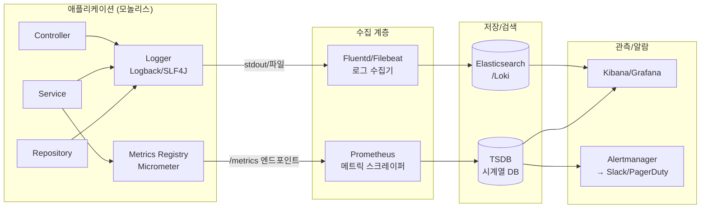

### 로깅·모니터링 기초 — "관측 가능성(Observability)"은 왜 개발이 아니라 운영의 문제인가

단일 서버 모놀리스에서도 로깅과 모니터링은 "잘 돌아가는 시스템"과 "장애 났을 때 원인을 알 수 있는 시스템"을 가르는 결정적 요소다. 코드는 배포되는 순간 블랙박스가 되고, 그 블랙박스 안에서 무슨 일이 벌어지는지 알려주는 유일한 창구가 로그와 메트릭이다.

---

#### 1. 세 가지 신호(Three Pillars): Logs, Metrics, Traces

관측 가능성 이론에서 시스템이 자기 자신을 설명하는 방법은 세 가지다. 모놀리스라도 이 셋은 목적이 다르다.

| 신호 | 답하는 질문 | 저장 특성 | 비용 |
|------|-----------|----------|------|
| **Logs** | "그때 무슨 일이 있었나?" (이벤트) | 고용량 텍스트, 개별 이벤트 | 저장 비쌈, 조회 느림 |
| **Metrics** | "지금 얼마나 심각한가?" (숫자) | 저용량 시계열, 집계값 | 저렴, 조회 빠름 |
| **Traces** | "요청이 어디서 느려졌나?" (흐름) | 요청 단위 그래프 | 샘플링 필요 |

Lv1 단계의 함정은 "로그만 남기면 다 된다"는 착각이다. 로그로 "지난 1시간 평균 응답시간"을 구하려면 로그 전체를 스캔해야 한다. 그건 메트릭이 할 일이다.

---

#### 2. 구조적 로깅(Structured Logging) — 문자열이 아니라 데이터

주니어와 시니어를 가르는 첫 번째 지점.

**❌ 나쁜 로그 (비구조적)**
```
2026-07-14 10:23:15 INFO 사용자 12345가 상품 A-100을 3개 주문했습니다. 금액: 45000원
```

**✅ 좋은 로그 (구조적, JSON)**
```json
{
  "timestamp": "2026-07-14T10:23:15.123Z",
  "level": "INFO",
  "event": "order.created",
  "userId": 12345,
  "productId": "A-100",
  "quantity": 3,
  "amount": 45000,
  "traceId": "abc-123-def",
  "service": "order-service"
}
```

차이점은 **검색 가능성(searchability)**이다. 비구조적 로그에서 "12345 사용자의 주문 실패율"을 뽑으려면 정규식과 눈물이 필요하다. JSON 로그는 `userId=12345 AND event=order.failed`로 끝난다.

Elasticsearch, Datadog, Loki 같은 도구들은 전부 구조적 로그를 전제로 설계되어 있다.

---

#### 3. 로그 레벨 — 소리 지를 시점을 정하는 규약

```
TRACE  →  DEBUG  →  INFO  →  WARN  →  ERROR  →  FATAL
(장황)                                            (치명)
```

시니어의 규칙:

- **ERROR**: 사람이 지금 봐야 한다. 알람이 울려야 한다. (DB 커넥션 끊김, 결제 실패)
- **WARN**: 지금 당장은 아니지만 누적되면 위험하다. (재시도 성공, 캐시 미스 급증)
- **INFO**: 비즈니스 이벤트. "주문 생성", "로그인 성공" — 감사(audit) 목적.
- **DEBUG**: 개발자용. 프로덕션에서는 기본 OFF.
- **TRACE**: 특정 요청 디버깅 시에만 임시로 켠다.

**흔한 실수**: 모든 예외를 `log.error()`로 찍는다. 그러면 알람이 노이즈가 되고, 진짜 ERROR가 묻힌다. `try-catch`로 정상 복구된 상황은 WARN이거나 아예 로그하지 않는다.

---

#### 4. Correlation ID(=Trace ID) — 요청의 실을 잇는 법

단일 서버라도 하나의 HTTP 요청은 여러 함수, 여러 DB 쿼리, 여러 로그를 만든다. 이 로그들을 어떻게 묶을까?

```
[요청 진입]
  ↓ traceId = "req-abc-123" 생성 (MDC / ThreadLocal에 저장)
  ↓
Controller.createOrder()
  → log("주문 요청 수신")  [traceId=req-abc-123]
  ↓
Service.processOrder()
  → log("재고 확인")       [traceId=req-abc-123]
  → log("결제 시작")       [traceId=req-abc-123]
  ↓
Repository.save()
  → log("DB 저장 완료")    [traceId=req-abc-123]
  ↓
[응답]
```

로그 시스템에서 `traceId=req-abc-123`로 필터링하면 그 요청의 전체 여정이 한 화면에 나온다. 이게 없으면 동시에 100건이 들어올 때 어느 로그가 어느 요청 것인지 알 수 없다.

Spring의 MDC(Mapped Diagnostic Context), Node.js의 AsyncLocalStorage가 이 역할을 한다. **모놀리스에서도 반드시 도입해야 한다.** 나중에 마이크로서비스로 갈 때 그대로 분산 트레이싱(OpenTelemetry)으로 확장된다.

---

#### 5. 전체 그림 — 로그·메트릭이 시스템 밖으로 나가는 여정



핵심 원칙: **애플리케이션은 로그를 stdout으로 뱉기만 하고, 어디로 보낼지는 인프라가 결정한다.** (12-Factor App §11) 앱 코드에 "Elasticsearch로 전송" 로직을 넣으면 인프라를 바꿀 때마다 재배포해야 한다.

---

#### 6. 메트릭의 4대 황금 신호(Google SRE)

Prometheus + Grafana를 붙였다면 최소한 이 네 가지는 대시보드에 있어야 한다.

1. **Latency (지연시간)** — p50, p95, p99. 평균은 거짓말한다. p99가 5초면 100명 중 1명은 5초를 기다리고 있다.
2. **Traffic (트래픽)** — 초당 요청 수(RPS). 갑자기 0이면 죽은 것, 갑자기 10배면 공격이거나 마케팅 성공.
3. **Errors (에러율)** — 5xx 응답 비율. SLO 계산의 기본.
4. **Saturation (포화도)** — CPU, 메모리, DB 커넥션 풀 사용률. 100%에 얼마나 가까운가.

---

#### 7. 트레이드오프 — 무엇을 얼마나 남길 것인가

| 결정 사항 | 많이(High) | 적게(Low) |
|----------|-----------|----------|
| **로그 상세도** | 디버깅 쉬움 | 저장비용↓, 조회 빠름 |
| **로그 보관기간** | 감사·법적 요건 충족 | 스토리지 비용↓ |
| **메트릭 카디널리티** | 세밀한 분석 | Prometheus 폭발 방지 |
| **동기 vs 비동기 로깅** | 안전(유실 없음) | 성능(응답 지연↓) |

**시니어의 판단 기준**:
- 결제·인증 로그는 무조건 남긴다 (규정, 분쟁, 포렌식).
- 헬스체크 로그는 무조건 뺀다 (초당 수십 건 노이즈).
- 개인정보(PII)는 로그에 절대 넣지 않는다 — 마스킹 규칙을 aspect로 강제한다.
- `userId=12345` 같은 저(低)카디널리티 태그는 OK, `requestId=uuid`를 메트릭 라벨로 넣으면 시계열이 폭발한다. (그건 로그/트레이스의 영역)

---

#### 8. 실제 사례

- **Netflix**: 초당 수백만 이벤트를 처리하기 위해 자체 로깅 파이프라인 **Keystone**을 만들었다. 애플리케이션은 로컬에 쓰기만 하고, 사이드카가 Kafka로 밀어 넣는 방식. "앱이 로그 전송으로 느려지면 안 된다"는 원칙의 극단.
- **Uber**: 마이크로서비스 3천 개 규모에서 로그로는 요청 추적이 불가능해 자체 분산 트레이싱 시스템 **Jaeger**(현 CNCF)를 오픈소스화했다. 모놀리스 시절에는 MDC로 충분했지만, 커지면서 필연적으로 traces 계층이 필요해진 사례.
- **당근마켓/토스**: 초기에는 CloudWatch Logs → 규모가 커지며 ELK(Elasticsearch-Logstash-Kibana) 또는 Datadog으로 이관. 공통점은 **처음부터 JSON 구조적 로그로 시작해서 이관 비용을 낮췄다는 것**.
- **잘못된 사례**: 어느 국내 e-commerce는 문자열 로그로 5년을 쓰다가 장애 원인 분석에 매번 4시간씩 걸려, 결국 전면 재작성. 초기의 30분짜리 결정이 5년치 부채가 된 케이스.

---

#### 9. 언제 쓰고, 언제 과한가

**반드시 도입해야 할 때**
- 프로덕션에 나가는 모든 서비스 (예외 없음). 사용자 1명짜리 사이드 프로젝트라도 최소 구조적 로그.
- 결제·인증·개인정보 처리 → 감사 로그는 법적 요구사항.
- 응답시간 SLO를 약속한 서비스 → p95 메트릭 없이는 SLO 준수 여부를 알 수 없다.

**과하게 하지 말아야 할 때**
- **로컬 개발/PoC**: Kibana까지 세팅하고 있으면 개발이 안 진행된다. `console.log`로 충분.
- **저(低) 트래픽 내부 도구**: 하루 100요청짜리 어드민에 Prometheus + Grafana + Alertmanager 스택은 유지비가 서비스 가치보다 크다. 클라우드 로그 서비스 기본형(CloudWatch, Stackdriver)이면 충분.
- **모든 함수에 진입/종료 로그**: `log("메서드 시작")` `log("메서드 끝")` — 이건 관측이 아니라 소음이다. 비즈니스 이벤트 경계에서만 남긴다.

**단계별 성숙도(Lv1 관점에서 적정선)**:
```
[Lv1 모놀리스 최소치]
1. 구조적(JSON) 로그 + 로그 레벨 준수
2. Correlation ID(MDC)로 요청 단위 추적
3. 4대 황금 신호 메트릭 + 간단한 대시보드
4. ERROR 로그 → Slack 알람 하나

이 정도면 웬만한 장애의 70%는 5분 내 원인 파악 가능.
그 이상(분산 트레이싱, 로그 파이프라인 자체 구축)은
서비스가 커진 후에 고민해도 늦지 않다.
```

---

> 💡 **왜 중요한가**: 코드는 "돌아가게" 만드는 것보다 "왜 안 돌아갔는지 5분 안에 설명할 수 있게" 만드는 것이 훨씬 어렵고, 그 격차를 메우는 유일한 수단이 로깅·모니터링이다.
