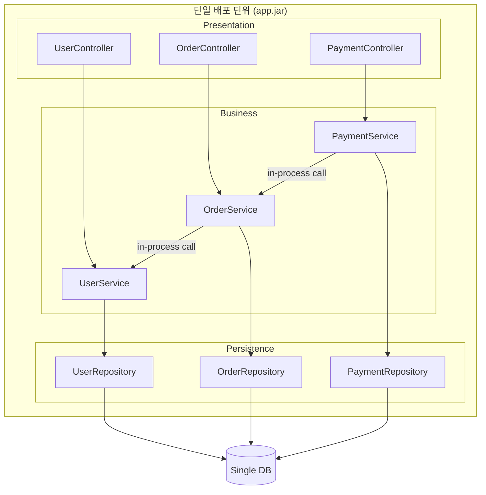

### 모놀리스 아키텍처 — "배포 단위"와 "설계 단위"를 혼동하지 마라

#### 1. 모놀리스는 "하나의 파일에 다 몰아넣은 코드"가 아니다

모놀리스(Monolith)라는 단어는 시니어들이 유독 자주 오해하는 단어다. 흔히 "코드가 뒤엉킨 스파게티" 또는 "레거시의 상징"으로 취급되지만, 실제 정의는 훨씬 단순하고 중립적이다.

> **모놀리스 = 하나의 배포 단위(Deployable Unit)로 빌드/배포되는 애플리케이션**

핵심은 "배포 단위"다. 코드가 얼마나 잘 나뉘어 있는지, 계층이 몇 개인지, 도메인이 몇 개인지와는 **무관하다**. Controller-Service-Repository 3계층으로 깔끔하게 나뉜 100만 라인 코드베이스가 하나의 `.jar` 파일로 배포된다면 그것은 모놀리스다. 반대로 코드가 뒤엉킨 스파게티라도 여러 배포 단위로 쪼개져 있으면 모놀리스가 아니다.

이 정의를 놓치면 앞으로 배울 개념(모듈러 모놀리스, SOA, 마이크로서비스)의 차이를 절대 이해할 수 없다.

#### 2. 구조



핵심 관찰 지점:
- 모든 레이어와 도메인이 **하나의 프로세스** 안에 있다
- 도메인 간 호출은 함수 호출(in-process) — 네트워크가 아니다
- 단일 커넥션 풀, 단일 스레드 풀, 단일 로그 파이프, 단일 JVM/GC를 **공유**한다

#### 3. 모놀리스가 잘 하는 것

**(1) 트랜잭션의 단순함**  
`@Transactional` 하나로 여러 도메인에 걸친 로직을 원자적으로 묶는다. 주문 생성 + 결제 상태 변경 + 포인트 차감이 한 트랜잭션이다. 서비스 분리 아키텍처에서는 Saga/Outbox 패턴을 동원해야 할 문제가, 모놀리스에서는 함수 호출 세 줄로 끝난다.

**(2) 리팩터링 속도**  
IDE가 모든 참조를 알고 있다. `UserService.findById()`의 시그니처를 바꾸면 컴파일러가 5초 만에 모든 파괴적 변경을 표시해준다. 분리 아키텍처에서 이 작업은 며칠짜리 API 계약 협상이 된다.

**(3) 운영 오버헤드가 거의 없다**  
CI/CD 파이프라인 1개, 모니터링 대시보드 1개, 로그 인덱스 1개, 배포 스크립트 1개. 6명 팀이 마이크로서비스 20개를 운영하려다 죽는 이유가 여기에 있다.

**(4) 저지연**  
in-process 함수 호출은 나노초, 네트워크 호출은 밀리초. 세 자릿수 차이다.

#### 4. 모놀리스가 못 하는 것

**(1) 부분 스케일링 불가**  
결제 로직만 CPU를 많이 써도, 그 부분만 스케일업할 수 없다. 전체를 통째로 복제해야 한다.

**(2) 기술 스택 고정**  
Java 애플리케이션이면 새 도메인도 Java여야 한다. 특정 워크로드에 Rust나 Go를 섞고 싶어도 배포 단위가 하나라 불가능하다.

**(3) 팀 병목**  
100명이 하나의 리포지토리를 만지면 머지 충돌, 배포 대기줄, 통합 테스트 지연이 지수적으로 커진다. Conway의 법칙이 배포 파이프라인 수준에서 부딪히는 지점이다.

**(4) 장애 격리 실패**  
한 곳의 메모리 누수가 전체 프로세스를 죽인다. 결제 코드의 무한 루프 하나가 로그인 API까지 마비시킨다.

#### 5. 실제 사례 — "다들 마이크로서비스로 갔다"는 신화

| 회사 | 규모 | 선택 | 이유 |
|---|---|---|---|
| **Shopify** | 억 단위 트래픽 | Ruby on Rails 모놀리스 유지 (2024년 기준) | 내부에 "모듈러 모놀리스" 경계를 강제. 배포는 통합 유지해 팀 협업 속도를 살림 |
| **Basecamp** | DHH의 대표작 | "Majestic Monolith" 선언 | 40명 규모에서 마이크로서비스는 조직적 낭비라는 주장 |
| **Stack Overflow** | 월 수십억 PV | .NET 모놀리스 + IIS 9대 | 초당 5,000+ 요청을 매우 낮은 지연으로 처리. "단순함이 성능이다"의 표본 |
| **Segment** | 데이터 파이프라인 | **마이크로서비스 → 모놀리스로 회귀** (2018) | 팀 규모 대비 서비스 수가 폭발. "Goliath"라는 이름의 모놀리스로 롤백 |
| **Amazon** | 초대형 | 2001년 모놀리스 탈피 | 하지만 그 시점 조직이 이미 **수천 명 규모**였다 |

Segment 사례가 특히 시사적이다. 그들은 "마이크로서비스가 나빠서"가 아니라 **"우리 팀 크기 대비 마이크로서비스의 운영 비용이 너무 커서"** 되돌아왔다. 아키텍처 결정은 코드가 아니라 조직 규모와 결합되어 있다.

#### 6. "모놀리스"와 "빅 볼 오브 머드"는 다르다

가장 위험한 오해가 이거다. 이 둘은 서로 **직교(orthogonal)** 하는 축이다.

```
                       배포 단위
                  ┌──────────┬──────────┐
                  │  하나     │  여러 개   │
      ┌───────────┼──────────┼──────────┤
  코드 │ 경계 있음  │ 좋은      │ 마이크로   │
  구조 │           │ 모놀리스   │ 서비스     │
      ├───────────┼──────────┼──────────┤
      │ 뒤엉킴     │ 빅 볼 오브 │ 분산       │
      │           │ 머드      │ 모놀리스   │
      └───────────┴──────────┴──────────┘
```

- "우리는 마이크로서비스라서 깨끗하다" → 거짓. 경계 없는 마이크로서비스는 **분산 모놀리스**가 되어 최악의 조합이 된다.
- "우리는 모놀리스라서 지저분하다" → 거짓. 계층/도메인 경계가 명확한 모놀리스는 팀 6명 스타트업의 최적해다.

즉, "좋은 모놀리스"와 "나쁜 모놀리스"의 차이는 배포 단위가 아니라 **내부 경계의 명확성**에서 나온다.

#### 7. 언제 쓰고, 언제 쓰면 안 되는가

**모놀리스로 시작해라, 만약:**
- 팀 크기가 15명 이하
- 도메인 경계가 아직 탐색 중 (제품이 안정되지 않음)
- 트랜잭션이 도메인 경계를 자주 넘음 (커머스/금융 초기)
- 인프라/DevOps 전담팀이 없음

**모놀리스에서 벗어나야 한다, 만약:**
- 특정 도메인의 부하 특성이 근본적으로 다름 (실시간 스트리밍 vs 배치)
- 배포 빈도가 팀별로 심하게 달라짐 (일 10회 vs 주 1회가 같은 파이프라인에 있음)
- 조직이 콘웨이 법칙상 하나의 팀으로 유지 불가능한 규모 (통상 50명+)
- 특정 도메인만 다른 기술 스택이 필수 (예: ML 워크로드가 Python 필수)

주의: **"확장성"은 생각보다 드물게 벗어날 이유가 된다.** Stack Overflow가 증명하듯 잘 만든 모놀리스는 웬만한 트래픽을 버틴다. 대부분의 "확장성 문제"는 사실 아키텍처가 아니라 DB 인덱스, 캐시 부재, N+1 쿼리 같은 마이크로한 이슈다. 아키텍처를 쪼개기 전에 프로파일러부터 켜라.

#### 8. Lv1 종합 — 우리가 배운 모든 것은 "좋은 모놀리스"의 조건이었다

지난 10일간 배운 것들을 다시 배치해 보면:

| 개념 | 모놀리스에서의 역할 |
|---|---|
| 레이어드 아키텍처, DTO/Entity 분리, DI/IoC/DIP | 모놀리스 **내부의 코드 경계** |
| REST API 설계 | 모놀리스가 **외부와 소통**하는 규칙 |
| 트랜잭션 경계 설계 | 모놀리스가 **무기로 삼을 수 있는 강점**을 활용하는 법 |
| 단일 DB 구조 | 모놀리스의 자연스러운 **데이터 저장소** |
| 세션 vs JWT, 로깅·모니터링 | 모놀리스를 **운영**하는 최소 도구 |

즉 Lv1 전체는 "좋은 모놀리스를 만드는 법"의 총합이었다. Lv2에서는 이 모놀리스 내부에 **명시적인 모듈 경계**를 그리는 방법(모듈러 모놀리스)과, 그 경계를 **다른 배포 단위로 분리**하는 방법(SOA/마이크로서비스)을 배운다.

> 💡 **왜 중요한가**: "모놀리스 = 나쁜 것"이라는 편견을 버리면, 아키텍처 결정은 "코드를 어떻게 나눌 것인가"가 아니라 **"배포 단위를 언제, 왜 나눌 것인가"** 라는 훨씬 정확한 질문으로 바뀐다.
