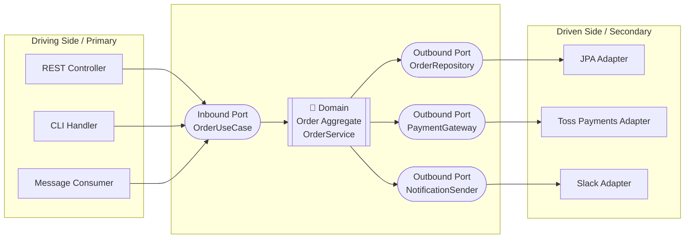

### Hexagonal Architecture (Ports & Adapters) — "도메인은 프레임워크를 알아서는 안 된다"

Alistair Cockburn이 2005년에 제안한 **Ports & Adapters** 패턴은, 사실 이름만 다른 DIP(의존성 역전 원칙)의 아키텍처적 구현이다. Layered/Clean/Onion이 "동심원의 방향"을 이야기한다면, Hexagonal은 "**바깥에서 안쪽으로 들어오는 문(Port)과, 그 문을 여닫는 손잡이(Adapter)**"라는 은유로 같은 원리를 훨씬 실용적으로 풀어낸다.

---

#### 1. 왜 육각형인가? — "네 개 방향으로는 부족했기 때문"

전통적인 3-Tier/4-Layer는 "위/아래"만 존재한다. Controller가 위, DB가 아래. 그런데 실제 시스템은 이렇게 단순하지 않다.

- HTTP 요청도 있고, 메시지 큐 컨슈머도 있고, 배치 스케줄러도 있다 (**들어오는 방향**)
- DB도 있고, 외부 API도 있고, 캐시, S3, SMTP도 있다 (**나가는 방향**)

이걸 "상/하 레이어"로 그리면 어색하다. Cockburn은 그래서 도메인을 육각형 한가운데에 놓고, **모든 외부 세계와의 접점을 "육각형의 변(edge)"으로 표현**했다. 육각형이라는 도형에 특별한 의미는 없다. "위/아래가 아니라 다면(多面)이다"라는 것을 시각화한 것뿐이다.



- **Port**: 도메인이 정의하는 **인터페이스**. "나는 이런 걸 필요로 한다" 혹은 "나는 이런 기능을 제공한다"는 계약.
- **Adapter**: 그 Port를 구현하는 **바깥 세계의 구현체**. 프레임워크·라이브러리·프로토콜 지식이 여기에만 존재한다.

핵심 규칙 하나: **의존성 화살표는 항상 바깥 → 안쪽을 향한다.** 도메인은 어떤 어댑터도 알지 못한다.

---

#### 2. Inbound Port vs Outbound Port — 방향으로 나뉜다

| 구분 | Inbound (Driving) Port | Outbound (Driven) Port |
|---|---|---|
| 누가 호출? | 외부가 도메인을 호출 | 도메인이 외부를 호출 |
| 구현 위치 | 도메인 안 (UseCase 인터페이스) | 도메인 안 (Repository, Gateway 인터페이스) |
| Adapter 예시 | `@RestController`, `@KafkaListener` | `JpaOrderRepository`, `TossPaymentClient` |
| DIP와의 관계 | 어댑터가 포트에 의존 (자연스러움) | **도메인이 인터페이스를 소유, 어댑터가 구현 (역전됨)** |

Outbound Port가 진짜 핵심이다. `OrderRepository` 인터페이스가 **도메인 패키지에 있고**, JPA 구현체는 `infrastructure` 패키지에 있어야 한다. 이 방향이 뒤집혀 있다면 (도메인이 JPA를 알고 있다면) 그건 Hexagonal이 아니라 이름만 붙인 3-Tier다.

```kotlin
// domain/order/OrderRepository.kt  ← Port는 도메인 소유
package com.example.order.domain

interface OrderRepository {
    fun save(order: Order): Order
    fun findById(id: OrderId): Order?
}

// infrastructure/persistence/JpaOrderRepository.kt  ← Adapter는 바깥
package com.example.order.infrastructure.persistence

@Repository
class JpaOrderRepository(
    private val jpaRepo: SpringDataOrderJpaRepository
) : OrderRepository {
    override fun save(order: Order): Order = 
        jpaRepo.save(OrderJpaEntity.from(order)).toDomain()
    // ...
}
```

이 구조에서 도메인은 Spring도, JPA도, Kafka도 모른다. `import org.springframework.*` 이 도메인 패키지 안에 하나라도 있다면 냄새다.

---

#### 3. Layered / Clean / Onion / Hexagonal — 뭐가 다른가?

이 네 가지는 **99% 같은 이야기를 다른 은유로 하는 것**이다. 그러나 강조점이 다르다.

| 패턴 | 강조하는 것 | 약한 부분 |
|---|---|---|
| Layered (4-Layer) | 위→아래 흐름의 단순성 | 도메인이 인프라를 참조하기 쉬움 |
| Onion | 동심원 방향의 일관성 | 실제 접점(입/출)을 잘 표현 못함 |
| Clean Architecture | UseCase 계층의 분리, 엔터프라이즈/애플리케이션 규칙 구분 | 다이어그램이 추상적 |
| **Hexagonal** | **Port(계약)와 Adapter(구현)의 분리, 다중 접점** | 육각형이라는 표현이 오해를 줌 |

시니어 관점에서 실무 팁: **하나만 고르라고 강요할 필요 없다.** 대부분의 프로젝트는 "Clean의 4계층 이름 + Hexagonal의 Port/Adapter 명명"을 섞어서 쓴다. 예를 들어 `application/port/in`, `application/port/out`, `adapter/in/web`, `adapter/out/persistence` 같은 구조는 Uncle Bob의 Clean과 Cockburn의 Hexagonal을 혼합한 표준적인 패키지 구조다.

---

#### 4. 트레이드오프 — 무엇을 얻고 무엇을 잃는가

**얻는 것**
- **테스트 용이성**: 도메인을 순수 JVM 객체로 테스트할 수 있다. Spring Context 로딩 없는 밀리초 단위 단위 테스트.
- **인프라 교체 용이성**: JPA → MongoDB, REST → gRPC로 옮길 때 도메인은 손대지 않는다. 물론 이런 일이 **실제로 자주 일어나느냐**는 의문. 다만 "테스트에서 In-Memory Repository로 갈아끼우기"는 매일 일어난다.
- **프레임워크 종속성 격리**: Spring 6 → 7 마이그레이션 시, 도메인 코드는 변경 없음. Spring이 없어져도 도메인은 산다.
- **다중 진입점 자연스러움**: 같은 UseCase를 REST, gRPC, Kafka Consumer, Batch Job 네 곳에서 호출해도 코드 중복이 없다.

**잃는 것**
- **코드량 증가**: 간단한 CRUD 하나에 인터페이스 2~3개, 어댑터 2~3개, 매핑 클래스가 붙는다. 3개 필드짜리 CRUD API를 이렇게 짜면 팀원들이 뒤에서 욕한다.
- **매핑 지옥**: `OrderRequest` → `OrderCommand` → `Order` (도메인) → `OrderJpaEntity` → `OrderResponse`. 다섯 개의 객체가 같은 데이터를 표현한다. MapStruct/Kotlin data class copy에 의존하게 된다.
- **초기 러닝 커브**: 신입에게 "Repository 인터페이스는 왜 domain 패키지에 있는데 구현체는 infrastructure에 있어요?"를 설명해야 한다. Spring Data JPA의 관습과 정면 충돌한다.
- **성능 최적화의 벽**: N+1 문제, JOIN FETCH, Native Query 같은 인프라 특화 최적화가 도메인 인터페이스 뒤에 숨겨지면서 오히려 문제 파악이 어려워지는 경우가 있다.

---

#### 5. 실제 사례

- **넷플릭스(Netflix)**: 대다수 마이크로서비스가 유사한 구조. 특히 Studio 부문의 콘텐츠 관리 시스템에서 "도메인 로직을 프레임워크와 프로토콜로부터 분리"하는 것을 명시적 원칙으로 삼는다. 이유는 다양한 소비자(웹, 모바일, 데이터 파이프라인)가 같은 도메인 로직을 다른 프로토콜로 호출하기 때문.
- **우아한형제들(배달의민족)**: 배민찬, 결제, 주문 시스템에서 Hexagonal 스타일 채택. 특히 결제 도메인은 PG사(토스, KCP, NHN)가 어댑터로 격리되어 있어 PG 교체/추가가 도메인 변경 없이 가능하다. 이건 "실제로 자주 일어나는" 변화라서 투자 가치가 명확한 케이스.
- **당근마켓**: 채팅, 광고 등 코어 도메인에 Hexagonal 적용. 다양한 이벤트 소스(HTTP, Kafka, SQS)가 같은 UseCase를 호출하는 구조.
- **반례 - 초기 스타트업**: 대부분의 시드~시리즈 A 스타트업은 이 패턴을 강제하면 **오히려 개발 속도가 반토막 난다**. Spring Data JPA + `@RestController` 직접 호출로 MVP 만들고, 도메인이 안정된 뒤 리팩터링하는 것이 훨씬 합리적.

---

#### 6. 언제 쓰고, 언제 쓰면 안 되는가

**써야 할 때**
- 도메인 로직이 복잡하다 (조건 분기, 상태 전이, 정책이 많다)
- 같은 UseCase를 **여러 진입점**에서 호출한다 (REST + Kafka + Batch)
- **외부 시스템 교체 가능성**이 실제로 있다 (PG사, 알림 채널, 인증 IdP)
- 도메인 테스트 커버리지가 팀의 KPI다
- 팀 규모가 5명 이상이고 3년 이상 유지보수될 시스템이다

**쓰면 안 될 때**
- **CRUD 위주의 관리자 페이지, 사내 툴**: 매핑 오버헤드가 얻는 것보다 크다
- **PoC, MVP**: 도메인이 아직 정해지지 않았는데 도메인 계층부터 만들면 그거 다 버릴 확률이 높다
- **팀에 이 패턴을 이해하는 사람이 1명뿐**: 그 사람이 퇴사하면 나머지는 유지보수 못 한다. 코드는 팀 평균 수준으로 수렴한다.
- **단순 프록시/게이트웨이 서비스**: 도메인 로직이 사실상 없는데 껍데기만 만들면 오버 엔지니어링이다.

---

#### 7. 실무 체크리스트

새 프로젝트에서 Hexagonal을 도입할 때 스스로 물어볼 질문:

1. `domain` 패키지의 `import` 문에 `org.springframework`, `jakarta.persistence`, `com.fasterxml.jackson` 이 있는가? → 있으면 실패.
2. Outbound Port 인터페이스는 누구 것인가? 도메인 것이어야 한다. 인프라 패키지에 있다면 이름만 Port다.
3. 어댑터를 갈아끼운 통합 테스트가 실제로 존재하는가? (In-Memory Repository로 UseCase 테스트하는 것) 없다면 이 구조를 유지할 이유가 절반 사라진다.
4. DTO 매핑이 몇 단계인가? 5단계를 넘으면 `application/command`와 `application/result` 같은 개념으로 축약을 고려하라.
5. 신입이 첫날 이 구조를 30분 설명 듣고 이해할 수 있는가? 아니라면 README에 다이어그램과 함께 명시하라.

---

> 💡 **왜 중요한가**: Hexagonal은 "새 패턴"이 아니라 DIP를 아키텍처 스케일로 적용한 결과물이며, "도메인이 프레임워크를 몰라야 한다"는 원칙을 물리적 패키지 구조로 강제하는 가장 실용적인 방법이다.
