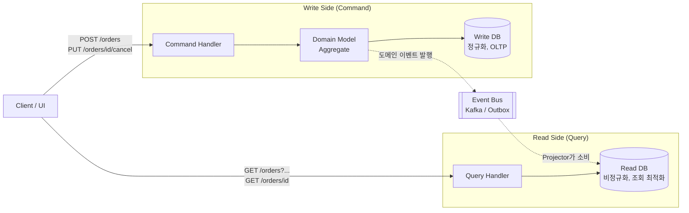

### CQRS (Command Query Responsibility Segregation) — "읽기와 쓰기는 원래 다른 문제였다"

#### 1. 왜 나왔는가: 하나의 모델이 두 얼굴을 감당하지 못한다

전형적인 CRUD 서비스는 **하나의 도메인 모델**로 읽기와 쓰기를 모두 처리한다. `Order` 엔티티가 있고, 그 엔티티로 주문을 생성·수정하고 동시에 주문 목록·상세 페이지에도 뿌린다. 시작할 때는 아무 문제 없다.

하지만 서비스가 성숙하면 두 세계는 요구사항이 갈라진다.

| 관점 | 쓰기(Command) | 읽기(Query) |
|------|---------------|-------------|
| 목적 | 상태 변경, 불변식 유지 | 조회, 화면 조립 |
| 데이터 형태 | 정규화된 단일 Aggregate | 여러 Aggregate가 합쳐진 View |
| 비율 | 보통 5~10% | 보통 90~95% |
| 최적화 대상 | 트랜잭션, 동시성 제어 | 응답 속도, 조인 최소화 |
| 요구 일관성 | 강한 일관성 (Strong) | 대체로 최종 일관성 허용 |

같은 `Order` 엔티티에 두 요구사항을 다 담으면, 도메인 모델은 화면용 필드로 뚱뚱해지고("주문자 이름 스냅샷", "배송지 라벨"), 반대로 조회 쿼리는 5개 테이블을 JOIN하며 매번 N+1을 걱정하게 된다. **핵심 통찰은 이것이다**: 읽기와 쓰기는 애초에 다른 문제인데, 우리가 "하나의 모델"이라는 관성으로 억지로 붙여놨을 뿐이다.

CQRS는 **"명령(Command)과 조회(Query)의 책임을 모델 수준에서 분리하자"** 는 원칙이다. Greg Young이 2010년경 정리했지만, 뿌리는 Bertrand Meyer의 CQS(Command-Query Separation, 메서드 단위) 원칙이다. CQRS는 이 아이디어를 **아키텍처 수준**으로 끌어올린 것이다.

---

#### 2. CQRS의 3단계 스펙트럼

CQRS를 "무조건 DB를 두 개 두는 것"으로 오해하면 안 된다. 실제로는 강도가 다른 3단계 스펙트럼이다.

```
[Level 1]  같은 DB, 다른 모델           (가벼움)
[Level 2]  같은 DB, Read Model 뷰/구체화 
[Level 3]  다른 DB (Write DB + Read DB) (무거움, 이벤트 소싱과 자주 결합)
```

##### Level 1 — 코드 레벨 분리

같은 DB, 같은 테이블을 쓰되 **애플리케이션 코드에서 Command 핸들러와 Query 핸들러를 나눈다**. Write는 도메인 Aggregate를 통과하지만, Read는 도메인 모델을 거치지 않고 바로 DTO로 매핑한다.

```java
// Command 측 — 도메인 규칙 통과
orderRepository.findById(id).cancel(reason);

// Query 측 — 도메인 모델을 만들지 않고 JOIN + Projection
jdbcTemplate.query("SELECT o.id, u.name, ... FROM orders o JOIN ...", OrderListDto::from);
```

이것만 해도 도메인 모델이 화면 요구사항에 오염되지 않는다. 대부분의 팀은 Level 1만으로 충분하다.

##### Level 2 — Read Model 분리 (같은 DB)

같은 DB 안에 조회 전용 **뷰(view)**, **구체화 뷰(materialized view)** 또는 **비정규화 테이블**을 둔다. 쓰기가 일어나면 트리거·배치·이벤트 핸들러로 Read Model을 갱신한다.

##### Level 3 — 물리적 저장소 분리

Write는 PostgreSQL(트랜잭션 강함), Read는 Elasticsearch(검색)·Redis(캐시)·Cassandra(넓은 조회)로 분리한다. Write DB에서 이벤트가 발행되면 Read DB로 프로젝션(projection)한다. **일관성이 최종 일관성(eventual consistency)이 된다**는 것이 결정적 대가다.

---

#### 3. 아키텍처 다이어그램



핵심 흐름: **쓰기는 도메인 모델을 관통하고, 읽기는 도메인 모델을 우회한다.** 두 저장소 사이의 정합성은 이벤트를 통해 비동기적으로 맞춘다.

---

#### 4. 트레이드오프 — CQRS의 진짜 비용

CQRS는 공짜가 아니다. Level이 올라갈수록 다음 비용이 붙는다.

**얻는 것**
- 읽기와 쓰기를 **독립적으로 스케일**할 수 있다 (조회 90%면 Read DB만 늘리면 된다)
- 도메인 모델이 **화면 요구사항에서 자유로워진다** — Aggregate가 순수하게 비즈니스 불변식만 관리
- 조회 성능이 극적으로 좋아진다 (JOIN 제거, 인덱스 자유, 캐시 친화)
- 쓰기·읽기 팀이 **서로 다른 속도로 배포**할 수 있다

**잃는 것**
- **최종 일관성**: "주문 완료" 화면을 눌러 목록으로 갔을 때 방금 만든 주문이 안 보일 수 있다. UX 관점에서 대응 필요 (Optimistic UI, 재시도, "곧 반영됩니다" 표시).
- **인프라 복잡도 폭발**: 이벤트 버스, Outbox 패턴, Projector, DLQ, 재처리, Read Model 리빌드 — 한번 Level 3로 가면 되돌리기 어렵다.
- **디버깅 난이도**: "왜 안 보이지?" → Write DB에는 있음. 이벤트는 발행됨. Read Model은 뒤처짐. 이 상태를 재현하는 것부터 지옥이다.
- **코드량 증가**: Command/Query/Handler/Event/Projector가 각각 존재. 단순 CRUD 대비 2~3배 코드.

---

#### 5. 실제 사례

**Netflix 콘텐츠 메타데이터** — 편집자가 콘텐츠를 등록하는 Write 트래픽은 초당 몇 건이지만, 전 세계 시청자가 조회하는 Read는 초당 수백만 건이다. Write는 관계형에 저장하고, Read는 Cassandra·Elasticsearch에 프로젝션. Level 3의 교과서적 사례.

**LinkedIn 피드** — 사용자가 글을 쓰는 것(Command)과 팔로워 피드에 뿌리는 것(Query)이 완전히 다른 시스템. "글 게시" 이벤트가 팬아웃(fan-out)되어 수백만 개의 개인 피드 저장소로 프로젝션된다.

**은행 계좌 시스템** — Write는 이중 계정부기(double-entry bookkeeping) 이벤트 소싱, Read는 잔액 스냅샷·거래 내역 뷰. **계좌 잔액이 실시간으로 보여야 하는 지점만 강한 일관성**을 쓰고, 나머지는 CQRS로 처리.

**쿠팡·배민 주문 목록** — "내 주문 목록"은 주문/결제/배송/리뷰 4개 DB의 정보를 합쳐야 한다. 매 조회마다 JOIN하지 않고, 각 도메인 이벤트를 구독해 만드는 **비정규화된 Order View**를 별도로 유지. 사실상 Level 2~3의 CQRS다.

---

#### 6. 언제 쓰고, 언제 쓰면 안 되는가

##### ✅ 이때는 도입하라
- **읽기와 쓰기 부하 비율이 심하게 비대칭**일 때 (예: 100:1 이상)
- **조회 화면이 여러 Aggregate를 합쳐야 하는데** 매번 JOIN이 너무 비쌀 때
- 도메인이 복잡해서 **Aggregate가 화면 요구사항에 오염되고 있다**고 느낄 때
- **이벤트 소싱**을 이미 쓰고 있을 때 (CQRS는 이벤트 소싱의 자연스러운 짝)
- **감사(audit) 요구**가 강해서 상태 변경 이력이 이미 이벤트로 저장돼 있을 때

##### ❌ 이때는 쓰지 마라
- **트래픽이 낮고 도메인이 단순**한 CRUD 앱 — 그냥 Repository 하나로 충분
- **팀이 이벤트 기반 시스템 운영 경험이 없을 때** — Outbox·재처리·리빌드 노하우 없이 들어가면 데이터 유실로 이어진다
- **강한 일관성이 UX 요구사항**인 도메인 (예: 재고 카운터, 좌석 예약) — 최종 일관성이 사용자 신뢰를 무너뜨린다
- **모놀리스 초창기**에 "언젠가 필요하겠지"로 미리 도입 — YAGNI. 나중에 도입해도 늦지 않다

##### 🎯 시니어의 실전 감각
- 처음부터 Level 3로 가지 마라. **Level 1(코드 분리)에서 시작**해서, 조회 성능에 진짜 병목이 생기면 그때 Level 2로, DB 자체가 병목이면 그때 Level 3로. 각 단계는 되돌릴 수 있어야 한다.
- **읽기 지연(replication lag)의 상한**을 SLO로 명시하라. "10초 이내 반영"이 지켜지지 않는 CQRS는 곧 재난이 된다.
- **Read Model 리빌드(rebuild) 시나리오**를 처음부터 설계하라. 스키마 바꾸거나 버그 나면 Projector를 처음부터 다시 돌려야 한다. 이걸 미리 준비 안 하면 운영 중 발이 묶인다.

> 💡 **왜 중요한가**: CQRS는 "읽기 90%·쓰기 10%"라는 대부분의 실무 트래픽 비대칭성을 **아키텍처의 대칭성으로 위장하지 않게 해주는** 도구이며, 그 대가로 최종 일관성이라는 새로운 계약을 팀 전체가 받아들여야 한다는 점을 이해하는 것이 시니어 설계의 분기점이다.
