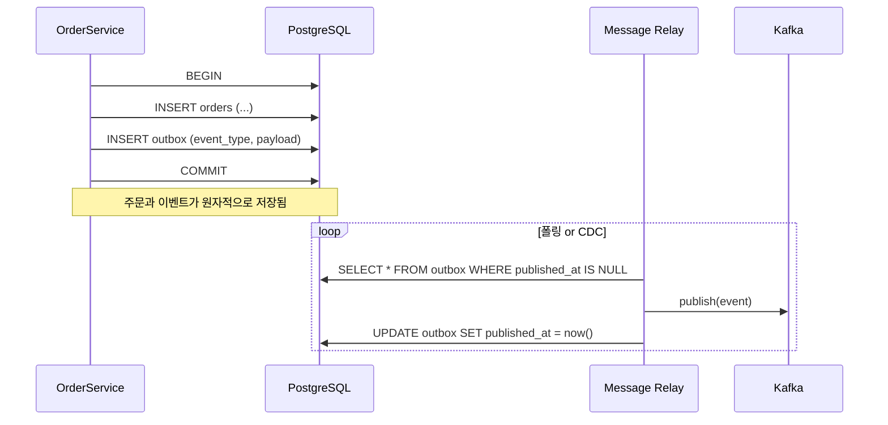

### 도메인 이벤트 (Domain Events) — "일어난 일"을 1급 시민으로 승격시키는 설계

#### 1. 왜 도메인 이벤트가 필요한가

전통적인 서비스 코드는 하나의 트랜잭션 안에서 여러 부수 효과를 몰아넣는다.

```java
// Anti-pattern: OrderService가 세상 모든 걸 안다
class OrderService {
    void placeOrder(Order order) {
        orderRepo.save(order);
        inventoryService.decrease(order.items());   // 재고 차감
        pointService.earn(order.userId(), order.total()); // 포인트 적립
        couponService.markUsed(order.couponId());   // 쿠폰 소진
        emailService.sendConfirmation(order);       // 메일 발송
        analyticsService.track("order_placed", order); // 분석
    }
}
```

문제는 **관심사의 전염**이다. 새로운 요구사항("주문 시 SMS도 보내주세요")이 생길 때마다 `OrderService`가 부풀고, 주문 도메인이 알 필요 없는 마케팅·통계·CRM 시스템까지 알게 된다. Lv1에서 배운 "결합도"라는 이름의 병이 클래스 단위가 아니라 **모듈 경계선을 넘어** 퍼지고 있는 상태다.

도메인 이벤트는 이 문제를 **"주문이 발생했다는 사실"을 기록하고, 관심 있는 자가 알아서 반응하도록** 뒤집는다.

```java
class Order {
    void place() {
        this.status = PLACED;
        registerEvent(new OrderPlaced(this.id, this.userId, this.total));
    }
}
```

`Order`는 이제 "주문이 발생했다"고 선언만 한다. 재고·포인트·쿠폰·메일은 각자 자기 관심사에 맞춰 이 사실에 반응한다.

---

#### 2. 도메인 이벤트란 정확히 무엇인가

> **도메인 이벤트(Domain Event)**: 도메인 전문가가 "관심 있을 만한 과거 시제의 사실". 이름은 반드시 **과거형**이다.

- `OrderPlaced` (O) — 이미 일어난 일
- `PlaceOrderCommand` (X) — 이건 커맨드다. 아직 안 일어남
- `OrderService` (X) — 이건 서비스다

과거형이 중요한 이유는, 이벤트는 **거부할 수 없기 때문**이다. 이미 일어난 일에 대해 "안 돼요"라고 답하는 핸들러는 없다. 후속 처리가 실패할 뿐이다. 이 성질이 시스템 설계에 근본적인 함의를 만든다(뒤에서 다룸).

---

#### 3. 두 얼굴 — Domain Event vs Integration Event

이 둘을 섞으면 반드시 아프다. Bounded Context 안팎을 기준으로 명확히 나눠야 한다.

```
┌─────────────── Order Bounded Context ────────────────┐   ┌─── Marketing Context ───┐
│                                                       │   │                          │
│   Order Aggregate                                     │   │   CampaignService        │
│      │                                                │   │        ▲                 │
│      │ raises                                         │   │        │ subscribes      │
│      ▼                                                │   │        │                 │
│   ┌──────────────────┐   in-process    ┌───────────┐  │   │   ┌────────────────┐    │
│   │ OrderPlaced      │ ─────────────▶  │ Inventory │  │   │   │ OrderCompleted │    │
│   │ (Domain Event)   │                 │ Handler   │  │   │   │ (Integration)  │    │
│   └──────────────────┘                 └───────────┘  │   │   └────────────────┘    │
│           │                                           │   │        ▲                 │
│           │ (동일 트랜잭션 or 아웃박스)                    │   │        │                 │
│           ▼                                           │   │        │ Kafka           │
│   ┌──────────────────┐   Outbox   ┌────────────────┐  │   │   ┌────┴─────────┐      │
│   │ integration_     │ ─────────▶ │ MessageRelay   │──┼───┼──▶│ Kafka Topic  │      │
│   │ events table     │            └────────────────┘  │   │   └──────────────┘      │
│   └──────────────────┘                                │   │                          │
│                                                       │   │                          │
└───────────────────────────────────────────────────────┘   └──────────────────────────┘
```

| 구분 | Domain Event | Integration Event |
|---|---|---|
| 범위 | 하나의 Bounded Context 내부 | 여러 컨텍스트/서비스 간 |
| 전달 | in-process(같은 프로세스 메모리) | Kafka/RabbitMQ/SNS 등 메시지 브로커 |
| 스키마 | 자유롭게 리팩터링 가능 | **공개 계약(public contract)**. 함부로 못 바꿈 |
| 페이로드 | 도메인 객체 참조 OK | 원시값 + ID 위주, 자기완결적 |
| 트랜잭션 | 원자성 가능 | 최종적 일관성 |

핵심 규칙: **Domain Event를 그대로 Kafka에 던지지 마라.** 도메인 객체 구조가 바뀔 때마다 다른 팀 시스템이 깨진다. Bounded Context 경계에서 **Integration Event로 번역**하는 명시적 단계를 두는 게 정석이다.

---

#### 4. 구현 — 트랜잭션 경계와 아웃박스 패턴

가장 흔한 실수:

```java
// 나쁜 예 — DB 커밋 전에 Kafka 발행
class OrderService {
    @Transactional
    void placeOrder(...) {
        orderRepo.save(order);
        kafkaTemplate.send("order.placed", event);  // ← DB 롤백돼도 메시지는 나감
    }
}
```

DB는 롤백됐는데 Kafka는 이미 나갔다. Marketing 팀은 존재하지 않는 주문에 쿠폰을 발급한다. 반대로 Kafka만 실패하면 주문은 됐는데 후속 처리는 영원히 안 온다.

해결책은 **Transactional Outbox 패턴**이다.



핵심은 이벤트를 **비즈니스 데이터와 같은 트랜잭션 안에서 outbox 테이블에 저장**하는 것. 별도 릴레이(폴링 워커 또는 Debezium 같은 CDC)가 outbox를 읽어 브로커로 전달한다.

- **At-least-once** 배달이 보장된다(중복은 발생 가능 → 구독자는 idempotent해야 함)
- 이벤트 순서는 파티션 키(예: orderId)로 보장
- **At-most-once가 필요한 사업은 거의 없다.** 대부분 "한 번 이상, 대신 중복은 소비 측이 처리"가 정답

---

#### 5. 트레이드오프

**얻는 것**
- 도메인 모듈이 얇아진다. Order는 자기 자신만 안다.
- 새로운 반응자를 추가할 때 기존 코드를 안 건드린다(개방-폐쇄 원칙이 실제로 작동).
- 감사 로그·시간여행 디버깅이 공짜로 따라온다. `outbox` 테이블 자체가 사실상 오디트 로그.
- 시스템 병목이 특정 서비스에 몰리지 않는다.

**잃는 것**
- **디버깅이 어려워진다.** 스택 트레이스가 끊긴다. "이 메일이 왜 왔지?"를 추적하려면 correlation ID + 분산 트레이싱이 필수.
- **일관성 모델이 바뀐다.** 강한 일관성 → 최종적 일관성. "주문 완료 화면에서 포인트가 아직 안 보이는데요?" 같은 UX 이슈가 생긴다.
- **중복 처리 방어가 모든 컨슈머의 책임**이 된다. Idempotency key 설계는 옵션이 아닌 필수.
- **이벤트 스키마가 사실상 API가 된다.** 한번 발행하면 소비자를 모르는 상태로 스키마를 바꿀 수 없다. 스키마 레지스트리(Confluent Schema Registry, Avro/Protobuf) 도입 압력이 들어온다.
- 초기 개발 속도는 느리다. 단순 CRUD에 이걸 도입하면 오버엔지니어링.

---

#### 6. 실제 사례

**쿠팡 — 주문 이벤트 기반 아키텍처**
쿠팡은 로켓배송 도입 시점에 주문 서비스가 물류·정산·고객·마케팅·재고 등 수십 개 downstream 시스템과 얽혀 있었다. 주문 API 응답 시간이 downstream 장애 하나에 좌우되는 상태였다. `OrderPlaced`, `OrderCancelled`, `OrderShipped` 같은 도메인 이벤트를 Kafka로 발행하는 구조로 전환하며 주문 API를 **downstream 장애로부터 격리**했다. 사이먼 브라운이 말한 "핵심 도메인은 주변의 소음으로부터 보호되어야 한다"의 실사판.

**Netflix — Studio Production Platform**
Netflix는 콘텐츠 제작 파이프라인에서 `ScriptApproved`, `CastingCompleted`, `PostProductionFinished` 같은 이벤트를 명시적 도메인 이벤트로 모델링했다. 이유는 조직 구조와 일치시키기 위해서였다(콘웨이의 법칙). 촬영팀·후반작업팀·마케팅팀이 각자 다른 시스템을 운영하고, 도메인 이벤트가 팀 간 계약이 되도록 한 것.

**Shopify — Modular Monolith 안의 도메인 이벤트**
Shopify는 여전히 하나의 Rails 모놀리스지만, 컴포넌트(Checkout, Payment, Shipping) 간에는 **in-process 이벤트 버스**로 통신한다. 마이크로서비스 없이도 도메인 이벤트만으로 관심사 분리를 달성한 대표 사례. 이미 다룬 [모듈러 모놀리스]와 도메인 이벤트가 잘 맞는 이유다.

---

#### 7. 언제 쓰고, 언제 쓰지 말아야 하나

**써야 할 때**
- 하나의 비즈니스 사건이 **3개 이상**의 서로 다른 부수 효과를 유발할 때
- 부수 효과의 목록이 **계속 늘어날 것으로 예상**될 때 (마케팅·분석·CRM은 대개 그렇다)
- 도메인 팀과 다른 팀(정산·물류·데이터) 간 결합을 끊고 싶을 때
- 감사 요구사항이 있을 때(금융·의료)
- 이미 Bounded Context가 명확히 나뉘어 있을 때

**쓰지 말아야 할 때**
- 도메인이 아직 CRUD 수준이고 부수 효과가 1~2개인 경우 → 그냥 함수 호출이 낫다
- **강한 일관성이 반드시 필요**한 경우(예: 계좌 이체의 출금-입금). 이건 사가 패턴 등 별개 논의.
- 팀에 분산 트레이싱/observability 기반이 없을 때 → 디버깅 지옥이 열린다
- "이벤트 = Kafka" 라고 착각하고 인프라부터 깔려는 경우. **먼저 in-process 도메인 이벤트로 시작하고**, 실제로 컨텍스트를 넘겨야 할 때만 외부화하라

---

#### 8. 흔한 함정 3가지

1. **Anemic Event** — `OrderUpdatedEvent(orderId=123)`처럼 ID만 들어있는 이벤트. 구독자는 결국 다시 API를 호출해 상세를 조회해야 한다. Event-Carried State Transfer로 필요한 상태를 담아라(단, 그렇다고 도메인 객체 전체를 통째로 실어 나르지도 말 것).
2. **이벤트로 커맨드를 흉내내기** — `SendEmailEvent`는 이벤트가 아니라 커맨드다. 이벤트는 사실을 알리고, 반응은 구독자의 선택이어야 한다. 이걸 섞으면 발행자가 다시 구독자를 알게 된다.
3. **이벤트 체인의 카오스** — A→B→C→D→A. 이벤트가 이벤트를 낳고 순환한다. 이벤트 흐름도(event storming 결과물)를 문서화하고 CI에서 순환 감지 툴을 돌려라.

---

> 💡 **왜 중요한가**: 도메인 이벤트는 "누가 무엇을 해야 하는가"를 "무엇이 일어났는가"로 뒤집어, 도메인의 결합도를 클래스가 아니라 **모듈·팀 단위에서** 근본적으로 낮추는 설계 도구다.
