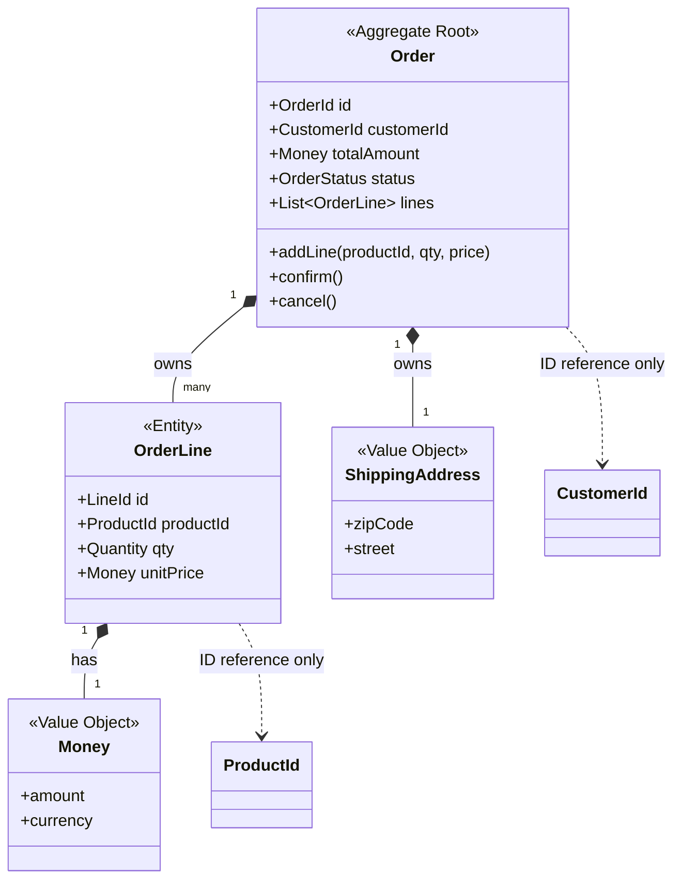

### DDD Aggregate — "일관성의 경계"를 어디까지 넓힐 것인가

Aggregate는 DDD에서 가장 실무적이면서 가장 많이 오해받는 개념이다. 흔히 "관련 엔티티들을 묶어놓은 것"으로 설명되지만, 본질은 **트랜잭션 일관성(transactional consistency)의 경계**를 어디에 그을 것인가에 대한 결정이다. Entity/VO를 "어떻게 모델링하느냐"의 문제라면, Aggregate는 "어디까지를 하나의 원자 단위로 묶을 것이냐"의 문제다.

#### 1. Aggregate가 정의하는 세 가지 경계

1. **일관성 경계**: 하나의 트랜잭션 안에서 원자적으로 지켜져야 할 규칙(invariant)의 범위
2. **동시성 경계**: 락(pessimistic) 혹은 버전(optimistic locking)이 걸리는 단위
3. **참조 경계**: Aggregate 외부는 반드시 Root의 ID를 통해서만 참조 (직접 객체 참조 금지)

Aggregate Root만이 외부(리포지토리, 애플리케이션 서비스)에 노출되고, 내부 Entity/VO는 Root를 거쳐서만 조작된다.

#### 2. 다이어그램: Order Aggregate

핵심은 점선 화살표(`..>`)다. `Customer`와 `Product`는 각자 다른 Aggregate이므로 **ID로만 참조**한다. 즉, `order.getCustomer().changeName(...)`은 원천적으로 불가능한 코드다. 이 규칙이 흐트러지는 순간 Aggregate는 이름만 남는다.

#### 3. 경계를 잘못 그었을 때 벌어지는 두 가지 재앙

**너무 크게 그은 경우 (God Aggregate)**
- `Customer`가 모든 `Order`, `Address`, `PaymentMethod`를 필드로 소유
- 주문 하나 추가할 때마다 Customer 전체를 로드 → 메모리·I/O 폭발
- 두 사용자가 같은 Customer의 서로 다른 필드를 수정 → 낙관적 락 충돌
- Vaughn Vernon의 *Implementing DDD*에 나오는 유명한 사례: 프로젝트관리 앱에서 `Project`가 `BacklogItem`, `Sprint`, `Release`, `Team`을 다 품었다가 성능 재앙 → 각각 별개 Aggregate로 쪼개면서 정상화.

**너무 작게 그은 경우**
- `Order`와 `OrderLine`을 별개 Aggregate로 분리
- "주문 총액이 X원 이하" 같은 invariant를 트랜잭션 하나로 지킬 수 없음
- 결국 애플리케이션 서비스에서 수동으로 락을 잡거나, 이벤트로 보정 → 복잡도가 오히려 폭증

#### 4. 실전 규칙 (Evans / Vernon 정리)

| 규칙 | 의미 |
|------|------|
| **Rule 1: 진짜 invariant만 묶어라** | "함께 자주 조회된다"는 이유로 묶지 마라. 트랜잭션적으로 함께 지켜져야 하는 규칙이 있을 때만 묶는다. |
| **Rule 2: 작게 설계하라** | Root + 소수의 VO/Entity. 큰 컬렉션은 별개 Aggregate로 뺀다. |
| **Rule 3: 외부는 ID로만 참조** | 객체 참조는 로딩 경계를 흐리고 캐싱·복제를 방해한다. |
| **Rule 4: 한 트랜잭션에 하나의 Aggregate만 수정** | Cross-aggregate 일관성은 도메인 이벤트 + 최종 일관성으로. |

Rule 4는 실무에서 가장 자주 어겨진다. "주문 확정 → 재고 차감"을 한 트랜잭션에 몰아넣고 싶은 유혹이 크지만, `Order`와 `Stock`이 다른 Aggregate라면 두 Aggregate를 한 트랜잭션에서 수정하는 순간 락 경합·데드락·확장성 문제가 시작된다.

#### 5. 트레이드오프

| 선택 | 얻는 것 | 잃는 것 |
|------|---------|---------|
| **큰 Aggregate** | 강한 일관성, 단순한 트랜잭션 코드 | 성능 저하, 락 경합, 확장성 상한 |
| **작은 Aggregate** | 성능, 확장성, 팀별 독립 개발 | 최종 일관성 관리 부담, 이벤트 인프라 필수 |
| **Aggregate 안 쓰기 (익명 CRUD)** | 초기 개발 속도 | invariant가 서비스층·컨트롤러·트리거에 산개 → 유지보수 지옥 |

#### 6. 실제 사례

- **Amazon 주문**: `Order`와 `Inventory`는 명확히 다른 Aggregate. 주문 확정 시 재고는 이벤트 기반으로 감소. "주문됐지만 재고 부족으로 사후 취소" 케이스는 보상 트랜잭션(saga)으로 처리. 강한 일관성을 포기하는 대신 확장성을 얻은 대표 사례.
- **Netflix 프로필/시청기록**: `Profile`과 `WatchHistory`를 분리. 프로필 수정과 초당 수만 건 쌓이는 시청 로그가 서로를 블로킹하지 않음.
- **국내 커머스(대형 e커머스 사례)**: 초기에 `Order`에 결제·배송·쿠폰·포인트까지 다 품었다가, 블랙프라이데이/특가 트래픽에서 락 경합으로 장애 → 도메인별 Aggregate로 재설계 + 이벤트 기반 통합. 재설계 이후 결제 지연시간이 절반 이하로 감소한 케이스가 국내 컨퍼런스 발표에서 반복적으로 등장한다.
- **은행 계좌 이체**: 계좌 A와 계좌 B는 각자 Aggregate. 이체는 두 Aggregate를 넘나들기 때문에 saga나 outbox 패턴이 필수 — DDD 교과서적 예시이자 실제로 대부분의 상용 뱅킹 시스템이 이렇게 구성된다.

#### 7. 시니어 관점: 언제 쓰고, 언제 쓰지 말 것인가

**써야 할 때**
- 도메인 규칙(invariant)이 명확하고 복잡한 시스템: 금융, 커머스, 예약, 물류
- 동시성 제어가 비즈니스적으로 중요한 경우 (재고, 좌석, 잔액)
- 팀이 유비쿼터스 언어(ubiquitous language)를 공유하고 도메인 전문가와 지속 대화할 준비가 된 조직

**쓰지 말아야 할 때**
- 단순 CRUD 애플리케이션 (관리자 화면, 마스터 데이터 관리, 리포트 시스템)
- 도메인 규칙이 거의 없는 데이터 이관·집계 파이프라인
- 팀이 "DTO에 Aggregate라는 이름만 붙이고 있는" 상태 — 이 경우 이득은 없이 러닝 커브·의식 절차만 남는다. 이름값을 못 하는 Aggregate는 오히려 코드베이스를 오염시킨다.
- **읽기 위주** 워크로드: Aggregate는 쓰기 모델을 위한 개념이다. 조회는 Aggregate를 우회해 별도의 읽기 모델로 가는 게 정석이다 (Lv3에서 다룰 주제).

> 💡 **왜 중요한가**: Aggregate는 "무엇을 함께 묶을까"가 아니라 "**어떤 규칙을 트랜잭션으로 지킬 것인가**"의 문제이며, 이 경계선이 시스템의 성능·확장성·복잡도의 상한선을 결정한다.
