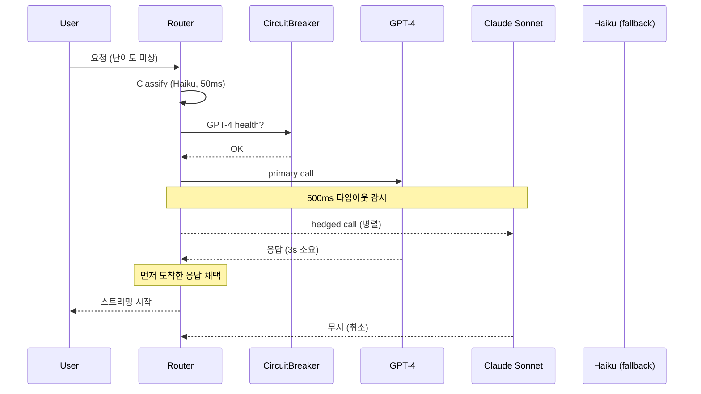

### LLM Routing과 Fallback — "GPT-4가 죽었을 때, 당신의 챗봇은 무엇을 하는가"

전통적인 백엔드 서비스는 데이터베이스가 죽으면 캐시로, 캐시가 죽으면 정적 응답으로 폴백한다. LLM 서비스도 똑같아 보이지만, 실제로는 훨씬 미묘하다. OpenAI가 rate limit을 걸어도, Anthropic이 지역 장애를 겪어도, 프로덕션은 계속 응답해야 한다. 그런데 "GPT-4 죽으면 Claude로 넘긴다"는 단순한 카스케이드가 실제로 왜 작동하지 않는가. 라우팅과 폴백은 **비용, 품질, 지연, 가용성이라는 4차원 최적화 문제**다.

#### 문제 정의: 한 모델에 묶이면 벌어지는 세 가지 사건

**① Rate Limit 지옥**: OpenAI GPT-4는 조직당 분당 토큰(TPM) 상한이 있다. 트래픽이 잠깐 튀면 429 에러가 쏟아지고, 재시도 백오프는 지연을 눈덩이처럼 키운다.

**② 지역 장애**: 2024년 6월 OpenAI가 3시간 다운되었을 때, 이 API에만 의존한 서비스들은 그동안 답변을 못 했다. 백업 프로바이더가 없으면 SLA는 프로바이더의 SLA에 종속된다.

**③ 비용 폭탄**: 모든 요청을 GPT-4에 보내면 요청당 $0.03이 나간다. 하지만 실제로는 요청의 70%가 "안녕", "다시 말해줘" 같은 GPT-3.5-turbo($0.001)로도 충분한 것들이다.

라우팅은 이 셋을 **한꺼번에** 풀어야 한다.

#### 라우팅 전략의 3가지 축

```
                    ┌────────────────┐
   요청 →           │  LLM Router    │
                    │                │
                    │  ┌──────────┐  │
                    │  │Classifier│──┼─→ 난이도/카테고리 판정
                    │  └──────────┘  │
                    │       ↓        │
                    │  ┌──────────┐  │        ┌─→ GPT-4o        (고품질/비쌈)
                    │  │  Policy  │──┼────────┼─→ Claude Sonnet (품질/속도)
                    │  │  Engine  │  │        ├─→ Haiku/GPT-4mini(빠름/저렴)
                    │  └──────────┘  │        └─→ Llama-local   (내부/무료)
                    │       ↓        │
                    │  ┌──────────┐  │
                    │  │Circuit   │──┼─→ 프로바이더별 헬스 트래킹
                    │  │Breaker   │  │
                    │  └──────────┘  │
                    └────────────────┘
```

**축 1: Cost-based Routing (비용 최적화)**
- 요청을 먼저 작은 모델로 분류(classify)해서, 쉬운 건 저렴한 모델로 보낸다.
- 예: "이 문장이 요약을 원하는가 vs 코드를 원하는가"를 Haiku로 판정 → 요약이면 GPT-4o-mini, 코드면 Claude Sonnet.
- 함정: **분류 자체에도 토큰이 든다.** 라우터 오버헤드가 절감액을 넘어서면 손해.

**축 2: Quality-based Routing (품질 최적화)**
- 카스케이드(cascade) 방식: 저렴한 모델이 먼저 답하고, 자신이 없으면(uncertainty가 높으면) 상위 모델로 escalate.
- Confidence 신호: 모델의 logprobs, self-critique 점수, 응답의 특정 패턴("확실하지 않지만…").
- 함정: **두 번 호출하면 지연은 두 배.** 사용자가 스트리밍을 보고 있다면 재시도가 시각적으로 티가 난다.

**축 3: Availability-based Routing (가용성 최적화)**
- Circuit Breaker + Health Check로 프로바이더별 상태를 실시간 추적.
- Latency P99가 임계치를 넘으면 자동으로 다른 프로바이더로 전환.

#### Fallback의 세 가지 얼굴: Sequential, Hedged, Degraded

**Sequential Fallback (순차 폴백)**
```
GPT-4 호출 → 5xx / timeout → Claude 재호출 → 실패 → Gemini 재호출
```
가장 단순하지만 **지연이 누적된다.** GPT-4 timeout이 10초라면 최악의 경우 30초. 사용자가 견디지 못한다.

**Hedged Requests (헤지드 병렬 폴백)**
```
GPT-4 호출 시작 → 500ms 지나도 응답 없으면 → Claude에 동시 호출
                                              → 먼저 오는 응답 채택
```
Netflix와 Google의 tail latency 대응 패턴을 LLM에 이식한 것. **비용이 늘어나지만 P99 지연이 극적으로 개선**된다. Anthropic 자체 문서도 프로덕션에서 hedging을 권장한다.

**Degraded Fallback (품질 저하 폴백)**
```
GPT-4 실패 → Haiku로 재시도 (품질 낮지만 응답은 나감)
           → 사용자에게 "간단 모드로 응답" 배너 표시
```
전통 백엔드의 "read-only 모드"와 같은 발상. 완전 실패보다 낫다.

#### 다이어그램: Production-grade Router



#### 트레이드오프: 라우터 자체가 새로운 SPOF

라우팅 계층을 도입하면 **아이러니하게도 새로운 단일 장애점**이 생긴다. 라우터의 classifier 모델이 죽으면 전체 시스템이 죽는다. 그래서 실제 프로덕션에서는:

- **라우터의 classifier는 매우 작은 모델(BERT-small, DistilBERT 등)** 을 로컬로 돌리거나
- **규칙 기반 사전 필터링**을 앞에 두거나 (요청 길이, 도메인 키워드로 분기)
- **classifier 실패 시 기본 라우팅 정책**(무조건 GPT-4로 보내기)을 준비한다.

또 하나: **모델마다 프롬프트가 다르게 작동한다.** GPT-4용 프롬프트를 그대로 Claude에 보내면 결과가 이상해질 수 있다. 폴백을 도입하면 **프롬프트를 모델별로 유지**해야 하고, 이건 상당한 운영 부담이다. Portkey, LiteLLM 같은 라이브러리가 이 문제를 부분적으로 해결하지만, 도메인 특화 프롬프트는 여전히 사람 손이 필요하다.

#### 실제 사례

**Perplexity AI**: Sonar 모델(자체 파인튜닝)을 기본으로 두고, "Pro Search" 모드에서만 GPT-4/Claude로 라우팅. 대부분의 검색 쿼리는 자체 모델이 처리하고, 복잡한 분석만 상위 모델로 escalate. 이 구조로 요청당 비용을 1/10로 낮췄다.

**Notion AI**: 요약, 번역 같은 정형 작업은 GPT-4o-mini와 Claude Haiku로 A/B 라우팅, 창의적 글쓰기만 상위 모델로 보낸다. 사용자는 어떤 모델인지 모른다.

**Vercel AI SDK**: `experimental_wrapLanguageModel`로 라우팅을 코드 한 줄로 구현. 하지만 실제 프로덕션 팀들은 Portkey나 자체 gateway를 앞단에 두고, SDK는 얇은 클라이언트로만 쓴다.

**Character.AI**: 초기에는 GPT-4에 의존했지만 규모가 커지면서 자체 모델로 전환. 폴백으로 OpenAI를 유지하되, 트래픽 대부분은 자체 인프라. 프로바이더 락인 해제가 결정적이었다.

#### 시니어 관점: 언제 쓰고, 언제 쓰면 안 되는가

**써야 할 때**
- 트래픽 규모가 커서 **비용 최적화 여지가 명확할 때** (월 $10K 이상 API 비용). 그 이하면 라우터 구축·운영 비용이 절감액을 넘는다.
- SLA가 프로바이더 SLA보다 엄격할 때 (99.9% 이상 요구).
- 요청 유형이 **명확히 계층적으로 분포**할 때 (쉬운 요청 80% + 어려운 요청 20% 같은 구조).

**쓰면 안 되는 때**
- MVP 단계. 프로바이더 하나로 시작하고, 라우팅은 트래픽이 나온 뒤 도입.
- 응답 품질이 **모델별로 크게 달라야 하는 도메인** (의료, 법률). 폴백이 저품질 응답을 반환하면 소송감이다. 이때는 폴백이 아니라 명시적 실패("죄송합니다, 잠시 후 시도해주세요")가 옳다.
- **모든 요청이 동일 난이도**일 때. 라우팅 계층만 오버헤드가 된다.

라우터를 처음 짓는 팀에게 가장 중요한 조언: **관측(observability)을 먼저 붙여라.** 어떤 모델로 몇 %가 갔는지, 폴백은 얼마나 발동됐는지, 폴백 응답의 사용자 만족도가 primary와 얼마나 다른지를 대시보드로 봐야 한다. 이 없이 라우터를 돌리면 "이유 모를 품질 저하"만 남는다.

> 💡 **왜 중요한가**: LLM Routing과 Fallback은 비용·품질·지연·가용성의 4차원 최적화 문제이며, 카스케이드·헤지·저품질 폴백을 상황에 맞게 조합해야만 프로바이더 SLA를 넘어서는 신뢰성을 만들 수 있다.
