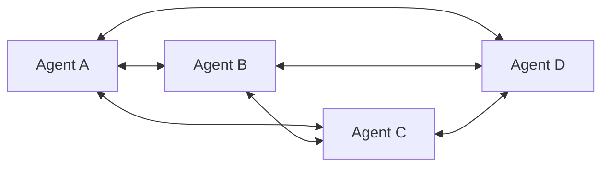

### Multi-Agent Orchestration — "Agent 여러 개를 팀으로 묶으면 똑똑해진다"는 신화, 그리고 조율(Coordination) 없이 시스템이 폭발하는 순간들

2023년까지 우리는 Agent 하나에 Tool 여러 개를 붙였다. 그런데 어느 순간부터 Agent에게 "너는 Reviewer야", "너는 Researcher야", "너는 Planner야" 라며 **여러 Agent를 팀으로 묶는 구조**가 유행하기 시작했다. AutoGen, CrewAI, LangGraph, Devin — 이름은 다르지만 본질은 같다. "Agent끼리 대화하게 만들면 더 잘한다."

정말 그런가? 시니어 백엔드 관점에서 보면 이건 **분산 시스템에 확률적 노드를 여러 개 꽂아놓은 상태**다. 그리고 분산 시스템의 모든 저주가 여기서 다시 나타난다. 부분 실패, 상태 동기화, 무한 루프, 비용 폭발, 관측 불가능성.

---

#### 왜 Single Agent로는 부족한가

이전 학습에서 다뤘던 ReAct 루프를 떠올려보자. Agent 하나가 Thought → Action → Observation을 반복하며 문제를 푼다. 이 방식의 한계는 명확하다.

1. **컨텍스트 창의 지옥**: 문제가 복잡해질수록 프롬프트가 부풀어 오른다. 리서치 결과, 이전 도구 호출 결과, 중간 사고 과정이 전부 컨텍스트에 쌓인다. 20턴을 넘어가면 모델은 초반 지시사항을 잊는다.
2. **역할 혼동(Role Confusion)**: 하나의 프롬프트에 "너는 코드도 작성하고, 리뷰도 하고, 테스트도 짜고, 문서도 만든다"라고 넣으면 각 역할의 품질이 평균으로 수렴한다.
3. **병렬화 불가**: 리서치와 코딩을 동시에 할 수 없다. 순차적 지연이 누적된다.

그래서 나온 답이 "Agent를 여러 개로 쪼개고, 각자에게 좁은 역할을 주고, 조율(Orchestrate)하자"다.

---

#### Orchestration 패턴 5가지

##### 1. Supervisor(감독자) 패턴

가장 흔한 구조. 중앙에 Supervisor Agent가 있고, 하위에 Specialist Agent들이 붙는다. Supervisor가 "다음에 누구를 부를지" 결정한다.

```
              ┌──────────────┐
              │  Supervisor  │  ← 다음 실행자 선택
              └──────┬───────┘
                     │ route
        ┌────────────┼────────────┐
        ▼            ▼            ▼
   ┌─────────┐  ┌─────────┐  ┌─────────┐
   │Researcher│  │  Coder  │  │ Reviewer│
   └────┬────┘  └────┬────┘  └────┬────┘
        │            │            │
        └────────────┴────────────┘
                     │ result
                     ▼
              ┌──────────────┐
              │  Supervisor  │
              └──────────────┘
```

**장점**: 흐름 통제가 명확. 로그 추적 가능. 예산 상한(iteration limit) 걸기 쉬움.
**단점**: Supervisor가 병목이자 SPOF. Supervisor가 잘못된 판단을 하면 전체가 실패.

##### 2. Router 패턴

Supervisor의 단순화 버전. "이 요청은 어느 Agent가 처리해야 하는가"만 판단하고, Agent 간 협업은 없다. 실질적으로 LLM Routing과 유사하지만, 라우팅 대상이 "모델"이 아니라 "도메인 전문 Agent"다.

##### 3. Sequential Pipeline 패턴

Agent들을 파이프라인으로 이어붙인다. Researcher → Analyzer → Writer → Editor 순서로 결과를 넘긴다.

```
Input ─▶ Researcher ─▶ Analyzer ─▶ Writer ─▶ Editor ─▶ Output
           (수집)       (요약)      (작성)     (검수)
```

**장점**: 예측 가능. Idempotent에 가깝게 설계 가능.
**단점**: 뒤 단계에서 앞 단계 결과가 부족하다고 판단해도 되돌릴 수 없음(순수 파이프라인이면). 실무에서는 Editor가 Writer에게 되돌리는 loop-back이 필요해지고, 결국 Supervisor 패턴으로 진화한다.

##### 4. Hierarchical(계층) 패턴

Supervisor 아래에 또 다른 Sub-Supervisor를 두는 트리 구조. Devin이나 대형 Coding Agent들이 채택하는 형태.

```
                 ┌─────────────┐
                 │ Top Manager │
                 └──────┬──────┘
             ┌──────────┴──────────┐
             ▼                     ▼
      ┌────────────┐        ┌────────────┐
      │Backend Team│        │Frontend Team│
      │ Supervisor │        │ Supervisor  │
      └──────┬─────┘        └──────┬──────┘
             │                     │
       ┌─────┴─────┐         ┌─────┴─────┐
       ▼           ▼         ▼           ▼
    Coder      Tester     Coder      Designer
```

**장점**: 대규모 태스크를 도메인별로 격리. 팀별 컨텍스트가 섞이지 않음.
**단점**: 층이 깊어질수록 지시사항이 왜곡됨 — **"전화 게임(Chinese Whispers) 문제"**. 최상위의 요구사항이 최하위 Agent까지 도달했을 때 원래 의도의 40%만 남을 수 있다.

##### 5. Swarm(군집) 패턴

Supervisor가 없다. Agent들이 서로 직접 대화하며 다음 발화자를 결정한다. OpenAI Swarm, AutoGen의 GroupChat이 여기에 해당.



**장점**: 창발적 협업이 가능. 유연함.
**단점**: **가장 위험한 패턴**. 무한 루프, 발산, 서로 칭찬하다 끝나는 현상이 흔함. 프로덕션에서는 거의 쓰이지 않는다.

---

#### 실제 사례: 각 회사는 왜 다른 패턴을 골랐는가

| 시스템 | 채택 패턴 | 이유 |
|--------|-----------|------|
| **Cognition (Devin)** | Hierarchical + 극도로 좁은 역할 | 장기 실행 코딩 태스크에서 **컨텍스트 격리**가 최우선. 서브 Agent는 부모의 컨텍스트를 상속받지 않고, 요약만 전달받음 |
| **Cursor Agent Mode** | Supervisor + Tool 중심 | 사용자와의 상호작용이 잦음. Supervisor가 사용자 확인을 받는 단일 접점 역할 |
| **AutoGen (MS)** | GroupChat(Swarm) | 연구용. 창발적 협업을 실험하기 위한 목적 — 프로덕션 프레임워크가 아님을 명시 |
| **CrewAI** | Sequential + Hierarchical | 비즈니스 워크플로우에 특화. "이 순서대로 해줘"를 표현하기 쉽게 만듦 |
| **LangGraph** | State Machine(그래프) | 위 모든 패턴을 표현할 수 있는 하위 원시(primitive)를 제공 |

**Cognition의 유명한 선언**: "Don't build multi-agent systems (in 2024)." 그들의 논지는 이랬다. **컨텍스트를 공유하지 않는 Agent들은 서로 다른 가정을 가지고 작업한다.** Reviewer Agent가 "이 코드는 X를 전제로 짠 것 같다"라고 추측한 게 사실은 Coder Agent의 의도와 다르다. 이 어긋남이 누적되면 결과물이 무너진다.

그래서 그들의 결론: "**Context가 곧 신뢰**"다. Multi-Agent를 쓸 거면, 모든 상위 결정을 하위에 요약이 아닌 **원본으로** 전달하거나, 아예 Single Agent + 긴 컨텍스트로 가라.

---

#### 진짜 문제: Multi-Agent에서만 발생하는 4가지 실패

##### ① Context Divergence (컨텍스트 분기)

Agent A는 "사용자가 Python 3.11을 쓴다"고 알고, Agent B는 "3.9를 쓴다"고 안다. 각자 다른 시점의 대화를 요약해서 상속받았기 때문. 결과물은 두 버전 모두에서 동작하지 않는다.

**대응**: 공유 State Store(예: LangGraph의 `State`, Redis에 저장된 사실 목록)를 두고, Agent들이 요약이 아닌 **정규화된 사실 집합**을 참조하게 한다.

##### ② Cost Explosion (비용 폭발)

Single Agent라면 10턴에 끝날 태스크가, Multi-Agent에서는 각 Agent가 서로의 결과를 컨텍스트에 넣고 다시 호출하며 **O(n²)로 토큰이 증가**한다. Supervisor + 3 Specialist 구조에서 한 라운드가 4번의 LLM 호출 + 각 호출당 누적된 컨텍스트를 의미한다.

실측 데이터 (필자가 본 케이스): 같은 요약 태스크를 Single Agent로 하면 8k 토큰, Supervisor + 3 Agent로 하면 34k 토큰. **4배 비쌌지만 품질은 15% 개선.** 이 트레이드오프가 정당한가?

##### ③ Infinite Loop / Deadlock

Reviewer가 "이 코드 별로다"라고 하고, Coder가 다시 짜고, Reviewer가 또 "별로다"라고 하는 상황. 각자 자기 역할에 충실하지만 종료 조건이 없다.

**대응 3가지**:
- **Hard limit**: max iterations. 못 끝냈으면 실패 처리.
- **Progress detection**: 이번 결과가 이전 결과와 임베딩 유사도 0.95 이상이면 "진전 없음"으로 판단하고 종료.
- **Escalation path**: N번 실패 시 사람에게 넘김.

##### ④ Silent Failure Propagation

Researcher가 잘못된 정보를 가져왔는데, Writer는 그걸 사실로 받아들이고 그럴듯한 결과를 만든다. **에러가 아니라 그럴듯한 오답이 흐른다.** 이건 분산 시스템의 "Byzantine Fault"에 가깝다.

**대응**: 각 Agent의 출력에 **신뢰도(confidence)**를 강제로 실어 넣게 하고, Supervisor가 낮은 신뢰도를 감지하면 재검증 Agent를 호출.

---

#### 트레이드오프: Single Agent vs Multi-Agent

| 축 | Single Agent | Multi-Agent |
|---|---|---|
| 지연(Latency) | 낮음 (순차 1개) | 높음 (여러 호출) — 병렬화해도 오버헤드 존재 |
| 비용 | 예측 가능 | 3~10배, 케이스별 편차 큼 |
| 품질 상한 | 컨텍스트 창에 제한됨 | 이론상 더 높음 |
| 디버깅 | 로그 하나 읽으면 됨 | 각 Agent 로그를 상관관계로 엮어야 함 (여기서 [[observability-three-pillars]]가 다시 등장) |
| 실패 모드 | 명시적 (틀리거나 답변 안 함) | 은밀함 (그럴듯한 오답) |
| 관측 가능성 | Single trace | Distributed trace + Agent별 span 필수 |

---

#### 시니어의 관점: 언제 쓰고, 언제 쓰면 안 되는가

**Multi-Agent를 써야 하는 경우**:
- 태스크가 **자연스럽게 병렬화**되는 경우. 예: 20개 문서를 각각 요약 → 최종 통합. 이건 Multi-Agent가 정답.
- 각 역할이 **서로 다른 도구 세트**를 필요로 하는 경우. Coder에겐 파일시스템 접근, Reviewer에겐 정적 분석 도구.
- **HITL(Human-in-the-loop) 접점이 명확**하고, 사람이 각 Agent의 결과를 검수할 수 있는 경우.

**Multi-Agent를 쓰면 안 되는 경우**:
- 태스크가 **본질적으로 순차적**이면 그냥 Chain-of-Thought로 충분하다. Multi-Agent로 포장하는 건 아키텍처 자위행위.
- **저지연이 요구되는 사용자 상호작용**. 챗봇 응답에 30초 걸리면 사용자는 떠난다.
- **재현성이 중요한 워크플로우**. Multi-Agent는 비결정성이 곱해진다. 같은 입력에 다른 결과가 나올 확률이 Single Agent보다 훨씬 높다.
- **컨텍스트가 강하게 결합된 태스크**. 예: 하나의 코드베이스를 리팩터링할 때, 서로 다른 파일을 다른 Agent가 만지면 전체 일관성이 무너진다.

**필자가 실무에서 쓰는 판단 규칙**:
> "이 태스크를 Single Agent + 40k 토큰 컨텍스트로 못 하는가?"를 먼저 묻는다. 대답이 "할 수 있다"면 Single Agent로 간다. Multi-Agent는 **컨텍스트가 물리적으로 안 들어가거나, 병렬성이 진짜 이득을 주는 경우에만** 정당화된다.

Distributed system을 도입하기 전에 "이거 monolith로 안 되나?"를 먼저 묻듯이, Multi-Agent를 도입하기 전에 "Single Agent로 안 되나?"를 먼저 물어야 한다. 규칙은 같다. **복잡도는 필요할 때만 산다.**

> 💡 **왜 중요한가**: Multi-Agent는 분산 시스템의 저주(부분 실패, 상태 동기화, 관측 어려움)를 확률적 노드로 재현하는 아키텍처이므로, "Agent를 늘리면 똑똑해진다"가 아니라 "조율 비용을 감당할 수 있을 때만 늘린다"가 시니어의 판단 기준이다.
