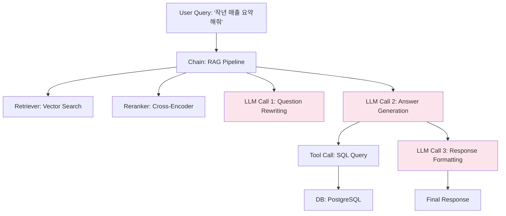

### AI Observability — "stack trace가 없는 세상"에서 프로덕션 LLM 앱을 디버깅한다는 것, 그리고 Datadog이 왜 여기선 무력한가

---

#### 1. 왜 기존 APM은 LLM 앱 앞에서 침묵하는가

전통적인 관측(Observability)은 세 개의 기둥 위에 서 있다. **Metrics, Logs, Traces.** Datadog·New Relic·Sentry가 지난 15년간 정련해온 이 도구들은 한 가지 전제를 공유한다.

> "버그는 코드에 있다. Stack trace를 따라가면 원인이 나온다."

그런데 LLM 앱에서는 이 전제가 붕괴한다.

```
[전통적인 백엔드 장애]
Request → 500 Error → NullPointerException at UserService.java:42
→ 원인이 코드 라인에 존재 → git blame으로 범인 특정 가능

[LLM 앱 장애]
Request → 200 OK → "죄송합니다, 저는 그 정보를 알 수 없습니다."
→ 코드는 정상 → HTTP는 정상 → 그런데 사용자는 화가 났다
→ 원인이 "확률 분포" 안에 있다. Stack trace가 없다.
```

LLM 앱의 진짜 버그는 **정상 실행 경로 위에서 발생한다.** 코드는 던지지 않는다. 예외도 없다. 그저 "이상한 답변"이 나올 뿐이고, Datadog은 그것을 `200 OK`로 기록한다.

---

#### 2. LLM 앱에서 관측해야 하는 5가지 층위

LLM 앱은 단순한 함수 호출이 아니다. 하나의 사용자 질문은 아래처럼 **중첩된 호출 트리**로 확장된다.



각 단계마다 다음 5가지가 **동시에** 문제를 일으킬 수 있다.

| 층위 | 관측 대상 | 전통 APM이 놓치는 것 |
|---|---|---|
| **Trace** | 어떤 체인·에이전트·도구가 어떤 순서로 호출됐는가 | 재귀적 Agent 호출의 계층 구조 |
| **Prompt** | LLM에 실제로 들어간 최종 프롬프트 전체 | System + Few-shot + RAG context + User가 합쳐진 결과물 |
| **Cost** | 토큰 사용량 × 모델 단가 (input/output 분리) | 하나의 사용자 요청당 실제 청구액 |
| **Quality** | 출력이 "좋았는가" (평가 점수, 사용자 피드백) | 200 OK 뒤에 숨은 나쁜 답변 |
| **Latency 분해** | Retriever vs LLM vs Tool 각각의 소요 시간 | LLM 스트리밍 중 TTFT(Time-To-First-Token) |

Datadog은 6번째 열, **"HTTP 200이면 성공"**만 안다. 나머지 다섯 개 층위는 존재조차 모른다.

---

#### 3. LangSmith vs LangFuse vs Helicone — 누가 무엇을 잘하는가

LLM Observability는 2024년부터 세 진영으로 굳어졌다.

```
┌────────────────────────────────────────────────────────────────┐
│                    LLM Observability 3파전                       │
├────────────────┬───────────────────┬───────────────────────────┤
│   LangSmith    │     LangFuse      │        Helicone          │
│  (LangChain)   │   (Open Source)   │     (Proxy 기반)          │
├────────────────┼───────────────────┼───────────────────────────┤
│ SDK 통합       │ SDK 통합           │ Base URL 바꿔서 프록시    │
│ (코드 수정 O)   │ (코드 수정 O)      │ (코드 수정 최소)          │
├────────────────┼───────────────────┼───────────────────────────┤
│ Eval 강력함    │ Self-host 가능     │ 캐싱·레이트리밋 내장       │
│ Playground O   │ 오픈소스 (MIT)     │ 세팅 5분                  │
├────────────────┼───────────────────┼───────────────────────────┤
│ Vendor Lock-in │ Postgres 백엔드    │ 프록시 장애 시 전체 다운   │
│ 비싸다          │ 운영 부담          │ Trace 계층 얕음           │
└────────────────┴───────────────────┴───────────────────────────┘
```

**LangSmith** — LangChain 팀이 만들었고, LangChain을 쓰면 데코레이터 하나로 자동 추적된다. Evaluation 프레임워크가 강력하다(데이터셋 만들고 회귀 테스트 돌리기 쉬움). 단, LangChain 생태계에 강하게 묶인다.

**LangFuse** — 오픈소스. Self-host 가능. GDPR·데이터 주권 이슈가 있는 유럽 기업(특히 금융·의료)이 많이 쓴다. SDK가 언어 중립적이고, LlamaIndex·Vercel AI SDK·직접 openai 호출까지 다 붙는다.

**Helicone** — 관점이 다르다. SDK를 쓰지 않는다. OpenAI 호출의 `base_url`을 `https://oai.helicone.ai/v1`로 바꾸면 끝. **프록시**로 흐르는 트래픽을 낚아채서 관측한다. 코드 침습이 거의 없어서 "일단 붙이고 보자"에 강하다.

---

#### 4. 실제 사례 — 누가 왜 무엇을 선택했는가

**GitHub Copilot Chat (내부 리포트, 2024)**
- 자체 Observability 스택 구축. 이유: 초당 수십만 요청 × 프라이버시(사용자 코드가 프롬프트에 포함됨) → SaaS 벤더 사용 불가.
- 핵심 지표는 "Acceptance Rate"(사용자가 제안을 실제로 채택한 비율). Latency나 200 OK가 아니라 **행동 지표**를 관측 지표로 삼음.

**Notion AI**
- LangSmith 도입. 이유: 프롬프트 A/B 테스트 사이클이 빠름. 새로운 프롬프트 배포 → 프로덕션 트래픽의 1%에 흘려보내고 Quality Score 비교 → 24시간 만에 판단.
- 교훈: **관측 도구 = 실험 도구**. LangSmith가 Trace만이 아니라 Eval을 강하게 밀어붙이는 이유.

**Klarna의 AI 어시스턴트 (2024)**
- Helicone + 자체 대시보드. 이유: 사용자 700명의 CS 상담원을 대체하는 시스템이라 **비용 관측이 압도적으로 중요**. Helicone의 토큰당 원가 리포트가 결정적이었음.
- 4개월 후 발표: "고객 문의당 처리 비용이 40% 감소했다." — 이 숫자는 관측 없이 못 만든다.

**독일의 대형 은행 (익명, LangFuse 케이스 스터디)**
- LangFuse Self-hosted. 이유: 프롬프트에 고객 계좌번호가 스칠 가능성이 있어서 데이터가 해외 SaaS로 나가면 안 됨. Postgres 백엔드라 기존 DBA 팀이 운영 가능.

---

#### 5. Trace가 있다고 문제가 해결되진 않는다 — 실전 함정 4가지

**함정 1. "모든 프롬프트를 저장하면 GDPR 폭탄이 된다"**
사용자가 채팅창에 주민번호를 붙여넣는 순간 그것이 관측 백엔드에 저장된다. **PII 마스킹은 SDK 레벨에서 하지 않으면 늦다.** LangFuse는 `mask()` 훅을 제공하지만, 개발자가 안 쓰면 그만이다.

**함정 2. "샘플링을 하면 이상한 사례를 놓친다"**
트래픽이 크면 100% 저장은 비용 폭발. 그런데 LLM 앱에서 "1% 샘플링"은 위험하다. 이상한 답변은 애초에 롱테일(long tail)에서 나온다. 해결책: **에러/사용자 부정 피드백/비용 상위 요청은 100%, 나머지는 샘플링**하는 이중 정책.

**함정 3. "Latency 평균은 거짓말이다"**
LLM 앱은 스트리밍 응답이 흔하다. 사용자 체감 지표는 `total_latency`가 아니라 **TTFT(첫 토큰까지 걸린 시간)**. 관측 도구가 TTFT를 따로 기록하지 않으면 "평균 3초"라는 숫자에 속아서 실제 UX 문제를 놓친다.

**함정 4. "Quality Score를 자동 매기려다 재귀 지옥에 빠진다"**
"답변 품질을 GPT-4로 채점하자" — 그럴싸하지만, **채점하는 LLM이 다시 관측된다.** 관측하다가 관측할 대상이 두 배가 되고, 비용도 두 배가 된다. LLM-as-Judge를 관측 파이프라인에 넣을 때는 **관측 스코프 밖으로 명시적으로 빼야** 한다.

---

#### 6. 시니어 관점 — 언제 도입하고 언제 미루는가

**지금 당장 도입해야 하는 상황**
- 프롬프트를 주 1회 이상 바꾸고 있다 → 회귀 감지 없이 배포하는 건 도박이다
- 하루 LLM 비용이 개발자 인건비의 유의미한 비율(예: 월 $500 이상)을 넘었다 → 원가 관측 없이 최적화 불가
- 사용자로부터 "왜 답이 이래?"라는 컴플레인이 CS로 들어오기 시작했다 → Trace 없으면 재현 불가능
- Agent가 도구를 3개 이상 조합해서 쓴다 → 어느 단계에서 궤도를 벗어났는지 로그로 못 잡는다

**아직 도입할 필요 없는 상황**
- LLM 호출이 하루 100건 미만이고 프롬프트 1개짜리 프로토타입 → OpenAI 대시보드로 충분
- 내부 툴 → Slack에 프롬프트/응답 페어를 그냥 로깅해도 된다. 벤더 붙일 시간에 프롬프트 개선이 낫다
- 매출 임계치 아래인 실험 프로젝트 → LangSmith 유료 플랜은 스타트업 초기에 부담. LangFuse Self-host도 운영 부담이 실사용량보다 크면 손해

**절대로 하지 말아야 할 것**
- **관측 도구 하나만 믿고 Eval 없이 배포 자동화** — 관측은 "뭔가 잘못됐다"를 알려주지만, "무엇이 정답인가"는 알려주지 않는다. Eval 파이프라인(이전 팁에서 다룬 것)과 반드시 짝을 이뤄야 한다.
- **PII 마스킹을 나중에 하자** — 데이터가 한 번 백엔드에 저장되면 GDPR·개인정보보호법상 완전 삭제 증명이 어렵다. 첫 커밋부터 마스킹 훅을 넣어라.

---

#### 7. 아키텍처 최종 그림 — 프로덕션 LLM 앱의 관측 계층

```
┌─────────────────────────────────────────────────────────────┐
│                        User Request                          │
└─────────────────────────────────────────────────────────────┘
                             │
        ┌────────────────────┼────────────────────┐
        ▼                    ▼                    ▼
  ┌──────────┐        ┌──────────┐         ┌──────────┐
  │ Datadog  │        │ LangFuse │         │  Sentry  │
  │ (HTTP,   │        │ (LLM     │         │ (Runtime │
  │  Infra)  │        │  Trace,  │         │  Error)  │
  │          │        │  Prompt, │         │          │
  │          │        │  Cost,   │         │          │
  │          │        │  Quality)│         │          │
  └──────────┘        └──────────┘         └──────────┘
       │                   │                     │
       └───────────────────┼─────────────────────┘
                           ▼
                 ┌───────────────────┐
                 │  Unified Dashboard │
                 │  (Grafana or 자체) │
                 │                    │
                 │  ⚠ Alert 규칙:     │
                 │  - p95 TTFT > 3s   │
                 │  - Cost/req 상위 5%│
                 │  - Quality < 0.7   │
                 │  - Error rate ↑    │
                 └───────────────────┘
```

핵심은 **Datadog을 버리는 게 아니라 병치하는 것**이다. HTTP·인프라·JVM 레벨은 여전히 Datadog이 잘한다. LLM 특화 층위만 LangFuse/LangSmith가 담당한다. **두 트레이스 ID를 연결(correlation)하는 것**이 시니어의 진짜 일이다 — 사용자 요청 ID 하나로 인프라 레벨과 프롬프트 레벨을 오갈 수 있어야 진짜 관측이다.

---

> 💡 **왜 중요한가**: LLM 앱의 버그는 stack trace가 아니라 확률 분포 안에 살고, 그것을 잡을 수 있는 유일한 무기는 프롬프트·비용·품질까지 함께 기록하는 관측 계층 — Datadog 하나로 프로덕션 LLM 앱을 운영하겠다는 건, 눈 감고 자율주행하는 것과 같다.
