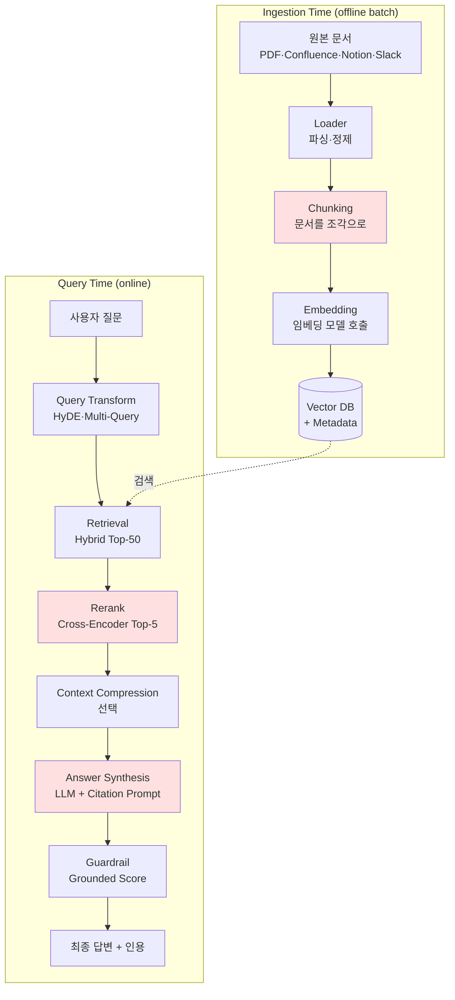

### RAG 아키텍처의 배신 — "문서를 잘 찾으면 답을 잘 한다"는 순진한 가정, 그리고 프로덕션 RAG가 무너지는 5개의 관문

RAG(Retrieval-Augmented Generation)는 2023년 이후 "LLM 환각(hallucination)의 만능 해결책"으로 팔려왔다. 마케팅은 단순하다: 회사 문서를 벡터로 인덱싱한다 → 질문이 오면 유사한 청크를 찾는다 → LLM에 컨텍스트로 넣어준다 → 정답이 나온다. 4줄로 요약되는 아키텍처.

하지만 프로덕션에 올려본 팀들은 안다. 이 4줄 각각이 지뢰밭이라는 것을. 사내 데모에서 90% 정확도를 보인 RAG가 실사용자 로그를 보면 40% 아래로 떨어지는 이유는 딱 하나 — **파이프라인의 어느 한 관문에서 정보가 새고 있기 때문**이다. 시니어 백엔드 관점에서 RAG는 "벡터 검색 + LLM 호출"이 아니라, **5단계 데이터 파이프라인**이다. 각 단계마다 실패 모드와 관측 지표가 다르며, 어느 하나만 병목이 되어도 뒤의 모든 단계가 무의미해진다.

이 글은 "LangChain 튜토리얼로 RAG를 만들어본 팀"이 프로덕션에 올리기 전에 반드시 보고 있어야 할 5개 관문의 지도다.

---

#### 1. RAG 파이프라인의 진짜 구조



빨간색으로 표시한 3개 — **Chunking, Rerank, Answer Synthesis** — 가 실무에서 사고의 90%가 나는 지점이다. 나머지 관문들도 실패하지만, 이 셋은 "실패하는 것조차 눈에 안 보인다"는 특징이 있다.

---

#### 2. 5개의 관문과 각 관문의 실패 모드

**관문 1: Loader (파싱)** — 가장 지루하고, 가장 자주 무시되는 지점
- 실패 모드: PDF의 표(table)가 단어 뭉치로 뭉개진다. Confluence 코드 블록이 인라인 텍스트로 흘러들어간다. 이미지 안의 텍스트(OCR 필요)는 아예 인덱싱조차 안 된다. Notion 데이터베이스 뷰의 관계형 정보는 사라진다.
- 관측 지표: `parse_error_rate`, `document_completeness_score`(원본 대비 추출 문자 비율)
- 실제 사례: **Notion AI 초기 버전**은 코드 블록을 일반 텍스트로 처리해서 "이 함수 뭐하는 거야?" 질문에 함수 시그니처를 제대로 못 읽었다. 지금은 블록 타입별 커스텀 파서를 붙였다. 파싱은 "그냥 라이브러리 쓰면 되는" 문제가 아니라 도메인 별로 재작성해야 하는 계층이다.

**관문 2: Chunking (조각내기)** — 조용히 정확도를 갉아먹는 결정
- 실패 모드: 고정 크기 청킹(예: 512 토큰)이 문장을 잘라버린다. 답변에 필요한 정보가 청크 A의 끝과 청크 B의 시작에 걸쳐 있으면 retrieval에서 둘 다 놓친다. "왜 답을 못 찾지?"의 절반은 여기서 나온다.
- 3가지 전략의 트레이드오프:

| 전략 | 검색 정확도 | 구현 비용 | 스토리지 |
|---|---|---|---|
| Fixed-size (512 tokens, 10% overlap) | 낮음 | 매우 낮음 | 낮음 |
| Semantic Chunking (임베딩 유사도로 경계 결정) | 중~높음 | 중간 | 중간 |
| Parent-Child (작은 청크로 검색, 큰 청크를 LLM에) | 높음 | 높음 | 매우 높음 |

- 실제 사례: **Perplexity**는 문단 기반 청킹에 20~30% 큰 오버랩을 쓴다. 스토리지 비용 vs 검색 정확도의 트레이드오프를 스토리지 쪽으로 밀어냈다 — "저장 비용은 계산 가능하지만 잘못된 답변으로 잃는 신뢰는 계산 불가능하다"는 판단이다.

**관문 3: Retrieval (Top-K 검색)** — K 값의 함정
- 실패 모드: Vector-only 검색이 "정확히 그 단어"를 못 찾는 문제(이건 이미 다룬 Hybrid Search 영역이라 생략). 여기서 시니어가 놓치기 쉬운 건 **Top-K 값 자체의 함정**이다.
- K를 늘리면? Recall은 오르지만 LLM 컨텍스트가 노이즈로 오염된다. 관련 없는 청크가 LLM 프롬프트에 섞이면 오히려 답변 품질이 떨어진다. 이걸 "lost in the middle" 현상이라고 부른다 — LLM은 프롬프트 중간에 있는 정보를 잘 못 쓴다.
- K를 줄이면? 정답 청크가 Top-K 밖으로 밀려나서 놓친다.
- 해답: **Retrieval Top-K는 크게(50~100), Rerank Top-K는 작게(3~5)** 두 단계로 분리.
- 관측 지표: `retrieval_recall@50`, `retrieval_precision@5`(rerank 이후)

**관문 4: Rerank (재정렬)** — 팀들이 가장 자주 생략하는 단계
- 실패 모드: Retrieval은 "빠른 근사"고 Rerank는 "정확한 재평가"다. 이 단계를 생략하면 Top-K 안의 순서가 엉망이 된다. LLM은 프롬프트 앞쪽 청크에 더 가중치를 두기 때문에, **청크 순서가 답변 품질을 결정한다.**
- 아키텍처: Bi-encoder(빠름, 정확도 낮음)로 후보 50개 → Cross-encoder(느림, 정확도 높음)로 상위 5개 재정렬. Bi-encoder는 질문과 문서를 각각 임베딩해서 코사인 유사도만 보지만, Cross-encoder는 [질문+문서]를 함께 입력해서 상호작용을 본다. 그래서 느리지만 훨씬 정확하다.
- 실제 사례: **Cohere Rerank v3**, **BGE Reranker v2**가 프로덕션 표준. 자체 구현은 대부분 실패한다. 왜? Cross-encoder 학습에 필요한 (query, positive_doc, negative_doc) 트리플렛 데이터셋을 만드는 게 예상보다 어렵기 때문이다.
- **경험칙**: Rerank를 넣으면 Top-3 정확도가 15~30%p 오른다. 이걸 안 넣는 팀은 "우리 RAG가 왜 이래?"를 반복한다.

**관문 5: Answer Synthesis (프롬프트 조립)** — 마지막에서 배신당하는 지점
- 실패 모드 3가지:
  - **Lost in the middle**: LLM은 프롬프트의 시작과 끝에 있는 정보를 잘 쓰고, 중간을 흘린다. → 가장 중요한 청크는 맨 앞이나 맨 뒤에 배치.
  - **Citation 누락**: 답변에 근거 청크 ID를 인용하지 않으면 사용자가 검증 불가 → 환각과 사실 구분 불가능. 반드시 구조화된 출력(JSON)이나 인용 태그로 근거를 강제해야 한다.
  - **컨텍스트 폭발**: 청크가 많아지면 latency와 비용이 선형 증가. 그래서 **Context Compression**(LongLLMLingua, LLM 요약)이라는 옵션 관문이 생겼다.

---

#### 3. Naive RAG vs Advanced RAG — 2024~2025년 프로덕션의 표준은 이미 이동했다

```
┌──────────────────────────────────────────────────────────┐
│  Naive RAG (2023년 초기)                                  │
├──────────────────────────────────────────────────────────┤
│  Query → Embedding → Top-5 Vector Search → LLM → Answer  │
│                                                           │
│  문제: 질문이 모호하면 검색 실패                            │
│        Rerank 없음 → 순서 엉망                             │
│        Citation 없음 → 환각과 사실 구분 불가                │
└──────────────────────────────────────────────────────────┘

┌──────────────────────────────────────────────────────────┐
│  Advanced RAG (2024~2025 프로덕션 표준)                    │
├──────────────────────────────────────────────────────────┤
│  Query                                                    │
│    ↓                                                      │
│  ┌────────────────────────┐                              │
│  │ Query Transform        │  HyDE·Multi-Query·Step-back  │
│  └───────────┬────────────┘                              │
│              ↓                                            │
│  ┌────────────────────────┐                              │
│  │ Hybrid Retrieval       │  Vector + BM25 + Metadata    │
│  └───────────┬────────────┘                              │
│              ↓ Top-50                                     │
│  ┌────────────────────────┐                              │
│  │ Cross-Encoder Rerank   │  BGE / Cohere                │
│  └───────────┬────────────┘                              │
│              ↓ Top-5                                      │
│  ┌────────────────────────┐                              │
│  │ Context Compression    │  LongLLMLingua / LLM 요약    │
│  │  (선택적)               │                              │
│  └───────────┬────────────┘                              │
│              ↓                                            │
│  ┌────────────────────────┐                              │
│  │ LLM + Citation Prompt  │  구조화 출력, 근거 태깅       │
│  └───────────┬────────────┘                              │
│              ↓                                            │
│  ┌────────────────────────┐                              │
│  │ Grounded Guardrail     │  답변이 컨텍스트에서 나왔는가?│
│  └────────────────────────┘                              │
└──────────────────────────────────────────────────────────┘
```

Naive RAG가 데모에서 70~80%의 정확도를 보인다면, Advanced RAG는 같은 데이터셋에서 90%+를 낸다. 이 20%p 차이가 프로덕션 배포 가능/불가능을 가른다.

---

#### 4. Query Transformation — 가장 많이 무시되는 앞단 관문

사용자 질문은 원래 나쁘다. "그거 왜 안 돼?"에는 벡터화할 semantic이 거의 없고, "지난주에 얘기했던 그거"에는 컨텍스트가 없다. Query Transform은 이 문제를 **검색 전에** 해결한다.

- **HyDE (Hypothetical Document Embeddings)**: 질문에 대한 "가짜 답변"을 LLM으로 생성 → 그 가짜 답변으로 검색. 왜 되는가? 질문보다 답변이 문서와 더 semantic하게 비슷하기 때문이다. 실무에서 검색 recall이 5~15%p 오른다.
- **Multi-Query**: 하나의 질문을 3~5개 변형으로 확장해서 각각 검색 → Reciprocal Rank Fusion(RRF)으로 결과 병합. 사용자 표현의 다양성 문제를 해결한다.
- **Step-back Prompting**: 구체적 질문을 추상적 상위 질문으로 바꿔서 검색 (예: "2023년 X 매출은?" → "X는 재무 지표를 어떤 문서에서 보고하는가?"). 답변에 필요한 상위 개념 문서를 먼저 확보한다.

실제 사례: **LinkedIn의 고객지원 RAG**는 Multi-Query와 Step-back을 도입한 뒤 첫 시도 해결율(first-contact resolution)이 크게 올랐다고 2024년 엔지니어링 블로그에 발표했다. Query Transform은 비용이 낮고(추가 LLM 호출 1~2회) 효과가 크다 — 가장 ROI 좋은 관문이다.

---

#### 5. 트레이드오프 표 — RAG vs Fine-tuning vs Long-context

| 항목 | Naive RAG | Advanced RAG | Fine-tuning | Long-context (Claude 200K/Gemini 1M) |
|---|---|---|---|---|
| 초기 구축 비용 | 낮음 | 중~높음 | 매우 높음 | 매우 낮음 |
| 문서 업데이트 | 즉시 (인덱싱) | 즉시 | 재학습 필요 | 즉시 |
| Latency | 낮음 (200~500ms) | 높음 (1~3s) | 낮음 | 매우 높음 (5~30s) |
| 답변 정확도 | 낮음 | 높음 | 매우 높음(도메인) | 중~높음 |
| Citation | 부분적 | 가능 | 불가능 | 가능하지만 부정확 |
| 비용/쿼리 | 낮음 | 중간 | 낮음(추론시) | 매우 높음(입력 토큰) |
| 유지보수 부담 | 낮음 | 높음 (5단계 파이프라인) | 매우 높음 (MLOps) | 매우 낮음 |
| 최대 지식 크기 | 무제한 | 무제한 | 학습 시점 고정 | 200K~1M 토큰 |

**핵심 인사이트**: Long-context 모델의 등장으로 "문서가 적으면 RAG 자체가 필요 없다"는 옵션이 생겼다. 이건 아키텍처 결정을 완전히 뒤흔든다.

---

#### 6. 언제 RAG를 쓰고, 언제 쓰면 안 되는가

**RAG가 답일 때:**
- 답변 근거 문서가 **자주 바뀐다** — 사내 위키, 정책 문서, 제품 매뉴얼, 지식베이스
- **Citation이 법적/규제적 필수** — 금융(투자 자문), 의료(진료 지원), 법률(판례 검색)
- 문서 총량이 **커서 컨텍스트에 다 못 넣는다** — 수만 건 이상, 수백만 토큰
- **다중 사용자별 권한**이 있어서 사용자마다 검색 가능한 문서 범위가 다르다 (RAG는 metadata filter로 쉽지만, Fine-tuning은 사용자별 모델을 못 만든다)

**RAG를 쓰면 안 될 때:**
- 답변이 **문서 간 조합 추론**을 요구할 때 — "우리 회사 매출 상위 5개 제품 중 마진율 낮은 것" 같은 질문은 RAG가 아니라 **Text-to-SQL 또는 Code Interpreter**가 답이다. RAG는 "문서에 이미 있는 답"을 찾는 것이고, 조합 추론은 계산이다.
- 문서 양이 **작아서 컨텍스트에 다 들어간다** — 수백 페이지 이하면 그냥 프롬프트 캐싱 + Long-context 모델이 낫다. Anthropic Prompt Caching으로 반복 비용도 90% 절감된다.
- **응답 latency SLA가 500ms 이하** — 5단계 파이프라인은 이 예산에 맞추기 어렵다. 이런 경우엔 Fine-tuning + KV 캐시가 답.
- 도메인이 **너무 특수해서 임베딩 모델이 semantic을 이해 못 한다** — 예: 특정 사내 코드베이스, 희귀 언어. 이땐 도메인 임베딩을 fine-tuning하거나 아예 다른 접근이 필요.

---

#### 7. 시니어를 위한 실무 관측 스택

```
[User Query]
    ↓
[Trace Root: query_id]
    ├── span: query_transform
    │     ├── attr: strategy = "hyde"
    │     ├── attr: input_query, transformed_queries
    │     └── attr: latency_ms, prompt_tokens
    ├── span: retrieval
    │     ├── event: vector_search (recall@50, top_scores)
    │     ├── event: bm25_search (recall@50, top_scores)
    │     └── event: fusion (rrf_k, merged_top50)
    ├── span: rerank
    │     ├── attr: model = "bge-reranker-v2"
    │     ├── attr: score_distribution (top5)
    │     └── attr: promoted_ids, demoted_ids
    ├── span: llm_synthesis
    │     ├── attr: model, input_tokens, output_tokens
    │     ├── attr: context_chunk_ids
    │     └── attr: cost_usd
    └── span: guardrail_check
          ├── attr: grounded_score (0~1)
          └── attr: hallucination_flag
```

LangSmith나 LangFuse에 이 구조로 트레이스를 넣으면, 사고가 났을 때 **어느 관문에서 정보가 샜는지 특정할 수 있다**. 트레이스 없이는 RAG를 프로덕션에 못 올린다 — "왜 이 답이 나왔지?"에 답할 방법이 없기 때문이다. 사용자 컴플레인이 들어왔을 때, 문제가 Loader에서 표를 놓친 건지, Chunking이 문장을 잘랐는지, Rerank 순서가 뒤집혔는지, LLM이 컨텍스트를 무시한 건지 — 파이프라인 관측 없이는 알 수 없고, 모르면 고칠 수 없다.

---

#### 8. 마지막 조언 — RAG는 검색 문제인가, 데이터 파이프라인 문제인가

Naive RAG를 만드는 팀은 이걸 "검색 문제"로 본다. Advanced RAG를 프로덕션에 성공시킨 팀은 이걸 "**5단계 ETL 파이프라인 + 관측성 문제**"로 본다. 임베딩 모델과 벡터 DB 고르는 데 하루를 쓰고, Loader와 Chunking 전략에 3주를 쓴다. 프론트엔드 프롬프트 튜닝에 하루를 쓰고, 백엔드 Rerank + Guardrail에 2주를 쓴다.

이 순서가 뒤바뀌면 — 즉 벡터 DB에 3주 쓰고 Chunking에 하루 쓰면 — 데모에서만 잘 되고 프로덕션에서 무너지는 RAG가 나온다. 시니어의 일은 이 순서를 팀에 강제하는 것이다.

---

> 💡 **왜 중요한가**: RAG는 "벡터 DB + LLM"이 아니라 5단계 데이터 파이프라인이며, 어느 한 관문에서 정보가 새면 나머지 4단계가 아무리 훌륭해도 답변 품질은 무너진다 — 그래서 RAG 프로젝트의 성패는 "임베딩 모델 선택"이 아니라 "Chunking·Rerank·관측성" 3개에서 결정된다.
