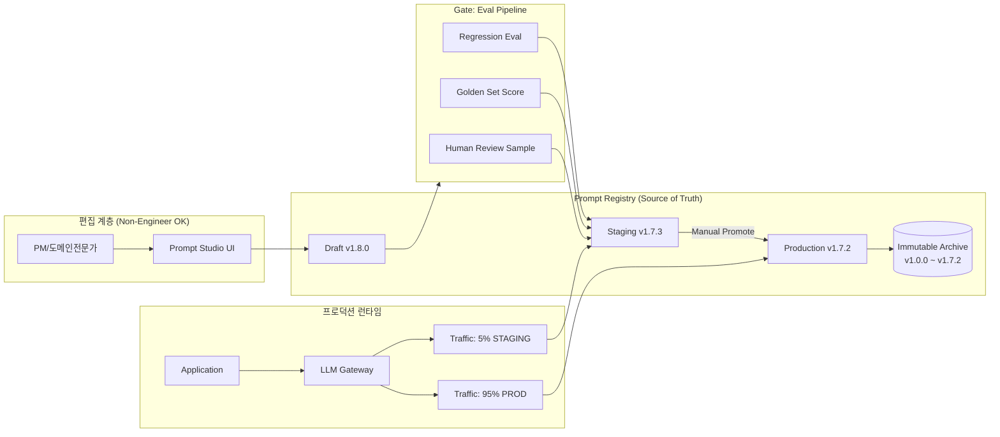

### 프롬프트 버저닝 — "git으로 관리하면 되잖아?"라는 순진함이 프로덕션 LLM 앱을 부수는 방식

> "프롬프트는 결국 텍스트다. 텍스트는 git에 넣으면 된다. 뭐가 문제인가?"

이 문장은 6개월 전까지의 나였다. 그리고 이 문장을 믿었던 팀은 예외 없이, 어느 화요일 오전 10시에 "고객 응답 톤이 갑자기 왜 이러지?"라는 슬랙 알림을 받는다.

프롬프트 버저닝은 얼핏 "코드 버저닝의 확장"처럼 보이지만, 실제로는 **코드도 아니고 데이터도 아닌 제3의 자산**을 다루는 문제다. 이 정체성 혼란이 프로덕션 LLM 시스템의 안정성 문제 절반을 만든다.

---

#### 1. 왜 git으로는 부족한가

git이 완벽하게 잘 하는 것: **텍스트 diff**. git이 완전히 못 하는 것: **의미 diff**.

프롬프트 한 단어를 바꾸는 것은 라이브러리 버전을 바꾸는 것과 성질이 다르다.

```
- "You are a helpful assistant."
+ "You are a concise assistant."
```

textual diff: 5글자. semantic diff: **응답 길이 분포가 평균 340 토큰 → 90 토큰으로 이동**, **친절도 점수 4.2 → 3.1**, **환불 요청 이탈률 12% → 19%**. 이걸 git log에서 어떻게 볼 수 있나? 못 본다.

여기서 세 가지 근본적 어긋남이 발생한다:

| 축 | 코드 | 프롬프트 |
|---|---|---|
| 정확성 판정 | 컴파일러/테스트 (결정론적) | Eval + 사람 판단 (확률적) |
| 편집자 | 엔지니어만 | PM, 도메인 전문가, 심지어 CS팀 |
| 배포 단위 | commit → build → deploy | **런타임에서 즉시 교체 가능해야 함** |
| 실패 감지 | exception, 5xx | "왠지 톤이 이상한데?" (며칠 뒤 리포트) |

특히 세 번째. **엔지니어 배포 사이클(30분)로는 프롬프트 문제를 못 잡는다.** PM이 CS 리포트를 보고 "이 프롬프트 지금 당장 롤백해야 해요"라고 말할 때, git revert → PR → CI → deploy를 돌리면 그 사이 30분 동안 사고가 계속 커진다.

---

#### 2. 진짜로 함께 버전 관리되어야 하는 것

프롬프트만 버저닝하는 것은 함수 시그니처만 버저닝하고 함수 본문을 무시하는 것과 같다. LLM 호출의 "실제 동작"을 재현하려면 **다섯 개의 축**이 모두 동기화되어야 한다.

```
┌─────────────────────────────────────────────────────────────┐
│  Prompt Bundle v1.7.2                                       │
├─────────────────────────────────────────────────────────────┤
│  1. Prompt Template     : "refund_assistant_v3.jinja"       │
│  2. Model Identity      : "gpt-4o-2024-08-06"               │
│  3. Sampling Params     : temp=0.2, top_p=0.9, max_tok=512  │
│  4. Tool Schema         : [refund_tool_v2, order_lookup_v1] │
│  5. Retrieval Strategy  : "policy_docs_v4, top_k=6, rrf"    │
│  6. Eval Baseline       : eval_set_refund_v2 → score 0.87   │
└─────────────────────────────────────────────────────────────┘
```

이 다섯 개 중 **하나만 바뀌어도 새 버전이어야 한다.** OpenAI가 조용히 `gpt-4o` 뒤의 실제 스냅샷을 바꿔치기 하는 순간 당신의 시스템은 "코드는 그대로인데 동작이 바뀐" 상태가 된다. 그래서 **핀 고정된 model snapshot ID**를 프롬프트 번들의 일급 시민으로 다뤄야 한다. `gpt-4o`가 아니라 `gpt-4o-2024-08-06`처럼.

---

#### 3. 아키텍처: Prompt Registry 패턴

MLOps에서 이미 답을 낸 문제와 구조가 같다. Model Registry(MLflow, SageMaker Model Registry)가 모델 바이너리에 대해 하던 일을 **프롬프트 번들**에 대해 그대로 하면 된다.



핵심 설계 원칙 세 가지:

**(a) Immutable Version ID.** 한번 발행된 `v1.7.2`는 절대 재사용/수정 불가. "hotfix로 살짝만 고칠게요"는 이 시스템을 즉시 망가뜨린다. 왜? Observability 트레이스에 남은 `prompt_version=1.7.2`가 더 이상 그 순간의 실제 프롬프트를 가리키지 못하기 때문. **Reproducibility가 곧 신뢰의 화폐다.**

**(b) Runtime Fetch, Not Build-Time Bundle.** 프롬프트를 애플리케이션 코드에 문자열로 임베딩하면 롤백 = 재배포다. 대신 애플리케이션은 시작 시 `prompt_id="refund_assistant"`, `env="production"`로 fetch 하고, in-memory + local cache에 보관한다. Registry의 `production` 포인터를 v1.7.2 → v1.7.1로 바꾸는 즉시 (혹은 몇 초 캐시 TTL 후에) 롤백이 발효된다.

**(c) Eval Gate는 필수 관문, PR merge가 아니다.** 새 프롬프트를 `production`으로 승격시키기 전에 **자동 회귀 eval 통과 + 골든셋 점수 하락 없음 + 최소 N개 샘플에 대한 사람 리뷰**를 강제한다. "PR 리뷰만으로 프롬프트를 배포하는 팀"은 확률적 회귀를 절대 못 잡는다.

---

#### 4. 세 가지 구현 접근과 트레이드오프

| 접근 | 대표 사례 | 장점 | 무너지는 지점 |
|---|---|---|---|
| **Git-Native** (`.jinja` + YAML frontmatter, code review) | 초기 스타트업, 오픈소스 LLM 앱 | 러닝커브 0, 모든 툴체인 재사용 | PM이 못 편집. 런타임 롤백 30분+. Eval 연동 수동 |
| **Managed Registry** (LangSmith, Humanloop, PromptLayer, Braintrust) | Notion AI, Cursor, 많은 YC 스타트업 | UI 편집, A/B, Eval 통합, 즉시 롤백 | 벤더 락인, 프롬프트가 SaaS DB에 있음(감사/유출 이슈), 월 청구서 커짐 |
| **In-House Hybrid** (구조는 Git, 콘텐츠는 자체 DB + admin UI) | Klarna, Shopify, Duolingo AI | 완전한 통제, 감사 로그 커스터마이즈 | 만드는 데 3~6개월. 유지보수가 팀 하나 몫 |

**언제 뭘 골라야 하나 (시니어 관점):**

- **팀 규모 < 5명, LLM 콜 하루 <10k**: **Git-Native**. Registry를 만들 시간에 프롬프트 자체를 더 개선해라. 오버엔지니어링의 전형.
- **PM/CS/도메인 전문가가 프롬프트를 자주 만진다**: **Managed Registry** 즉시 도입. 엔지니어 병목이 프롬프트 개선 속도의 상한선을 정해버린다.
- **금융/의료/공공, 프롬프트 자체가 규제 자산**: **In-House Hybrid** 외 선택지 없음. LangSmith에 환자 데이터 관련 프롬프트를 올리는 건 컴플라이언스 부서에서 절대 통과 안 됨.
- **모델을 여러 개 A/B 하면서 프롬프트도 함께 A/B 한다**: **Managed Registry**. 자체 구현 시 실험 매트릭스가 O(모델 × 프롬프트 × 사용자세그먼트)로 폭발함.

---

#### 5. 실제 사례: 세 회사가 왜 이렇게 골랐나

**Notion AI** — Managed(LangSmith/자체 조합). 프롬프트 실험을 PM이 직접 돌리는 문화. 하루에도 수십 개의 프롬프트 변형을 A/B 하기 때문에 엔지니어 배포 사이클로는 실험 속도를 못 따라간다. 대신 프롬프트가 SaaS 벤더 DB에 있다는 사실이 감사 리스크로 남아 있어, 최근에 자체 백업 미러링을 추가한 것으로 알려짐.

**Klarna의 GPT-4 CS Assistant** — In-House Hybrid. "700명 CS 직원 몫의 업무를 대체" 발표로 유명한 사례. 사고 시 즉시 롤백해야 하고, 감사 로그가 EU 규제(GDPR + 곧 시행되는 AI Act) 하에 필수라 자체 구현. Prompt 변경마다 CS 리더의 명시적 승인 로그가 남는 워크플로가 코어에 박혀 있음.

**GitHub Copilot** — 모델 버전과 프롬프트(시스템 프롬프트, 컨텍스트 조립 규칙, few-shot 예제)를 **분리해서 독립적으로** 버저닝. 왜? Copilot의 신뢰는 응답의 일관성에서 오는데, 모델 스냅샷 하나만 바꿔도 코드 완성 스타일이 미묘하게 달라져 사용자가 즉시 체감한다. 그래서 모델 rollout과 프롬프트 rollout을 **절대 동시에 하지 않는** 원칙을 운영한다.

---

#### 6. 시니어의 판단 체크리스트

Prompt Registry 도입을 미뤄도 되는 신호:
- 프로덕션 LLM 호출 하루 10k 미만이고, 응답 품질 이슈가 사용자 리포트로만 온다
- 프롬프트 편집자가 실질적으로 1~2명의 엔지니어뿐
- 모델을 하나만 쓰고, 벤더가 스냅샷을 갑자기 은퇴시킬 걱정이 없다

**지금 당장 도입해야 하는 신호 (하나라도 걸리면):**
- **롤백이 30분 이상 걸린 사고를 이미 한 번 겪었다**
- 엔지니어가 아닌 사람이 프롬프트를 편집하고 싶어한다 (그리고 그게 옳다)
- Observability 트레이스는 있는데 "이 응답이 어떤 프롬프트 버전에서 나왔는지"를 못 답한다 → 이건 이미 사고 대응 능력이 없다는 뜻
- 모델 벤더가 스냅샷을 은퇴시키는 이메일을 이미 받아봤다

특히 세 번째. `AI Observability`(→[이전 학습 참조])로 잡아둔 trace에 `prompt_version` 필드가 없다면, 관측성은 절반짜리다. "왜 이 답이 나왔는가"를 답하려면 **입력 + 프롬프트 번들 스냅샷 + 모델 스냅샷**이 트레이스마다 함께 남아야 한다. Registry 없이 이걸 하려고 하면 곧바로 "그때 프롬프트가 뭐였지?"라는 미스터리 사냥이 시작된다.

---

#### 7. 마무리: 프롬프트는 코드도 데이터도 아니다

프롬프트를 코드로 다루면 편집 병목이 생기고, 데이터로 다루면 재현성이 사라진다. Prompt Registry는 그 사이의 **제3의 자산 종류를 위한 시스템**이다.

시니어 백엔드 관점에서 이 문제의 진짜 무게는 다음 한 문장에 있다:

> **"프로덕션 LLM 시스템에서 가장 자주, 가장 조용히 바뀌는 것이 프롬프트다. 그리고 가장 관측이 안 되는 것도 프롬프트다. 이 두 사실이 겹치면, 그 시스템은 이미 debuggable 하지 않다."**

Registry는 이 무관측 상태를 관측 가능 상태로 되돌리기 위한 최소한의 인프라다. Eval, Observability, Gateway 세 축이 모두 `prompt_version`이라는 축을 공통으로 참조할 수 있게 되는 순간, LLM 시스템은 비로소 "운영 가능한" 상태가 된다.

> 💡 **왜 중요한가**: 프롬프트 버저닝 없는 LLM 프로덕션 시스템은 "어떤 코드 커밋이 배포됐는지 모르는 채로 운영하는 서버"와 정확히 같은 신뢰 수준을 가진다.
