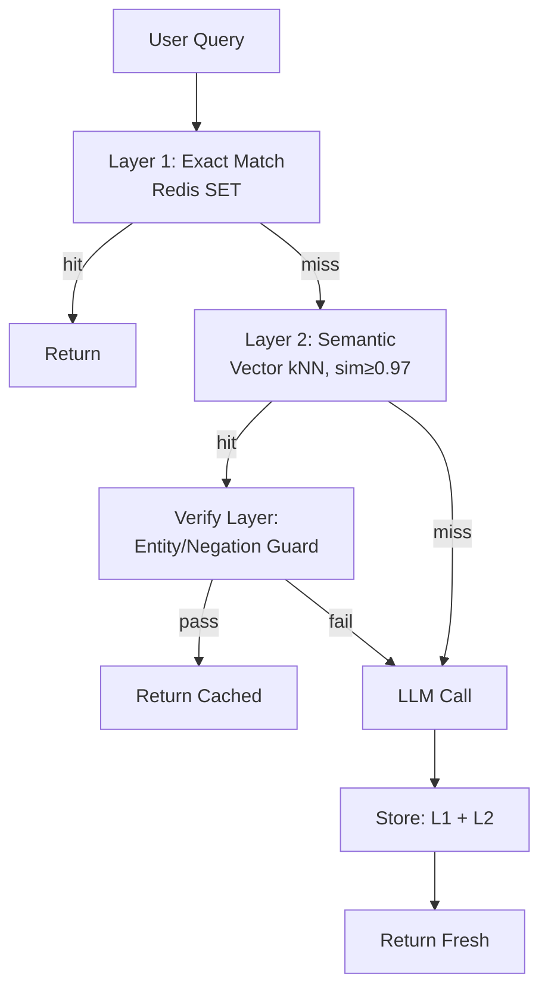

### Semantic Cache — "같은 질문에 두 번 돈 내지 마라"는 유혹, 그리고 캐시 히트가 오답을 뿌리는 순간

## 1. 시작하는 이야기: $47,000 청구서와 CTO의 두통

2026년 초, 한 SaaS 스타트업의 슬랙 채널에 다음 메시지가 올라왔다.

> "이번 달 OpenAI 청구서 $47,000. 유저 수는 늘지 않았습니다."

로그를 뜯어보니, 유저들이 챗봇에 던지는 질문의 **68%는 서로 의미가 거의 같은 재질문**이었다.

- "환불 정책이 어떻게 되나요?"
- "제가 환불 받을 수 있나요?"
- "환불 신청은 어디서 하죠?"
- "Refund policy 알려주세요"

동일한 답이 나와야 할 이 네 개의 질문에, 시스템은 **네 번의 GPT-4 호출**을 했다. 각 $0.03. 하루 수만 번. 이것이 Semantic Cache가 등장하는 문맥이다.

전통적 캐시(Redis, Memcached)는 **문자열이 정확히 같을 때만** 히트한다. LLM 세계에서 이는 거의 무의미하다. 사람은 같은 뜻을 100가지로 표현하니까.

Semantic Cache는 이렇게 말한다: **"문자열이 아니라, 의미가 같으면 캐시 히트다."**

---

## 2. 아키텍처: 임베딩 기반 캐시 룩업

```
┌─────────────────────────────────────────────────────────────────┐
│                    User Query                                    │
│              "환불 받을 수 있나요?"                              │
└──────────────────────┬──────────────────────────────────────────┘
                       │
                       ▼
              ┌─────────────────┐
              │ Embed Query     │  ← text-embedding-3-small
              │ (768-dim vec)   │     ($0.00002 / query)
              └────────┬────────┘
                       │
                       ▼
           ┌───────────────────────┐
           │ Semantic Cache Lookup │  ← Vector DB (Redis Vector,
           │ (kNN, cos-sim ≥ 0.95) │     pgvector, Milvus)
           └────────┬──────────────┘
                    │
        ┌───────────┴───────────┐
        │                       │
   [HIT: sim ≥ 0.95]     [MISS: sim < 0.95]
        │                       │
        ▼                       ▼
  ┌──────────┐          ┌──────────────┐
  │ Return   │          │ LLM Call     │  ← 실제 $$$ 발생
  │ Cached   │          │ (GPT-4, etc) │
  │ Answer   │          └──────┬───────┘
  └──────────┘                 │
                               ▼
                       ┌───────────────┐
                       │ Store in Cache│
                       │ {embed, ans,  │
                       │  ttl, meta}   │
                       └───────────────┘
```

핵심은 세 가지 파라미터다.

| 파라미터 | 역할 | 잘못 잡으면 |
|---------|------|------------|
| **Similarity threshold** (예: 0.95) | 얼마나 비슷하면 "같은 질문"인가 | 낮으면 오답 폭탄, 높으면 캐시 무용지물 |
| **TTL** | 캐시 유효기간 | 짧으면 절약 실패, 길면 stale 답변 |
| **Embedding model** | 의미 유사도 판정자 | 도메인 특화 어휘 못 잡으면 히트율 0에 수렴 |

---

## 3. 진짜 함정: 왜 0.95 임계치가 유저를 화나게 하는가

주니어라면 이렇게 짤 것이다. "임계치 0.9쯤 잡으면 되겠지."

시니어는 이 코드를 보고 얼굴을 찌푸린다. 왜?

**케이스 1: 의미가 반대인데 유사도가 높은 질문**

```
Q1: "이 프로젝트를 삭제할 수 있나요?"
Q2: "이 프로젝트를 삭제할 수 없나요?"

cosine similarity: 0.96  ← 캐시 히트!
```

부정어 하나로 의미가 뒤집혔지만, 임베딩 공간에서 두 문장은 거의 붙어있다. 캐시가 "네, 삭제 가능합니다"를 반환하면 유저는 실수를 저지른다.

**케이스 2: 파라미터가 다른데 유사도가 높은 질문**

```
Q1: "주문번호 12345 배송 상태 알려줘"
Q2: "주문번호 67890 배송 상태 알려줘"

cosine similarity: 0.98  ← 캐시 히트!
```

임베딩은 숫자 리터럴을 잘 구별하지 못한다. **다른 유저의 주문 정보가 노출**되는 데이터 유출 사고로 이어진다.

**케이스 3: 시간이 지나 답이 변하는 질문**

```
Q1 (2026-01-15 물음): "오늘 프로모션 있어?"
Q2 (2026-08-05 물음): "오늘 프로모션 있어?"

cosine similarity: 1.0  ← 완벽 히트!
```

7개월 전 답이 지금 유저에게 반환된다.

---

## 4. 시니어의 방어선: 3층 필터 아키텍처

프로덕션에서 실제로 돌아가는 Semantic Cache는 이렇게 생겼다.



**Layer 1 — 정확 매칭 (Redis)**: 문자열 hash. 밀리초 대 응답. 캐시의 20%를 담당.

**Layer 2 — 의미 매칭 (Vector DB)**: 임계치를 **0.97 이상**으로 높게. 여기서 낮추면 안 된다.

**Verify Layer — 후처리 가드**: 이게 시니어와 주니어를 가른다.
- **Entity Check**: 질문 내 명명 개체(주문번호, 유저ID, 상품명)를 NER로 뽑고, 캐시된 질문의 개체와 완전 일치할 때만 히트 인정
- **Negation Guard**: 부정어(`안`, `못`, `없`, `not`, `never`)의 개수/위치 비교
- **Temporal Guard**: "오늘", "지금", "최근" 같은 시간 표현 있으면 TTL을 5분으로 강제 하향

---

## 5. 트레이드오프: 히트율 vs 정확도의 시소

| 임계치 | 히트율 | 오답률 | 언제 쓰나 |
|--------|--------|--------|-----------|
| 0.85 | 60% | 8~15% | 절대 쓰지 마라 |
| 0.92 | 40% | 2~5% | 콘텐츠 추천처럼 오답 비용이 낮은 곳 |
| 0.97 | 25% | 0.3~1% | 일반 챗봇, FAQ 응답 |
| 0.99 | 12% | <0.1% | 금융/의료/법률 |

히트율 25%에 실망하지 마라. **호출량 25%만 줄여도 $47,000이 $35,000이 된다.** 시니어는 "완벽한 캐시"가 아니라 "**안전하게 돈이 되는 캐시**"를 만든다.

또 하나의 트레이드오프: **Embedding 비용**이다. 캐시 룩업마다 embedding call이 발생한다. `text-embedding-3-small`은 GPT-4의 1/1500 가격이지만, 히트율이 낮은 도메인에서는 **캐시 자체가 순 비용**이 될 수 있다. 반드시 A/B로 측정하라.

---

## 6. 실제 사례: 세 회사의 서로 다른 선택

**Notion AI (2024~)**: FAQ성 질문에만 Semantic Cache 적용. 유저 문서를 참조하는 RAG 질의는 캐시 안 함 (문서가 편집되면 즉시 stale). GPTCache 오픈소스 활용.

**Perplexity**: 검색형 질문에 Semantic Cache를 **읽기 전용 캐시**로 씀. 캐시 미스 시 검색+생성, 히트 시 "N분 전 결과" 배지 표시. 사용자에게 신선도를 명시적으로 노출하는 UX 트릭이 시니어의 통찰.

**Zendesk Answer Bot**: 초기에 0.9 임계치로 배포 → 오답 리포트 폭증 → **테넌트별로 임계치를 개별 학습**하는 방향으로 재설계. 대기업 고객은 0.98, SMB는 0.94. 획일적 임계치는 프로덕션에서 살아남지 못한다.

**반례 — 안 쓰기로 결정한 곳**: Stripe의 내부 LLM 지원 도구. 이유는 하나. **모든 질문이 계정 컨텍스트를 포함**하기에 의미 캐시가 원리적으로 위험. 대신 프롬프트 캐싱(Anthropic의 prompt cache)만 사용.

---

## 7. 시니어 관점: 언제 쓰고 언제 쓰면 안 되는가

**✅ 써야 할 때**
- 트래픽의 상당 부분이 FAQ/공용 지식 질문 (>30%)
- 답변이 유저별로 달라지지 않는 도메인 (제품 문서, 정책, 위키)
- 답변의 신선도 요구가 낮음 (분 단위 최신성 불필요)
- 호출 비용이 지배적 (GPT-4/Claude Opus 등 프리미엄 모델)

**❌ 쓰면 안 될 때**
- 개인화된 답변 (유저 데이터, 계정 컨텍스트 포함)
- 실시간성 요구 (재고, 가격, 배송 상태)
- 규제 도메인 — 히트 결과가 다른 유저 정보를 스칠 위험 (금융, 의료 진단, 법률 자문)
- 히트율이 15% 미만으로 예측되는 low-repetition 도메인 (창작, 코드 생성)

**시니어의 마지막 체크**: Semantic Cache를 배포하기 전에 반드시 shadow-mode로 2주 돌려라. 실제 프로덕션 트래픽을 캐시에 흘려보내되, **답변은 항상 LLM 호출 결과를 반환**하고, 캐시가 반환하려던 답과 LLM 답의 차이를 로깅한다. 여기서 나오는 "위험한 히트" 케이스가 Verify Layer의 규칙이 된다.

---

> 💡 **왜 중요한가**: LLM 시대의 인프라 비용은 CPU/메모리가 아니라 **토큰**으로 청구되고, Semantic Cache는 유일하게 "의미"라는 도메인 지식을 캐시 키에 녹여넣는 계층이지만, 잘못 튜닝하면 절약이 아니라 조용한 데이터 유출과 오답의 소스가 된다.
