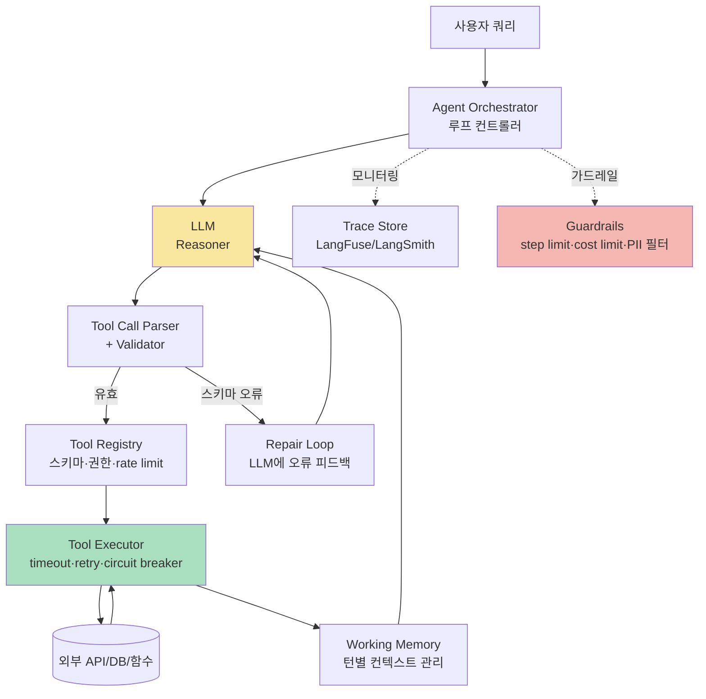

### Agent 시스템의 정체 — "LLM이 스스로 판단해서 도구를 쓴다"는 마법 뒤에 숨은 while 루프, 그리고 이 루프가 프로덕션에서 조용히 무한 순환에 빠지는 방식

> 시니어 백엔드 관점에서 Agent를 처음 볼 때 가장 큰 착각은 이거다.
>
> **"Agent는 새로운 종류의 프로그램이다."**
>
> 아니다. Agent는 **상태 기계(state machine) 위에서 도는 while 루프**다. 다른 점은 조건문의 판단 주체가 `if (x > 0)`가 아니라 **확률적 텍스트 생성기**라는 것뿐이다. 그리고 이 사실을 이해하지 못한 팀은 반드시 프로덕션에서 무한 루프, 컨텍스트 폭발, 유령 함수 호출을 만난다.

---

#### 1. Agent = while 루프 + LLM + Tool Registry

Agent의 본질을 20줄로 뽑아내면 이렇다.

```python
def agent(user_query, tools, max_iterations=10):
    messages = [system_prompt(tools), user_query]
    for step in range(max_iterations):
        response = llm.call(messages)
        if response.is_final_answer():
            return response.text
        tool_call = response.tool_call
        result = tools[tool_call.name](**tool_call.args)
        messages.append(response)
        messages.append(tool_result(result))
    return "timeout"  # ← 여기가 프로덕션 지옥의 입구
```

시니어라면 이 코드에서 즉시 몇 가지 냄새가 나야 한다.

- `max_iterations=10`은 **magic number**다. 왜 10인가? 5면 왜 부족한가?
- `messages.append(...)`는 **누적 상태**다. 매 iteration마다 context가 커진다.
- `tools[tool_call.name]`은 **LLM이 문자열로 지목한 함수를 실행**한다. LLM이 존재하지 않는 함수를 지목하면?
- 루프 종료 조건이 **LLM의 자기 판단**에 달려있다. LLM이 "아직 안 끝났어"라고 우기면?

이 네 가지가 Agent 시스템의 4대 실패 지점이다.

---

#### 2. ReAct 패턴 — Reason과 Act를 왜 굳이 분리하는가

ReAct는 2022년 Yao et al. 논문에서 제안된 패턴이다. 핵심은 매 스텝을 **Thought → Action → Observation**으로 강제하는 것이다.

```
User: "서울과 도쿄의 현재 온도 차이가 뭐야?"

Iteration 1:
  Thought: 두 도시의 온도를 각각 조회한 뒤 빼면 된다. 먼저 서울부터.
  Action: get_weather("Seoul")
  Observation: 28°C

Iteration 2:
  Thought: 이제 도쿄. 
  Action: get_weather("Tokyo")
  Observation: 31°C

Iteration 3:
  Thought: 31 - 28 = 3. 도쿄가 3도 더 높다.
  Action: FINAL_ANSWER("도쿄가 3도 더 높습니다.")
```

**왜 Thought를 명시적으로 뽑는가?** 두 가지 이유다.

1. **디버깅**: LLM이 왜 이 도구를 골랐는지 log에 남는다. Observability에서 이 Thought 라인이 없으면 사후 분석이 불가능하다.
2. **품질**: Chain-of-Thought 효과. Thought를 강제하면 도구 선택 정확도가 실측으로 15~30% 오른다 (원 논문 및 다수의 재현 실험).

**하지만 트레이드오프가 있다.**

- Thought는 토큰이다. 매 스텝마다 200~500 토큰이 추가 소비된다.
- Thought가 잘못된 방향으로 나가면 **자기 확신에 갇힌다** — 다음 스텝에서 그 잘못된 Thought를 참조해 더 잘못된 판단을 내린다. 이걸 **"reasoning cascade failure"** 라고 부른다.

---

#### 3. Tool Use = LLM에게 준 함수 포인터

Tool Use는 프로토콜이다. OpenAI의 function calling, Anthropic의 tool use, Google의 function calling — 이름은 다르지만 본질은 같다.

```
LLM에게 주는 것:
  {
    "name": "get_weather",
    "description": "도시 이름으로 현재 온도를 조회한다",
    "parameters": {
      "city": {"type": "string", "description": "영문 도시명"}
    }
  }

LLM이 뱉는 것:
  {
    "tool_name": "get_weather",
    "arguments": {"city": "Seoul"}
  }
```

시니어 백엔드가 여기서 놓치는 게 있다. 이 프로토콜은 **RPC와 정확히 동일한 구조**를 가진다. 그런데 RPC 세계에서 우리가 신경 쓰는 것들이 여기선 통째로 빠져있다.

| RPC에서 당연한 것 | Tool Use에서 빠진 것 |
|---|---|
| 스키마 검증 (protobuf, OpenAPI) | LLM은 스키마를 **참고**할 뿐, 지킨다는 보장 없음 |
| 재시도 정책 | LLM이 실패한 tool을 그대로 다시 호출하는 경우 다반사 |
| Idempotency key | 같은 tool을 두 번 호출하면 부작용 두 번 |
| Timeout | LLM은 도구가 오래 걸리는지 모름 |
| Circuit breaker | 실패하는 도구를 계속 부름 |

즉, **Tool Use 시스템을 만든다는 것은 곧, 확률적 클라이언트를 위한 방어적 RPC 서버를 만드는 것**이다.

---

#### 4. ReAct vs Planning — 두 개의 대립되는 철학

여기가 시니어들이 자주 헷갈리는 지점이다.

**ReAct**: 매 스텝마다 다음 한 걸음만 결정한다. Reactive.

```
Step 1: 다음 뭐 할까? → A 실행 → 결과 봄
Step 2: 결과 봤으니 다음 뭐 할까? → B 실행 → 결과 봄
Step 3: ...
```

**Planning (Plan-and-Execute)**: 처음에 전체 계획을 세우고, 그 다음 실행만 한다.

```
Step 0 (Planner): "이 문제 풀려면 A → B → C → D 순서로 해야 함"
Step 1 (Executor): A 실행
Step 2 (Executor): B 실행
Step 3 (Executor): C 실행 (실패!)
Step 4 (Replan): 계획 재수립
```

두 접근의 트레이드오프:

```
                    ReAct              Planning
                   ─────────         ────────────
지연시간            나쁨 (매 스텝 LLM)  좋음 (한 번 계획)
비용                나쁨 (스텝당 호출)   좋음 (계획 1회 + 실행)
동적 대응력          좋음               나쁨 (재계획 필요)
디버깅              어려움 (경로가 매번 다름)  쉬움 (계획이 명시적)
장기 작업            취약 (매 스텝 실수 누적)   견고 (계획이 앵커)
```

**실제 사례:**
- **Anthropic의 Claude Code, Cursor**: ReAct 기반. 파일 하나 열고, 결과 보고, 다음 파일 결정. 코딩은 워낙 상태 의존적이라 Planning이 오히려 방해된다.
- **AutoGPT (초기)**: Planning 기반. "웹사이트 만들어줘" → 20단계 계획 → 실행 → 3단계에서 죽음 → 재계획 → 또 죽음. 대실패의 교과서.
- **Devin (Cognition AI)**: 하이브리드. 큰 뼈대는 Planning, 세부는 ReAct.
- **LangChain의 AgentExecutor 초기 버전**: 순수 ReAct. 그래서 5~10 스텝 넘어가는 작업에서 성능이 급락했다.

**시니어 판단 기준:** 작업의 상태 공간이 **작고 예측 가능**하면 Planning, **크고 dynamic**하면 ReAct.

---

#### 5. Agent 시스템 전체 아키텍처 — 실전에서 뭘 준비해야 하는가



시니어라면 이 그림에서 다음을 알아봐야 한다.

- **Parser + Repair Loop**: LLM은 JSON 문법을 틀리게 뱉는다. 이걸 "LLM한테 다시 물어봐서 고치기"로 처리하는 게 표준이다. 하지만 이 Repair Loop 자체가 무한 루프의 씨앗이다 — Repair 시도도 반드시 카운트해야 한다.
- **Tool Registry**: 그냥 `dict[str, function]`이 아니다. 각 도구에는 권한 스코프, rate limit, 비용 정보, side-effect 여부(idempotent인가?)가 붙어야 한다.
- **Working Memory**: `messages.append()`가 아니다. 컨텍스트 윈도우가 200k라도, 실전에서는 30k 넘어가면 정확도가 급락한다. 요약/압축 전략이 필수다.
- **Guardrails**: step limit, cost limit(스텝당 $), PII 필터, 위험한 도구(예: DB 삭제) 확인 프롬프트.

---

#### 6. 프로덕션에서 Agent가 조용히 무너지는 5가지 방식

**(a) 무한 루프 (Circular Reasoning)**

LLM이 같은 도구를 같은 인자로 반복해서 호출한다.

```
Step 3: search_docs("결제 오류")  → 결과 없음
Step 4: search_docs("결제 오류")  → 결과 없음
Step 5: search_docs("결제 오류")  → 결과 없음
...
Step 10: (max_iterations 도달, 실패)
```

**대응**: 같은 (도구, 인자) 쌍이 반복되면 강제로 새 전략을 프롬프트에 주입한다. `You have already tried X with the same arguments. Try a different approach.`

**(b) 컨텍스트 윈도우 폭발**

매 스텝마다 tool 결과가 messages에 쌓인다. tool이 큰 결과를 반환하면 (예: 검색 결과 100개, PDF 텍스트 50페이지) 3~5 스텝만에 컨텍스트가 폭발한다.

**대응**: Tool 결과를 요약해서 넣거나, 참조 ID만 넣고 나중에 필요할 때 조회한다. LangGraph의 `MessagesState`가 이걸 프레임워크 레벨로 뽑아낸 이유.

**(c) Hallucinated Tool Call**

LLM이 존재하지 않는 도구를 부르거나, 도구는 맞는데 스키마에 없는 파라미터를 넣는다.

```
LLM: get_weather(city="Seoul", unit="celsius", country="Korea")
                                                 ^^^^^^^^^^^^^^
                                                 스키마에 없음
```

**대응**: 엄격한 스키마 검증 → Repair Loop. 절대 그대로 실행하지 말 것.

**(d) Partial Progress 소실**

15 스텝짜리 작업이 12번째에서 실패했다. 다시 시도하면 처음부터 다시 한다. 도구 12개 다시 호출. 비용 12배, 부작용 12배.

**대응**: Checkpoint. LangGraph의 `Checkpointer`, Temporal Workflow, DB에 상태 저장. Agent를 **workflow engine** 위에 얹는 게 정답이다.

**(e) Tool 에러의 잘못된 해석**

`get_user(id=123)`이 `404 Not Found`를 반환했다. LLM은 이걸 보고 "일시적 오류인가 보다"라고 판단해서 다시 호출한다. 계속 404. 계속 재시도.

**대응**: Tool 결과에 "이 오류는 재시도해도 소용없음"이라는 **의미론적 태그**를 붙여서 LLM에 준다. `{"error": "not_found", "retryable": false, "hint": "user does not exist. do not retry."}`

---

#### 7. 실제 사례 — 누가 왜 이 패턴을 택했는가

- **GitHub Copilot Workspace**: Planning 강조. "이슈 → 계획 → 코드 변경"의 명시적 단계. 이유: 사용자가 계획을 승인/수정해야 하는 UX. ReAct처럼 매 스텝 결정하면 사용자가 개입할 지점이 없다.

- **Anthropic Computer Use**: 극단적 ReAct. 스크린샷 보고 → 다음 클릭 결정 → 클릭 → 새 스크린샷. Planning이 불가능하다 — GUI 상태가 완전히 dynamic이기 때문.

- **Perplexity의 Search Agent**: 매우 얕은 Agent (2~3 스텝). 검색 → 요약 → 답변. 왜 얕게 만들었나? **지연시간이 곧 이탈률**. 사용자는 5초 이상 기다리지 않는다.

- **Sierra AI (고객 서비스)**: 강한 Guardrail + 얕은 Agent. 도구가 "환불 처리"처럼 위험한 side effect를 가지면 반드시 human-in-the-loop. Agent가 자동으로 실행하지 않는다.

- **국내: 토스의 AI 상담 에이전트, 카카오 i의 도구 사용 시스템**: 사내 발표에서 공통적으로 언급되는 교훈은 **"Agent를 얕게 유지하라"**. 3 스텝 넘어가는 순간 실패율이 지수적으로 증가한다.

---

#### 8. 시니어 백엔드의 판단 기준 — 언제 Agent를 쓰고, 언제 안 써야 하는가

**Agent를 써야 할 때:**
- 사용자 쿼리가 **어떤 도구가 필요한지 사전에 예측 불가**할 때. (예: "우리 회사 매출 데이터에서 이상한 점 찾아줘.")
- 도구 조합의 **경우의 수가 폭발**해서 명시적 워크플로우로 못 짤 때.
- **에러 복구가 상황 의존적**일 때. (예: API가 실패했을 때 대안 API로 갈지, 재시도할지, 사용자에게 물어볼지가 문맥에 따라 다름.)

**Agent를 쓰면 안 될 때:**
- 워크플로우가 **결정적**일 때. `A → B → C → D`가 확정이라면 그냥 코드로 짜라. LLM은 A, B, C, D 안에서 각각 텍스트 생성만 담당하면 된다. 이걸 **"Chain"** 이라 부르고, Agent보다 100배 안정적이다.
- **지연시간이 SLO의 핵심**일 때. Agent는 최소 3배, 보통 5~10배 느리다.
- **부작용이 되돌릴 수 없을 때**. 결제, 삭제, 발송. Agent가 자동으로 실행하게 두지 말고, 항상 confirmation 게이트를 둬라.
- **비용에 상한이 필요할 때**. 사용자당 월 $1 예산인 SaaS에서 Agent 한 번 돌면 $0.30 나간다. 계산해보면 답이 나온다.

---

#### 9. 최종 정리 — Agent 시스템의 3원칙

1. **Agent는 while 루프다.** 종료 조건, iteration limit, 상태 관리를 백엔드 엔지니어링의 자세로 다뤄라. LLM의 "판단"을 신뢰하지 마라.
2. **Tool Use는 확률적 RPC다.** 스키마 검증, 재시도, idempotency, timeout, circuit breaker — RPC 세계의 방어 기법을 그대로 가져와라.
3. **얕게 유지하라.** ReAct든 Planning이든, 스텝 수는 실패율의 지수 함수다. 3 스텝으로 풀리는 문제를 10 스텝짜리 Agent로 만들지 마라.

> 💡 **왜 중요한가**: Agent는 "새로운 프로그래밍 패러다임"이 아니라 "확률적 판단자가 조종하는 while 루프"이며, 이 인식 없이 Agent를 프로덕션에 올린 팀은 반드시 무한 루프·컨텍스트 폭발·되돌릴 수 없는 부작용 중 하나를 마주한다.
