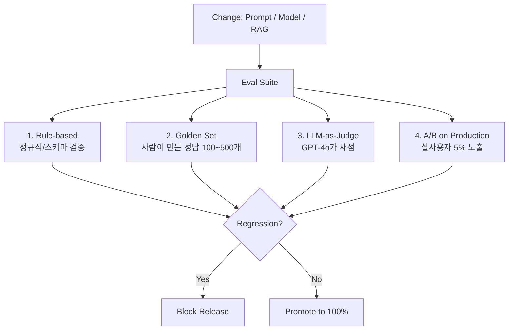

### MLOps for LLM — "우리는 모델을 배포하지 않는다, 프롬프트를 배포한다"는 착각, 그리고 Eval 없이 릴리스한 팀이 3개월 뒤 겪는 지옥

**"모델은 OpenAI가 관리하니까 우리는 MLOps 필요 없어요."**

이 문장이 시니어 백엔드 개발자 입에서 나오는 순간, 그 팀의 프로덕션 LLM 앱은 3개월 시한부다. 이유는 단순하다. **당신은 모델을 배포하지 않는다. 프롬프트, RAG 파이프라인, Tool 정의, few-shot 예제, temperature, top_p, 그리고 이 모든 것의 조합을 배포한다.** 그리고 이 조합은 "코드"가 아니라 "확률적 행동을 만드는 설정"이다. Git으로 관리한다고 안전한 게 아니다.

전통 ML MLOps는 `모델 학습 → 검증 → 배포 → 모니터링`의 라이프사이클이었다. LLM 시대의 MLOps는 다르다. **당신이 학습시키는 건 아무것도 없다. 당신이 관리해야 하는 건 "모델을 둘러싼 모든 것"이다.** 그리고 이걸 놓치면, 어느 날 GPT-4o가 마이너 업데이트를 하고 당신의 챗봇이 조용히 이상해진다.

---

#### 1. LLM MLOps가 전통 MLOps와 다른 지점

```
[전통 ML MLOps]
────────────────────────────────────────────────
데이터 수집 → Feature Eng → 학습 → 검증(정확도)
    ↓
모델 아티팩트(pkl, onnx) → 레지스트리 → 배포
    ↓
Drift 모니터링(입력 분포 변화 감지)


[LLM MLOps]
────────────────────────────────────────────────
             ┌─ Prompt (system, user, few-shot)
             ├─ RAG index (chunk 크기, embedding 모델)
"릴리스 단위"─┼─ Tool 정의 (schema, description)
             ├─ Model version (gpt-4o-2024-08-06)
             └─ Hyperparams (temp, top_p, max_tokens)
    ↓
Eval Suite (LLM-as-judge + Golden set + Human)
    ↓
Canary / Shadow → 프로덕션
    ↓
Trace 기반 회귀 감지 (LangSmith/LangFuse)
```

핵심 차이 세 가지:

| 축 | 전통 ML | LLM |
|---|---|---|
| **릴리스 단위** | 모델 가중치 | 프롬프트+모델+RAG+Tool의 조합 |
| **검증 지표** | Accuracy, F1, AUC (숫자) | Helpfulness, Faithfulness (주관적) |
| **회귀 감지** | 입력 데이터 분포 | 출력 품질 (모델이 조용히 바뀜) |

특히 세 번째가 시니어들이 놓치는 함정이다. `gpt-4o`를 쓰는데 OpenAI가 어제 밤 마이너 튜닝을 했다면? **당신의 코드는 안 바뀌었는데 프로덕션 행동이 바뀐다.** 전통 ML에는 이런 개념이 없다.

---

#### 2. Eval Suite — LLM MLOps의 심장

Eval이 없는 LLM MLOps는 **CI 없는 백엔드 배포**와 같다. 될 때까지 그냥 배포하는 거다. 문제는 "Eval이 뭐냐"가 훨씬 복잡하다는 것.



**Layer 1: Rule-based (가장 저렴, 커버리지 낮음)**
- JSON 스키마 검증, 금지어 필터, 길이 체크
- CI에서 5초 안에 도는 것들

**Layer 2: Golden Set (사람이 만든 정답)**
- 100~500개 정도의 "이 입력에 이 출력이 나와야 한다"
- 문제: LLM 출력은 표현이 매번 다르다 → **exact match 안 됨**
- 해결: semantic similarity + 핵심 키워드 포함 여부

**Layer 3: LLM-as-Judge (LLM이 LLM을 채점)**
- GPT-4o에게 "이 답변이 helpful/faithful/harmless한가"를 5점 척도로 물음
- 문제: **judge도 편향이 있다** — 긴 답변을 선호, 자기 스타일 답변을 선호
- 해결: judge를 학습 데이터 모델과 다른 벤더로. Anthropic 모델을 쓰면 judge는 OpenAI

**Layer 4: 실사용자 A/B**
- 최종 관문. 5% 트래픽에 새 프롬프트/모델 노출
- Thumbs up/down 비율, 재질문 비율, 세션 길이로 판단

---

#### 3. Versioning — "무엇을" 버저닝하는가

Git에 프롬프트 파일 커밋한다고 끝나는 게 아니다. **재현 가능해야 한다.** 즉, "3개월 전 프로덕션 응답을 재현하시오"가 가능해야 한다.

```yaml
# release/v1.42.yaml — 하나의 "LLM 릴리스 단위"
model:
  provider: openai
  name: gpt-4o-2024-08-06   # ← 반드시 date-pinned
  temperature: 0.2
  top_p: 0.9

prompt:
  system_hash: sha256:a3f2...   # 프롬프트 스토어 참조
  few_shot_version: v7

rag:
  embedding_model: text-embedding-3-large
  chunk_size: 512
  chunk_overlap: 50
  index_snapshot: pinecone://prod-2026-08-05

tools:
  - name: search_docs
    schema_hash: sha256:9c1e...

eval_result:
  golden_set: v12
  pass_rate: 0.94
  llm_judge_score: 4.31/5.0
```

**시니어들이 실수하는 지점:**
- ❌ `model: gpt-4o` — 별칭은 언젠가 밑에서 바뀐다
- ✅ `model: gpt-4o-2024-08-06` — 벤더가 deprecation 공지하기 전까지 고정

Anthropic도 마찬가지: `claude-opus-4-6` 대신 `claude-opus-4-6-20260115`처럼 date-pinned 버전을 쓰라는 게 문서에 명시돼있다.

---

#### 4. Rollout 전략 — Canary가 다르게 작동한다

전통 백엔드에서 Canary는 "10%에 배포하고 에러율 보면 됨"이다. LLM은? **에러율은 0인데 답변 품질만 떨어질 수 있다.** HTTP 200 OK로 헛소리를 뱉는다.

```
[Shadow Mode — 프로덕션 트래픽 복제]
사용자 → 프로덕션(v1.41) → 응답 반환 ✓
         ↓ (async 복제)
         v1.42 실행 → 응답 저장만 → 오프라인 비교

[Canary — 실사용자 5%]
사용자 5% → v1.42 → thumbs 비율, 재질문 비율 모니터링
사용자 95% → v1.41

[승격 조건 예시]
- LLM-judge 점수 하락 < 2%
- 사용자 thumbs-down 비율 상승 < 10%
- 응답 시간 p95 상승 < 15%
- Faithfulness (RAG citation 존재) > 90%
```

**실제 사례: Notion AI**
- 프롬프트 변경 시 Shadow mode로 24시간 트래픽 복제
- 오프라인에서 LLM-judge로 비교 후 Canary 5% → 25% → 100%
- 이유: "에러 안 났는데 답변이 미묘하게 이상함"이 실사용 로그로만 잡히기 때문

---

#### 5. 실제 사례 — 두 팀의 대조

**Case A: GitHub Copilot Chat (성숙한 LLM MLOps)**
- 프롬프트/모델/tool을 하나의 "manifest"로 관리
- 수천 개 규모의 Golden set (실제 개발자 세션에서 추출)
- 매 릴리스마다 오프라인 eval → Shadow → 1% → 100%
- 회귀 발견 시 자동 롤백 (LangSmith 스타일 trace 비교)

**Case B: 국내 스타트업 X (전형적인 지옥)**
- 프롬프트는 코드에 하드코딩, PR로 관리
- Eval? "QA 팀이 몇 개 눌러보고 됨" 
- 3개월 후: 어느 프롬프트 조합이 프로덕션에 있는지 아무도 모름
- OpenAI가 gpt-4-turbo를 조용히 튠업 → 사용자 컴플레인 급증 → 원인 찾는 데 2주

두 팀의 차이는 **"LLM 앱도 시스템이다"**를 인정했느냐다. Case A는 프롬프트를 "설정"이 아니라 "artifact"로 봤고, Case B는 "그냥 문자열"로 봤다.

---

#### 6. 트레이드오프

| 접근 | 장점 | 단점 |
|---|---|---|
| **Eval 없이 배포** | 빠름, MVP엔 충분 | 3개월 후 회귀 감지 불가, 롤백 근거 없음 |
| **Golden Set만** | 재현 가능, CI 통합 쉬움 | 표현 다양성 못 잡음, 유지보수 비용 |
| **LLM-as-Judge** | 확장성, 자동화 | Judge 편향, 비용 (매 릴리스 $10~100) |
| **Full A/B on prod** | 진실을 말해줌 | 느림(주 단위), 초기 트래픽 필요 |

**시니어의 답:** 4개 층을 모두 쌓되, 릴리스 크기에 따라 통과 관문을 다르게. 프롬프트 오탈자 수정은 Layer 1만, 모델 교체는 Layer 1~4 전부.

---

#### 7. 언제 쓰고 언제 쓰면 안 되는가

**써야 하는 경우:**
- 프로덕션 트래픽이 있는 LLM 앱 (사용자 요청 1일 1000건 이상)
- 프롬프트/RAG를 주 1회 이상 수정하는 팀
- 여러 모델 벤더를 오가는 환경 (Fallback 있음)
- 규제 산업 (금융/의료) — 릴리스 감사 추적 필수

**쓰지 말아야 하는 경우 (오버킬):**
- 사내용 프로토타입, 개발자 10명 이하 사용
- 프롬프트를 월 1회 이하로 만지는 앱
- 응답이 결정적이어야 하는 경우 (그럼 LLM 쓰지 말고 rule engine을)

**중간지대의 함정:** "MVP니까 나중에 하자" — 이게 가장 위험하다. Golden set은 프로덕션 트래픽이 생기기 전에 만들어두는 게 10배 싸다. 트래픽이 쌓이면 "무엇이 정답이었는지"를 사람이 다시 라벨링해야 한다.

---

> 💡 **왜 중요한가**: LLM 앱의 배포 단위는 "코드"가 아니라 "프롬프트+모델+RAG+Tool의 조합"이며, 이 조합의 회귀는 HTTP 500이 아니라 "미묘하게 이상한 답변"으로 나타나기 때문에 Eval Suite 없이는 감지 자체가 불가능하다.
