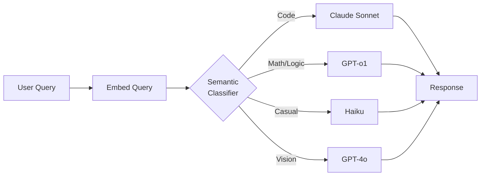

### LLM Routing/Fallback — "Fallback만 붙이면 안전하다"는 착각, 그리고 fallback이 발동한 새벽 3시에 JSON 파서가 조용히 죽는 방식

시니어 백엔드가 LLM을 처음 프로덕션에 태울 때 흔히 하는 말이 있다.

> "OpenAI 죽으면 Anthropic으로 fallback 붙였으니 SLA 문제없어요."

이 문장을 CTO 앞에서 자신 있게 했던 팀이 3개월 뒤에 겪는 일이 두 가지 있다. 첫째, **청구서가 예상의 30배로 나온다.** 둘째, **fallback이 발동한 15분 동안 시스템이 살아있었지만 응답은 전부 쓰레기였다.**

Fallback은 안전장치가 아니다. **다른 시스템으로의 마이그레이션**이다. 그리고 그 마이그레이션을 트래픽 폭주 중에, 자동으로, 검증 없이 실행하겠다는 게 대부분의 "fallback 전략"의 정체다.

---

#### 1. Routing과 Fallback은 다른 문제다 (혼동이 대부분의 사고의 시작)

많은 팀이 이 둘을 섞어서 이야기하는데, 성격이 완전히 다르다.

| 구분 | Routing | Fallback |
|---|---|---|
| **목적** | 비용/성능 최적화 | 가용성 확보 |
| **트리거** | 요청의 특성 (사전) | 에러/타임아웃 (사후) |
| **성격** | 프로액티브 | 리액티브 |
| **주요 위험** | 라우팅 오분류 | 출력 포맷 불일치 |
| **최적화 대상** | 원가 (P&L) | 가용성 (SLA) |

시니어의 첫 번째 판단: **당신이 진짜 필요한 게 뭔가?** 재무팀에서 원가 얘기 나온 거면 Routing이고, 오퍼레이션에서 장애 얘기 나온 거면 Fallback이다. 둘 다 필요한 경우가 대부분이지만, **동시에 도입하면 디버깅이 불가능해진다.** 어느 쪽 결정 때문에 이 요청이 저 모델로 갔는지 로그만 봐서는 알 수 없다.

---

#### 2. Cascade Routing — "싼 놈부터 태우고 안 되면 비싼 놈"

가장 흔한 라우팅 패턴이자, 가장 자주 잘못 구현되는 패턴이다.

```
┌─────────────┐
│  Incoming   │
│   Request   │
└──────┬──────┘
       │
       ▼
┌──────────────────┐    confidence
│  Haiku / GPT-mini│───── > 0.85 ────► ✅ Return
│  ($0.25/1M tok)  │
└──────┬───────────┘
       │ confidence < 0.85
       ▼
┌──────────────────┐    confidence
│  Sonnet / GPT-4o │───── > 0.90 ────► ✅ Return
│  ($3/1M tok)     │
└──────┬───────────┘
       │ confidence < 0.90
       ▼
┌──────────────────┐
│  Opus / GPT-o1   │────────────────► ✅ Return
│  ($15/1M tok)    │
└──────────────────┘
```

멋있어 보이지만 여기엔 **함정 세 개**가 있다.

**함정 1: "confidence"가 없다.** LLM은 자기 답이 맞는지 스스로 모른다. `logprobs`를 쓴다? 그건 "이 토큰이 나올 확률"이지 "이 답이 맞을 확률"이 아니다. 결국 대부분의 팀은 **별도의 판정 LLM**을 붙이거나, **응답 스키마 검증**으로 대체한다. 판정 LLM을 붙이면 그것도 비용이고, 스키마 검증만 하면 "형식은 맞는데 내용은 틀린" 답을 못 걸러낸다.

**함정 2: Cascade는 latency를 파괴한다.** 최악의 경우 3번 호출한다. Haiku 800ms + Sonnet 1.5s + Opus 3s = 5.3초. 사용자는 그냥 처음부터 Opus 부르는 것보다 오래 기다린다.

**함정 3: 캐시가 무력해진다.** 같은 질문이 어떤 날은 Haiku에서 끝나고 어떤 날은 Opus까지 갔다면, 응답 캐싱 키를 뭘로 잡을 것인가? 결정론적 시스템에서 벗어나는 순간 관측성도 함께 무너진다.

**실전 사례**: Notion AI는 초기에 이 cascade 전략을 시도했다가 접었다는 얘기가 있다. 이유는 "사용자가 같은 기능을 두 번 눌렀을 때 답이 다르면 신뢰가 무너진다"였다. 지금은 기능(feature) 단위로 모델을 **정적 매핑**한다. Summarize는 Haiku 고정, Draft는 Sonnet 고정. 이게 시니어의 정답에 가깝다.

---

#### 3. Semantic Routing — "질문의 성격을 보고 모델을 고른다"

Cascade의 대안. Embedding으로 요청을 분류해서 처음부터 맞는 모델로 보낸다.



Martian, RouteLLM 같은 오픈소스가 다 이 방식이다. 이론적으로는 최적이다. 문제는:

- **Classifier도 모델이다.** 이걸 뭘로 돌릴 건가? Haiku로 돌리면 200ms 추가. 임베딩만 쓰면 200ms 추가 + 정확도 저하.
- **분류가 틀리면 사용자는 이유를 모른다.** "왜 오늘은 답이 이상해요?"라고 물어보면 백엔드 개발자가 로그 파서 "아, 코드 질문인데 casual로 분류돼서 Haiku로 갔네요"라고 답해야 한다.
- **모델이 바뀌면 classifier도 재훈련.** GPT-5가 나오면 어느 카테고리를 GPT-5로 옮길지 다시 결정해야 한다. 이 재훈련이 CI/CD에 얼마나 파이프라인화돼 있는가?

**실전 사례**: Perplexity는 Pro Search에서 라우팅을 쓴다. "요약이면 Sonnet, 코드면 GPT-4, 최신 정보면 자체 Sonar"처럼. 이게 가능한 이유는 그들의 **분류 정확도가 90%대**여서가 아니라, **사용자에게 "어떤 모델이 답했는지" UI에서 노출**하기 때문이다. 라우팅 오분류가 발생해도 사용자가 다른 모델 선택할 수 있는 escape hatch가 있다. B2B API로 팔면 이 escape hatch가 없다. 조심해야 한다.

---

#### 4. Fallback의 함정 — "OpenAI 죽어서 Anthropic으로 갔더니 파서가 죽었다"

여기가 진짜 사고 나는 곳이다.

당신의 프로덕션 파이프라인이 이렇게 생겼다고 하자.

```
GPT-4o (function calling) 
  → returns: {"tool": "search", "args": {...}}
  → JSON.parse() 
  → downstream 처리
```

OpenAI가 죽었다. Fallback으로 Claude로 넘어간다. Claude도 tool use를 지원한다. 그런데:

```
OpenAI:  {"tool_calls": [{"function": {"name": "search", "arguments": "{...}"}}]}
Claude:  {"content": [{"type": "tool_use", "name": "search", "input": {...}}]}
```

**같은 개념, 완전히 다른 스키마.** 당신의 파서는 OpenAI 포맷에 하드코딩돼 있다. Fallback이 발동한 순간 downstream이 조용히 undefined를 뱉기 시작한다. **HTTP 200으로.** 알림도 안 온다. 사용자만 "왜 오늘 답이 이상해요"라고 문의 넣는다.

이걸 막는 유일한 방법은 **Adapter Pattern**이다.

```
┌─────────────┐
│  Business   │
│    Logic    │
└──────┬──────┘
       │  (표준화된 사내 스키마)
       ▼
┌─────────────────────────┐
│   LLM Abstraction       │
│   (내부 표준 스키마)    │
└──┬────────────────┬─────┘
   │                │
   ▼                ▼
┌──────────┐   ┌──────────┐
│ OpenAI   │   │ Anthropic│
│ Adapter  │   │ Adapter  │
└──────────┘   └──────────┘
```

이 abstraction을 안 만들고 fallback 붙이는 팀은 **fallback이 있는 척**만 하는 거다. 진짜 발동하면 죽는다.

---

#### 5. Rate Limit — Fallback의 두 번째 함정

OpenAI가 죽어서가 아니라, **당신이 rate limit에 걸려서** fallback으로 넘어가는 경우가 훨씬 흔하다. 그런데 이때 Anthropic으로 fallback을 태우면 어떻게 될까?

- 평소 트래픽: 초당 100 req → OpenAI 90 / Anthropic 10 (baseline)
- OpenAI 장애: 초당 100 req → Anthropic 100 (10배 스파이크)
- Anthropic도 rate limit 진입 → 429 → **양쪽 다 죽음**

이걸 **Thundering Herd Failover**라고 부른다. 시니어 백엔드라면 익숙한 패턴이다. DB replica failover에서 똑같이 겪는다.

**대응**:
- Fallback provider도 baseline 트래픽을 상시로 흘려서 **워밍업**해두기 (5~10%)
- Circuit breaker에 **jitter** 넣어서 동시 fallback 방지
- Fallback 트리거를 timeout이 아니라 **에러율 기반**으로 (일부 요청만 넘김)

---

#### 6. 트레이드오프 정리

| 전략 | 비용 절감 | Latency | 복잡도 | 관측성 파괴 정도 |
|---|---|---|---|---|
| 단일 모델 (No routing) | ❌ | ⭐⭐⭐ | ⭐ | ⭐ |
| 기능별 정적 매핑 | ⭐⭐ | ⭐⭐⭐ | ⭐⭐ | ⭐⭐ |
| Cascade | ⭐⭐⭐ | ⭐ | ⭐⭐⭐ | ⭐⭐⭐⭐ |
| Semantic Routing | ⭐⭐⭐ | ⭐⭐ | ⭐⭐⭐⭐ | ⭐⭐⭐⭐ |
| Multi-provider Fallback | ❌ (오히려 증가) | ⭐⭐⭐ | ⭐⭐⭐⭐ | ⭐⭐⭐⭐⭐ |

**시니어의 판단**:

- **일단 단일 모델로 시작하라.** 라우팅은 원가 문제가 실제로 드러난 다음 도입하는 최적화다. 조기 도입은 관측성만 깬다.
- **원가가 문제가 되면 Cascade보다 기능별 정적 매핑을 먼저.** "Summarize는 Haiku, Draft는 Sonnet" 같은 단순한 규칙이 90% 케이스를 커버한다.
- **Fallback은 Adapter 없이 붙이지 마라.** 그건 fallback이 아니라 시한폭탄이다.
- **Fallback provider는 baseline 트래픽으로 워밍업하라.** 완전히 idle 상태의 provider를 위기 순간에 스파이크 태우면 같이 죽는다.

---

#### 7. 언제 쓰고 언제 쓰면 안 되는가

**써야 하는 경우**:
- 월 API 청구서가 팀 인프라 예산의 20%를 넘기 시작할 때 (라우팅으로 원가 최적화)
- 규제 산업(금융/의료)에서 SLA 계약상 다중 벤더 요구가 있을 때 (Multi-provider Fallback)
- 특정 작업이 모델별로 성능 차이가 크게 나는 게 벤치마크로 증명될 때 (Semantic Routing)

**쓰지 말아야 하는 경우**:
- MVP 단계 (아직 어떤 모델이 필요한지도 모른다)
- 응답의 결정론성이 중요한 경우 (같은 질문에 같은 답을 요구하는 UX)
- 사내에 LLM 관측 인프라(LangSmith/LangFuse 같은)가 없는 상태 — **라우팅은 관측성 위에서만 안전하다**
- Fallback provider의 tool/schema를 사내 Adapter로 표준화하지 않은 상태

---

> 💡 **왜 중요한가**: Routing과 Fallback은 "안전장치를 추가한다"가 아니라 "시스템의 결정론성을 포기하는 대가로 다른 것(원가/가용성)을 산다"는 트레이드오프이며, 이 대가를 인지하지 못하고 도입하면 관측성·재현성·응답 일관성이 조용히 무너진다.
