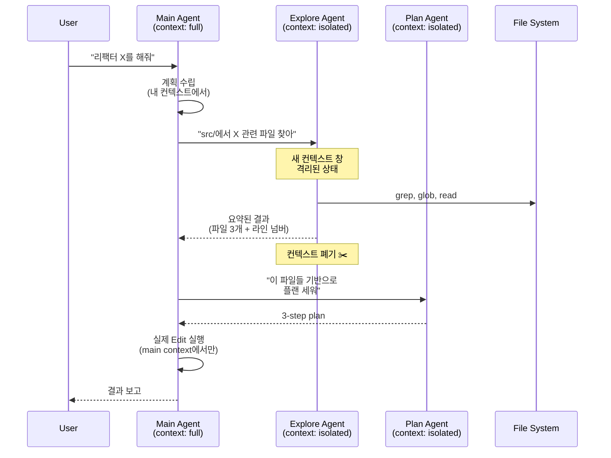

### Multi-Agent Orchestration — "에이전트 여러 개 붙이면 똑똑해진다"는 헛소리, 그리고 병렬 에이전트가 서로의 컨텍스트를 오염시키며 조용히 예산을 태우는 방식

---

#### 1. 시작하는 오해: "한 명이 못하면 여러 명이 하면 되잖아?"

Lv5 Day 45쯤 우리는 이미 배웠다. 단일 에이전트(ReAct 루프)의 한계는 명확하다.

- **컨텍스트 창 폭발**: 10턴 넘어가면 32k 토큰이 순식간에 찬다
- **역할 혼란**: 코딩도 하고, 검색도 하고, 요약도 하는 "만능 프롬프트"는 모든 작업에서 mediocre
- **디버깅 불가**: 한 에이전트가 실패했을 때 어느 툴 호출에서 실패했는지 추적 지옥

그래서 자연스러운 다음 스텝: **"에이전트를 여러 개 나누자."**

- Planner 에이전트가 계획을 세우고
- Researcher 에이전트가 검색을 하고
- Coder 에이전트가 코드를 짜고
- Reviewer 에이전트가 리뷰를 한다

문서에는 이렇게 쓰여 있다. 그리고 튜토리얼도 이렇게 짜여 있다. AutoGPT, BabyAGI, MetaGPT, CrewAI, LangGraph의 데모는 전부 이 패턴이다.

**문제는 프로덕션에서 이걸 그대로 옮기면 3주 안에 팀이 이걸 다 뜯어낸다는 것이다.** 왜?

---

#### 2. 오케스트레이션 패턴의 4가지 원형

멀티 에이전트를 하기 전에, 무엇을 하려는지 정확히 알아야 한다. 패턴은 대략 4가지다.

```
┌─────────────────────────────────────────────────────────────────┐
│                                                                 │
│   [1] Supervisor / Orchestrator-Worker                          │
│                                                                 │
│                    ┌─────────────┐                              │
│                    │  Supervisor │ ──── decides who runs next   │
│                    └──────┬──────┘                              │
│              ┌────────────┼────────────┐                        │
│              ▼            ▼            ▼                        │
│         ┌────────┐  ┌────────┐  ┌────────┐                      │
│         │Worker A│  │Worker B│  │Worker C│                      │
│         └────────┘  └────────┘  └────────┘                      │
│                                                                 │
│   → Claude Code, LangGraph 대부분의 예제, OpenAI Swarm          │
│                                                                 │
├─────────────────────────────────────────────────────────────────┤
│                                                                 │
│   [2] Hierarchical / Team-of-Teams                              │
│                                                                 │
│                    ┌─────────────┐                              │
│                    │   CEO Agent │                              │
│                    └──────┬──────┘                              │
│              ┌────────────┴────────────┐                        │
│         ┌────▼────┐              ┌─────▼────┐                   │
│         │ Eng Lead│              │Product PM│                   │
│         └────┬────┘              └─────┬────┘                   │
│         ┌────┴─────┐              ┌────┴─────┐                  │
│         ▼          ▼              ▼          ▼                  │
│       Dev1        Dev2         Analyst    Designer              │
│                                                                 │
│   → MetaGPT (소프트웨어 회사 시뮬레이션)                        │
│                                                                 │
├─────────────────────────────────────────────────────────────────┤
│                                                                 │
│   [3] Debate / Adversarial                                      │
│                                                                 │
│         ┌────────┐   ┌────────┐   ┌────────┐                    │
│         │Proposer│──▶│ Critic │──▶│  Judge │                    │
│         └────────┘   └────────┘   └────────┘                    │
│                                                                 │
│   → Anthropic 내부 "Constitutional AI", 코드 리뷰 파이프라인    │
│                                                                 │
├─────────────────────────────────────────────────────────────────┤
│                                                                 │
│   [4] Swarm / Peer-to-Peer                                      │
│                                                                 │
│         ┌────────┐◀─▶┌────────┐                                 │
│         │Agent 1 │   │Agent 2 │                                 │
│         └───┬────┘   └────┬───┘                                 │
│             │             │                                     │
│         ┌───▼────┐   ┌────▼───┐                                 │
│         │Agent 3 │◀─▶│Agent 4 │                                 │
│         └────────┘   └────────┘                                 │
│                                                                 │
│   → AutoGen(초기), 학술 데모, 프로덕션에서는 거의 실패          │
│                                                                 │
└─────────────────────────────────────────────────────────────────┘
```

**중요한 관찰:** 프로덕션에서 살아남는 건 거의 [1] Supervisor 패턴 하나다. [2]는 데모용, [3]은 특정 워크플로우에서만, [4]는 논문에서만 산다. 왜 그런지 뒤에서 본다.

---

#### 3. 실제 프로덕션 아키텍처: Claude Code의 sub-agent 모델

가장 잘 설계된 프로덕션 멀티 에이전트 시스템 중 하나가 Claude Code다. Anthropic이 자기 도그푸딩하면서 다듬은 결과물이라 참고할 만하다.



핵심 설계 원칙 4개:

1. **컨텍스트 격리 (Context Isolation)**  
   서브 에이전트는 부모의 컨텍스트를 못 본다. 필요한 것만 프롬프트로 받는다. 이유: 부모 컨텍스트가 20k 토큰이면, 서브가 5개 뜨는 순간 100k가 넘는다.

2. **결과 요약 (Summarization at Boundary)**  
   서브가 100개 파일을 읽어도, 부모에게는 "관련 파일 3개: A:12, B:45, C:88" 이런 요약만 돌려준다. 이걸 안 하면 부모 컨텍스트가 서브의 스캔 노이즈로 오염된다.

3. **쓰기 권한 분리**  
   서브 에이전트는 대개 **읽기만** 한다. Edit/Write는 오케스트레이터(부모)만 한다. 여러 서브가 동시에 파일을 쓰면 병합 지옥이 열린다.

4. **명시적 종료 조건**  
   서브는 한 가지 목적만 가지고, 그 목적을 완수하면 죽는다. "탐색해서 답을 찾을 때까지 무한 반복"이 아니라 "이 5개 파일 안에서 X 찾기"다.

---

#### 4. 실패 모드 5선 — 튜토리얼에는 안 나오는 것들

##### 실패 1. 컨텍스트 오염 (Context Pollution Cascade)

Supervisor가 모든 워커의 출력을 자기 컨텍스트에 다 담는 순간, 워커가 늘어날수록 Supervisor가 멍청해진다.

```
Turn 1:  Supervisor context =  4k tokens
Turn 2:  + Worker A output   =  8k tokens
Turn 3:  + Worker B output   = 14k tokens
Turn 5:  + Worker A retry    = 22k tokens
Turn 8:  + Worker C output   = 35k tokens  ← 이 시점부터 
Turn 12: + ...               = 60k tokens     지시 무시하기 시작
```

Long context ≠ smart. Anthropic의 needle-in-haystack 벤치마크에서도 32k 넘으면 성능이 급격히 떨어진다. **Supervisor 컨텍스트를 4~8k 이내로 유지하는 게 프로덕션의 절대 원칙이다.**

##### 실패 2. 무한 위임 (Delegation Loop)

Supervisor가 애매한 답을 받으면 다시 위임한다. Worker가 애매하게 답하면 다시 다른 Worker에게 위임한다. 이 재귀는 예산이 다 탈 때까지 안 멈춘다.

**AutoGPT 초기 커뮤니티에서 "밤새 GPT-4 API를 돌렸는데 $340 나오고 답은 없더라"는 후일담이 왜 폭발했는지의 이유다.** 명시적 최대 위임 깊이(max_depth=3 정도)와 예산 상한이 없으면 프로덕션에 못 올린다.

##### 실패 3. 역할 분리가 실제 성능을 만들지 않는다

"Researcher는 잘 찾고, Coder는 잘 짜니까 분리하면 좋아진다" → **이건 미신이다.**

실제로 GPT-4나 Claude 4에게 "너는 리서처야"라고 프롬프트를 주는 것과, 그냥 시키는 것은 대부분의 태스크에서 유의미한 성능 차이가 없다. 페르소나 부여의 효과는 도메인이 매우 좁고(법률, 의료), 톤/포맷 제약이 클 때만 통계적으로 유의하다.

**즉, 역할 분리는 성능이 아니라 컨텍스트 예산 관리 목적이어야 한다.** "분업했더니 똑똑해졌다"는 없고, "분업했더니 각자의 컨텍스트가 작아져서 각자가 흐트러지지 않았다"는 있다.

##### 실패 4. 상태 공유의 지옥

두 에이전트가 같은 파일을 수정한다. 또는 같은 데이터베이스를 업데이트한다. 트랜잭션 격리 수준이 없으면 마지막 쓴 놈이 이긴다.

Lv3에서 배운 CQRS나 event sourcing이 여기서 다시 튀어나온다. **멀티 에이전트가 공유 상태를 건드리는 순간, 시스템은 분산 시스템이 되고, 그러면 분산 시스템의 모든 문제가 따라온다.** 그런데 각 에이전트가 stochastic하다는 게 훨씬 더 큰 문제로 얹힌다.

##### 실패 5. Observability 붕괴

에이전트가 하나면 trace는 선형이다. 서브 5개가 병렬로 뜨면 trace는 트리이자 DAG이며, 각 노드는 다른 프롬프트/모델/시각을 가진다.

Datadog으로 못 본다는 건 Lv5 Day 34에서 이미 배웠다. 그런데 LangSmith/LangFuse도 병렬 서브 에이전트 트레이싱은 여전히 UX가 미숙하다. **프로덕션에 올리기 전 반드시 "이 요청 하나가 어떻게 흘러갔는지 3분 안에 재구성할 수 있는가?"를 스스로 물어야 한다.**

---

#### 5. 실제 사례 대조

| 시스템 | 패턴 | 특징 | 왜 그런 선택을 했나 |
|---|---|---|---|
| **Claude Code (Anthropic)** | Supervisor + isolated sub-agent | 서브는 읽기 전용, 결과 요약해서 리턴 | 컨텍스트 격리가 우선. 코딩은 결정론적 파일 시스템 위에서 이뤄져 상태 충돌 회피 필요 |
| **Devin (Cognition)** | Supervisor + 특화 sub-agent (Browser, Editor, Shell) | Sub는 도구별로 분화, planner는 상위에 하나 | 툴 사용의 실패 recovery가 핵심. 툴별로 재시도 전략을 다르게 |
| **MetaGPT** | Hierarchical (CEO→PM→Eng→Dev) | 회사 조직 시뮬레이션, SOP 기반 | "소프트웨어 개발 프로세스"라는 예측 가능한 워크플로우가 존재해서 계층이 의미 있음 |
| **AutoGen (초기)** | Group chat (Swarm과 유사) | 에이전트들이 자유롭게 대화 | 데모는 인상적이었지만, **프로덕션 사례는 거의 없다.** 종료 조건 불명확 |
| **LangGraph** | 그래프 기반 supervisor | 개발자가 직접 상태 전이 그래프를 정의 | 결정론적 흐름을 강제. **사실상 워크플로우 엔진에 LLM을 노드로 끼운 것** |
| **Perplexity의 Copilot** | 단일 에이전트 + tool | 멀티 에이전트가 아니다 | 검색+합성이 명확해서 굳이 나눌 이유가 없다고 판단 |

**패턴 눈치챘나?** 프로덕션 성공 사례는 대부분:
- **Supervisor 하나** + **격리된 서브들**
- **자유 대화가 아니라 명시적 그래프/DAG**
- **각 에이전트의 역할은 "다른 성격"이 아니라 "다른 도구/컨텍스트"**

반면 학술/데모에서는:
- 계층 조직, 자유 대화, 페르소나 강조

**이 두 세계는 겹치지 않는다.**

---

#### 6. 트레이드오프 정리

| 축 | 단일 에이전트 | 멀티 에이전트 (Supervisor) | 멀티 에이전트 (Swarm) |
|---|---|---|---|
| **초기 성능** | 중 | 중~고 | 저 (프롬프트 조율 지옥) |
| **컨텍스트 확장성** | 나쁨 (창 폭발) | 좋음 (격리) | 최악 (전파 폭발) |
| **디버깅** | 쉬움 | 중간 (트레이스 트리) | 지옥 |
| **비용** | 저 | 중 (2~5배) | 고 (10배+) |
| **레이턴시** | 낮음 | 중~높음 (직렬 위임) | 예측 불가 |
| **확정적 종료** | 쉬움 | 중간 | 어려움 |
| **팀 온보딩** | 쉬움 | 중간 | 불가능 |

**"멀티 에이전트가 이긴다"는 벤치마크는 대개 성공률(quality)만 본다. 비용, 레이턴시, 운영 부담을 붙이면 대부분의 실무 태스크에서 단일 에이전트가 이긴다.**

---

#### 7. 시니어 백엔드 관점: 언제 쓰고 언제 쓰면 안 되는가

##### ✅ 써야 하는 경우

1. **컨텍스트가 명백히 창을 넘는다**  
   예: 100개 파일 리팩터, 1000쪽 문서 요약. Supervisor + Map-style sub-agent로 나누는 게 자연스럽다.

2. **작업 단계가 명확히 분리되고 인터페이스가 안정적**  
   예: "검색 → 요약 → 코드 생성 → 리뷰". 각 경계에서 스키마(JSON)로 계약을 강제할 수 있으면 안전하다.

3. **서로 다른 모델을 써야 한다**  
   예: 검색은 Haiku(빠르고 싸다), 코드 생성은 Opus. LLM Routing과 겹치는 지점. 이 경우 자연스럽게 에이전트가 나뉜다.

4. **병렬화로 레이턴시 이득이 크다**  
   예: 10개 문서를 각각 서브가 분석하고 병합. 순차 대비 5~8배 빠름.

##### ❌ 쓰지 말아야 하는 경우

1. **단일 프롬프트로 이미 잘 되는데 "구조가 예뻐서" 나누고 싶을 때**  
   프로덕션에서 가장 흔한 실패다. "이건 CQRS해야 폼 나잖아"와 같은 병.

2. **워크플로우가 결정론적이고 짧다**  
   그건 그냥 순차 함수 호출로 충분하다. 에이전트가 아니라 파이프라인이다. LangGraph조차 오버킬.

3. **팀에 LLM Observability(LangSmith/LangFuse) 인프라가 없다**  
   Lv5 Day 34에서 강조했듯, 서브 에이전트 트레이싱이 없으면 프로덕션 디버깅이 불가능하다. 먼저 관측성 깔고, 그 다음 멀티 에이전트다.

4. **비용/레이턴시 SLO가 빡빡한 사용자 대면 기능**  
   Supervisor + 3 서브 = 최소 4번의 LLM 호출. p95 20초 걸릴 수 있다. 실시간 챗은 대개 단일 에이전트가 답이다.

5. **에이전트가 공유 상태(DB, 파일)를 쓰기 접근**  
   반드시 쓰기는 오케스트레이터로 모으고, 서브는 읽기 전용으로 만들라. Two-phase commit을 LLM에게 맡기지 마라.

---

#### 8. 실무 체크리스트 — 프로덕션 올리기 전

```
[ ] Supervisor의 컨텍스트가 8k 토큰 이내로 유지되는가? 
    (서브 결과를 요약해서 받는가?)

[ ] 최대 위임 깊이(max_depth)와 최대 스텝(max_steps)이 설정됐는가?

[ ] 요청당 비용 상한(budget cap)이 있는가? 초과 시 fail-fast?

[ ] 각 서브 에이전트는 명확한 종료 조건이 있는가?
    ("찾을 때까지" 같은 무한 조건 금지)

[ ] 서브 간 공유 상태가 있다면, 락/트랜잭션/idempotency key가 있는가?

[ ] Trace가 트리 형태로 시각화 가능한가? (LangSmith/LangFuse 연동)

[ ] 각 에이전트의 프롬프트가 개별 버저닝되는가? 
    (Lv5 Day 40 프롬프트 버저닝 참조)

[ ] Circuit breaker: 특정 서브가 3회 연속 실패하면 부모가 fallback으로 전환?

[ ] Cost/latency 회귀 테스트가 CI에 있는가? 
    (한 프롬프트 바꿨다가 호출 수 4배 되는 사고 방지)
```

이 9개 중 4개 이상 답 못하면, **아직 멀티 에이전트를 프로덕션에 올릴 준비가 안 된 것이다.**

---

> 💡 **왜 중요한가**: 멀티 에이전트는 "똑똑함"을 사는 게 아니라 "컨텍스트 격리"를 사는 것이며, 이 본질을 착각하는 순간 팀은 3배의 비용으로 절반의 성능을 얻는 시스템을 짓게 된다.
