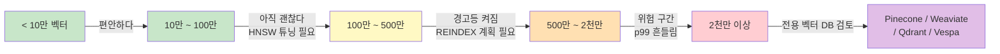

### pgvector — "우리 이미 Postgres 쓰는데 하나 더 늘리기 싫다"는 정치적 선택, 그리고 500만 벡터 넘어가는 순간 HNSW 인덱스가 조용히 무릎 꿇는 방식

#### 왜 지금 이 이야기를 해야 하는가

RAG를 붙이기로 결정한 팀이 가장 먼저 마주치는 질문은 임베딩 모델이나 chunking 전략이 아니다. **"벡터를 어디에 저장하지?"** 다.

여기서 갈리는 두 파벌이 있다.

- **파벌 A**: "우리 이미 Postgres 잘 쓰고 있잖아. `pgvector` 확장 붙이면 끝이야. DBA 한 명, 백업 파이프라인 하나, 트랜잭션 하나. 벡터 DB를 왜 사?"
- **파벌 B**: "Pinecone, Weaviate, Qdrant 같은 전용 벡터 DB가 괜히 있는 게 아니다. 스케일 나오면 Postgres는 못 버틴다."

두 진영 모두 자기 논리가 있고, 둘 다 부분적으로 옳다. 문제는 **"pgvector로 시작해서 언제 벗어나야 하는가"** 라는 질문에 대한 답이 팀마다 다르다는 점이고, 이 판단을 틀리면 프로덕션에서 **재인덱싱 3시간, p99 3초, recall 82%** 같은 지옥 트리오를 만난다.

이 글은 시니어 백엔드 관점에서 pgvector의 매력, 함정, 그리고 "언제까지 밀고 나갈 수 있는가"를 다룬다.

---

#### 1. pgvector가 아키텍처적으로 매력적인 이유

pgvector가 단순히 "Postgres에 벡터 컬럼 하나 추가"가 아닌 이유는, 벡터 검색이 **기존 관계형 쿼리와 같은 트랜잭션 안에서 실행된다**는 데 있다.

```sql
-- 하나의 트랜잭션에서 필터 + 벡터검색 + JOIN이 동시에
SELECT d.id, d.title, d.author
FROM documents d
WHERE d.tenant_id = $1                          -- 정확 일치
  AND d.created_at > NOW() - INTERVAL '30 days' -- 범위
  AND d.status = 'published'                    -- enum
ORDER BY d.embedding <=> $2                     -- 벡터 유사도
LIMIT 10;
```

Pinecone에서 이걸 하려면 metadata filter로 tenant/status/timestamp를 밀어넣고, 결과 ID를 받아다가 다시 Postgres에서 JOIN해야 한다. 왕복 2번, 정합성 이슈 1개, latency 100ms 추가.

**pgvector의 진짜 킬러 기능**은 벡터 검색이 아니라 **"관계형 데이터와 같은 세계에 사는 벡터"** 다.

| 항목 | pgvector | Pinecone/Weaviate |
|------|----------|------------------|
| 스토리지 인프라 | 기존 Postgres 재활용 | 신규 SaaS/클러스터 |
| 트랜잭션 | ACID, 다른 테이블과 JOIN | 없음. 최종 일관성 |
| 백업/DR | 기존 pgbackrest/WAL | 별도 파이프라인 |
| 인증/RBAC | Row Level Security | 별도 API key/네임스페이스 |
| 운영 인력 | 기존 DBA | 신규 학습 필요 |
| 비용(초기) | 사실상 0 | 월 $70~ (Serverless) |

이 표만 보면 pgvector가 항상 이긴다. 그런데 왜 Pinecone이 유니콘이 됐고, Weaviate가 시리즈 B를 받았을까?

---

#### 2. 함정: HNSW 인덱스와 MVCC의 상성 문제

pgvector가 지원하는 인덱스는 크게 두 종류다.

- **IVFFlat**: 벡터 공간을 k-means로 클러스터링. 학습 필요. 데이터 분포 바뀌면 recall 붕괴.
- **HNSW**: 계층적 그래프. 학습 불필요. 최신 벡터 인덱스의 사실상 표준.

문제는 여기서 시작된다. **HNSW는 in-place update에 매우 취약한 자료구조**이고, Postgres는 MVCC 기반으로 매 UPDATE마다 새 튜플을 만든다.

```
┌──────────────────────────────────────────────────────────────────┐
│                      pgvector + HNSW 워크로드                     │
├──────────────────────────────────────────────────────────────────┤
│                                                                  │
│   INSERT/UPDATE                    SELECT (벡터 검색)             │
│        │                                  │                      │
│        ▼                                  ▼                      │
│   ┌──────────┐                     ┌──────────────┐              │
│   │ documents│  ────새 튜플────►   │  HNSW Index  │              │
│   │  table   │  ────dead 튜플──►   │  (그래프)    │              │
│   └──────────┘                     └──────────────┘              │
│        │                                  │                      │
│        │  VACUUM이 dead 튜플 청소          │                      │
│        │  ─── 그래프 노드는 놔둔다 ───►    │                      │
│        │                                  ▼                      │
│        │                          ┌──────────────────┐           │
│        │                          │ 그래프 팽창       │           │
│        │                          │ recall 저하       │           │
│        │                          │ p99 latency 상승 │           │
│        │                          └──────────────────┘           │
│        │                                                         │
│        ▼                                                         │
│   결국 REINDEX CONCURRENTLY                                      │
│   500만 벡터 = 몇 시간, WAL 폭증, replica lag                   │
└──────────────────────────────────────────────────────────────────┘
```

핵심은 다음과 같다:

1. HNSW는 **삽입은 저렴하지만 삭제/이동은 비싸다**. Postgres의 MVCC는 UPDATE를 "DELETE + INSERT"로 다루기 때문에, 벡터가 자주 갱신되는 워크로드에서 인덱스가 팽창한다.
2. VACUUM은 힙 테이블은 청소하지만, HNSW 인덱스의 "고립된 노드"까지 완벽히 정리하지 못한다.
3. 어느 순간부터 recall이 조용히 떨어지기 시작하는데, **에러 로그도 안 남는다**. "왠지 요즘 검색 품질이 이상하다"라는 정성적 신호로만 감지된다.

Pinecone 같은 전용 벡터 DB는 이걸 인지하고 **백그라운드 리컴팩션**, **샤드 분리**, **인덱스 세대 교체**를 자동으로 돌린다. pgvector는 당신이 직접 REINDEX 스케줄링해야 한다.

---

#### 3. 스케일 곡선: 어디서 무너지는가

실무에서 관찰되는 pgvector의 대략적인 스케일 한계선.



숫자는 절대적이지 않고 **차원(dim), 필터의 selectivity, write ratio**에 따라 크게 변한다.

- **1536차원 (OpenAI ada-002/small) × 500만 벡터**: 인덱스만 대략 30~60GB. 메모리에 올려야 실용적. RAM 128GB 이하 인스턴스는 스왑 발생.
- **write:read = 1:100** 이면 상관없지만, **1:10**만 돼도 인덱스 팽창이 눈에 띈다.
- **필터 selectivity가 낮을 때(tenant_id 하나가 90% 차지)**, HNSW pre-filter가 후보 부족으로 recall이 급락한다. pgvector는 최근 버전에서 iterative scan을 추가했지만 여전히 tuning 지옥.

---

#### 4. 실제 사례로 본 판단 기준

**Supabase — "pgvector가 프로덕션에서 실전 가능하다"고 마케팅한 회사**

Supabase는 pgvector를 자사 스택의 핵심 세일즈 포인트로 밀었다. 이유는 명확하다. Supabase = Postgres SaaS이기 때문에, "벡터 저장소도 여기서 되면 고객이 이탈할 이유가 없다". 실제로 초기~중기 스타트업, **수백만 벡터 이하** 워크로드에서 훌륭하게 작동한다. 하지만 Supabase 팀조차도 대규모 프로덕션 케이스에는 **Timescale의 pgvectorscale**을 권장하기 시작했다. 즉, "vanilla pgvector로는 부족하다"는 걸 그들도 인정한 것이다.

**Notion AI — 초기 pgvector, 성장하며 별도 인프라로 이동**

Notion은 사용자 문서 수가 수십억 단위다. 초기 실험은 Postgres 확장으로 시작할 수 있어도, tenant마다 격리된 인덱스가 필요하고 write 속도가 어마어마하다. 결국 별도의 검색 인프라(자체 검색 + 벡터 검색 하이브리드)로 이동했다. **"pgvector로 프로토타입, 프로덕션은 별도"** 는 전형적인 곡선이다.

**Instacart, Shopify — pgvector를 프로덕션에서 잘 쓰는 사례**

이 회사들은 **벡터가 특정 도메인에만 국한**되고, **write가 자주 발생하지 않는** 워크로드를 pgvector로 처리한다. 예: 상품 임베딩. 상품은 매일 수만 개 추가/변경되지만, 검색 요청은 수억 건이다. write:read 비율이 극단적으로 낮고, 필터(카테고리, 재고, 가격대)가 강력해서 벡터 검색 후보를 잘 좁힐 수 있다. 이건 pgvector의 스위트 스팟이다.

**Perplexity, Vercel v0 — 처음부터 전용 벡터 인프라**

이들은 워크로드 자체가 벡터 중심이다. Postgres의 트랜잭션이 필요 없고, 쓰기 지연을 감내할 수 없다. Vespa, Turbopuffer 같은 전용 인프라로 시작했다.

---

#### 5. 시니어 관점: 언제 쓰고 언제 쓰면 안 되는가

**pgvector로 가는 게 옳은 경우**

- 벡터 총량이 **1천만 미만**이고 당분간 그 이상으로 갈 계획이 없다.
- 벡터 검색 결과에 **관계형 필터/JOIN이 반드시 필요**하다 (tenant isolation, RBAC 등).
- 팀에 **DBA는 있지만 벡터 DB 전문가는 없다**. 운영 부담을 최소화하고 싶다.
- Write:Read 비율이 **낮다** (읽기 중심).
- **PoC/MVP 단계**. 6개월 안에 방향이 바뀔 가능성이 크다.
- **컴플라이언스** 때문에 데이터를 외부 SaaS에 못 보낸다 (금융, 공공, 의료).

**pgvector를 쓰지 말아야 하는 경우**

- 벡터가 **수천만~수억** 단위로 예상된다. HNSW 인덱스가 RAM에 안 들어간다.
- **실시간 임베딩 업데이트**가 초당 수천 건 이상. 인덱스 팽창이 빠르다.
- Recall이 **비즈니스 지표**에 직접 묶여 있다 (검색 품질 = 매출). pgvector의 튜닝 여지는 좁다.
- **멀티 리전 저지연 검색**이 필요하다. Postgres read replica로 벡터 인덱스를 복제하는 건 가능하지만 관리가 지옥.
- **하이브리드 검색**이 핵심 요구사항이다 (Vector + BM25 + Reranking). Weaviate/Vespa가 훨씬 편하다.

**중간 답: pgvectorscale, pgvecto.rs, Lantern 같은 확장이 등장한 이유**

pgvector의 한계는 커뮤니티도 알고 있다. 그래서 **pgvectorscale**(Timescale이 만든 확장, StreamingDiskANN 인덱스로 디스크 기반 검색 지원), **pgvecto.rs**(Rust 재구현으로 성능 개선), **Lantern**(HNSW 대안 인덱스) 같은 프로젝트가 나왔다. "Postgres를 벗어나기 싫지만 vanilla pgvector로는 부족하다"는 팀의 중간 정착지다. 다만 이것들도 **결국 트레이드오프의 이동**이지 해결이 아니다. 운영 복잡도가 다시 올라간다.

---

#### 6. 실무 체크리스트

pgvector로 시작했든, 이미 굴리고 있든, 정기적으로 확인해야 할 시그널.

- [ ] 인덱스 크기가 shared_buffers를 초과했는가? → 페이지 미스 급증
- [ ] `pg_stat_user_indexes`의 `idx_scan` 대비 `idx_tup_fetch` 비율이 상승했는가? → recall 저하 의심
- [ ] REINDEX CONCURRENTLY의 소요 시간이 다음 유지보수 창을 넘겼는가? → 이전 시점
- [ ] p99 벡터 검색 latency가 목표 SLO의 80% 도달했는가? → 튜닝/이전 결정 필요
- [ ] Write:Read 비율이 6개월 전 대비 2배 이상 상승했는가? → 워크로드가 pgvector 스위트스팟에서 벗어나는 중

이 지표들이 **임계선 3개 이상**에 걸리면, 그 시점부터는 pgvector가 아니라 다른 걸 검토해야 한다는 신호다.

---

> 💡 **왜 중요한가**: "벡터 DB를 추가하면 인프라가 하나 늘어난다"는 정치적 저항은 실재하지만, pgvector로 무한정 밀어붙일 수 있다는 착각은 500만 벡터쯤에서 REINDEX 3시간과 recall 82%로 되돌아오며, 그때는 이미 프로덕션 트래픽이 붙어 있다.
