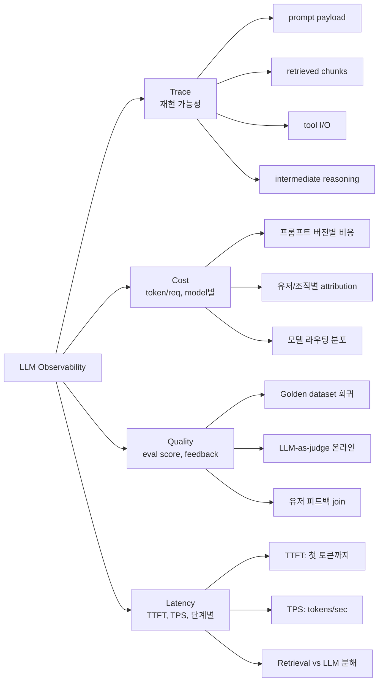

### AI Observability — "우리 DataDog 이미 붙어있는데 뭘 또?"라는 백엔드 팀의 방어벽, 그리고 첫 hallucination 회고 미팅에서 그 방어벽이 조용히 무너지는 이유

**시나리오.** 금요일 오후, CS팀에서 티켓이 튄다. "고객이 존재하지 않는 환불 정책 조항을 챗봇이 인용했다." 백엔드 리드가 Grafana를 연다. p99 latency 정상, 5xx 0%, GPT-4o 호출 성공률 100%. 로그를 판다 — 요청 ID로 검색하니 `POST /v1/chat 200 OK 1832ms` 한 줄만 나온다. 프롬프트는 없다. 응답도 없다. 컨텍스트로 넘긴 문서 chunk 5개도 없다. Retrieval 점수도 없다. Rerank 결과도 없다. 회의실에서 리드는 이렇게 말한다. "재현이 안 됩니다."

이게 LLM Observability가 없는 상태에서 프로덕션 LLM 앱을 운영한다는 뜻이다. 3개월 전 그가 "DataDog에 이미 다 보내는데 굳이 LangSmith를 붙일 필요가 있나?"라고 말했던 그 방어벽이 이 회의실에서 붕괴한다.

---

#### 1. 왜 기존 APM이 LLM 앱에서는 눈뜬 장님인가

기존 관측 스택(Prometheus + Grafana + DataDog + Sentry)은 **결정론적 시스템**을 전제로 설계됐다. 같은 입력 → 같은 출력. Latency가 튀거나 5xx가 나거나 CPU가 튀면 그게 곧 사고다.

LLM 앱은 이 전제가 다 깨진다.

| 관측 항목 | 결정론적 서비스 | LLM 앱 |
|---|---|---|
| 성공 신호 | HTTP 200 | 200이어도 hallucination이면 실패 |
| 재현 | 요청 replay | temperature > 0이면 재현 불가, 프롬프트 payload 없으면 아예 불가 |
| SLO | p99 latency, error rate | latency + **정답률 + hallucination rate + cost/req** |
| 알람 조건 | error rate spike | eval score 하락, 특정 topic에서 refusal 증가 |
| 원인 분석 | stack trace | prompt + retrieved chunks + tool calls + intermediate reasoning |

핵심 문장: **"LLM 앱에서 200 OK는 성공이 아니라 관측의 시작점이다."**

기존 APM은 이 관측의 시작점 이후를 하나도 모른다. Trace 하나에 담아야 할 정보가 근본적으로 다르기 때문이다.

---

#### 2. LLM Trace가 기존 Distributed Trace와 다른 이유

기존 OpenTelemetry trace tree는 "어느 서비스가 느렸나"를 본다. LLM trace tree는 "**에이전트가 어떻게 생각했나**"를 본다. 노드의 의미가 다르다.

```
[User Query] "환불 언제까지 가능해?"
│
├─ [Retrieval Span]                    ← chunk 8개 + BM25/vector score
│   ├─ vector_search(k=20) 45ms
│   ├─ bm25_search(k=20)  12ms
│   └─ rerank(cross-encoder) 180ms      ← top 5로 축소
│
├─ [LLM Call: intent_classifier]        ← 프롬프트 v3.2, gpt-4o-mini
│   ├─ input_tokens: 412
│   ├─ output_tokens: 8
│   ├─ cost: $0.00021
│   └─ output: "refund_policy_query"
│
├─ [Tool Call: get_user_purchase_date] 320ms
│   └─ result: "2026-07-30"
│
├─ [LLM Call: main_answer]              ← 프롬프트 v7.1, claude-sonnet-4-6
│   ├─ input_tokens: 3,204              ← 시스템 프롬프트 + 5 chunk + 대화이력
│   ├─ output_tokens: 187
│   ├─ cost: $0.00842
│   ├─ TTFT: 640ms
│   └─ output: "구매일로부터 14일 이내..."
│
└─ [Eval Span]                           ← 오프라인/온라인 평가
    ├─ groundedness: 0.42  ⚠️            ← 근거 없이 답변한 신호
    ├─ helpfulness: 0.88
    └─ user_feedback: 👎 (t+42s)
```

이 tree를 DataDog span으로 억지로 밀어넣을 수는 있다. 하지만 세 가지가 안 된다.

1. **프롬프트/응답 payload 저장**. APM은 span attribute를 짧게 잡는다. 8KB 시스템 프롬프트 넣으면 인덱싱 비용이 폭발한다.
2. **Token/cost 집계**. Grafana에서 "지난 24시간 프롬프트 v7.1의 평균 cost/req"를 뽑으려면 별도 파이프라인이 필요하다.
3. **Eval 연결**. 오프라인 eval, LLM-as-a-judge, 유저 피드백(👍/👎)을 같은 trace ID로 join하는 건 APM의 데이터 모델과 근본적으로 안 맞다.

---

#### 3. LLM Observability의 4개 축

LangSmith든 LangFuse든 Arize Phoenix든, 다 이 4축을 묶는 걸 목표로 한다.



기존 APM은 오른쪽 아래 E(Latency)만 어정쩡하게 커버한다. 나머지 셋은 관측 도구가 아니라 **회귀 테스트 인프라**에 가깝다. 이 지점에서 백엔드 팀의 인식이 갈린다 — "이건 QA 문제 아냐?" vs "이건 프로덕션 관측 문제야."

정답은 후자다. 왜냐하면 LLM 앱에서 품질 저하는 **배포 없이도 발생**하기 때문이다. OpenAI가 조용히 모델 behavior를 튜닝해도, 인덱싱된 문서가 업데이트돼도, 유저 질문 분포가 바뀌어도 품질은 떨어진다. 배포 이벤트 없이 회귀가 일어나는 시스템은 **런타임 관측으로만 잡힌다**.

---

#### 4. LangSmith vs LangFuse vs Arize Phoenix — 뭐가 다른가

세 제품이 자주 언급되지만 성격이 완전히 다르다.

| 축 | LangSmith | LangFuse | Arize Phoenix |
|---|---|---|---|
| 라이선스 | Proprietary (SaaS 우선) | OSS (MIT) + Cloud | OSS + Cloud |
| Self-host | 유료 Enterprise만 | 무료로 가능 | 무료로 가능 |
| 뿌리 | LangChain 팀 | 독립 스타트업 | Arize (전통 ML 관측) |
| 통합 | LangChain/LangGraph 1급 시민 | SDK 프레임워크 중립 | OpenTelemetry 표준 지향 |
| Eval | 강력한 dataset 관리 + LLM-as-judge | Eval + Prompt playground | Eval + ML drift 감지 |
| 강점 | UX, LangChain 생태계 통합 | 자유롭게 self-host, PII 통제 | OTel 표준, ML/LLM 통합 관측 |
| 약점 | 벤더 락인, 클로즈드 백엔드 | UX가 LangSmith만큼 세련되진 않음 | LLM 특화 기능은 후발 |

핵심 선택 기준은 세 가지다.

- **PII/규제**: 금융/의료라면 프롬프트에 개인정보가 흐른다. SaaS로 원본을 밖에 보낼 수 없다면 LangFuse self-host 또는 Phoenix.
- **스택 동조**: LangChain/LangGraph를 이미 쓰면 LangSmith가 압도적으로 편하다. 안 쓰면 굳이 갈 이유 없다.
- **기존 관측 스택과의 결합**: OpenTelemetry 표준으로 통합하려면 Phoenix가 자연스럽다. 반대로 완전히 별도 대시보드로 두고 싶으면 LangSmith/LangFuse.

---

#### 5. 실제 사례로 보는 선택 논리

**Notion AI — LangSmith.** LangChain 기반 파이프라인 위에서 프롬프트 실험이 잦다. Eval dataset 관리와 A/B 테스트 UX가 결정적이었다. SaaS로 프롬프트가 나가는 리스크는 "기업 문서 원본이 아니라 요약/질문만"이라는 제약으로 완화한다.

**Klarna — 내부 도구 + Arize.** 결제 데이터의 규제 요구가 강해 프롬프트 원문을 벤더에 보낼 수 없다. Arize Phoenix + OTel을 자사 스택에 통합해 기존 관측 파이프라인(Prometheus/Kafka)과 연결했다.

**국내 금융/보험 스타트업 다수 — LangFuse self-host.** 이유가 매우 단순하다. "고객 개인정보가 프롬프트에 섞여 나간다"는 컴플라이언스 리뷰를 통과할 수 없어서. Docker Compose로 사내 VPC에 띄우고 Postgres 백엔드로 운영한다. Eval 자동화는 자체 CI에 붙인다.

**Perplexity — 자체 관측 스택.** 초당 수만 쿼리 규모에서 SaaS 관측 벤더의 QPS 한계를 넘긴다. ClickHouse 기반으로 자체 구축했다. 이건 규모가 어느 선을 넘으면 벤더가 병목이 된다는 신호다 — 대부분의 팀에겐 해당 없음.

**Anthropic 자체 프로덕트(Claude Code 포함) — 사내 관측 인프라.** LLM 회사가 외부 관측 SaaS를 쓸 수는 없다. 이건 참고 사례일 뿐 벤치마크는 아니다.

---

#### 6. 백엔드 시니어가 놓치는 3가지 함정

**함정 1: "샘플링하면 되지 않나?"**
전통 APM에선 100% trace 저장이 비싸서 10% 샘플링한다. LLM에선 이게 매우 위험하다. Hallucination은 tail이다. 유저 신고 → trace ID로 회수 → "샘플링돼서 없어요"가 반복된다. **저장 정책은 100% 원본 + 파생 지표 downsampling**이 실무 정답이다. 대신 payload 압축(gzip)과 30/60/90일 TTL로 비용을 다스린다.

**함정 2: "eval은 배포 전에만 돌리면 되지"**
이게 CI에서 통과한 프롬프트가 프로덕션에서 무너지는 이유다. **온라인 eval(LLM-as-judge를 프로덕션 트래픽 일부에 실시간 적용)**을 붙여야 회귀를 잡는다. 이건 관측 도구의 기능이다 — LangSmith/LangFuse는 이걸 `session_id`로 자동 스코어링해준다.

**함정 3: "PII는 로깅 안 하면 되지"**
프롬프트에서 PII를 지우면 trace의 재현 가치가 사라진다. 대신 **PII 마스킹 파이프라인을 관측 SDK 앞단에 붙이고, 원본은 저장하지 않되 해시 + 카테고리 태그로 재현 힌트만 남긴다**. 이 균형점을 잡는 게 관측 아키텍처의 핵심 설계 결정이다.

---

#### 7. 언제 도입해야 하는가, 언제 미뤄도 되는가

**써야 하는 경우**
- LLM이 유저 트래픽을 처리한다 (내부 도구여도 신뢰 회복 비용이 크면 포함).
- 프롬프트를 주 1회 이상 수정한다.
- Retrieval, tool use, multi-step agent 등 **파이프라인 depth ≥ 2**.
- 회귀를 잡기 위해 CS 티켓 원본을 재현해야 한다.
- Cost가 월 $1k를 넘어 attribution이 필요하다.

**미뤄도 되는 경우**
- 단일 프롬프트, 단일 모델 호출로 끝나는 POC 단계.
- 트래픽이 하루 100 req 미만 — DB 한 테이블에 프롬프트/응답/피드백을 그냥 붙여도 된다.
- 사내 데모용, 유저가 개발자 본인들뿐인 단계. 이 단계에 LangSmith 붙이는 건 오버 엔지니어링이다.

**시니어의 판단 프레임**: 관측 도구 도입 결정은 **"내가 어제 배포한 프롬프트가 지금 잘 돌아가고 있는지 5분 안에 대답할 수 있는가?"** 이 질문에 "아니오"라면 붙일 때가 된 것이다. LLM 앱은 관측 도구 없이는 프로덕션 코드가 아니라 계속 데모다.

---

#### 8. 아키텍처 관점의 결론

LLM Observability는 **APM의 확장이 아니라 별도 레이어**다. 기존 스택과 통합하지 말라는 뜻이 아니라, 데이터 모델·저장 정책·알람 조건이 근본적으로 달라서 별도로 설계해야 한다는 뜻이다.

실무 아키텍처는 대체로 이 조합으로 수렴한다.

- **인프라 지표**(CPU, latency, error rate) → 기존 APM(DataDog/Grafana) 유지.
- **LLM trace + payload + eval** → LangSmith/LangFuse/Phoenix.
- **비용/token 회계** → 관측 도구의 export를 BigQuery/Snowflake에 밀어넣고 재무 대시보드에서 다룸.
- **Alert 라우팅**은 통합 — 관측 도구의 webhook을 PagerDuty로 흘려 기존 온콜과 이어지게.

이 분리를 받아들이지 않으면, 조직은 두 가지 중 하나로 간다. (a) 기존 APM에 억지로 우겨넣다가 프롬프트 payload가 인덱싱을 태우고 대시보드가 쓸 수 없게 되거나, (b) 관측 자체를 포기하고 "어제 CS 티켓 재현 불가" 상태로 계속 운영하거나. 둘 다 3개월이면 회고 회의실이 열린다.

> 💡 **왜 중요한가**: LLM 앱에서 200 OK는 성공이 아니라 관측의 시작점이며, 이 시작점 이후를 볼 도구가 없으면 프로덕션 사고는 재현 불가능한 유령으로만 남는다.
