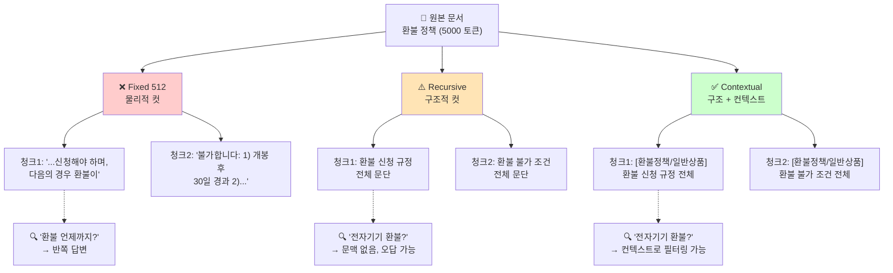

### Chunking 전략 — "일단 512 토큰씩 자르자"는 게으름, 그리고 청크 경계가 새벽 3시 CS 티켓의 오답을 만드는 방식

RAG를 처음 붙일 때 팀이 가장 마지막으로 튜닝하는 게 청킹이다. "임베딩 모델 뭐 쓸까", "Pinecone 갈까 pgvector 갈까", "top-k 몇으로 할까"에 시간을 다 쓰고, 청킹은 `RecursiveCharacterTextSplitter(chunk_size=512, chunk_overlap=50)` 한 줄로 끝난다.

그리고 프로덕션에 나간 지 2주 뒤, CS 팀이 "환불 정책 물었는데 배송 정책이 답으로 나온다"고 티켓을 올린다. 답변을 열어보면 hallucination이 아니다. 진짜로 배송 정책 청크가 top-1으로 검색됐다. 왜?

청크 경계가 잘못 그어져 있기 때문이다. 512 토큰이라는 마법의 숫자는, 문서 저자가 아니라 GPT-3의 컨텍스트 창을 기준으로 만들어진 관행이다.

---

#### 다섯 가지 청킹 전략의 스펙트럼

```
[정보 손실 큼]                                                    [정보 보존 큼]
     ↑                                                                    ↑
Fixed-size  →  Recursive  →  Semantic  →  Late Chunking  →  Contextual
(단순)         (구조 인식)     (의미 인식)     (임베딩 후 분할)    (LLM으로 컨텍스트 주입)
[비용 낮음]                                                    [비용 높음]
```

각 전략을 하나씩 뜯어보자.

---

#### 1. Fixed-size Chunking — "512 토큰씩 자른다"

```python
chunks = [text[i:i+512] for i in range(0, len(text), 512-50)]  # 50 오버랩
```

**문제**: 문장 중간, 코드 블록 중간, 표 중간에서 잘린다.

```
청크 A: "...환불은 구매일로부터 14일 이내에 신청해야 하며, 다음의 경우 환불이"
청크 B: "불가합니다: 1) 개봉 후 30일 경과 2) 소프트웨어 라이선스 활성화 이후..."
```

유저가 "환불 언제까지 가능?"이라고 물으면 청크 A가 검색되고, "환불 안 되는 경우?"라고 물으면 청크 B가 검색된다. 근데 둘은 원래 **하나의 규정**이었다. LLM은 반쪽짜리 컨텍스트로 답하고, 답변은 절반만 맞다.

**언제 쓰나**: FAQ처럼 각 항목이 짧고 독립적일 때. 그 외에는 쓰지 마라.

---

#### 2. Recursive Chunking — "문단 → 문장 → 토큰 순으로 자른다"

LangChain의 `RecursiveCharacterTextSplitter`가 이걸 한다. `["\n\n", "\n", ". ", " "]` 순서로 분할을 시도하고, 각 청크가 목표 크기 아래로 떨어질 때까지 재귀적으로 자른다.

**개선점**: 문단 경계를 최대한 존중한다.
**한계**: 여전히 "의미"를 모른다. 두 문단이 같은 주제여도 물리적으로 분리된다.

**언제 쓰나**: 대부분의 실무 문서(Markdown, 기술 문서, 위키). 코드 문서라면 `Language.PYTHON` 같은 언어별 분리자를 반드시 지정해라 — 함수 중간에서 안 잘린다.

---

#### 3. Semantic Chunking — "임베딩 거리로 자른다"

각 문장을 임베딩한 뒤, **인접 문장 간 코사인 유사도**가 급락하는 지점을 청크 경계로 삼는다. 주제가 바뀌는 지점을 자동으로 감지하는 셈이다.

```
문장1 ─┐ (유사도 0.92)
문장2 ─┤ (유사도 0.89)  → 같은 청크
문장3 ─┤ (유사도 0.41)  ← 여기서 컷! (주제 전환)
문장4 ─┘ (유사도 0.88)  → 새 청크 시작
```

**트레이드오프**:
- ✅ 주제 경계를 정확히 잡는다
- ❌ 청크 크기가 들쭉날쭉해진다 (한 청크가 3000 토큰이 될 수도)
- ❌ 임베딩 API 호출 비용이 문서 인덱싱 단계에서 3~5배 증가
- ❌ Threshold 튜닝이 도메인마다 다름 (법률 vs 마케팅 vs 코드)

**언제 쓰나**: 문서 구조가 없는 회의록, 인터뷰 녹취록, 긴 에세이. 이미 헤딩이 잘 잡힌 기술 문서에는 오버킬.

---

#### 4. Late Chunking — "먼저 임베딩하고 나중에 자른다" (Jina AI, 2024)

이게 시니어 관점에서 가장 흥미로운 접근이다. 순서가 뒤집혔다.

**기존 순서**:
```
문서 → [청킹] → 각 청크 임베딩 → 벡터 저장
```

**Late Chunking**:
```
문서 전체 → [long-context 임베딩 모델] → 토큰별 임베딩 벡터 → [나중에 청킹] → 청크별 pooling
```

핵심 아이디어: 임베딩 모델이 **전체 문서의 컨텍스트를 본 뒤** 각 토큰을 임베딩한다. 그다음에 청크로 나눠서 pooling한다. 그래서 "이것은"이라는 대명사도 앞 문장의 주어를 알고 임베딩된다.

**전제 조건**: Jina Embeddings v3, Nomic Embed 같은 8K+ 컨텍스트 임베딩 모델이 있어야 함. text-embedding-ada-002(8K 지원하지만 정보 손실 큼)로는 어렵다.

---

#### 5. Contextual Retrieval — "각 청크에 문서 요약을 prepend한다" (Anthropic, 2024-09)

Anthropic이 자사 블로그에서 공개한 기법이다. 매우 단순하지만 실전에서 강력하다.

```
[원본 청크]
"14일 이내 신청 가능하며, 개봉 시 환불 불가"

    ↓ Claude Haiku로 컨텍스트 생성 ↓

[Contextual 청크]  
"이 문서는 XYZ 쇼핑몰의 환불 정책 페이지이며,
 이 청크는 일반 상품(전자기기 제외)의 환불 조건을 다룬다.
 14일 이내 신청 가능하며, 개봉 시 환불 불가"
```

각 청크마다 Claude Haiku를 한 번씩 호출해서 "이 청크가 어떤 문서의 어떤 부분인지" 컨텍스트 요약을 앞에 붙인다. 그 다음 임베딩.

**Anthropic 벤치마크**: 
- Retrieval 실패율: 5.7% → 1.9% (Contextual + BM25 + Reranking 조합)
- 즉, 문서 인덱싱 시점에 LLM을 한 번 더 태우는 비용이 검색 품질을 획기적으로 올린다

**비용**: 프롬프트 캐싱을 쓰면 문서당 $1/백만 토큰 수준. 100만 청크면 $100. 검색 정확도 대비 싸다.

---

#### 다이어그램: 청크 경계가 답변 품질을 결정하는 방식



---

#### 실제 사례 — 각 회사가 왜 그 전략을 택했나

**Anthropic (Claude Docs)**: Contextual Retrieval. 자사 기술이라는 이유도 있지만, 기술 문서 특성상 "이 API는 어느 버전의 어느 기능"이라는 메타 컨텍스트가 결정적이다. 청크만 보면 "max_tokens는 4096이 기본"이라는 문장이 Claude 2인지 Claude 4.7인지 모른다.

**Notion AI**: Recursive + 페이지 메타데이터. 노션의 페이지 구조 자체(제목 → 헤딩 → 블록)가 이미 chunking을 해두고 있다. 별도 semantic chunking 없이도 사용자 자신이 만든 계층이 청크 경계 역할을 한다.

**Perplexity**: 문서 유형별 하이브리드. 웹 페이지는 Recursive, PDF 논문은 섹션 기반, 코드는 언어별 AST 기반. "한 가지 전략으로 다 되지 않는다"는 게 그들의 공개된 입장.

**GitHub Copilot Chat (@workspace)**: 코드 파일은 AST 기반 청킹(함수/클래스 단위). 이유는 명확 — 함수 중간에서 잘린 청크는 컴파일도 안 되고 LLM이 완전히 잘못된 코드를 생성한다.

---

#### 시니어 관점의 의사결정 트리

```
Q1. 문서가 이미 구조화되어 있나? (헤딩, 섹션)
   ├─ Yes → Recursive Chunking (기본값)
   └─ No  → Q2

Q2. 문서가 길고(>10K) 대명사/참조가 많은가?
   ├─ Yes → Contextual Retrieval 또는 Late Chunking
   └─ No  → Q3

Q3. 검색 정확도가 매출/컴플라이언스에 직결되나?
   ├─ Yes → Contextual Retrieval (돈으로 정확도 산다)
   └─ No  → Recursive면 충분
```

**언제 쓰지 말아야 하나**:
- **Semantic Chunking**: 문서량이 하루 10만 페이지 넘게 증가할 때. 임베딩 비용이 폭발한다.
- **Late Chunking**: 임베딩 모델이 8K 미만이거나, 문서가 컨텍스트 창을 넘길 때. 전제가 깨진다.
- **Contextual Retrieval**: 문서가 자주 바뀔 때(하루 여러 번 업데이트). 매번 재인덱싱하며 Haiku 호출 비용이 누적된다.

---

#### 놓치기 쉬운 함정

1. **Chunk overlap = 15%가 국룰?** — 문서 유형에 따라 다르다. FAQ는 0%, 학술 논문은 30%가 나을 때도 있다. "국룰"이라는 말이 나오면 벤치마크가 없다는 뜻.

2. **청크 크기 = 임베딩 모델의 컨텍스트 창** — 아니다. `text-embedding-3-large`가 8191 토큰까지 받는다고 8000 토큰짜리 청크를 만들면, LLM에 넘길 때 top-3만 넣어도 24000 토큰이다. LLM 비용이 5배로 뛴다. 청크 크기는 **retrieval 정확도와 LLM 컨텍스트 비용의 균형점**이다.

3. **한 번 청킹하면 끝?** — 사용자 쿼리 유형에 따라 여러 청킹을 유지하는 팀도 있다 (Hierarchical Retrieval). "요약 질문" → 큰 청크, "구체적 사실 질문" → 작은 청크. 인프라 복잡도가 두 배가 되지만, 정확도가 필요한 도메인에선 감수한다.

---

> 💡 **왜 중요한가**: RAG의 정확도는 임베딩 모델보다 청킹 전략에서 더 크게 갈리며, 잘못 그어진 청크 경계는 top-k나 reranker로도 복구되지 않는다.
