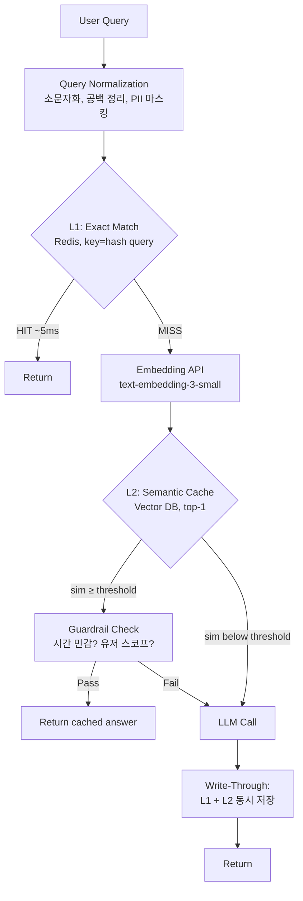

### Semantic Cache — "같은 질문이면 캐시 히트"라는 낙관, 그리고 0.87 유사도가 새벽 3시 결제 정책 답변을 뒤바꾸는 방식

#### 0. 이 글의 도발적 전제

LLM 앞단에 캐시 붙이는 건 백엔드 개발자에게 너무 자연스럽다. Redis 15년 써왔는데 뭐가 어렵겠나. 그런데 실제로 붙여보면 5분 안에 깨닫는다.

- `"환불 되나요?"` → 캐시 미스
- `"환불 가능한가요?"` → 캐시 미스
- `"환불 어떻게 해요?"` → 캐시 미스

Redis의 문자열 키는 자연어 앞에서 무력하다. **의미가 같은데 문자열이 다르면 캐시가 안 먹는다.** 그래서 등장한 게 Semantic Cache — "질문을 임베딩해서 벡터 유사도로 캐시 조회하자"는 발상이다.

그런데 이게 조용히 프로덕션을 태워먹는다. 그 방식이 오늘의 주제다.

---

#### 1. Semantic Cache가 하는 일

한 줄로 요약하면:

> **질문 텍스트를 임베딩해서, Vector DB에서 유사도가 임계값을 넘는 과거 질문의 답변을 반환한다.**

```
[User] "환불 어떻게 해요?"
   │
   ▼
[Embedding Model]  →  [0.12, -0.44, 0.88, ...]  (768~1536 차원)
   │
   ▼
[Vector DB Query: top-1 with cosine similarity]
   │
   ├─ similarity ≥ 0.95 → 캐시 HIT → 즉시 반환 (10ms, $0)
   │
   └─ similarity < 0.95 → 캐시 MISS → LLM 호출 (1800ms, $0.02)
                                ↓
                        [Store: Vector DB에 질문+답변 저장]
```

효과는 극적이다. FAQ 성격의 쿼리가 70% 이상인 서비스라면:
- **비용**: 월 $10,000 → 월 $2,000 (80% 절감)
- **레이턴시**: p50 1,800ms → 15ms
- **Rate Limit**: OpenAI 429 걱정 사라짐

여기까지 보면 "당장 붙여야지" 싶다. 문제는 여기서부터다.

---

#### 2. 3-Tier 캐시 아키텍처 (실무에서 실제 이렇게 씀)

Semantic Cache만 딸랑 붙이는 팀은 없다. 프로덕션은 이렇게 생겼다.



**핵심은 L1과 L2의 분리다.** Exact match(L1)는 embedding 비용($0.00002)조차 아까울 때 필요하다. "환불 어떻게 해요?"가 하루 5만 번 들어온다면 L1 hit로 처리해야지, 매번 임베딩 API 때리는 건 낭비다.

- **L1 (Redis Exact Match)**: latency 5ms, hit ratio ~30%
- **L2 (Vector Semantic Match)**: latency 30~80ms (embedding + vector search), hit ratio ~40%
- **L3 (LLM Fallback)**: latency 1500~3000ms, hit ratio ~30%

이제 이 아키텍처가 왜 조용히 무너지는지 볼 차례다.

---

#### 3. 임계값(Threshold) — 0.01 차이가 만드는 지옥

Semantic Cache의 유일하고 가장 위험한 파라미터가 코사인 유사도 임계값이다.

| Threshold | Hit Rate | False Positive Risk | 실무 판단 |
|-----------|----------|---------------------|----------|
| 0.99      | 5%       | 거의 없음           | 사실상 exact match와 다름없음 |
| **0.95**  | **35%**  | **낮음**            | **일반적 안전 구간** |
| 0.90      | 60%      | 중간                | FAQ에만 |
| 0.85      | 80%      | 높음                | **여기서 사고 남** |
| 0.80      | 90%      | 매우 높음           | 재앙 |

프로덕트 매니저는 "hit rate 80%면 좋은 거 아냐?"라고 묻는다. 백엔드 시니어라면 이 질문에 소름이 돋아야 한다.

**임베딩 공간에서 이런 문장쌍들이 유사도 0.85~0.90에 들어온다:**

- `"환불 가능한가요?"` vs `"환불 불가능한가요?"` → 유사도 **0.93**
- `"주문 취소해줘"` vs `"주문 취소하지 마"` → 유사도 **0.91**
- `"이 상품 재고 있어?"` vs `"이 상품 재고 없어?"` → 유사도 **0.94**

임베딩 모델은 **부정어(不, 안, no, not)에 민감하지 않다.** 문장 구조와 주제어에 훨씬 큰 가중치가 실린다. 그래서 threshold 0.90에서 캐시 히트가 나면, 사용자가 "환불 불가능한가요?"라고 물었는데 "네, 환불 가능합니다"라는 예전 답변이 나갈 수 있다.

**실제 사고 시나리오 (금융 도메인):**
> 새벽 3시. CS 봇이 "카드 사용 정지 되었나요?"라는 질문에, threshold 0.88에 걸린 "카드 사용 정지 안 되었나요?"의 캐시 답변인 "네, 정상 사용 가능합니다"를 반환. 실제로는 도난 신고로 정지된 카드였음. 사용자는 안심하고 다음날까지 대응 안 함.

이걸 예방하는 방법은 두 가지뿐이다.
1. Threshold를 0.97 이상으로 올리기 → hit rate 급감
2. **부정 표현 감지 필터**를 캐시 히트 뒤에 붙이기 (규칙 기반, 또는 작은 분류 모델)

---

#### 4. 캐시하면 안 되는 것들 — 시니어의 판단 체크리스트

Semantic Cache를 붙일 때 백엔드 시니어가 먼저 물어야 하는 것:

**❌ 캐시 금지 카테고리**

| 유형 | 예시 | 이유 |
|------|------|------|
| 실시간 상태 | "지금 재고 있어?" | 10초 뒤 답이 바뀜 |
| 개인화 데이터 | "내 주문 어디쯤?" | 유저 A의 답이 B에게 나감 (PII 유출) |
| 시간 민감 | "오늘 환율 얼마야?" | 시장 마감 후에도 옛 값 반환 |
| 정책 부정 표현 | "환불 안 되나요?" | 부정어 무시로 반대 답변 |
| 규제 도메인 | "이 약 복용해도 돼?" | 오답의 책임 소재 |

**✅ 캐시 적합 카테고리**

- 정적 FAQ: "회원가입 어떻게 해요?"
- 문서 요약: "환불 정책 알려줘" (정책 자체가 바뀌면 TTL로 대응)
- 개념 설명: "OAuth가 뭐야?"
- 반복적 코드 질문: "Python에서 파일 읽는 법"

이 판단을 **쿼리 라우팅 시점**에 해야 한다. 캐시에 넣기 전에, 이 쿼리가 캐시 가능한 종류인지 분류하는 얇은 classifier가 앞단에 필요하다. 이걸 안 하면 개인화 답변이 공용 캐시로 흘러들어간다.

---

#### 5. 캐시 스코프 — Multi-Tenancy에서 조용히 터지는 부분

B2B SaaS라면 이 부분에서 반드시 사고가 난다.

```
❌ 안티패턴: 전역 캐시
[Company A 유저 질문] → [Vector Cache] → LLM 답변 저장
                              ↓
                    [Company B 유저 유사 질문] → HIT!
                              ↓
                    Company A의 내부 문서 기반 답변이 B에게 유출
```

RAG 파이프라인에서 이건 심각하다. Company A의 매출 데이터를 참조한 답변이 Company B에게 노출된다. **캐시 키는 반드시 tenant scope를 포함해야 한다.**

```
Cache Key = hash(tenant_id + user_role + query_embedding)
```

Pinecone/Weaviate에서는 이걸 **namespace** 또는 **metadata filter**로 구현한다. 벡터 검색 시 `WHERE tenant_id = 'company_a'` 조건을 필터로 걸어야 한다.

---

#### 6. TTL과 무효화 — Redis 15년 노하우가 안 통하는 이유

Redis에서 TTL은 쉽다. `EXPIRE key 3600`. 끝.

Semantic Cache는 다르다. **"환불 정책이 바뀌었을 때 관련된 모든 캐시를 무효화해야 한다"** 는 요구가 들어오는데, 여기서 문제가 생긴다.

- Redis: `DEL refund:policy:v1` → 하나의 키 삭제
- Semantic Cache: "환불"에 관련된 벡터가 100개인데 어떻게 골라내지?

**실무 대응 3가지:**

1. **TTL을 짧게** (1~24시간) — 가장 단순, 대신 hit rate 하락
2. **메타데이터 태깅** — 저장 시 `{"topic": "refund", "version": "v3"}` 태그 → 정책 변경 시 태그 기반 벌크 삭제
3. **Content-Based Invalidation** — 원본 문서가 바뀌면, 그 문서를 참조한 답변들을 역인덱스로 추적해 삭제

프로덕션에선 대부분 2번 + 짧은 TTL 조합이다. 3번은 이론상 우아하지만 유지비가 너무 든다.

---

#### 7. 실제 사례 — 누가 왜 이걸 쓰는가

**GPTCache (Zilliz 발, 오픈소스)**
- Milvus/Zilliz 팀이 만든 대표 라이브러리
- LangChain에 통합되어 있어 진입장벽 낮음
- 문제: 기본 설정(threshold 0.8)이 너무 공격적. 대부분 팀이 프로덕션 붙이고 3주 만에 CS 폭탄 맞고 threshold 올림

**Portkey Gateway**
- LLM Gateway에 semantic cache가 내장 (이전에 다룬 LLM Gateway 패턴과 결합)
- Gateway 레벨에서 캐시를 하니 모든 서비스가 자동으로 캐시 혜택
- Enterprise에서 인기: A 서비스의 캐시를 B 서비스가 재활용

**Anthropic Prompt Caching (내장 캐시)**
- 이건 semantic cache가 아니라 **exact prefix cache**임에 주의
- 시스템 프롬프트/문서를 5분간 서버 측에 캐시 → 입력 비용 90% 절감
- 의미 기반이 아니라 **문자열 prefix 기반**이라 false positive 없음
- 실무에선 이 둘을 조합: Anthropic 내장 캐시(안전) + 앱 레벨 semantic cache(공격적)

**Perplexity, You.com 같은 검색 계열**
- 인기 쿼리("오늘 날씨", "환율")는 캐시 안 함
- 롱테일 지식 쿼리("리튬이온 배터리 원리")는 공격적으로 캐시
- 이 판단이 **쿼리 분류기**로 앞단에서 이뤄짐

**핀테크/헬스케어**
- 대부분 semantic cache를 안 쓴다. 부정 표현 리스크와 규제 대응 비용이 캐시 절감액보다 큼
- 쓰더라도 **문서 요약** 같은 명백히 안전한 use case에만 국한

---

#### 8. 트레이드오프 정리

| 축 | 얻는 것 | 잃는 것 |
|----|---------|---------|
| **비용** | LLM 호출 70~80% 감소 | Embedding API 비용 + Vector DB 인프라 |
| **레이턴시** | p50 1800ms → 15ms | Cache miss 시 embedding 오버헤드(+50ms) |
| **일관성** | 같은 질문에 항상 같은 답 (재현성↑) | 정책 변경 반영 지연 |
| **UX** | 즉시 응답 | 스트리밍(타이핑 효과)이 캐시에선 어색함 → 인위적 딜레이 추가 필요 |
| **정확성** | (Hit 시) 검증된 답변 재사용 | False positive 시 완전히 잘못된 답변 |
| **운영** | LLM Rate limit 회피 | Threshold 튜닝, 캐시 무효화 정책 유지 필요 |

---

#### 9. 백엔드 시니어의 판단 프레임

**✅ Semantic Cache 도입 판단 기준:**
1. 쿼리 볼륨이 하루 10만 건 이상 (그 이하는 ROI 안 나옴)
2. Top 20% 쿼리가 전체의 60% 이상을 차지 (Pareto 확인)
3. 도메인이 정적 지식 기반 (기술 문서, FAQ, 튜토리얼)
4. False positive 발생 시 롤백 가능한 도메인 (금융/의료 아님)
5. 부정 표현 감지 + tenant isolation을 구현할 리소스 있음

**❌ 도입 미루기:**
1. MVP 단계 — 트래픽 패턴부터 파악
2. 개인화 답변이 주력인 서비스 (My Data, Assistant)
3. 규제 산업 — 캐시 히트의 책임 소재 불분명
4. Streaming UX가 브랜드 정체성인 서비스 (ChatGPT 같은 느낌)

---

#### 10. 요약 — Semantic Cache는 "빠르고 싼 캐시"가 아니라 "확률적 정답 반환기"다

Redis 캐시는 결정론적이다. 같은 키면 같은 값, 끝. Semantic Cache는 다르다. **"이 정도면 같은 질문이라고 봐도 되겠지"라는 확률적 판단**을 매 요청마다 내리는 시스템이다.

이 차이를 이해하지 못한 팀이 threshold 0.85로 프로덕션에 올리고, 3개월 뒤 CS 티켓 회고에서 "왜 봇이 반대 답변을 했지?"를 조사하다 진실을 마주한다.

**시니어 관점의 정리:**
- Semantic Cache는 **캐시 계층이 아니라 검색 계층에 가깝다.** Vector Search를 앞단에 붙인 것과 아키텍처적으로 동일하다.
- 그래서 [[hybrid-search]]에서 다룬 정확도-리콜 트레이드오프가 그대로 재현된다.
- Threshold는 SLO다. 비즈니스 팀과 합의해서 "false positive를 몇 %까지 감내할 수 있나"를 정한 뒤 결정해야 한다.
- 무엇보다 — **캐시 히트도 관측하라.** L2 hit인 답변에는 반드시 `X-Cache: SEMANTIC-HIT, similarity=0.92` 헤더를 남겨서 사고 났을 때 재현 가능하게 해야 한다.

> 💡 **왜 중요한가**: Semantic Cache는 LLM 비용을 80% 줄이는 유일하게 검증된 무기지만, 결정론적 캐시라는 착각으로 도입하면 부정 표현 하나에 반대 답변을 반환하는 확률적 폭탄이 된다.
