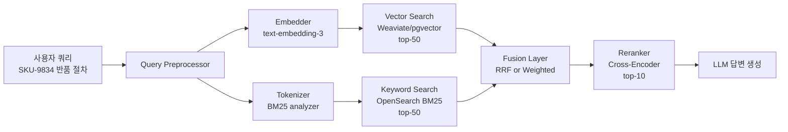

### Hybrid Search — "Vector Search면 다 된다"는 신뢰, 그리고 상품 코드 `SKU-9834`가 top-100에도 안 뜨는 이유

새벽 2시, CS 팀에서 슬랙이 온다.

> "고객이 'SKU-9834 반품 절차' 물어봤는데 챗봇이 엉뚱한 정책 문서를 요약해서 답했어요. 우리 시스템에 그 SKU 매뉴얼 분명히 있잖아요?"

너는 로그를 연다. Vector Search top-10을 확인한다. `SKU-9834` 매뉴얼은 **top-100에도 없다**. 코사인 유사도 0.71~0.78 사이에 "반품 관련" 문서 수십 개가 몰려 있고, 정작 정답 문서는 0.62다. 임베딩 모델은 `SKU-9834`를 그냥 "어떤 식별자"로 뭉개버렸다. `SKU-9834`, `SKU-1234`, `SKU-9843` 모두 임베딩 공간에서 거의 같은 벡터가 된다.

이게 Vector-only Search의 근본적 실패 모드다. **의미는 잘 잡지만, 정확히 그 문자열을 찾는 건 못한다.**

---

#### 1. Vector Search 단일 실패의 4가지 얼굴

| 실패 유형 | 예시 쿼리 | 왜 실패하는가 |
|---|---|---|
| **정확 식별자(Exact ID)** | `SKU-9834 반품`, `주문번호 20260825-A9F2` | 임베딩 모델은 자릿수/문자 조합을 semantic으로 인식 못 함 |
| **희귀 고유명사** | `대교출판 학습지 재이 캐릭터` | 사전학습 데이터에 거의 없어 임베딩 quality 낮음 |
| **부정어(Negation)** | `PC로는 불가능한 결제 수단` | 임베딩은 "결제 수단"에만 반응, "불가능"을 놓침 |
| **최신 용어** | `2026년 8월 개편된 마일리지 규정` | 임베딩 모델 학습 시점 이후 용어는 semantic 대응 불가 |

Keyword Search(BM25)는 이 네 가지 중 **1, 2, 4번**을 정확히 잘한다. 왜냐면 BM25는 "의미"가 아니라 "이 정확한 토큰이 얼마나 희귀하게 이 문서에만 있느냐"를 본다. `SKU-9834`처럼 IDF가 극도로 높은 토큰은 BM25가 압도적으로 잘 찾는다.

문제는 반대다. BM25는 "환불 정책"과 "취소 규정"이 같은 뜻이란 걸 절대 모른다.

**둘은 반대 방향으로 실패한다. 그래서 합친다.**

---

#### 2. Hybrid Search 아키텍처



핵심은 **두 검색이 병렬로 나가고**, **Fusion Layer가 순위를 합치고**, 그다음 Reranker가 최종 필터링을 한다는 것. 세 단계 모두 필요한 이유가 있다.

---

#### 3. Fusion 전략 — RRF vs Weighted Score, 시니어의 선택

두 검색 엔진이 뱉는 점수는 **스케일이 완전히 다르다.**

- Vector: 0.0 ~ 1.0 (cosine similarity)
- BM25: 0.0 ~ ∞ (IDF · TF 곱, 도메인마다 편차 큼)

이걸 그냥 `0.5*vec + 0.5*bm25`로 더하면 어느 한쪽이 항상 지배한다. 그래서 실무에서는 두 가지 접근이 있다.

**(A) RRF (Reciprocal Rank Fusion)** — 점수 대신 **순위**만 쓴다.

```
score(doc) = Σ  1 / (k + rank_i(doc))
              i
k = 60 (관례적 상수)
```

Vector에서 3등, BM25에서 7등인 문서는 `1/(60+3) + 1/(60+7) = 0.0308`이 된다. 스케일 무관, 도메인 무관, 튜닝 파라미터 거의 없음. **Elasticsearch 8.9+, Weaviate, Qdrant 모두 RRF를 기본으로 밀고 있다.**

**(B) Weighted Score** — 정규화 후 가중합.

```
score(doc) = α · norm(vec_score) + (1-α) · norm(bm25_score)
```

α를 도메인에 맞게 튜닝한다 (법률 문서는 α=0.3, 챗봇 FAQ는 α=0.7 식). Eval 셋으로 α를 grid search 하는 게 정석이다.

**시니어 관점의 선택 기준:**

| 상황 | 추천 | 이유 |
|---|---|---|
| Eval 셋 없음, 도메인 여러 개 | **RRF** | 튜닝 없이 baseline이 나온다 |
| Eval 셋 있음, 단일 도메인 | **Weighted** | α를 최적화하면 RRF보다 5~10% 우위 |
| 쿼리 유형이 명확히 갈림 | **Query Router + 두 방식 혼용** | "코드성 쿼리는 BM25 가중치↑" 같은 룰 |

**RRF의 함정**: 하위 순위(50등 근처)도 영향을 준다. Vector top-50에 억지로 밀려 들어간 노이즈 문서가 최종 순위를 오염시킬 수 있다. 그래서 top-k를 20~30으로 제한하는 팀이 많다.

---

#### 4. 실제 사례 — 왜 이 회사들이 Hybrid로 넘어갔나

**Notion AI (2024)**: 초기 순수 Vector Search로 출시. 사용자 문서에 자기가 만든 코드명, 프로젝트 별칭(`Project-Falcon-v2`)이 잔뜩 있는데 검색이 안 됨. 사내 팀원 이름 검색도 실패. → OpenSearch BM25 + Vector Hybrid로 재설계, RRF fusion.

**Perplexity AI**: 웹 검색 결과와 semantic search를 결합. 사실 얘네 초기부터 Hybrid였고, 이게 ChatGPT search 대비 인용 정확도가 높은 핵심 이유. URL, 회사명, 논문 제목 같은 exact match가 압도적으로 중요한 도메인.

**LinkedIn**: 채용공고 검색에 Hybrid 도입. "Java 백엔드 시니어"는 semantic이 잘하지만 "Kafka 3.5 실무 경험"에서 "3.5" 버전 매칭은 BM25가 필요. Weighted, α는 쿼리 유형별 분기.

**Elastic 자체**: 8.9에서 `retriever` API로 RRF를 1급 시민 취급. 이유 — 고객사들이 Vector-only 도입 후 "Elastic 시절엔 잘 되던 게 안 된다"는 컴플레인을 6개월 내내 받았다.

**공통점**: 전부 **일단 Vector-only로 시작했다가, 6개월 안에 Hybrid로 회귀**했다. 예외 없이.

---

#### 5. 인프라 관점의 트레이드오프

| 관점 | Vector-only | Hybrid |
|---|---|---|
| **인프라 컴포넌트** | Vector DB 1개 | Vector DB + BM25 엔진 (OpenSearch/Elastic) |
| **인덱싱 지연** | 임베딩 계산 시간 | 임베딩 + BM25 인덱싱 (병렬 가능) |
| **쿼리 지연** | 50~100ms | 100~150ms (병렬 조회) |
| **운영 복잡도** | 단일 데이터 소스 관리 | **두 스토어의 정합성 관리 필수** |
| **비용** | Vector DB 만 | + OpenSearch 클러스터 (or Weaviate/Qdrant 내장 BM25) |
| **검색 품질(NDCG@10)** | baseline | 보통 +15~25% |

**시니어가 놓치는 함정 하나** — Vector DB와 BM25 인덱스가 **비동기로 업데이트**되면, 문서 삭제 후에도 한쪽에만 남아 있는 순간이 생긴다. 삭제된 개인정보 문서가 BM25에 30초 더 살아 있다가 검색된다. GDPR 영역이면 사고다.

→ **삭제는 반드시 Vector + BM25 tombstone 동기 처리**, 아니면 Fusion Layer에서 tombstone 필터를 최종 적용해야 한다.

---

#### 6. Weaviate/Qdrant 내장 vs 외부 조합

시니어 백엔드가 실제로 마주치는 결정:

**Option A — Weaviate/Qdrant 내장 Hybrid**
- 한 시스템으로 통합 운영
- BM25 튜닝 옵션 제한적 (analyzer, synonym filter 등)
- 500만 문서까지는 무난, 1억 넘어가면 BM25 성능이 전용 엔진 대비 밀림

**Option B — pgvector + PostgreSQL FTS**
- 이미 있는 Postgres 활용, 인프라 추가 없음
- FTS는 BM25보다 훨씬 단순 (ts_rank), 다국어 특히 한국어 형태소 분석기 약함
- 벡터 500만 넘어가면 이미 pgvector가 무릎 꿇음 (앞서 다룬 주제 참고)

**Option C — Vector DB + OpenSearch/Elastic 조합**
- BM25는 최강, 한국어 nori analyzer, synonym 그래프까지 자유
- 두 시스템 운영/모니터링 이중 부담
- Fusion Layer를 애플리케이션 코드에 직접 구현해야 함 (또는 LangChain retriever)

**대규모(1억+ 문서, 한국어 도메인) 실무 정답은 대부분 C.** 소규모 PoC는 A로 시작하고 규모 커질 때 마이그레이션 계획을 미리 세워두는 게 시니어의 판단.

---

#### 7. 언제 Hybrid를 쓰지 말아야 하나

Hybrid가 만능은 아니다. 오히려 오버킬인 케이스:

- **쿼리가 100% 자연어 대화체**: 사내 위키 요약 봇처럼 exact match가 거의 필요 없는 경우. 그냥 Vector-only + Reranker가 낫다.
- **문서가 극도로 짧음(FAQ 한 줄짜리)**: BM25는 문서 길이 정규화가 짧은 문서에 불리하게 작동, Hybrid 이득 미미.
- **비용이 지배 요인**: OpenSearch 클러스터 추가는 월 수백만 원 단위. Vector-only + Reranker 튜닝으로 대체 가능한지 먼저 확인.
- **latency SLA가 극단적(<50ms)**: 두 시스템 병렬 조회 + Fusion 오버헤드 감당 못 함. 이때는 Vector-only + 프리페치.

---

#### 8. 결정 체크리스트

새 RAG 시스템을 설계한다면 다음을 스스로 물어라:

1. 우리 쿼리에 **식별자·코드·고유명사**가 20% 넘게 섞이는가?
2. 임베딩 모델이 **한국어·도메인 특수 용어**를 잘 못 잡는가? (한국어 임베딩 quality는 여전히 영어 대비 낮다)
3. **Eval 셋**을 만들 여력이 있는가? (없으면 RRF, 있으면 Weighted)
4. Vector DB와 별개 **BM25 엔진 운영 리소스**를 감당할 수 있는가?
5. **문서 삭제 정합성**을 두 스토어에 동시 반영할 파이프라인이 있는가?

1, 2번 중 하나라도 Yes면 Hybrid 강력 권장. 4, 5번이 No면 Weaviate/Qdrant 내장 Hybrid로 타협.

> 💡 **왜 중요한가**: Vector Search만 믿으면 "의미는 통하지만 정답은 아닌" 답변이 새벽 3시에 조용히 쌓이고, Hybrid는 그중 절반을 exact match 하나로 뒤집는다.
