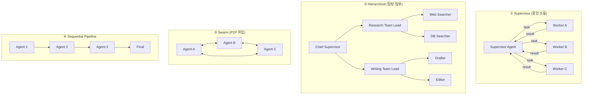

### Multi-Agent Orchestration — "Agent 여러 개 붙이면 더 똑똑해질 것"이라는 환상, 그리고 4개 Agent가 서로 무한 위임하다 새벽 4시에 $340 태우고 답 없이 죽는 방식

---

#### 1. 이 챕터가 왜 이제야 필요한가

Day 62에서 [[react-vs-plan-execute]]를 다뤘을 때 우리는 이미 배웠다. 단일 Agent도 8번째 iteration에서 조용히 예산을 태운다는 걸.

그런데 시장에는 이런 소리가 넘친다.

> "Researcher Agent + Writer Agent + Critic Agent를 붙이면 GPT-4 하나보다 훨씬 좋아요. 논문 정리 시스템 우리도 만들자."

이 발언에는 두 개의 심각한 오해가 숨어 있다.

1. **"더 많은 Agent = 더 좋은 결과"** — 실제로는 서로의 오류를 증폭시키는 경우가 더 많다.
2. **"오케스트레이션은 그냥 순서 정하는 것"** — 실제로는 분산 시스템의 모든 문제(합의, 순서 보장, 실패 격리, 예산 상한)를 한 번에 상속받는다.

Multi-Agent는 **분산 시스템 설계 문제**다. LLM 문제가 아니다. 이 관점을 놓치면 다음 장면이 그대로 재현된다.

#### 2. 실제 장애 시나리오 — CS 자동화 Multi-Agent가 무한 루프에 빠지던 날

한 이커머스 회사가 CS 챗봇을 Multi-Agent로 리팩터링했다. 구조는 이랬다.

- **IntentAgent**: 사용자 의도 분류
- **PolicyAgent**: 환불/교환 정책 조회
- **OrderAgent**: 주문 상태 조회
- **ResponseAgent**: 최종 답변 생성

Router는 "다른 Agent가 필요하면 위임하라"고 지시받았다. LangChain 튜토리얼대로.

새벽 3시 47분, "제가 어제 주문한 거 어떻게 되는 건가요?"라는 모호한 문의가 들어왔다.

```
IntentAgent → "주문 상태 조회일 수도, 환불일 수도 있음. OrderAgent 호출"
OrderAgent → "주문번호 없이는 조회 불가. IntentAgent에 재분류 요청"
IntentAgent → "PolicyAgent 호출해서 환불 정책 확인 필요"
PolicyAgent → "구체 상품 없이 정책 불가. OrderAgent에 상품 확인 요청"
OrderAgent → "주문번호 없이는... IntentAgent에..."
... (반복 117회)
```

새벽 4시 21분, 예산 알림. **$340 소진, 응답 0.** 사용자는 이미 앱을 껐다.

원인은 세 가지가 겹쳤다.
- **상태 없는 위임**: 각 Agent는 "이전에 누가 뭘 시도했는지" 몰랐다.
- **종료 조건 부재**: max_iterations를 Router 레벨에서만 걸어놨는데, 위임 트리는 그걸 우회했다.
- **책임 경계 불명확**: "정보가 부족하면 다른 Agent를 부른다"는 규칙이 사이클을 유발했다.

이건 LLM 문제가 아니다. **1990년대에 이미 풀린 분산 시스템 문제를 2026년에 다시 겪는 것**이다.

#### 3. 오케스트레이션 패턴 4가지

Multi-Agent 시스템은 조율 방식에 따라 크게 4가지로 나뉜다. 각각 성능/비용/디버깅 특성이 다르다.



##### ① Supervisor — 가장 안전한 기본값

하나의 Supervisor가 상태를 소유하고, Worker들은 순수 함수처럼 동작한다.
- Worker는 서로 대화하지 않는다. 항상 Supervisor를 통한다.
- **상태가 한 곳에 있으므로 디버깅과 재현이 쉽다.**
- 병목이 명확하다 (Supervisor 자체).

LangGraph의 `create_supervisor`가 이 패턴이다. Anthropic이 2025년 공개한 Claude Research 시스템도 근본적으로 Lead Researcher가 Sub-Agent들을 병렬 위임하는 Supervisor 구조다.

##### ② Hierarchical — Supervisor의 스케일 아웃

Worker 수가 10개를 넘어가면 단일 Supervisor의 컨텍스트가 터진다. 그래서 **팀 단위로 묶는다.** 조직도랑 똑같다.
- Chief는 팀장에게만 위임한다.
- 각 팀은 독립된 컨텍스트를 가진다.
- 대신 hop이 늘어나 지연시간과 비용이 급증한다.

Devin(Cognition Labs)의 내부 구조가 이 유형에 가깝다고 알려져 있다. "Planning Agent → Execution Agent → Verification Agent" 3단.

##### ③ Swarm — 위험한 자유

Agent들이 서로에게 직접 위임한다. OpenAI가 실험적으로 공개한 Swarm 라이브러리, 그리고 CrewAI의 일부 모드가 여기 속한다.
- **유연성 최고, 디버깅 지옥.**
- 위 CS 사례가 정확히 이 함정이다.
- 프로덕션에는 극도로 신중하게. 종료 조건과 hop 상한을 반드시 강제해야 한다.

##### ④ Sequential Pipeline — 사실 Multi-Agent가 아니다

Agent 1 → Agent 2 → Agent 3 순으로만 흐른다. 분기 없음.
- 이건 그냥 **Chain of Prompts**다. Multi-Agent라고 부르지 마라.
- 하지만 90%의 실무 케이스는 이걸로 충분하다. RAG의 "Retrieve → Rerank → Generate"가 그 예다.

#### 4. 패턴별 트레이드오프

| 패턴 | 지연시간 | 비용 | 디버깅 | 확장성 | 종료 보장 |
|---|---|---|---|---|---|
| Supervisor | 중 | 중 | ★★★★★ | ★★★ | ★★★★★ |
| Hierarchical | 높음 | 높음 | ★★★★ | ★★★★★ | ★★★★ |
| Swarm | 예측 불가 | 폭발 위험 | ★ | ★★★★ | ★ |
| Sequential | 낮음 | 낮음 | ★★★★★ | ★★ | ★★★★★ |

시니어의 90% 선택은 **Supervisor 아니면 Sequential**이다. Swarm은 연구용, Hierarchical은 정말로 다양한 도메인의 Agent 10+개가 필요할 때만.

#### 5. 프로덕션 Multi-Agent가 반드시 갖춰야 할 5가지

Anthropic의 Multi-Agent Research 시스템 엔지니어링 블로그(2025)와 실무 회고들을 종합하면, 프로덕션급 시스템은 예외 없이 다음을 강제한다.

**(1) 전역 예산 상한 (Budget Envelope)**
```
- max_total_tokens: 50_000
- max_total_cost_usd: 2.00
- max_wall_clock_sec: 30
- max_agent_hops: 8
```
어느 Agent가 얼마를 썼든 전역 상한에 걸리면 즉시 종료 후 부분 답변 반환. Supervisor 레벨에서 강제한다.

**(2) 공유 상태 저장소 (Shared Memory)**
각 Agent가 컨텍스트를 로컬로 들고 다니면 위 CS 사례처럼 "누가 뭘 시도했는지" 잊는다. Redis나 in-memory KV에 `run_id` 단위로 저장한다.

**(3) Handoff 프로토콜**
"필요하면 다른 Agent 부르세요" 같은 모호한 지시는 금지. **명시적 스키마**로 강제한다.
```json
{
  "handoff_to": "OrderAgent",
  "reason": "user query mentions order status",
  "context_hash": "sha256(...)",
  "attempted_by": ["IntentAgent"],
  "hop_count": 3
}
```
`attempted_by`에 자기 이름이 이미 있으면 위임 금지. 이 한 줄이 무한 루프의 95%를 막는다.

**(4) Trace ID 전파 (Distributed Tracing)**
OpenTelemetry 표준을 그대로 쓴다. LangSmith/LangFuse는 이걸 GenAI 시맨틱으로 감싼 것뿐이다. Agent 간 호출은 곧 RPC 호출이라는 관점을 잊지 마라.

**(5) 결정론적 재실행 (Replay)**
LLM은 비결정적이지만, `temperature=0` + `seed` + 저장된 입력이 있으면 재현 가능성이 크게 오른다. 장애 재현이 불가능한 Multi-Agent는 운영할 수 없다.

#### 6. 실제 사례 비교

| 회사/시스템 | 선택한 패턴 | 왜 |
|---|---|---|
| **Anthropic Claude Research** | Supervisor (병렬 Sub-Agent) | 검색 태스크는 병렬화 가능, 결과 취합은 Lead가 담당. 명확한 종료 조건 |
| **Devin (Cognition)** | Hierarchical (3단) | 코드 작성이라는 도메인이 Planning-Execution-Verification 분리가 자연스러움 |
| **GitHub Copilot Workspace** | Sequential + 사용자 개입 | 각 단계마다 사용자 승인. 자동화 비용/위험 최소화 |
| **CrewAI 프로덕션 사례** | Supervisor 강제 권고 | 초기 Swarm 옵션이 있었지만 무한 위임 사고 후 Supervisor를 기본값으로 |
| **AutoGen (Microsoft Research)** | GroupChat (Swarm 유사) | 연구용. 프로덕션 도입 시 Selector 커스터마이징 필수 |

한국 스타트업 사례 하나. 2025년 하반기, 어떤 리걸테크 스타트업이 "판례 검색 Agent + 법령 검색 Agent + 요약 Agent" 3개 Swarm 구조로 데모를 만들었다. 데모는 놀라웠고, 시드 투자를 받았다. 그런데 프로덕션 첫 주 AWS 요금이 예상의 8배. 회고에서 밝혀진 원인은 위 CS 사례와 판박이. 결국 Supervisor로 다시 짜서 요금이 정상화됐다. 이 이야기는 그 CTO가 여러 밋업에서 공유한 유명한 사례다.

#### 7. 언제 쓰고 언제 쓰면 안 되는가

##### ✅ Multi-Agent를 진지하게 고려할 때
- **도메인 지식이 명확히 분리**되는 경우 (예: 코드 작성 vs 코드 리뷰 vs 테스트 생성). 각 Agent가 다른 시스템 프롬프트와 다른 도구셋을 갖는다.
- **병렬화로 지연시간 이득**이 큰 경우 (예: 5개 데이터 소스 동시 검색). Anthropic Research가 이 경우다.
- 각 Agent의 **품질을 독립적으로 측정**할 수 있는 경우. Eval이 안 되면 개선도 안 된다.

##### ❌ 절대 Multi-Agent로 가지 말아야 할 때
- **단일 LLM + Tool Use로 충분한데** 유행을 따라가는 경우. GPT-4o 수준 모델이면 3-4 hop 태스크는 단일 Agent가 더 낫다.
- **상태 공유가 복잡한 태스크**. 편집 트랜잭션이 걸린 문서를 여러 Agent가 동시에 수정하는 구조 같은 것.
- **레이턴시 예산이 3초 이하**인 사용자 대면 기능. Multi-Agent는 최소 hop당 1-2초. 5 hop이면 이미 죽었다.
- **비용 예측 가능성이 SLA인 B2B 서비스**. Swarm은 상한을 걸어도 top-p 튜닝 하나로 비용 분포가 바뀐다.

#### 8. 시니어 백엔드 관점에서의 최종 프레임

Multi-Agent를 분산 시스템의 관점으로 다시 매핑하면 이해가 쉽다.

| Multi-Agent 개념 | 분산 시스템 대응 |
|---|---|
| Supervisor | Orchestrator / Saga Coordinator |
| Worker Agent | Microservice |
| Handoff | RPC + Circuit Breaker |
| Shared Memory | 분산 상태 저장소 (Redis) |
| Trace ID | Distributed Tracing (Jaeger) |
| Budget Envelope | Rate Limit + Timeout |
| Replay | Event Sourcing |

**즉, Multi-Agent 시스템 설계는 새 문제가 아니라 오래된 문제의 새 옷이다.** 20년 전 SOA에서, 10년 전 Microservices에서, 5년 전 Event Sourcing에서 이미 배운 것들이 그대로 적용된다.

기억할 한 문장.

> Multi-Agent는 **LLM의 확장이 아니라 분산 시스템의 확장**이다. LLM 튜닝으로는 안정성이 오지 않는다. **경계, 상한, 관찰가능성, 재현성** — 이 네 가지가 오케스트레이션의 실체다.

새벽 3시 CS 챗봇을 지키는 건 프롬프트 엔지니어링이 아니라 `max_agent_hops = 5` 한 줄이다.

---

> 💡 **왜 중요한가**: Multi-Agent는 성능 문제로 실패하지 않는다 — 경계 없는 위임과 상한 없는 실행이라는 아주 오래된 분산 시스템 문제 때문에 실패한다.
