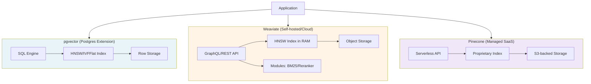

### Vector DB 선택 — "일단 pgvector로 시작하자"는 실용주의, 그리고 컬렉션이 800만 벡터를 넘긴 새벽 2시에 P99가 4.7초로 치솟는 방식

---

#### 1. 사건: "Postgres에 다 있는데 굳이?"의 끝

시니어 백엔드가 RAG 도입을 결정하면 대부분 이 문장으로 시작한다.

> "우리 이미 Postgres 쓰고 있잖아. pgvector 익스텐션 하나 깔면 되지 않아? 인프라 하나 더 붙이는 거 리스크야."

이 판단은 **6개월 동안은 100% 옳다**. 그러다 임베딩 컬렉션이 어느 순간 800만 벡터를 넘기고, 사용자 쿼리 QPS가 40을 넘어가는 순간 — Datadog에서 알람이 뜬다.

```
[ALERT] rag-search P99 latency: 4720ms (threshold: 800ms)
[ALERT] postgres CPU: 94% sustained
[ALERT] shared_buffers hit ratio dropped to 71% (from 98%)
```

원인은 HNSW 인덱스가 커져서 `shared_buffers`에 다 안 올라가고, 매 검색마다 디스크 I/O가 폭발한 것. 이때 팀은 두 갈래 갈림길에 선다.

- **A. Postgres 튜닝으로 버틴다** — 인스턴스 스케일업, 인덱스 파라미터 재조정, 파티셔닝
- **B. 전용 Vector DB로 이전한다** — Pinecone / Weaviate / Qdrant

문제는 이 결정을 **알람 뜨고 나서 하면 이미 늦다는 것**. 왜 그런지, 그리고 처음부터 어떻게 판단해야 하는지가 오늘의 주제다.

---

#### 2. 세 후보의 본질적 차이

Vector DB 선택은 "어느 게 더 빠른가"의 문제가 아니다. **인덱스가 어디에 살고, 누가 그걸 관리하며, 스케일 축이 어디로 뻗는가**의 문제다.



세 후보의 성격을 한 줄로 요약하면:

| 후보 | 본질 | 운영 부담 | 스케일 상한 (실무) |
|------|------|----------|-------------------|
| **pgvector** | 관계형 DB + 벡터 인덱스 | 낮음 (기존 DBA가 관리) | 500만~1천만 벡터, QPS 30~50 |
| **Weaviate** | 벡터 전용 DB + 모듈러 (BM25/Reranker 내장) | 중간 (K8s 운영 필요) | 수억 벡터, QPS 수천 |
| **Pinecone** | Managed 벡터 서비스 (SaaS) | 없음 (비용으로 지불) | 사실상 무제한 |

---

#### 3. 인덱스 알고리즘: HNSW vs IVFFlat, 왜 알아야 하는가

Vector DB를 고를 때 **인덱스 알고리즘의 트레이드오프를 모르면 튜닝을 못 한다**. 핵심은 두 가지.

##### HNSW (Hierarchical Navigable Small World)

```
Layer 2:  [A] -------- [D]              (sparse, 빠른 탐색)
           |            |
Layer 1:  [A]-[B]---[D]-[E]             (medium)
           |   |     |   |
Layer 0:  [A]-[B]-[C]-[D]-[E]-[F]-[G]   (모든 벡터, 촘촘)
```

- **강점**: 재현율(recall) 95%+ 유지하면서 P99 20~50ms 가능
- **약점**: **인덱스가 통째로 RAM에 있어야 함**. 800만 벡터 × 1536 dim × 4byte = 약 50GB. `shared_buffers`에 안 올라가면 재앙
- **파라미터**: `m` (그래프 연결 수, 16~64), `ef_construction` (품질 vs 빌드 시간)

##### IVFFlat (Inverted File with Flat quantization)

```
클러스터 100개로 분할 → 쿼리 시 가까운 N개 클러스터만 스캔
[Cluster 1: 8만개 벡터]
[Cluster 2: 7만개 벡터]
...
[Cluster 100: 9만개 벡터]

Query → 가까운 nprobe=10 개 클러스터만 완전 탐색
```

- **강점**: RAM 요구량 적음. 빌드도 빠름
- **약점**: `nprobe`를 낮추면 recall 급락, 높이면 latency 급증
- **언제**: 벡터가 자주 추가/삭제되고, RAM이 부족할 때

**시니어 판단 규칙**: pgvector는 `HNSW`를 쓰되, 벡터 개수 × 차원 × 4byte가 `shared_buffers`의 80%를 넘으면 무조건 전용 DB로 이전 검토. 그 지점을 넘긴 pgvector 튜닝은 **연봉 대비 시간 낭비**다.

---

#### 4. 트레이드오프 매트릭스 (실무 결정 기준)

| 축 | pgvector | Weaviate | Pinecone |
|----|----------|----------|----------|
| **초기 셋업 시간** | 10분 (extension 설치) | 반나절 (K8s + Helm) | 5분 (API 키만) |
| **비용 (100만 벡터/월)** | 기존 Postgres 비용 내 | ~$150 (self-hosted t3.large × 2) | ~$70 (Serverless) |
| **비용 (1억 벡터/월)** | 사실상 불가능 | ~$1,500 | ~$2,300 |
| **트랜잭션 결합** | ★★★ (JOIN 가능) | ★ (별도 API) | ✗ (별도 API) |
| **필터링 성능** | ★★★ (SQL WHERE 조합) | ★★ (metadata filter) | ★★ (metadata filter) |
| **하이브리드 검색** | 직접 구현 (`ts_vector` + `vector`) | 내장 (BM25 모듈) | 별도 (v2 API) |
| **Multi-tenancy** | Row-level Security | Native (테넌트별 shard) | Namespace |
| **인덱스 재빌드 중 다운타임** | 있음 (CONCURRENTLY 있으나 락) | 없음 (rolling) | 없음 (managed) |
| **팀 러닝커브** | 0 (SQL 그대로) | 중 (GraphQL/모듈 이해) | 저 (SDK만) |

---

#### 5. 실제 사례: 왜 그들은 그걸 골랐는가

##### 🟦 Notion AI — pgvector로 시작해서 pgvector로 남았다

Notion은 초기 RAG를 **pgvector**로 시작했고, 현재도 상당 부분 유지 중이다. 이유는:
- **문서 메타데이터가 이미 Postgres에 있음**. `workspace_id`, `permission`, `updated_at` 필터가 SQL로 자연스럽게 결합됨
- Row-level security로 **workspace 격리**가 이미 검증됨
- 벡터는 workspace 단위로 파티셔닝 → 한 워크스페이스가 수백만 문서를 넘지 않음

**교훈**: 벡터 검색이 항상 **강한 metadata 필터와 결합**된다면 pgvector가 오히려 유리하다. `WHERE workspace_id = ? AND permission = 'read'`를 벡터 검색 후에 하면 필터로 90%가 날아가는 재앙이 생긴다.

##### 🟧 Perplexity — Pinecone에서 자체 인프라로

Perplexity는 초기에 Pinecone을 썼다가 트래픽이 폭발하면서 **자체 벡터 인프라로 이전**했다. 이유:
- QPS가 수천을 넘어가면 Pinecone 비용이 **월 5자리 달러**를 훌쩍 넘김
- 검색 로직에 **커스텀 랭킹, 필터, 실시간 크롤 결과 결합**이 필요해짐
- Managed의 편의성보다 **레이턴시 통제권**이 더 중요해짐

**교훈**: Pinecone은 "빠르게 검증하고 스케일"의 정답. 하지만 QPS 1000+, 커스텀 랭킹이 필요해지면 **비용과 통제권 모두 잃는다**.

##### 🟩 Elastic (Elasticsearch 자체) — Weaviate 대신 자기 자신

Elastic은 벡터 검색을 8.x부터 지원하며 **BM25 + Vector 하이브리드**를 네이티브로 제공한다. 이미 Elasticsearch를 쓰는 회사에게 Weaviate는 어색한 선택.

**교훈**: 이미 검색 인프라가 있으면 (Elasticsearch, OpenSearch, Solr) 벡터 지원을 확인부터 하라. 새 인프라 도입은 **팀의 인지 부담**을 증가시킨다.

---

#### 6. 시니어 백엔드 관점: 결정 트리

```
Q1. 벡터 개수 < 100만 && QPS < 20 인가?
   YES → pgvector. 논쟁 종료.
   NO  → Q2

Q2. 기존에 Elasticsearch/OpenSearch가 있는가?
   YES → 벡터 지원 확인 후 활용. 새 인프라 도입 지양.
   NO  → Q3

Q3. 팀에 K8s/인프라 운영 여력이 있는가?
   NO  → Pinecone (혹은 Weaviate Cloud). 비용으로 시간을 산다.
   YES → Q4

Q4. 커스텀 랭킹/필터 로직이 복잡한가? (BM25 + Vector + Metadata + Business Rule)
   YES → Weaviate (모듈러) 또는 Qdrant (payload filter 강력)
   NO  → Pinecone Serverless. 가장 편함.

Q5. 벡터가 트랜잭션과 강하게 결합되는가? (예: 결제 로그 벡터화, 사용자별 격리)
   YES → pgvector 재검토. RLS + JOIN의 가치가 크다.
   NO  → 전용 Vector DB.
```

---

#### 7. 함정과 안티패턴

##### ❌ 안티패턴 1: "일단 Pinecone"

Pinecone은 **가장 쉬운 시작**이지만, 회사가 커지면 **가장 벗어나기 어려운 종속**이 된다. 데이터 export는 되지만, 다른 DB로 가면 **인덱스를 처음부터 재구축**해야 하고, 그 사이 검색 품질이 튄다. 초기부터 **abstraction layer**(예: LangChain의 VectorStore 인터페이스, 혹은 자체 wrapper)를 두는 것이 필수.

##### ❌ 안티패턴 2: pgvector에 인덱스 없이 시작

`CREATE INDEX ... USING hnsw` 없이 시작하면 **모든 쿼리가 seq scan**. 10만 벡터에서 이미 3초 걸린다. 근데 초기엔 데이터가 적어서 빠르니 아무도 눈치 못 챈다. 6개월 뒤 알람 뜨면 그때 **인덱스 빌드에 4시간, 그동안 서비스 반쯤 죽음**.

##### ❌ 안티패턴 3: 차원 수 그대로 저장

OpenAI `text-embedding-3-large`는 3072차원이지만, `dimensions` 파라미터로 1024로 줄여도 성능 하락이 미미하다. 3072 그대로 저장하면 **디스크 3배, 인덱스 크기 3배, 검색 속도 절반**. 시니어의 첫 번째 최적화는 **차원 축소**다.

##### ❌ 안티패턴 4: 임베딩 모델 바꿀 계획 없이 저장

임베딩 모델을 바꾸면 **기존 벡터 전부 재계산**해야 한다. 1억 벡터를 재계산하면 OpenAI 비용만 수천만 원. 스키마에 `embedding_model_version` 컬럼을 반드시 두고, **버전별 인덱스를 병렬 운영할 수 있는 구조**로 시작해야 한다.

---

#### 8. 실전 셋업 예시: pgvector에서 안전한 스타트

```sql
CREATE EXTENSION IF NOT EXISTS vector;

CREATE TABLE document_embeddings (
    id BIGSERIAL PRIMARY KEY,
    document_id BIGINT NOT NULL,
    workspace_id BIGINT NOT NULL,
    embedding vector(1024) NOT NULL,
    embedding_model VARCHAR(64) NOT NULL,
    chunk_text TEXT NOT NULL,
    created_at TIMESTAMPTZ DEFAULT NOW()
);

CREATE INDEX ON document_embeddings 
USING hnsw (embedding vector_cosine_ops)
WITH (m = 16, ef_construction = 64);

CREATE INDEX ON document_embeddings (workspace_id, embedding_model);
```

쿼리 시 `SET LOCAL hnsw.ef_search = 40;`으로 recall/latency 튜닝. `ef_search`를 런타임에 조절할 수 있다는 게 pgvector의 숨은 강점이다.

---

#### 9. 언제 쓰고 언제 쓰면 안 되는가

##### ✅ pgvector를 써야 할 때
- 벡터 개수 < 500만, QPS < 30
- 강한 metadata 필터가 매 쿼리마다 결합됨
- 팀에 전담 인프라 인력이 없음
- 트랜잭션과 벡터가 결합됨 (예: 상품 임베딩 + 재고)

##### ✅ Weaviate를 써야 할 때
- 하이브리드 검색(BM25 + Vector)이 핵심
- Multi-tenant SaaS 구조
- 리랭커, 생성, 모듈러 파이프라인이 내부적으로 필요
- K8s 운영 역량이 있음

##### ✅ Pinecone을 써야 할 때
- 스타트업 초기, 검증이 우선
- 벡터가 유일한 검색 대상 (강한 필터 없음)
- 인프라 인력이 부족하고 비용 감당 가능
- 다국가 low-latency가 필요 (자동 리전 배포)

##### 🚫 절대 안 되는 조합
- **1억 벡터를 pgvector에 넣기** — 인덱스 빌드에 8시간, RAM 부족
- **millisecond-critical에 Pinecone Serverless** — cold start 있음
- **트랜잭션이 벡터와 결합되는데 Pinecone** — 이중 쓰기 실패 시 데이터 불일치

---

> 💡 **왜 중요한가**: Vector DB 선택은 "무엇이 더 빠른가"가 아니라 "우리 팀의 6개월 뒤 운영 부담과 스케일 축을 어디에 걸 것인가"의 결정이며, 이 선택을 알람 뜨고 나서 하면 이미 리팩터링 비용이 3배로 뛴다.
