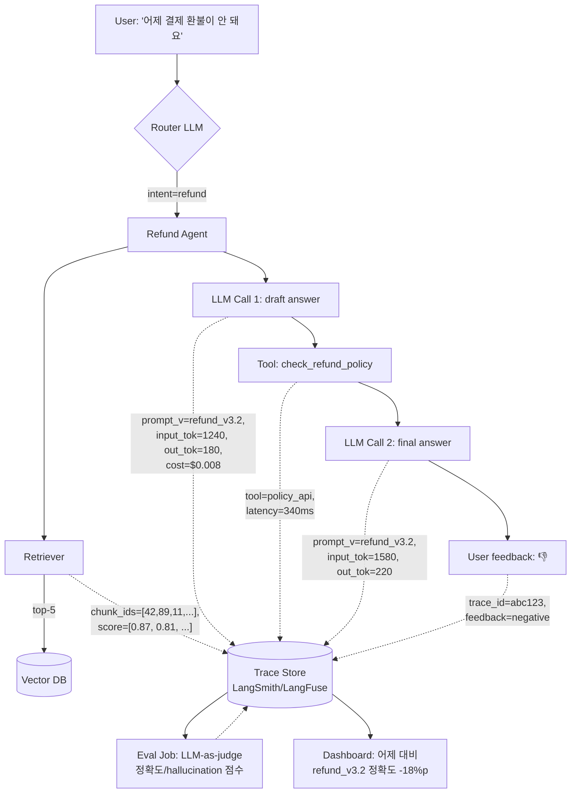

### AI Observability (LangSmith/LangFuse) — "Datadog에 tag만 잘 붙이면 된다"는 오만, 그리고 프롬프트 v3.2가 하루 만에 hallucination 4배를 만들고도 아무도 모르지 못했던 이유

---

## 새벽 4시 12분, PM의 슬랙 — "왜 갑자기 이 답이 나와요?"

CS 챗봇의 CSAT이 3.8 → 2.1로 하루 만에 떨어졌다. 근거는 "환불 정책 답변이 이상하다"는 5명의 고객 캡처. 백엔드는 Datadog을 열었다. HTTP 200, p95 응답시간 1.4초, 5xx 0%. **모든 지표가 초록불이다.**

- 어떤 프롬프트 버전이 나갔는가? → 모른다 (Git commit hash는 있지만 실제 런타임에 어떤 템플릿이 렌더링됐는지 추적 불가)
- Retrieval 단계에서 어떤 문서가 top-k에 들었는가? → 모른다 (Vector DB 쿼리 로그는 있지만 어떤 최종 답변으로 이어졌는지 join 불가)
- Tool call은 몇 번 돌았고, 각 단계 토큰은? → 모른다 (OpenAI usage API 총합만 있음)
- 어제 대비 오늘 이 질문 유형의 답변이 어떻게 바뀌었는가? → 모른다 (production input/output이 로그에 남지 않음, PII 우려로 마스킹됨)

결국 6시간 동안 로컬에서 프롬프트를 손으로 재현했다. 원인은 어제 배포된 "system prompt에서 `"Do not speculate"` 문장이 실수로 삭제된 것". **10줄짜리 diff를 찾는 데 6시간**을 태웠다.

이게 LLM 시스템에 **APM이 아닌 LLM Observability**가 필요한 이유다.

---

## 왜 전통 APM은 LLM에서 무용지물인가

Lv4에서 다룬 관측성(3 pillars: metrics/logs/traces)은 **결정론적 시스템**을 전제로 한다. "같은 입력 → 같은 출력"이 깨지지 않기에 지연/에러/RPS만 보면 된다.

LLM은 이 전제가 3중으로 깨진다:

| 축 | 전통 웹 서비스 | LLM 시스템 |
|---|---|---|
| 결정성 | 같은 입력 → 같은 출력 | temperature > 0면 매번 다름 |
| 실패 정의 | HTTP 5xx, exception | HTTP 200인데 답이 틀림 (hallucination) |
| 비용 축 | CPU/RAM (거의 flat) | 토큰당 과금, request당 100배 편차 |
| 회귀 감지 | 유닛/E2E 테스트 | 정성 평가 필요, 사람 or LLM-as-judge |
| 근본 원인 축 | code diff | prompt / model / retrieval / tool 4축 동시 변화 |

APM이 놓치는 것: **"HTTP 200으로 응답한 잘못된 답변"**. 이건 코드 계층에서 감지 불가능하다.

---

## LLM Observability가 잡아야 하는 6가지 신호

1. **Trace tree** — 하나의 사용자 질문 → Chain → Retrieval → LLM call → Tool call → 재-LLM call, 이 계층을 나무 구조로 저장
2. **Prompt version** — 각 호출에 실제로 렌더링된 최종 프롬프트 문자열 + 템플릿 버전 tag
3. **Token/cost per span** — input/output 토큰 수, 모델별 가격, 누적 비용
4. **Retrieval provenance** — 어떤 청크(문서 id, 유사도 점수)가 컨텍스트에 실려 들어갔는가
5. **User feedback signal** — thumbs up/down, edit distance, "지금 상담사 연결" 클릭
6. **Automated eval score** — LLM-as-judge, 정규식 assertion, 검색 정확도 등 배포 후에도 지속적으로 붙는 점수

이 6개가 하나의 trace id로 join되어야 "왜 이 답이 나왔지?"에 30초 안에 답할 수 있다.

---

## 아키텍처 다이어그램: Trace tree가 실제로 저장되는 모습



핵심은 **점선(-.->) 전부가 하나의 `trace_id`로 묶여 있다**는 것. Datadog에서는 이걸 흉내내려면 span에 태그 20개를 붙여야 하고, retrieval provenance 같은 배열은 아예 못 넣는다.

---

## LangSmith vs LangFuse vs 자체 구축, 3자택일

### LangSmith (LangChain Inc., SaaS)

- **강점**: LangChain/LangGraph 코드 한 줄이면 자동 계측. Prompt Hub(버전 관리), dataset, playground가 통합됨. 프론티어 팀이 요구하는 human labeling UI가 성숙.
- **약점**: SaaS 강제(2026년 8월 기준 self-hosted는 Enterprise만), 데이터가 외부로 나감. LangChain 없이 쓰면 SDK가 어색함. 가격이 trace 수 기반으로 빠르게 오름.
- **채택 사례**: **Elastic**, **Rakuten**, 초기 **Retool AI** — LangChain을 프로덕션에 그대로 태운 팀들. LangChain을 이미 쓰는 팀이면 사실상 default.

### LangFuse (오픈소스, self-host 가능)

- **강점**: OSS(MIT), 자체 인프라에 배포 가능 → 금융/의료/PII 규제 대응. LangChain 비의존, OpenAI/Anthropic SDK를 그냥 wrapping. Prompt management + eval + dataset이 다 들어 있음.
- **약점**: 커뮤니티 기반이라 엔터프라이즈급 SLA는 유료 Cloud tier 필요. UI 성숙도가 LangSmith보다 약간 뒤. Human labeling 워크플로우가 아직 초기.
- **채택 사례**: **Khan Academy**의 Khanmigo (교육 데이터 EU privacy 이슈로 self-host 선택), **Samsara**, 국내에서는 규제 산업(금융/공공)에서 self-host 조합으로 빠르게 확산 중.

### 자체 구축 (Datadog/OpenTelemetry + 태그)

- **강점**: 이미 있는 관측성 스택 재사용. SRE가 다룰 줄 앎.
- **약점**: prompt/output 원문 저장이 로그 스키마와 맞지 않음(문자열이 너무 길고, PII 마스킹이 span 단위로 필요). Prompt versioning, dataset, eval은 처음부터 다시 만들어야 함. **6개월 후 반드시 후회한다.**
- **채택 사례**: 초대형 자체 인프라 팀(**Airbnb**, **Uber**)만 지속 가능. 그 외는 결국 LangFuse/LangSmith로 이관하거나 절반쯤 만들다 방치됨.

### 언제 무엇을 쓸까 — 시니어 관점 결정 트리

```
Q1. 데이터가 외부로 나가면 안 되는 규제 산업인가?
    Yes → LangFuse self-host (거의 유일한 실용 선택)
    No  → Q2

Q2. LangChain/LangGraph를 이미 프로덕션에 쓰고 있는가?
    Yes → LangSmith (통합 비용 압도적으로 낮음)
    No  → Q3

Q3. 하루 trace 100만 개 이상 + 자체 SRE 팀이 있는가?
    Yes → OpenTelemetry + LangFuse self-host 하이브리드
    No  → LangFuse Cloud (가장 무난한 default)
```

---

## 실전에서 놓치기 쉬운 4가지

### 1. Prompt version은 **git tag가 아니라 런타임 렌더링 결과**를 저장해야 한다

`prompts/refund_v3.2.jinja` git hash만 저장하면 소용없다. `{{ user_history }}` 자리에 실제로 어떤 대화 이력이 렌더링됐는지가 hallucination의 원인이다. **최종 렌더링된 문자열**을 span에 붙여야 한다.

### 2. PII redaction은 **저장 전(pre-ingest) hook**으로 처리하라

LangFuse/LangSmith 둘 다 `mask()` 함수 훅을 지원한다. 이걸 안 붙이면 주민번호가 그대로 SaaS로 나간다. GDPR/개인정보보호법 위반은 일주일 안에 감사에서 잡힌다.

### 3. Feedback → Dataset → Eval **폐회로**를 만들어야 관측성이 값을 한다

관측만 하고 개선 루프가 없으면 그냥 예쁜 대시보드다. 실전 파이프라인:

```
user 👎 → trace_id 자동 태그
       → 매일 배치로 "부정 피드백 trace"만 dataset 편입
       → 다음 프롬프트 후보를 이 dataset에 대해 offline eval
       → 개선 확인 시에만 canary 배포
```

**Notion AI**는 이 루프로 프롬프트 A/B를 주 2회 돌린다고 공개한 바 있다(2025년 컨퍼런스). 이 루프가 없으면 프롬프트 튜닝은 감(感)이다.

### 4. **비용 대시보드는 Observability에서 만들지 마라**

토큰 비용을 대시보드에서만 보면 이미 늦다. Observability tool에 budget alert(예: 시간당 $50 초과)을 **PagerDuty로 연결**하라. Agent 시스템은 루프에 걸리면 시간당 $1000도 태운다. 이건 이미 [[Multi-Agent Orchestration]]에서 다룬 예산 폭탄 이슈와 같은 축이다.

---

## 언제 쓰면 안 되는가

- **RAG조차 아직 프로토타입 단계** — Observability 붙이기 전에 [[Chunking 전략]]/Retrieval을 안정화하는 게 먼저다. 관측만 늘리고 문제는 안 풀린다.
- **초저지연 (p99 < 200ms) 실시간 시스템** — 대부분의 tracing SDK가 async flush를 하지만 SDK overhead 5~15ms는 감수해야 한다. 관측성과 지연 예산 사이 트레이드오프를 명확히 하라.
- **모델 output에 PII가 필연적으로 포함되는 도메인 + 마스킹 불가** — 저장 자체를 안 하는 게 정답. sampling(예: 1%만 원문 저장) + 나머지는 hash만 저장하는 절충안 검토.

---

## 트레이드오프 요약

| 축 | LangSmith | LangFuse | 자체 구축(Datadog+태그) |
|---|---|---|---|
| 초기 통합 비용 | ⭐⭐⭐⭐⭐ (LangChain이면) | ⭐⭐⭐⭐ | ⭐⭐ |
| 데이터 주권 | ⭐⭐ (SaaS) | ⭐⭐⭐⭐⭐ (self-host) | ⭐⭐⭐⭐⭐ |
| Prompt/Dataset/Eval 통합 | ⭐⭐⭐⭐⭐ | ⭐⭐⭐⭐ | ⭐ (처음부터 만들어야) |
| 대량 trace 비용 | ⭐⭐ (빠르게 비쌈) | ⭐⭐⭐⭐ | ⭐⭐⭐⭐⭐ |
| 벤더 락인 | ⭐⭐ | ⭐⭐⭐⭐ (OSS) | ⭐⭐⭐⭐⭐ |
| Human labeling UX | ⭐⭐⭐⭐⭐ | ⭐⭐⭐ | ⭐ |

---

> 💡 **왜 중요한가**: LLM 시스템의 장애는 HTTP 5xx가 아니라 "HTTP 200으로 응답한 잘못된 답변"이며, 이걸 잡을 수 있는 유일한 방법은 프롬프트·retrieval·tool·피드백·비용을 하나의 `trace_id`로 묶어 저장·검색·재현·평가할 수 있는 LLM 전용 관측 계층을 갖추는 것이다 — Datadog로는 절대 못 한다.
