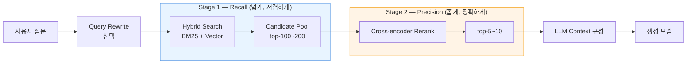

### Reranking (2-stage Retrieval) — "top-5는 top-100의 진짜 상위"라는 착각, 그리고 정답 문서가 87위에 숨어 새벽 3시 CS 챗봇이 오답 문서를 자신 있게 인용하는 방식

---

#### 새벽 3시 27분, CS 챗봇 로그

```
[user]  디지털 굿즈 환불 언제까지 가능해요?
[bot]   환불은 결제 완료 후 7일 이내에만 가능합니다.
        (근거: docs/refund_policy_v2.md)
```

실제 정책(policy_v3.md):
> 디지털 상품 — **다운로드 이력 없을 때 24시간 이내**
> 물리 상품 — 수령 후 14일 이내
> policy_v2는 2025-03-14에 deprecated

로그를 뜯어보니 Vector Search는 정답 문서를 top-100에 **분명히** 뽑았다. 순위는 **87위**. LLM 컨텍스트로는 top-5만 넘겼기에, 모델은 오답 문서 하나를 근거로 확신에 찬 문장을 만들어냈다. Hallucination이 아니다. 근거는 있었다. 다만 **정답이 아니었을 뿐**.

이 사건은 검색 파이프라인의 어느 지점을 다시 봐야 한다는 신호인가?

---

#### Bi-encoder의 구조적 한계 — "질문과 문서를 따로 보면 놓치는 것들"

지금까지 우리가 써온 벡터 검색은 대부분 **bi-encoder** 구조다.

```
질문 ──▶ Encoder ──▶ [질문 벡터]
                                  ┐
                                  ├─▶ cosine similarity
                                  ┘
문서 ──▶ Encoder ──▶ [문서 벡터]  (미리 인덱싱)
```

빠르다. 문서 임베딩은 인덱싱 타임에 한 번만 계산하면 되고, 쿼리마다 필요한 건 질문 벡터 하나 + ANN 검색뿐이다. pgvector도 Pinecone도 Weaviate도 다 이 구조다.

문제는 **질문과 문서가 서로를 절대 못 본다**는 점이다.

- "환불 언제까지?" 라는 짧은 질문은 임베딩 공간에서 **의도의 밀도**가 낮다
- `refund_policy_v2.md` 는 제목·헤더·"환불" 키워드가 많아 벡터 노름 자체가 크다
- `policy_v3.md` 는 "구매 후 취소 신청 가능 시한" 이라는 다른 표현을 쓰고, 실제 답이 8번째 섹션에 있다

Bi-encoder는 이 두 문서 중 "제목이 화려한 오답"을 위에 놓는다. 상호작용을 못 보기 때문에.

---

#### Cross-encoder — "이번엔 한 문장에 넣고 다시 본다"

Cross-encoder는 완전히 다른 구조다.

```
[CLS] 질문 [SEP] 문서 [SEP]  ──▶  Transformer  ──▶  relevance score (0~1)
```

질문과 문서를 **하나의 시퀀스로 concat**해서 모든 token이 서로 attention을 걸도록 만든다. "환불 언제까지"라는 질문이 문서의 "다운로드 이력이 없는 경우 24시간" 문장과 실제로 **의미적으로 붙는지**를 본다.

대가는 명확하다. **인덱싱이 불가능하다.** 새로운 질문마다 (질문, 문서) 쌍 전체를 다시 forward pass 시켜야 한다. 문서가 800만 개면 쿼리 한 번에 800만 번 추론. 있을 수 없는 일이다.

그래서 실전에서는 **2단계 검색**을 쓴다. Bi-encoder로 top-100~200을 저렴하게 뽑고, cross-encoder로 그 후보만 다시 정렬한다.

---

#### 2-stage Retrieval 아키텍처



핵심은 **각 단계의 목표가 다르다**는 점이다.

| 단계 | 목표 | 지표 | 실패 모드 |
|---|---|---|---|
| Stage 1 (Recall) | 정답을 **놓치지 않기** | Recall@100 | 정답이 애초에 후보에 없음 → rerank도 못 살림 |
| Stage 2 (Precision) | 후보를 **정확히 정렬** | NDCG@10, MRR | 정답이 후보엔 있는데 top-5에 못 올라옴 |

Stage 1에서 정답을 못 뽑으면 Stage 2는 아무 것도 못 한다. 그래서 후보 pool은 **관대하게** 잡는다 (top-100~200). 반대로 top-1000까지 뽑으면 rerank 지연이 지옥이 된다. 이 균형이 senior의 첫 번째 판단 지점이다.

---

#### Reranker 선택지 — 2026년 현재

| Reranker | 유형 | 지연 (top-100) | 비용 | 특징 |
|---|---|---|---|---|
| **Cohere Rerank 3.5** | SaaS API | 150~300ms | $2 / 1K queries | 100+ 언어, multilingual 강점 |
| **Voyage rerank-2** | SaaS API | 200~400ms | $50 / 1M tokens | 도메인 특화(코드/금융) 옵션 |
| **BGE-reranker-v2-m3** | 오픈소스 self-host | 80~250ms (GPU) | GPU 인프라 비용 | 한국어 성능 준수, self-host 가능 |
| **Jina Reranker v2** | 오픈소스 + SaaS | 100~200ms | $2 / 1M tokens | multilingual, 함수형 쿼리 강함 |
| **자체 fine-tuned** | in-house | 도메인/모델 따라 | GPU + 학습 비용 | 도메인 라벨 5K개 이상 확보 시만 |

한국어 도메인이라면 **BGE-reranker-v2-m3 self-host** 또는 **Cohere Rerank 3.5** 가 현실적인 첫 선택. 한국어 라벨 데이터가 5K+ 있다면 fine-tuning 여지가 열린다.

---

#### 실제 사례 — 누가 왜 이 패턴을 택했나

**Perplexity AI** — 답변 품질이 곧 제품인 회사. Bi-encoder만으로는 top-3 신뢰도가 안 나온다는 걸 초기에 인정하고, Cohere Rerank + 자체 정렬 layer를 2단으로 얹었다. **응답 latency 예산 중 rerank에 300ms를 배정**하고 나머지를 스트리밍 생성에 밀어넣는 구조.

**Notion AI (Q&A)** — 워크스페이스가 커지면 문서가 수십만 개. Bi-encoder만 쓰면 제목이 비슷한 회의록이 위로 올라와 진짜 결정 문서가 밀린다. BGE-reranker를 self-host해서 워크스페이스별로 격리된 인덱스에 붙임. **비용을 API로 넘길 수 없는 규모**여서 self-host가 유일한 선택지였다.

**GitHub Copilot Chat** — 코드 컨텍스트 검색은 자연어 검색과 성격이 다르다. "이 함수 어디서 쓰이지?" 라는 질문에 대한 답은 vector 유사도만으로는 못 찾는다. 자체 학습 cross-encoder를 붙였고, 그 학습 데이터는 **사용자가 실제로 accept한 suggestion 로그**에서 나온다 (Feedback → Dataset → Eval 폐회로가 여기서 rerank 학습으로도 확장된다 — 이건 [[ai-observability]]와 붙는 지점).

**금융권 사내 지식베이스 (익명)** — 규제 문서 검색. Recall이 낮으면 컴플라이언스 위반이 나올 수 있어 **Stage 1에서 top-500까지 뽑고**, Stage 2에서 도메인 fine-tuned reranker로 정렬. Latency는 2초까지 허용. 이 도메인에서 latency는 정확도 앞에 명함을 못 내민다.

---

#### 트레이드오프 — 진짜 값을 계산해보자

**정확도 이득 (도메인마다 다르지만 대략)**
- NDCG@10: bi-encoder만 vs +rerank = **+15~40%p** 향상
- 사용자 인지 품질 (thumbs up rate): **+8~20%p** 향상
- Hallucination rate: **-30~60%** (근거 문서 자체가 정확해지므로)

**비용/지연 대가**
- Latency: top-100 rerank 기준 **+150~600ms** (모델·인프라에 따라)
- 비용: SaaS 기준 **월 100K queries → $200~500** 추가
- 인프라: self-host면 **GPU 1~2장** 상시 대기 필요

이 숫자를 놓고 시니어가 진짜 물어야 할 질문은 하나다.

> **"이 워크로드의 병목은 recall인가, precision인가?"**

- Recall 병목 (정답이 아예 후보에 없음) → rerank를 붙여도 소용없다. Chunking 전략, embedding 모델, hybrid search 가중치부터 손봐라.
- Precision 병목 (후보엔 있는데 top-5에 못 올라옴) → 바로 rerank의 자리다.

Stage 1 후보 pool에서 정답 위치를 뽑아 히스토그램을 그려보면 답이 나온다. 정답이 top-20 안에 대부분 있으면 rerank는 오버킬. top-50~100에 흩어져 있으면 rerank는 홈런.

---

#### 시니어 결정 트리 — 언제 쓰고 언제 쓰지 말 것

```
문서 규모 < 500개?
├─ Yes → LLM 컨텍스트에 통째로 넣어라. Retrieval 자체가 오버엔지니어링.
└─ No ↓

Recall@100이 95% 이상인가? (정답이 후보에 잘 뽑히는가)
├─ No → rerank 붙이지 마라. Stage 1부터 고쳐라.
│        (chunking / hybrid weight / embedding 모델 교체)
└─ Yes ↓

P99 latency 예산이 500ms 미만인가?
├─ Yes → rerank 회피. 대신 embedding 모델 교체나 hybrid 가중치 튜닝.
│        (또는 후보 pool을 top-30으로 줄여 rerank latency를 100ms 이하로)
└─ No ↓

도메인 특화(코드/의료/법률/금융)인가?
├─ Yes → 라벨 5K+ 확보 가능하면 fine-tuned reranker.
│        아니면 Voyage rerank-2(도메인 특화 옵션) 또는 도메인 학습 BGE.
└─ No ↓

한국어/다국어 비중이 큰가?
├─ Yes → BGE-reranker-v2-m3 (self-host) 또는 Cohere Rerank 3.5
└─ No  → Cohere Rerank 3.5 또는 Jina Reranker v2 로 시작
```

---

#### 흔한 오해 3가지

**"Hybrid search를 잘 하면 rerank는 필요 없다."**
반은 맞고 반은 틀리다. Hybrid는 **recall을 늘리기 위한** 도구고, rerank는 **후보 pool 내 정렬을 뒤집기 위한** 도구다. 둘은 대체재가 아니라 순차 조합이다. [[hybrid-search]] 다음에 rerank가 오는 게 정석.

**"Rerank latency는 top-k에 비례한다."**
문서 길이에도 비례한다. Top-100인데 문서마다 8K 토큰이면 rerank가 2초를 넘긴다. 그래서 rerank 전에 **문서를 짧은 스니펫으로 자르는 전처리**가 필수다 ([[chunking-strategy]]와 연결). 8K 문서를 512 토큰 스니펫 4개로 잘라 넣는 게 훨씬 빠르고 정확하다.

**"Rerank score를 그대로 LLM confidence로 써도 된다."**
쓰지 마라. Reranker의 score는 **후보 대비 상대적 관련성**이지 절대적 사실성이 아니다. Score 0.92라고 해서 "이 문서가 정답의 92%"라는 뜻은 없다. Threshold cutoff는 도메인마다 다시 튜닝해야 한다. 우리 데이터셋에서 실제로 정답이었던 rerank score의 5th percentile을 확인하고 그걸 cutoff로 잡는 게 실용적이다.

---

#### 도입 시 반드시 걸어둘 관측 지표

Rerank를 붙였다면 [[ai-observability]] 대시보드에 아래 4개는 반드시 추가한다.

1. **Stage 1 Recall@K** — 정답이 후보에 들어갔는가 (rerank 정확도의 상한)
2. **Rerank 재정렬 폭** — Stage 1 순위와 Stage 2 순위의 차이 히스토그램. 재정렬이 거의 없으면 rerank 비용이 낭비되는 것.
3. **Rerank latency p50/p99** — 특히 문서 길이 분포와 함께 봐라
4. **Rerank cache hit rate** — [[semantic-cache]]와 같은 쿼리 유사도 기반 캐싱을 rerank에도 적용 가능

이 4개 없이 rerank를 프로덕션에 넣으면, 어느 날 "왜 답변 품질이 떨어졌지?" 하는 순간에 원인이 Stage 1인지 Stage 2인지 구분할 방법이 없다.

---

> 💡 **왜 중요한가**: RAG 품질의 상한은 embedding이 결정하고, 하한은 rerank가 결정한다 — 정답 문서가 top-100에 있어도 top-5에 없으면 LLM은 "확신에 찬 오답"을 만들며, 이걸 뒤집을 수 있는 유일한 지점이 2단계 검색이다.
