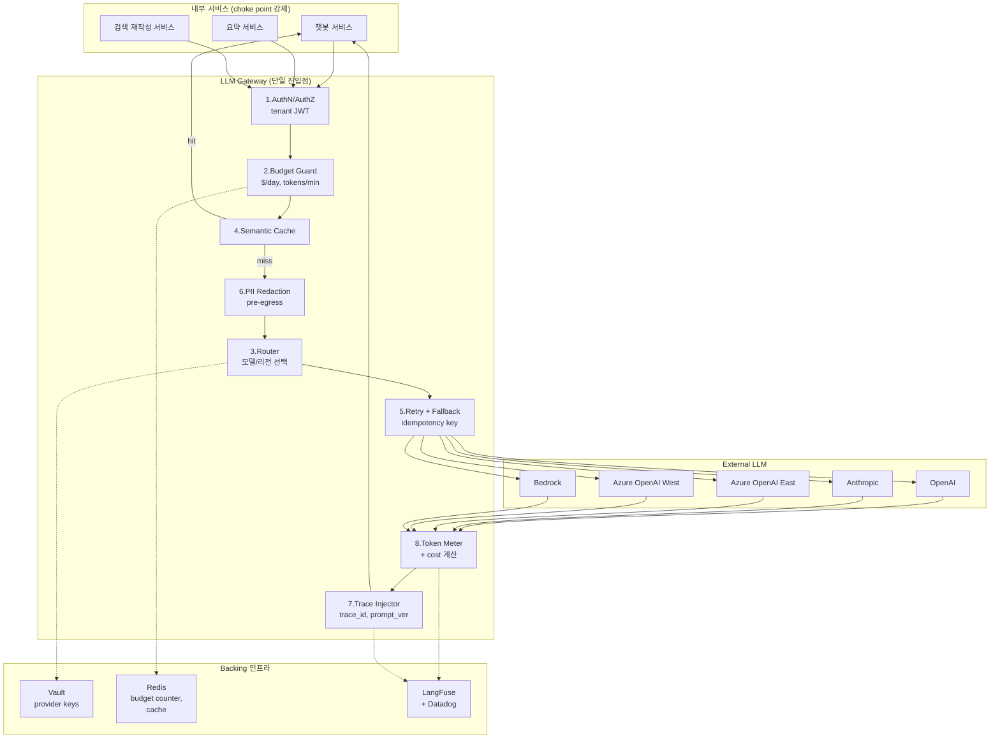

### LLM Gateway 패턴 — "API Gateway랑 똑같지 않네"라는 뒤늦은 깨달음, 그리고 유출된 GPT-4 key 하나가 8시간 만에 $47,000 청구서를 만든 방식

시니어 백엔드가 LLM Gateway를 처음 만나면 반드시 하는 말이 있다.

> "이거 그냥 API Gateway 앞에 두면 되는 거 아니야? Kong으로 하자."

3개월 뒤 그 팀은 Kong 앞단에 LiteLLM Proxy를 별도로 세우고, 그 앞에 또 자체 Gateway를 만들고 있다. 왜냐면 **LLM 트래픽은 REST 트래픽처럼 생겼지만, 완전히 다른 동물이기 때문**이다.

---

#### 1. 먼저 착각부터 정리: "API Gateway와 뭐가 다른가"

Lv3~Lv4에서 다뤘던 API Gateway(Kong, AWS API Gateway, Envoy)의 책임과 겹치는 부분부터 보자.

| 책임 | API Gateway | LLM Gateway |
|---|---|---|
| 인증/인가 | ✅ JWT, API Key | ✅ (같음) |
| Rate Limiting | ✅ req/sec | ⚠️ **req/sec + tokens/min + $/day** |
| Retry | ✅ 5xx retry | ⚠️ **retry ≠ idempotent (스트림 중간 재시도 불가)** |
| Load Balancing | ✅ RR, LC | ⚠️ **모델 fallback + provider fallback + region fallback** |
| Circuit Breaker | ✅ 5xx 임계치 | ⚠️ **429 rate + context length error + content filter** |
| Observability | ✅ latency, status | ⚠️ **+ token 사용량, 비용, 프롬프트 버전** |
| Key 관리 | ✅ tenant별 key | ⚠️ **provider key rotation + BYOK(bring your own key)** |
| Caching | ✅ HTTP cache | ⚠️ **Semantic Cache (이미 다룸)** |
| Streaming | 드묾 | **기본값 (SSE, chunked)** |

**결론: 겹치는 60%는 Kong으로 충분하다. 하지만 나머지 40%가 LLM만의 지옥이다.**

---

#### 2. 왜 별도의 Gateway가 필요한가 — 사고 사례 3건

##### 사례 A. 유출된 key 하나가 8시간 만에 $47,000

한 이커머스 스타트업이 OpenAI key를 개발자별로 발급했다. Frontend 팀 인턴이 실수로 `.env`를 커밋 → 봇이 30분 안에 스캔 → 8시간 동안 GPT-4로 병렬 호출.

**Kong이 못 잡은 이유:**
- Kong은 "우리 서비스" 앞단이지 "OpenAI"로 나가는 outbound 트래픽을 안 본다
- $ 기준 rate limit이 없다 (req/sec만 있다)
- key가 유출된 걸 감지할 방법이 없다 (client는 여전히 "정상" 요청)

**LLM Gateway가 잡는 방식:**
- 모든 LLM 호출이 Gateway를 거친다 → provider key는 Gateway만 안다 → client는 Gateway key만 안다
- key가 유출되어도 Gateway에서 tenant별 **$/day 예산**을 넘으면 자동 차단
- 이상 패턴 감지 (평소 시간당 200회 → 갑자기 20,000회 → 알람 + 자동 revoke)

##### 사례 B. Azure East US 장애 → 챗봇 27분 다운 → 재발

Routing/Fallback은 이미 다뤘다. 근데 fallback을 애플리케이션 코드에 박아둔 팀은 이런 걸 겪는다:

- 서비스 A는 GPT-4 → Claude fallback
- 서비스 B는 GPT-4 → GPT-3.5 fallback
- 서비스 C는 fallback 없음 (스프린트에서 잘림)

Azure 장애가 나면 **서비스마다 다른 방식으로 죽는다.** 사후 회고에서 "우리도 fallback 있는데요"라고 각자 우기게 된다.

**Gateway가 하는 것:** fallback 정책을 애플리케이션이 아니라 **Gateway config**에 둔다. 서비스는 그냥 `POST /v1/chat/completions`만 부른다. 정책 바뀌면 Gateway만 재배포.

##### 사례 C. 프롬프트 v3.2가 hallucination 4배를 만들었는데 아무도 몰랐음

이미 다룬 이슈([[ai-observability]])다. 하지만 **여기서 놓친 것**: 어떻게 모든 팀이 강제로 trace ID를 붙이게 할 것인가?

- "각 팀이 LangFuse SDK 붙이세요"라고 말한다 → 안 붙는다
- Gateway를 강제하면 → Gateway가 자동으로 trace ID, tenant ID, 프롬프트 버전을 attach → 팀이 뭘 안 해도 관측된다

**핵심 원리: LLM Gateway는 관측성/보안/비용을 "중앙화 강제"하기 위한 choke point다.**

---

#### 3. 아키텍처 — 무엇을 Gateway 안에 넣는가



여기서 **순서가 아키텍처의 전부**다. 시니어가 놓치는 순서 실수 3가지:

1. **Cache를 PII Redaction 앞에 두지 마라.** cache key에 raw PII가 들어간다. 반대로, cache를 redaction *뒤*에 두면 캐시 히트율이 뚝 떨어진다. 정답: **cache key는 redacted 버전으로, 저장 payload는 완전 hash로.**
2. **Budget Guard를 Cache 앞에 두라.** cache hit도 "요청 시도"로 카운트? 아니다. 하지만 "이 tenant가 최소한 요청권은 있는지"는 캐시 조회 전에 봐야 한다. 그래서 **AuthN → Budget check(count only, not deduct) → Cache → miss 시 Budget deduct**.
3. **Trace Injection은 provider 응답 *후*가 아니라 *전*에도 필요하다.** provider가 죽으면 요청 자체가 trace에 안 남는다. 그래서 pre-request/post-response 양쪽에서 span을 연다.

---

#### 4. Streaming — 여기서 대부분의 Gateway가 무너진다

REST Gateway는 request/response 짝을 다룬다. LLM은 **SSE로 토큰이 흘러온다.** Kong에 그대로 태우면 다음이 다 깨진다:

| 문제 | Kong의 반응 | 필요한 처리 |
|---|---|---|
| chunk가 5초 이상 안 옴 | timeout 판정 → 503 | LLM은 원래 첫 토큰까지 8초 걸리기도 함. **첫 토큰 timeout 별도.** |
| client가 연결 끊음 | Kong은 upstream 계속 흘림 | **cancel propagation** — upstream에도 abort 신호 |
| 중간에 provider 429 | 이미 100 토큰 보냈는데 retry? | retry 불가, **partial response에 error frame 삽입** |
| Token 카운트 | Kong은 body를 안 파싱 | **SSE 파서 + tiktoken으로 실시간 집계** |
| Semantic Cache에 스트림 저장 | ?? | 스트림을 다 받은 뒤 백그라운드로 캐시 |

**"그냥 프록시"가 안 되는 이유가 여기다.** 스트리밍 프록시는 stateful하다. 그래서 Kong 위에 별도 LLM Gateway가 필요하다.

---

#### 5. Idempotency — Retry의 아킬레스건

REST 세계에선 GET은 안전, POST는 위험. LLM 세계에선 **모든 요청이 POST고, 모든 요청이 (temperature > 0이면) non-deterministic**이다.

Gateway가 provider timeout으로 retry하면:
- provider 입장에서 두 번 실행 → **두 배 청구**
- 결과가 다를 수 있음 → 어느 걸 client에 반환?

**해결: `Idempotency-Key` 헤더를 Gateway가 강제로 붙이고, Redis에 (key → 첫 응답) 24시간 저장.** 이건 Stripe API 패턴 그대로다. OpenAI SDK가 최근에 자체 지원하기 시작했지만, provider마다 다르니 Gateway 레이어에서 통일하는 게 안전하다.

---

#### 6. 실제 회사 사례

**Portkey (SaaS)**
- 스타트업에서 가장 많이 채택. "API Gateway for LLMs"로 마케팅
- Virtual Key(내부용) ↔ Provider Key(실제) 분리가 킬러 피처
- 단점: SaaS라 모든 프롬프트가 Portkey 서버를 거침 → 금융/의료는 못 씀

**LiteLLM Proxy (오픈소스, self-host)**
- 100개+ 프로바이더를 OpenAI 스펙으로 통일
- Anthropic Claude를 `/v1/chat/completions`로 부를 수 있게 해줌 → **서비스 코드는 provider-agnostic**
- LangChain/LlamaIndex 진영에서 사실상 표준
- 단점: 성능이 Kong 급은 아님 (Python asyncio)

**Cloudflare AI Gateway**
- Edge에서 처리. 로깅/캐싱/rate limit이 무료
- 단점: Cloudflare 외 인프라와 통합이 얕음

**Kong AI Gateway (2024~)**
- 기존 Kong에 AI 플러그인 얹은 형태
- 이미 Kong 쓰는 조직엔 자연스러움
- 단점: LLM 특화 관측성은 LangFuse만 못함 → 결국 병행

**시니어의 실무 조합 (가장 흔한 패턴):**
```
Client → Kong (기존 인증/rate limit) → LiteLLM Proxy (LLM specific) → Provider
                                            ↓
                                        LangFuse (관측)
```
Kong은 **REST 관문**, LiteLLM은 **LLM 관문** — 역할 분리.

---

#### 7. 트레이드오프 — 시니어 관점의 결정 표

| 항목 | Gateway 있음 | Gateway 없음 (SDK 직결) |
|---|---|---|
| Latency 오버헤드 | +20~50ms | 0 |
| Provider key 유출 blast radius | 폭 좁음 (Gateway만 재발급) | 폭 넓음 (앱마다 배포) |
| 새 모델 실험 | config 변경 | 서비스 재배포 |
| 관측성 강제 | 자동 | 팀별 의지에 의존 |
| 스트리밍 복잡도 | Gateway가 흡수 | 앱마다 재구현 |
| SPOF 위험 | 있음 (Gateway 죽으면 전체 다운) | 없음 |
| 조직 규모 임계점 | **3팀 이상, 월 $5k+ 지출** | 그 미만 |

**핵심: Gateway는 인프라 세금이다. 이 세금이 아까운 조직이면 안 만드는 게 맞다.**

---

#### 8. 언제 쓰고 언제 쓰지 말 것인가

**써야 하는 신호**
- 3개 이상의 팀/서비스가 LLM을 호출한다
- 월 LLM 지출이 $3~5k를 넘었다 (비용 통제 ROI 발생)
- Provider 다양화가 진행 중이다 (OpenAI만이 아니라 Claude, Bedrock도 쓴다)
- 규제 대응 필요 (PII redaction, audit log)
- 개발자 실수로 인한 사고를 한 번이라도 겪었다

**쓰면 안 되는 신호**
- 서비스 1개, 팀 1개, 월 $500 이하 지출 → **오버엔지니어링.** SDK 직결이 맞다
- Latency에 극도로 민감한 실시간 음성 (첫 토큰 100ms 요구) → +30ms도 큼
- Edge에서 브라우저가 직접 LLM 부르는 아키텍처 → Gateway는 서버 사이드 개념

**판단 원칙: "LLM key 하나가 유출되면 회사가 얼마 물어야 하는가?"가 $10,000을 넘으면, Gateway는 이미 필수다.**

---

#### 9. 그래서 시니어가 남길 한 문장

Routing/Fallback은 Gateway의 **한 기능**이다. Semantic Cache도 **한 기능**이다. PII Redaction도 **한 기능**이다. 이걸 각 팀이 각자 SDK에 붙이면, **품질이 팀 실력에 비례해 요동친다.**

Gateway는 이 요동을 인프라 레벨에서 평탄화하는 장치다. API Gateway가 REST 시대에 그랬듯이.

> 💡 **왜 중요한가**: LLM Gateway는 성능 최적화 도구가 아니라 **"조직 전체가 LLM을 안전하게 쓰도록 강제하는 choke point"**다 — 없으면 각 팀의 실수와 비용이 모두 프로덕션 청구서로 돌아온다.
