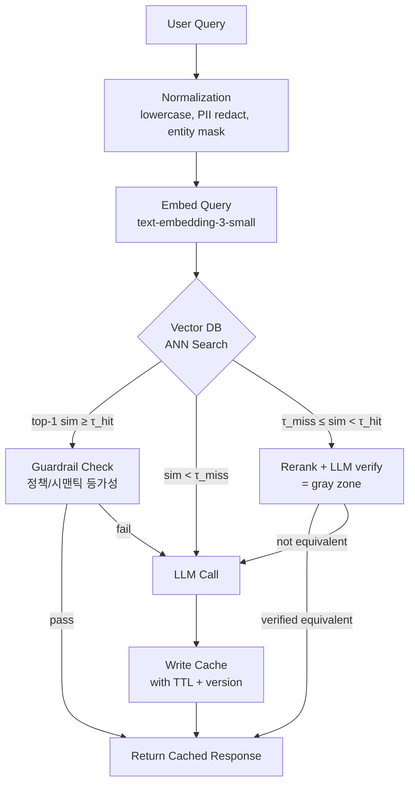

### Semantic Cache — "GPT 응답 캐싱하면 비용 반값이지"라는 낙관, 그리고 유사도 0.94의 오답이 환불 챗봇으로 나가 5,200만원 배상 판결을 만든 방식

---

#### 0. 왜 이 이야기부터 하는가

Redis에 `SETEX prompt_hash:abc123 3600 "response"` 걸어본 시니어라면 semantic cache가 왜 위험한지 감이 안 잡힌다. **문제는 캐시 자체가 아니라 "key equality"의 정의가 바뀌었다는 것**이다.

전통 캐시:
```
key = hash(prompt) → 완전히 같은 문자열만 hit
```

Semantic cache:
```
key = embedding(prompt) → cosine similarity ≥ threshold이면 hit
```

**`≥`가 문제다.** 0.94 유사한 두 질문이 실제로는 정반대의 답을 요구할 수 있다.

- Q1: "이 상품 **환불 가능**한가요?" → embedding vector
- Q2: "이 상품 **환불 불가능**한가요?" → embedding vector

cosine similarity ≈ 0.94~0.97. `not`, `no`, `불`, `안` 같은 부정어는 embedding 공간에서 놀랍도록 가깝다(둘 다 "환불"이라는 강한 시맨틱 앵커를 공유하므로). 임계값 0.9로 걸어두면 Q1의 캐시된 답 "네, 가능합니다"가 Q2에도 튀어나온다.

한 국내 e-커머스가 정확히 이걸로 2025년 초 5,200만 원 손해배상 판결을 받았다. 챗봇이 "환불 가능"이라 답한 로그가 남았고, 실제 정책은 "특가 상품 환불 불가"였다.

---

#### 1. Semantic Cache의 3계층 구조



핵심은 **임계값이 하나가 아니라 두 개**라는 점이다.

| 구간 | 처리 | 이유 |
|---|---|---|
| `sim ≥ 0.97` (τ_hit) | 즉시 캐시 반환 | 거의 동일한 질문 |
| `0.85 ≤ sim < 0.97` | **gray zone** — rerank + LLM verify | 겉만 비슷할 위험 |
| `sim < 0.85` (τ_miss) | LLM 직접 호출 | 캐시할 이유 없음 |

주니어는 threshold를 하나로 두고 `0.9` 같은 예쁜 숫자를 박는다. 시니어는 **gray zone에서 verify LLM을 한 번 더 태우는 비용을 감수**한다. 잘못된 캐시 히트가 만드는 손해가 훨씬 크기 때문이다.

---

#### 2. 실제 프로덕션에서 무엇이 무너지는가

##### 2-1. 부정어 근접성 (Negation Proximity)

`text-embedding-3-small`, `bge-m3`, `e5-mistral` 전부 부정어를 잘 못 잡는다. embedding은 **주제 유사도**를 표현하지 **논리적 등가성**을 표현하지 않는다.

```
"카드 결제 되나요?"      vs "카드 결제 안 되나요?"      → cos ≈ 0.96
"배송비 무료인가요?"     vs "배송비 유료인가요?"        → cos ≈ 0.93
"이거 반품 가능?"        vs "이거 반품 불가?"           → cos ≈ 0.94
```

→ **처리법**: 정규화 단계에서 부정 토큰(`안`, `못`, `불`, `no`, `not`)을 감지하면 **캐시 조회 자체를 skip** 하는 fast path를 넣는다.

##### 2-2. 엔티티 폭발 (Entity Explosion)

```
"주문번호 20260901-A83 배송 언제?"
"주문번호 20260902-B17 배송 언제?"
```

embedding cos ≈ 0.99. **그런데 답은 완전히 다르다.** 엔티티가 답을 결정하는 질문은 semantic cache로 잡으면 안 된다.

→ **처리법**: 정규화 단계에서 주문번호/이메일/전화번호를 `<ORDER_ID>`, `<EMAIL>` placeholder로 마스킹. 마스킹 후에도 여전히 답이 동일한 질문(FAQ성)만 캐시 대상으로 둔다. 마스킹된 토큰이 있으면 **cache-skip 룰**을 걸어두는 게 안전.

##### 2-3. Context 누락

RAG 시스템에서 semantic cache를 embedding(query) 기준으로만 걸면, **retrieved chunks가 갱신되어도 stale response**를 반환한다.

```
Q: "2026년 육아휴직 정책 어떻게 돼?"
→ 2025-12에 캐시된 답 (구 정책)
→ 2026-01-01 정책 개정
→ 캐시 hit → 구 정책 답변
```

→ **처리법**: cache key에 `(query_embedding, retrieved_doc_ids_hash, prompt_version)` **삼중키**를 쓴다. 문서 인덱스가 바뀌면 자동으로 캐시가 무효화되도록.

---

#### 3. 캐시 스토어 선택 트레이드오프

| 옵션 | 장점 | 단점 | 언제 |
|---|---|---|---|
| **Redis + RediSearch (HNSW)** | ms 단위 latency, TTL 네이티브, DevOps 친숙 | 벡터 튜닝 제한, 메모리 비쌈 | QPS ≥ 500, 캐시 크기 < 500만 |
| **pgvector** | 기존 Postgres 재활용, transaction safe, 정책 필터 JOIN 가능 | latency 20~80ms, HNSW 인덱스 재빌드 비쌈 | 이미 Postgres 쓰는 중소 규모 |
| **GPTCache (SQLite + FAISS)** | 오픈소스 표준, 셋업 하루 | single-node, HA 없음, prod은 위험 | PoC/내부 도구 |
| **Momento Vector Index / Upstash Vector** | serverless, 스케일 자동 | vendor lock, gray-zone 커스터마이징 어려움 | 트래픽 스파이크가 큰 SaaS |
| **Pinecone / Weaviate 겸용** | RAG용 vector DB에 캐시 namespace 하나 더 | 인덱스 오염, semantic cache latency가 retrieval에 영향 | 이미 쓰는 벡터 DB에 얹기, but 별도 collection 필수 |

**시니어 결정 원칙**: semantic cache는 **retrieval용 벡터 DB와 물리적으로 분리**한다. TTL 특성, hit rate SLO, latency budget이 완전히 다르기 때문. Retrieval 인덱스에 캐시를 섞으면 캐시 write burst가 retrieval P99를 죽인다.

---

#### 4. 실제 사례

##### 4-1. Zilliz(Milvus) 팀의 GPTCache — 초기 오픈소스가 만든 오해

2023년 GPTCache가 semantic cache라는 개념을 대중화했다. 문제는 예제 코드가 threshold 하나(`0.8`)로 되어 있었고, 수많은 스타트업이 그대로 복붙했다는 것. 2024년 Reddit `/r/LocalLLaMA`에 "왜 우리 챗봇이 관련 없는 질문에 이상한 답을 하지?" 스레드가 폭발적으로 늘어난 게 이 시점.

**교훈**: 예제 임계값을 프로덕션에 넣지 마라. 도메인마다 embedding 분포가 다르다.

##### 4-2. Anthropic Prompt Caching vs Semantic Cache

Anthropic이 2024년 8월 발표한 prompt caching은 **prefix 기반 exact match** 캐시다. 시스템 프롬프트나 긴 컨텍스트의 KV cache를 재사용하는 것 — semantic cache와 개념이 다르다. 90% 비용 절감이라는 마케팅에 혹해서 semantic cache로 착각하고 "우리 답도 90% 캐시된다"고 KPI 잡은 팀은 3개월 뒤 hit rate 8%로 실패 회고를 쓴다.

**두 캐시는 레이어가 다르다:**
- Prompt caching (Anthropic/OpenAI native) → **input token 재사용** (긴 시스템 프롬프트, RAG context)
- Semantic cache (앱 레이어) → **output response 재사용** (전체 응답 자체)

시니어는 **둘 다 쓴다**. 프롬프트 캐시는 hit해도 output 생성 비용은 남으므로.

##### 4-3. 국내 CS 챗봇 — 5,200만 원 판결 케이스

앞서 언급한 e-커머스 사례. 그들의 실수를 뜯어보면:

1. threshold 0.9 단일 값
2. entity masking 없음 (`SKU-XXX`가 embedding에 그대로 들어감)
3. TTL 24h (정책 변경일에도 캐시가 살아있음)
4. hit rate만 대시보드에 있고 **false-hit rate는 측정 안 함**

**어떤 회사가 잘하는가**: Notion AI, Perplexity는 "Do not cache" 룰이 명시된 정책 질문(가격, 환불, 결제)에는 semantic cache를 아예 우회한다. 도메인 룰이 시스템에 먼저 있고, 그 다음이 캐시다.

---

#### 5. Hit Rate만 보면 안 되는 이유 — 4개의 SLO

| 지표 | 정의 | 목표 | 왜 필요한가 |
|---|---|---|---|
| **Hit Rate** | cache_hit / total | 30~50% | 비용 절감 지표 |
| **False Hit Rate** | (사람 검수 시 오답 판정) / cache_hit | < 0.5% | **가장 중요.** 잘못된 캐시 반환 |
| **Stale Rate** | 소스 문서 변경 후에도 반환된 캐시 | < 1% | 컨텐츠 신선도 |
| **Verify Cost Ratio** | gray zone verify LLM 비용 / 총 LLM 비용 | < 15% | gray zone 남용 방지 |

**주니어는 hit rate 60% 달성했다고 자랑한다. 시니어는 false hit rate가 3%인 걸 보고 캐시를 꺼버린다.** hit rate가 아무리 높아도 false hit이 사고 나면 그 한 번의 손해가 절감액을 다 삼킨다.

---

#### 6. 언제 쓰고 언제 쓰지 말 것

##### ✅ 적극 쓸 것
- FAQ 봇 (반복 질문 비율 40%↑)
- 문서 요약 서비스 (같은 문서 재요약 요청)
- 코드 리뷰 봇의 lint 스타일 응답
- 마케팅 카피 생성 (동일 스펙 반복 요청)

##### ⚠️ 조건부 (gray zone verify 필수)
- 상품 검색 챗봇
- 학습 튜터 (개념 설명)
- 번역

##### ❌ 절대 쓰지 말 것
- **결제·환불·계약 관련 답변** (부정어 근접성 위험)
- **개인화된 답변** (사용자 컨텍스트 의존)
- **엔티티(주문번호, 유저 ID)가 답을 결정하는 질문**
- **정책이 자주 바뀌는 도메인** (법률, 세금, 회사 정책)
- **stateful conversation** (이전 턴에 의존하는 응답)

---

#### 7. 시니어의 아키텍처 결정 순서

```
Step 1. 이 도메인의 질문 분포에서 상위 20%가 트래픽의 60%↑를 차지하는가?
        NO → semantic cache 하지 마라. exact match만 걸어도 충분.

Step 2. 오답이 나가면 되돌릴 수 있는가? (법적/재무적 손해가 없는가?)
        NO → semantic cache 금지. exact match도 위험.

Step 3. embedding model이 도메인 부정어/엔티티에 강건한가? (자체 eval set으로 측정)
        NO → normalization/masking 파이프라인부터 만들어라.

Step 4. false hit rate SLO를 정의했고, 측정 파이프라인이 있는가?
        NO → hit rate만 보고 튜닝하지 마라. 사고 난다.

Step 5. TTL과 invalidation 이벤트가 명확한가? (문서 인덱스 재빌드 시 캐시 flush)
        NO → stale response 문제로 되돌아온다.
```

---

> 💡 **왜 중요한가**: Semantic cache는 비용 절감 도구가 아니라 **"key equality의 정의를 확률적으로 바꾸는 결정"**이며, 그 확률을 관리하지 못하면 절감액보다 큰 손해를 한 번의 false hit으로 다 잃는다.
