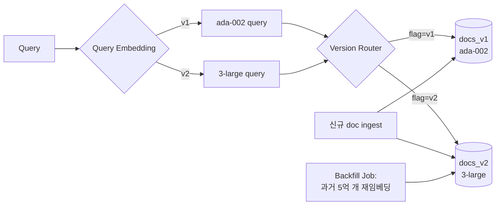

### Embedding Model 버전 관리 — "ada-002에서 3-large로 그냥 바꾸면 되지"라는 순진함, 그리고 5억 벡터를 재임베딩하는 동안 검색 정확도가 랜덤에 수렴한 3일

#### 문제의 새벽

2026년 3월, OpenAI가 `text-embedding-3-large`를 GA. MTEB 벤치마크 ada-002 대비 +20%. 팀 미팅 30분 만에 결정. "이번 주말에 배포하자."

금요일 밤 배포 스크립트:
```python
# 잘못된 접근 — 순진한 in-place 마이그레이션
for doc in documents:  # 5억 개
    new_vec = openai.embeddings.create(
        model="text-embedding-3-large",
        input=doc.text,
    )
    pgvector_upsert(doc.id, new_vec)  # 같은 컬럼에 덮어쓰기
```

토요일 오전 10시, CS팀 알람 폭주:
- "환불 정책을 찾는데 이용약관 페이지가 나옵니다"
- "제품 검색이 완전히 뒤죽박죽이에요"

검색 정확도(nDCG@10) 0.72 → 0.31로 급락. 원인: 재임베딩이 **3일 걸리는데** 그 동안 컬렉션에 ada-002 벡터(1536차원)와 3-large 벡터(3072차원)가 **섞여 있음**. 두 벡터는 **좌표계 자체가 다름**. cosine similarity 계산이 노이즈를 뱉음.

---

#### 왜 이렇게 되는가 — Embedding Space는 모델마다 완전히 다른 공간이다

임베딩 모델 교체는 "성능 좋은 함수로 대체"가 아니다. **좌표계 이전(coordinate transform)** 이다.

```
   ada-002 공간 (1536D)         3-large 공간 (3072D)
        ↑                              ↑
        │  ●환불정책                    │       ●환불정책
        │     ●이용약관                 │   ●이용약관
        │  ●결제방법                    │         ●결제방법
        └──────────────→                └──────────────→

  같은 "환불정책" 문서라도 두 공간의 좌표는 무관함
  → 두 공간의 벡터를 같은 인덱스에서 비교하면 랜덤 노이즈
```

인덱스에 두 공간의 벡터가 섞여 있고, 쿼리는 3-large로 만들어졌다면 → ada-002 벡터와의 유사도는 **의미 없는 수**. 근데 HNSW는 그 수로 상위 K개를 정직하게 뽑아준다. 결과: "관련 있는 척하는 무관한 문서".

---

#### 3가지 마이그레이션 패턴과 트레이드오프

##### 패턴 1. Blue-Green (별도 컬렉션 통째 교체)



**동작**:
1. 새 컬렉션 `docs_v2` 생성, 3-large로 병렬 임베딩
2. 신규 doc은 dual-write (v1, v2 모두)
3. backfill 완료 후 라우터 flag를 v1 → v2로 스위칭
4. v1은 롤백용으로 1주일 보관 후 삭제

- ✅ 롤백이 즉시(플래그 토글), 검증 시점 명확
- ❌ 스토리지 2배, 재임베딩 중 dual-write 인프라 필요
- ⚠️ **쿼리 임베딩 모델과 인덱스 선택이 원자적으로 함께 스위칭**되어야 함

##### 패턴 2. Dual-Write + Shadow Read (프로덕션 트래픽으로 검증)

```
[신규 문서 ingest]
        │
        ├─→ ada-002 → docs_v1  (serving)
        └─→ 3-large → docs_v2  (shadow)

[Query time]
        │
        ├─→ v1 검색 → 사용자에게 응답 (실사용)
        └─→ v2 검색 → 로그만 저장 (shadow eval)

  ↓ 몇 주간 shadow 로그 분석
  ↓ v2가 v1 대비 nDCG, click-through 지속 우수
  ↓ 확인되면 라우터 스위칭
```

- ✅ 실제 프로덕션 쿼리 분포로 검증 가능 (오프라인 eval보다 훨씬 신뢰도 높음)
- ❌ 임베딩 API 호출 2배 → **월 비용 2배** (5억 벡터면 무시 못 함)
- ❌ 과거 문서 backfill은 별도 진행 필요 (신규만 dual-write)

##### 패턴 3. Incremental with Version Tag (⚠️ 함정)

각 벡터에 `model_version` 태그, 쿼리 시 필터:
```sql
SELECT id, text FROM docs
WHERE model_version = 'v2'
ORDER BY embedding <=> :query_vec_v2
LIMIT 10;
```

**함정**: backfill이 30% 진행된 상태에서 사용자가 검색하면 → **v2로 임베딩된 30%만 검색 대상**. 나머지 70%는 존재하지 않는 것처럼 사라짐. 사용자가 어제 본 문서를 오늘 찾으면 "결과 없음". → **부분 상태 노출로 데이터 유실 착시**.

→ **완전한 dual-index가 완성되기 전에는 v2를 사용자에게 절대 노출 금지**.

---

#### 실제 사례

**Notion (2024)**: ada-002 → 3-large 마이그레이션. **Blue-Green + 워크스페이스 단위 롤아웃** 채택. 신규 문서는 3-large로 시작, 과거 문서는 6주에 걸쳐 nightly batch로 재임베딩. 완료된 워크스페이스부터 개별 스위칭. 사고 반경을 워크스페이스 단위로 제한.

**OpenAI 공식 마이그레이션 가이드**: "old + new 임베딩을 **최소 2주 병렬 운영**하며 shadow eval로 개선폭을 검증한 후 스위칭"을 권고. 자사 API 사용자가 in-place 교체로 사고 낸 사례가 반복돼 명시됨.

**국내 리걸테크 사례(2025)**: Incremental tag 방식 채택. 계약서 3천만 건 중 40% 재임베딩된 상태에서 신규 계약 검색 기능 오픈 → 재임베딩 미완료 계약이 검색 결과에서 사라짐 → 변호사가 "이 계약서가 시스템에 없다"고 판단 → 동일 계약을 **중복 등록 6,000건** 발생. 데이터 정합성 복구에 2개월.

---

#### 시니어 관점 — 언제 무엇을 쓸까

| 상황 | 권장 패턴 | 이유 |
|------|-----------|------|
| 벡터 < 1억, 재임베딩 < 24h | **Blue-Green** | 스토리지 2배 감내 가능, 롤백 단순 |
| 벡터 > 5억, 실시간 ingest 지속 | **Dual-Write + Shadow Read** | 프로덕션 트래픽 검증 필수, 비용 감내 |
| 멀티테넌트 (워크스페이스/조직 단위) | **테넌트별 점진 스위칭** | 사고 반경 격리, 문제 발생 시 해당 테넌트만 롤백 |
| SaaS 임베딩 비용 부담이 큼 | **오프피크 batch + Blue-Green** | Shadow의 상시 2배 비용 회피 |
| **절대 쓰지 말 것** | Incremental tag 단독 노출 | 부분 상태로 데이터 유실 착시 발생 |

---

#### 자주 놓치는 체크리스트 3가지

1. **Query 임베딩 모델도 함께 스위칭되는가?**
   인덱스만 v2로 바꾸고 쿼리는 여전히 ada-002 모델을 호출하고 있으면 → 벡터 공간이 어긋남 → 검색 완전 실패. Router가 **query embedding 생성 모델 + index 선택**을 **원자적으로 함께 스위칭**해야 함. Feature Flag를 두 곳에 나눠 두면 반드시 사고.

2. **차원 수 변경 시 인덱스 재구성 비용을 계산했는가?**
   pgvector HNSW 인덱스는 차원이 바뀌면 CREATE INDEX 재실행. 5억 벡터 × 3072차원 → 인덱스 빌드만 8~12시간, 그동안 쓰기 성능 심각한 저하. Pinecone/Weaviate도 유사. → 차원이 다른 모델로 갈 땐 **반드시 별도 컬렉션/인덱스**로.

3. **Semantic Cache([[semantic-cache]]) 무효화**
   캐시된 응답은 이전 모델의 임베딩으로 키가 생성됨. 마이그레이션 후 v2 쿼리가 유사도 0.94로 v1 캐시를 히트하면 → 잘못된 답변 반환. **캐시 키에 `model_version` prefix를 반드시 포함**하거나 전량 flush.

---

> 💡 **왜 중요한가**: 임베딩 모델 교체는 "함수 하나 바꾸기"가 아니라 **좌표계 이전(coordinate transform)** 이며, 마이그레이션 중간 상태를 단 1초라도 사용자에게 노출하는 순간 검색 시스템은 그럴듯한 답을 뱉는 랜덤 함수로 전락한다.
