### LLM Routing & Fallback — "Opus 하나로 다 커버하면 되지"라는 낭비, 그리고 GPT-4 장애에 Claude를 fallback으로 붙였다가 tool call 스키마가 달라서 CS 챗봇이 45분간 "오류가 발생했습니다"만 반복한 방식

---

#### 새벽 3시의 두 얼굴

**Case A — 낭비의 얼굴 (평상시)**
```
이커머스 CS 챗봇, 월 청구서
├─ 총 요청: 1,200만 건
├─ 사용 모델: Claude Opus 4 (단일)
├─ 월 비용: $84,000
└─ 문제: 요청의 78%가 "배송 언제 와요?" 수준

실제 필요 모델 분포 (사후 분석)
├─ Haiku로 충분: 78% → $2,400 이면 되는 걸 $65,520 씀
├─ Sonnet 필요: 19% → 적정
└─ Opus 필요: 3% → 적정

낭비된 비용: 월 $63,000 (= 개발자 1명 인건비)
```

**Case B — 장애의 얼굴 (11월 12일 새벽)**
```
02:47  OpenAI GPT-4o 장애 (us-east-1)
02:47  자동 fallback trigger → Claude Sonnet 4로 전환 ✅
02:48  첫 요청 도착
02:48  응답: "죄송합니다. 오류가 발생했습니다."
02:49  두 번째 요청
02:49  응답: "죄송합니다. 오류가 발생했습니다."
...
03:32  엔지니어 도착, 로그 확인
03:33  원인 발견:
       - GPT-4o의 tool_calls[].function.arguments = JSON string
       - Claude의 tool_use.input = JSON object
       - Parser가 string 기대 → object 만나서 throw
03:34  hotfix 배포
03:35  정상화

장애 시간: OpenAI 실제 장애 12분
챗봇 실제 다운타임: 47분 (35분은 잘못된 fallback 탓)
```

**두 얼굴은 정반대 방향의 실수처럼 보이지만, 원인은 같다.**
LLM을 **단일 자원(monolithic resource)** 으로 보고 있다는 것.

---

#### Routing과 Fallback은 다른 문제다 (많은 팀이 섞어 쓴다)

| 구분 | **Routing** | **Fallback** |
|------|-------------|--------------|
| **트리거** | 요청 특성 (사전) | 실패 감지 (사후) |
| **목적** | 비용/품질 최적화 | 가용성 확보 |
| **결정 시점** | 요청 도착 즉시 | 응답 실패 후 |
| **결정 기준** | 복잡도, 카테고리, 사용자 tier | 에러 코드, timeout, rate limit |
| **주요 실패 모드** | 잘못된 모델 선택 → 품질 저하 | 스키마 mismatch → 파싱 실패 |
| **레이어** | 요청 파이프라인 | Circuit Breaker |

**혼동의 대가**: Routing 실패는 "답이 좀 이상"으로 끝나지만, Fallback 실패는 "서비스 전면 중단"이다. 같은 코드 경로에 두 로직을 뒤섞으면 fallback이 route를 오염시키고, route가 fallback을 무력화한다.

---

#### 전체 아키텍처

```mermaid
flowchart TB
    Client[Client Request] --> GW[LLM Gateway]
    GW --> Router{Router<br/>복잡도 분류}

    Router -->|간단 78%| Haiku[Haiku 4.5<br/>$0.25/1M in]
    Router -->|중간 19%| Sonnet[Sonnet 4.6<br/>$3/1M in]
    Router -->|복잡 3%| Opus[Opus 4.7<br/>$15/1M in]

    Haiku --> CB1{Circuit Breaker}
    Sonnet --> CB2{Circuit Breaker}
    Opus --> CB3{Circuit Breaker}

    CB1 -->|정상| Response[Response]
    CB1 -->|Timeout/5xx| FB1[Fallback:<br/>Sonnet 4.6 재시도]
    FB1 --> AdapterFB[Response Adapter<br/>스키마 정규화]
    AdapterFB --> Response

    CB2 -->|정상| Response
    CB2 -->|장애| FB2[Fallback:<br/>GPT-4o mini]
    FB2 --> AdapterFB

    CB3 -->|정상| Response
    CB3 -->|장애| FB3[Fallback:<br/>GPT-4o + Human Review]
    FB3 --> AdapterFB

    Response --> Client

    style Router fill:#ffd700
    style AdapterFB fill:#ff6b6b
```



핵심은 **`Response Adapter`** 다. Fallback에서 다른 provider로 넘어갈 때 이 레이어가 없으면 앞서 본 45분 장애가 재현된다.

---

#### Routing 전략 4가지 (그리고 각각의 함정)

##### 1. Static Rule-based (`if intent == "refund" → Opus`)

```python
def route(request):
    if request.intent in {"refund", "legal", "compliance"}:
        return "opus"
    if request.tokens > 4000:
        return "sonnet"
    return "haiku"
```

- ✅ **장점**: 예측 가능, 디버깅 쉬움, latency 0ms
- ❌ **함정**: 새로운 intent 나오면 코드 수정 → 배포. 규칙이 20개 넘으면 유지보수 지옥
- 🎯 **언제**: intent 분류가 명확한 도메인 (은행, 의료). Discord bot 초기.

##### 2. Complexity-based (LLM으로 복잡도 판정)

```python
async def route(request):
    complexity = await haiku.classify(
        prompt=f"이 질문의 복잡도는? SIMPLE/MEDIUM/COMPLEX\n\n{request.text}"
    )
    return {"SIMPLE": "haiku", "MEDIUM": "sonnet", "COMPLEX": "opus"}[complexity]
```

- ✅ **장점**: 새로운 요청 유형 자동 대응
- ❌ **함정**: **Router에 LLM 콜 하나 추가 = 모든 요청에 +200ms + $0.0002.** 요청 1,200만 건이면 월 $2,400 + 40시간의 대기시간
- 🎯 **언제**: 요청 편차가 극심할 때. 하지만 대개는 아래 Confidence-based가 더 나음

##### 3. Confidence-based Cascade (실전 최강)

```python
async def route_cascade(request):
    # 1단계: Haiku로 시도
    result = await haiku.complete(request)
    if result.self_confidence > 0.85:
        return result

    # 2단계: Sonnet으로 escalate
    result = await sonnet.complete(request)
    if result.self_confidence > 0.75:
        return result

    # 3단계: Opus로 escalate
    return await opus.complete(request)
```

- ✅ **장점**: 실제 응답 품질 기반, 정확도 최상위 근접
- ❌ **함정**: **worst case는 3배 latency + 3배 비용.** Self-confidence 신뢰도 자체가 낮으면 무의미
- 🎯 **언제**: Perplexity, GitHub Copilot이 이 방식. 정답률이 비용보다 중요할 때

##### 4. User Tier / Context-based

```python
def route(request, user):
    if user.tier == "enterprise": return "opus"
    if user.session_criticality == "checkout": return "sonnet"
    return "haiku"
```

- 🎯 **언제**: SaaS의 유료 플랜 차별화. Notion AI, Linear의 "AI 추가 요금제"가 이 방식

---

#### Fallback의 5가지 함정 (11월 12일 그 새벽에 밟은 것들)

##### 함정 1: **Tool Call 스키마 차이**

```python
# GPT-4o
{
  "tool_calls": [{
    "function": {
      "name": "search_order",
      "arguments": "{\"order_id\": \"ORD-123\"}"   # ← JSON string
    }
  }]
}

# Claude
{
  "content": [{
    "type": "tool_use",
    "name": "search_order",
    "input": {"order_id": "ORD-123"}               # ← JSON object
  }]
}
```

**대응**: `ResponseAdapter`를 별도 레이어로. `provider별` → `internal canonical format` 변환.

##### 함정 2: **Streaming SSE 이벤트 이름 다름**
- OpenAI: `data: {"choices": [{"delta": {...}}]}`
- Claude: `event: content_block_delta\ndata: {...}`
- **대응**: `StreamNormalizer` — 두 provider 이벤트를 하나의 internal event로

##### 함정 3: **System Prompt 위치**
- OpenAI: `messages[0].role == "system"`
- Claude: `system` 필드 별도 (`messages`에 넣으면 안 됨)
- **대응**: Adapter가 알아서 옮기기

##### 함정 4: **Latency Spike로 인한 Cascading Failure**
Fallback 트리거되면 요청이 다른 provider로 몰림 → 그쪽도 rate limit 걸림 → 또 fallback → 무한 루프

```python
# 나쁜 예 (실제 사례에서 발생)
try:
    return await openai.complete(req)
except Exception:
    return await claude.complete(req)  # ← OpenAI 장애 시 초당 3만 요청이 Claude로

# 좋은 예
async def with_fallback(req):
    if circuit_breaker.is_open("openai"):
        return await claude_with_ratelimit.complete(req)  # 이미 rate 제한 인지
    try:
        return await openai.complete(req)
    except Exception:
        circuit_breaker.record_failure("openai")
        return await claude_with_ratelimit.complete(req)
```

##### 함정 5: **응답 스타일 차이로 downstream parser 붕괴**
Claude는 응답 앞뒤에 `"물론이죠! 알아본 결과..."` 같은 pleasantries 붙임. JSON만 파싱하는 downstream이 이걸 못 벗겨내면 SyntaxError.
- **대응**: Adapter에서 `extract_json()` — 첫 `{` 부터 매칭되는 `}` 까지만

---

#### 실제 사례

##### Cursor — Auto Model Selection (Confidence Cascade + User Toggle)
- 사용자가 `Auto` 선택 시: Haiku → Sonnet → Opus cascade
- 코드 생성은 `Sonnet 4.6` 기본, 리팩토링/설계 질문은 `Opus 4.7`로 자동 escalate
- **왜 이렇게 했나**: 초기에 Opus 단일 사용 시 월 GPU 비용이 매출을 초과 → cascade로 60% 감축

##### GitHub Copilot Chat — Complexity Routing
- Inline suggestion: `Codex-mini` (가장 저렴)
- Chat 응답: `GPT-4o-mini` 기본, `@workspace` 컨텍스트가 붙으면 `GPT-4o`로
- **왜 이렇게 했나**: inline은 초당 수만 건 발생 → 저렴한 모델 필수. Chat은 사용자가 기다림 → 품질 우선

##### Anthropic 자체 API — Cross-region Fallback (Provider fallback 아님)
- Anthropic도 같은 Claude 모델을 3개 region에 두고 fallback
- **provider 자체를 바꾸지 않는다** — 그래야 스키마 문제가 없음
- 시니어 관점 시사점: **가능하면 같은 provider 내 region fallback이 스키마 지옥을 피하는 정답**

##### Perplexity — Query 유형별 Routing
- 뉴스/최신 정보: `Sonar` (자체 모델, 검색 통합)
- 코딩: `Claude Sonnet`
- 학술: `GPT-4o` (긴 컨텍스트)
- **왜 이렇게 했나**: 모델마다 강점 도메인이 다름. 단일 모델로는 vertical별 품질 확보 불가

---

#### 시니어 관점 결정 트리

```
Q1. 요청량이 월 100만 건 이상인가?
├─ NO → 단일 모델(Sonnet)로 시작. Routing 오버엔지니어링
└─ YES → Q2

Q2. 요청 편차가 큰가? (간단한 것과 복잡한 것이 섞임)
├─ NO → 단일 모델. Fallback만 구축
└─ YES → Q3

Q3. Latency 예산이 여유 있는가? (200ms 추가 허용?)
├─ NO → Static Rule-based Routing
└─ YES → Q4

Q4. 정답률이 비용보다 훨씬 중요한가? (금융, 법률, 의료)
├─ YES → Confidence Cascade
└─ NO  → Complexity Classification (Haiku router)

--- Fallback은 별도 결정 ---

Q5. SLA가 99.9% 이상인가?
├─ NO → provider 재시도 (지수 backoff)만 하면 충분
└─ YES → Q6

Q6. Cross-provider Fallback이 필요한가?
├─ 가능하면 NO — 같은 provider의 region fallback 우선
└─ 정말 필요하면 → ResponseAdapter + StreamNormalizer 필수 구축
   → 그리고 매주 GameDay로 fallback 경로 실제 트리거 훈련
```

---

#### 언제 쓰고, 언제 쓰지 말아야 하는가

| ✅ **쓸 때** | ❌ **쓰면 안 될 때** |
|--------------|----------------------|
| 요청 편차 크고 비용이 매출의 20%+ | 월 요청 100만 건 미만 (오버엔지니어링) |
| Latency 여유가 있고 품질이 중요 | 실시간 (100ms 이하 SLA) — Router latency가 병목 |
| 다중 provider로 SLA 99.99% 필요 | Tool use 워크플로가 provider-specific 기능 의존 (Claude Artifacts, OpenAI Assistants API 등) |
| SaaS 유료 tier로 모델 차별화 | Fallback 경로를 매주 훈련할 SRE 리소스 없음 (죽은 코드 됨) |

**가장 흔한 오판**: "일단 Routing/Fallback 다 구축하고 시작하자"
→ 6개월간 요청 5만 건인데 router 코드가 500줄. **Router 자체 버그가 실제 provider 장애보다 다운타임 더 만든다.**

**두 번째로 흔한 오판**: "Fallback = try/except"
→ 위 함정 1~5 중 하나는 반드시 밟는다. Fallback은 **Adapter + Normalizer + CircuitBreaker + GameDay 훈련** 4종 세트가 있어야 진짜다.

---

> 💡 **왜 중요한가**: LLM은 단일 자원이 아니라 **비용·품질·가용성이 다른 자원의 포트폴리오**이며, Routing은 그중 최적을 고르는 문제(사전 결정)이고 Fallback은 실패한 자원을 대체하는 문제(사후 대응)로 — 이 둘을 섞으면 낭비는 못 잡고 장애만 키운다.
