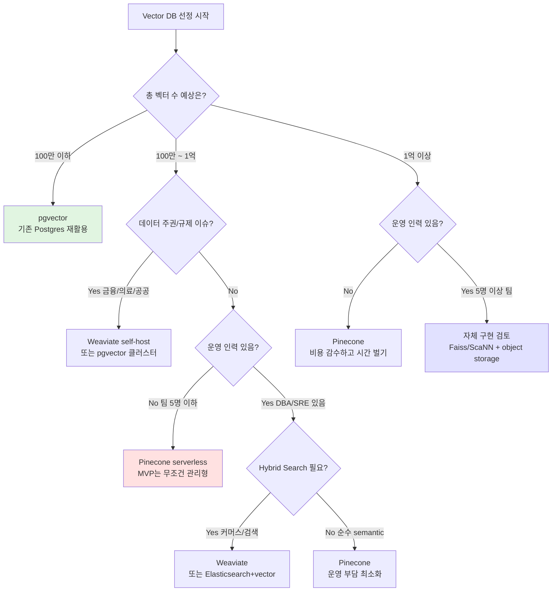

### Vector DB 선택 — "Pinecone 쓰면 안전하지"라는 관성, 그리고 pgvector로 시작한 스타트업이 3천만 벡터에서 P99 latency 800ms를 만나 야반도주한 새벽

---

#### 상황: "Vector DB 뭐 써요?"라는 질문의 함정

시니어 백엔드 개발자가 RAG 시스템을 처음 설계할 때 가장 흔히 하는 두 가지 실수가 있다.

**실수 1**: "그냥 Pinecone 쓰지, SaaS니까 편해." → 벡터 100만 개에 $70/월. 5천만 개 되면 월 $3,500. CFO가 재무제표에서 이 라인 발견하고 슬랙 DM 온다.

**실수 2**: "우린 이미 Postgres 있으니까 pgvector로." → MVP는 완벽하게 돌아간다. 벡터 3천만 개, top-k=20, HNSW index 튜닝 안 된 상태에서 P99 latency 800ms 찍고 CS팀에서 "챗봇이 왜 이렇게 느려요?" 티켓 폭주.

Vector DB 선택은 **"어떤 DB가 좋냐"의 문제가 아니라 "우리 팀의 벡터 수명주기(ingest 빈도 × 총 벡터 수 × QPS)에 어떤 아키텍처가 맞냐"의 문제**다.

---

#### 3파전: Pinecone vs Weaviate vs pgvector

```
┌─────────────────────────────────────────────────────────────────────┐
│                    Vector DB 선택의 3축                              │
├─────────────────────────────────────────────────────────────────────┤
│                                                                       │
│         운영 부담 ↑                                                    │
│              │                                                        │
│      pgvector│●                                                       │
│  (Postgres 위에)                                                      │
│              │                                                        │
│              │              ●Weaviate                                  │
│              │        (self-host or SaaS)                             │
│              │                                                        │
│              │                              ●Pinecone                 │
│              │                          (fully managed)               │
│              │                                                        │
│              └──────────────────────────────────→ 규모/성능           │
│                                                                       │
│      비용:   pgvector ≪ Weaviate self-host < Pinecone                │
│      운영:   pgvector > Weaviate self-host > Pinecone                │
│      확장성: Pinecone > Weaviate > pgvector                          │
│                                                                       │
└─────────────────────────────────────────────────────────────────────┘
```

##### 옵션 1: **pgvector** — "이미 있는 Postgres에 확장 붙이자"

```sql
CREATE EXTENSION vector;

CREATE TABLE documents (
  id BIGSERIAL PRIMARY KEY,
  tenant_id UUID NOT NULL,
  content TEXT,
  embedding vector(1536),
  metadata JSONB
);

-- HNSW index (Postgres 16+ / pgvector 0.5+)
CREATE INDEX ON documents USING hnsw (embedding vector_cosine_ops)
  WITH (m = 16, ef_construction = 64);

-- 검색
SELECT id, content, 1 - (embedding <=> $1) AS similarity
FROM documents
WHERE tenant_id = $2
ORDER BY embedding <=> $1
LIMIT 20;
```

**장점**:
- **트랜잭션과 조인**: 벡터 검색 결과에 사용자 권한 체크, 삭제 여부, 소프트 삭제 필터를 한 쿼리로. Pinecone은 metadata filter로 가능하지만 성능 페널티 큼.
- **비용**: 이미 RDS 있으면 사실상 공짜. 인스턴스 급만 좀 올리면 됨.
- **백업/복구**: `pg_dump` 하나로 끝. 재해복구 훈련 기존 프로세스 그대로.

**한계** (이게 진짜 중요):
- **HNSW 인덱스가 메모리에 안 올라가면 지옥**: 3천만 벡터 × 1536차원 × 4바이트 = **약 180GB의 raw vector**. HNSW 그래프까지 하면 250GB+. `shared_buffers`에 안 들어가면 매 쿼리 디스크 I/O.
- **build 시간**: 3천만 벡터 HNSW build에 6-12시간. index 재빌드 필요할 때(임베딩 모델 교체 등) 다운타임 각오.
- **P99 latency 지연**: 대량 write 중에는 HNSW graph 업데이트로 인해 read latency도 튄다. Postgres의 MVCC와 HNSW가 궁합이 좋지 않음.

##### 옵션 2: **Weaviate** — "self-host 가능한 벡터 특화 엔진"

```
┌──────────────────────────────────────────────┐
│              Weaviate Cluster                 │
│  ┌────────┐  ┌────────┐  ┌────────┐         │
│  │ Node 1 │  │ Node 2 │  │ Node 3 │         │
│  │ Shard  │  │ Shard  │  │ Shard  │  Raft   │
│  │  A,B   │  │  C,D   │  │  E,F   │  합의    │
│  └────────┘  └────────┘  └────────┘         │
│                                                │
│  - HNSW per shard                             │
│  - Sharding by object UUID                    │
│  - Replication factor: 3                      │
│  - GraphQL / gRPC API                         │
└──────────────────────────────────────────────┘
```

**장점**:
- **Hybrid Search 내장**: BM25 + Vector 결합이 native. (참고: [[hybrid-search-tradeoffs]])
- **Multi-tenancy 1급 시민**: 테넌트별 완전 격리된 shard. B2B SaaS에 딱.
- **모듈 시스템**: text2vec-openai, generative-cohere 등 임베딩/생성 파이프라인 통합.
- **self-host 가능**: 데이터 주권 이슈(금융/의료) 있을 때 유일한 실질적 옵션.

**한계**:
- **운영 난이도**: Kubernetes 위에서 stateful 클러스터 운영. Shard 리밸런싱, 장애 복구, 백업 자동화 다 직접.
- **schema 변경 부담**: 클래스 스키마 마이그레이션이 SQL 마이그레이션보다 정형화 덜 됨.
- **커뮤니티 규모**: Pinecone 대비 스택오버플로우 답변, 프로덕션 사례 부족.

##### 옵션 3: **Pinecone** — "그냥 API 호출하고 돈으로 해결"

**장점**:
- **serverless mode(2024~)**: 이제는 사용량 기반 과금. 유휴 시 거의 공짜.
- **초당 수만 QPS까지 auto-scaling**: 캐시 계층 없이도 P99 <50ms 유지.
- **운영 부담 0**: DBA 필요 없음. 백업/복구 걱정 없음.

**한계**:
- **비용 예측 어려움**: serverless 이후에도 read 단가 + storage 단가 + write 단가로 분리. 트래픽 튀는 날 청구서도 튐.
- **vendor lock-in**: metadata filter 문법, hybrid search 구현이 표준화 안 되어 있음. 이관할 때 재작성 각오.
- **데이터 유출 리스크**: 임베딩은 원문 복원 가능(embedding inversion attack). 규제 산업에서 SaaS 벡터 DB는 legal 승인 힘듦.
- **네트워크 latency**: 리전 다르면 RTT만 100ms+. 아시아 사용자에게 미국 리전 Pinecone은 UX 재앙.

---

#### 실제 사례: 어떤 회사가 왜 무엇을 택했나

| 회사 | 선택 | 이유 |
|------|------|------|
| **Notion AI** | 자체 구현 (Rust + Faiss + S3) | 수십억 페이지, 워크스페이스별 격리, 비용 최적화가 사업 마진 결정 |
| **Perplexity** | 자체 구현 + Turbopuffer 실험 | 실시간 웹 크롤 벡터화, 초당 수만 QPS. SaaS로는 감당 안 됨 |
| **HubSpot** | pgvector (마케팅 hub 검색) | 이미 Postgres 스택 전면 사용, CRM 데이터와 조인 필수 |
| **Instacart** | Elasticsearch + Vector | 기존 Elasticsearch 인프라 재활용, 검색팀이 하이브리드 검색 튜닝 노하우 보유 |
| **초기 스타트업들** | Pinecone 또는 Supabase(pgvector) | 팀 3명, DBA 없음, 시장 검증이 최우선 |

**Notion의 케이스가 특히 시사적**: 처음엔 Pinecone으로 시작했다가, 벡터 수가 수억 개를 넘어가면서 청구서가 인프라 예산의 40%를 차지하기 시작. Rust로 자체 벡터 검색 엔진을 만들어 S3 위에 올렸고, "cold storage에 밀어두고 필요할 때만 hot으로 승격"하는 티어링으로 비용을 1/10로 줄였다.

---

#### 시니어 결정 트리



---

#### 언제 무엇을 쓰지 말아야 하나

**pgvector를 쓰지 마라**:
- 벡터가 1억 개를 넘어가는 게 확실할 때 (index build 시간과 메모리 압박)
- write TPS가 초당 1,000 이상일 때 (HNSW 업데이트로 read latency 튐)
- 이미 Postgres 클러스터가 CPU 70% 이상 쓰고 있을 때 (벡터 워크로드가 OLTP를 밟는다)

**Weaviate를 쓰지 마라**:
- 운영 인력이 없을 때 (self-host stateful 클러스터는 진짜 힘들다)
- 벡터 수 100만 미만 (오버킬)
- 팀에 Kubernetes/Helm 자신 있는 사람 없을 때

**Pinecone을 쓰지 마라**:
- 데이터 규제가 SaaS를 막을 때 (금융 마이데이터, 의료 개인정보)
- 벡터 수 10억 이상 (비용이 자체 구현보다 커짐)
- 극도로 낮은 latency 필요 (한국 사용자에게 US-East는 부적합)
- **Vector DB 이관 계획이 아예 없을 때** (초기 lock-in을 인지하고 시작해야 함)

**자체 구현을 하지 마라**:
- 팀에 검색 엔진 만들어본 사람이 없을 때
- 총 벡터 수 1억 미만 (관리형이 훨씬 싸다)
- 사업 검증도 안 됐을 때 (product-market fit 전에 인프라 자체 구현은 자살)

---

#### 시니어가 놓치는 3가지 함정

**함정 1: 벡터 저장 비용만 계산하고 재임베딩 비용을 잊는다**  
임베딩 모델을 업그레이드하면(참고: [[embedding-model-versioning]]) 전량 재임베딩 필요. 3천만 벡터 × text-embedding-3-large 단가 = 수백만원. Vector DB 비용보다 임베딩 API 비용이 훨씬 크다는 걸 6개월 지나서 깨닫는다.

**함정 2: metadata filter의 성능 특성을 무시한다**  
"WHERE tenant_id = X AND created_at > Y"를 벡터 검색에 붙이면 pre-filter냐 post-filter냐에 따라 정확도와 latency가 100배 차이 난다. Pinecone은 pre-filter가 강하고, pgvector는 post-filter가 기본. 이걸 모르고 설계하면 top-k 결과가 텅텅 빈다.

**함정 3: backup/restore 리허설을 안 한다**  
Vector DB의 재해복구는 일반 DB와 다르다. Pinecone은 pod snapshot이 있지만 restore에 몇 시간. pgvector는 pg_dump가 되지만 HNSW index rebuild에 또 몇 시간. **연 1회는 반드시 실제 restore 훈련을 해야 한다.**

---

> 💡 **왜 중요한가**: Vector DB 선택은 "성능"의 문제가 아니라 **"우리 팀이 감당 가능한 운영 복잡도 × 예측 가능한 비용 곡선"** 의 문제이며, 잘못 고르면 이관 비용이 원래 인프라 비용의 10배가 된다.
