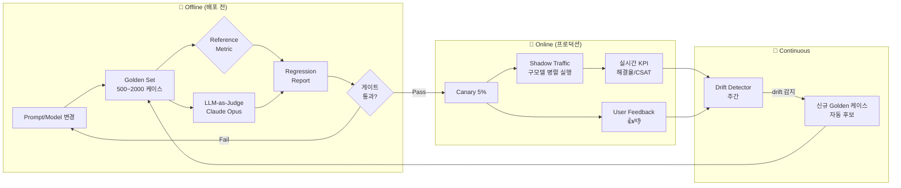

### LLM Evaluation & Regression Testing — "prompt 한 줄 바꿨더니 벤치마크가 92%로 올랐다"는 착각, 그리고 GPT-4o로 마이그레이션하며 정확도 +3%p를 자랑한 CS 챗봇 팀이 3일 만에 환불 오분류 도미노로 하루 매출 4억을 태운 새벽

---

#### 1. 문제의 근본: LLM Eval은 왜 기존 ML Eval과 다른가

전통적 ML은 `y_true`가 있다. 분류면 라벨, 회귀면 수치. `accuracy = (correct / total)` 한 줄이면 끝난다.

LLM은 **정답이 여러 개**다. "환불 정책을 요약해줘"에 대해 A안, B안, C안 모두 옳을 수 있고, "이 계약서 위험한가?"에는 뉘앙스·근거·법적 톤이 함께 채점되어야 한다. 게다가 temperature > 0이면 같은 입력이라도 답이 다르다. 즉:

| 차원 | 전통 ML | LLM |
|---|---|---|
| 정답 | 단일 라벨 | 다중 정답 + 스타일·근거·톤 |
| 결정성 | 결정론적 | 확률적 (seed 고정해도 provider가 배포 바꾸면 흔들림) |
| 평가 대상 | 모델 하나 | prompt + model + tools + RAG + guardrails **전체 파이프라인** |
| 회귀 | test set으로 검증 | prompt 한 글자만 바꿔도 downstream 전체가 뒤틀림 |
| 비용 | 무료 (CPU) | LLM-as-Judge 돌리면 배포당 수백~수천 달러 |

핵심 함정: **"모델을 업그레이드했다"가 아니라 "파이프라인 전체를 교체했다"**로 봐야 한다. GPT-4 → 4o는 tokenizer, tool schema 해석, JSON 준수율, 거절 스타일이 전부 바뀐다. 벤치마크 하나가 올랐다고 프로덕션이 좋아졌다는 보장은 **전혀 없다**.

---

#### 2. Eval의 4가지 층위 — 무엇을 어디서 재는가

```
┌─────────────────────────────────────────────────────────────┐
│  Layer 4: Business KPI (해결율, 이탈률, CSAT, 환불 이의제기)   │  ← 진짜 목표
├─────────────────────────────────────────────────────────────┤
│  Layer 3: Task Success  (end-to-end: "환불 요청 → 승인 완료")  │  ← 시나리오 통과 여부
├─────────────────────────────────────────────────────────────┤
│  Layer 2: Component Quality (RAG recall, tool 정확도, JSON 유효)│  ← 부품별 품질
├─────────────────────────────────────────────────────────────┤
│  Layer 1: Unit Assertion (금지어, PII 마스킹, 문자수, schema)  │  ← 규칙 기반
└─────────────────────────────────────────────────────────────┘
```

대부분의 팀이 Layer 1~2만 잰다. 그러고는 "정확도 92%"라고 발표하며 배포한다. 문제는 **Layer 3, 4에서 무너진다**는 것.

- Layer 1은 `assert` 문. CI에서 초 단위.
- Layer 2는 golden set + reference metric (Recall@K, F1). 분 단위.
- Layer 3은 시나리오 다이얼로그를 재생하며 마지막 상태를 검증. 시간 단위.
- Layer 4는 실제 프로덕션 A/B, shadow traffic. 주 단위.

**시니어의 판단**: 정확도라는 단일 숫자에 속지 마라. Layer별로 분리해 리포트하고, 배포 게이트는 **가장 아래 층부터** 통과시켜라.

---

#### 3. Eval 파이프라인 아키텍처 (Offline + Online + Continuous)



핵심은 **golden set이 살아있는 데이터셋**이라는 점이다. 프로덕션에서 실패한 케이스가 발견되면 → 즉시 golden에 추가 → 다음 배포부터 회귀 테스트에 포함. 이게 없으면 같은 버그가 6번씩 재발한다.

---

#### 4. LLM-as-Judge — 편해 보이지만 밟기 쉬운 지뢰

가장 흔한 패턴: "Claude에게 답변 A와 B 중 어느 게 더 좋은지 물어본다."

```python
JUDGE_PROMPT = """
다음 두 답변을 [정확성, 유용성, 톤] 기준으로 채점하라.
각 항목 1~5점, JSON으로 출력.

질문: {q}
답변 A: {a}
답변 B: {b}
"""
```

세 가지 함정:

1. **Position bias**: A/B 순서를 바꾸면 결과가 뒤집힌다. → 항상 양방향 평가 후 평균.
2. **Verbosity bias**: 긴 답을 좋게 본다. → 길이 정규화 or 명시적 감점 룰.
3. **Self-preference bias**: GPT judge는 GPT 답변을 편애한다. → judge와 평가 대상 모델을 **다른 vendor**로.

그리고 결정적: **Judge 모델 자체가 버전업되면 과거 점수와 비교 불가**. 92점이 90점이 됐을 때, 실제 품질이 나빠진 건지 judge 기준이 엄격해진 건지 알 수 없다.

**해결**: judge 모델 버전 pin + rubric에 예시 답변(anchor sample) 3개 포함 + 주기적으로 human eval 100건과 상관계수 재확인.

---

#### 5. 실제 사례 — 어떤 회사가 왜 이 방식을 택했는가

**OpenAI Evals (오픈소스)**  
`registry/evals/*.yaml`에 시나리오를 선언적으로 등록하고, `match / includes / model-graded` 세 가지 채점 방식을 조합. GPT-5 학습 파이프라인에서 매 체크포인트마다 수천 개 eval을 돌리는 인프라. 시사점: **eval은 코드가 아니라 데이터**로 관리해야 스케일한다.

**Anthropic Model Card + Constitutional AI eval**  
새 Claude 배포 전 수십 개 카테고리(수학, 코딩, 안전성, 거절률)에서 이전 버전과 비교 리포트를 만든다. 특히 **거절률 회귀**를 감시 — Sonnet 4.5에서 "정당한 요청을 거절하는 케이스"가 늘어난 게 여기서 잡혔다.

**Klarna의 CS 챗봇** (2024)  
CS 700명 분량 대체를 발표하며 "resolution time 11분 → 2분, 24개 언어, CSAT 동등"이라는 KPI를 공개. 이건 Layer 4 지표를 정직하게 잰 사례. 반대로 이걸 안 재고 "hallucination 낮췄어요"만 발표한 팀들은 6개월 후 조용히 롤백했다.

**Cursor / GitHub Copilot의 벤치마크**  
HumanEval 같은 공개 벤치는 오염(contamination)됐다는 걸 알기에, **자체 private repo에서 실제 PR 완료율**을 잰다. Copilot Workspace 팀은 "issue → PR merge까지 성공률"이라는 Layer 3 지표를 내부 규정 통과 기준으로 삼는다.

**Braintrust / LangSmith / LangFuse**  
셋 다 "실험(prompt/model 변경) → eval run → 이전 실험과 diff" 워크플로에 집중. 특히 LangFuse는 오픈소스라 self-host 가능해 금융권/의료에서 채택. LangSmith는 LangChain trace와 자연 통합되어 agent 시스템에 유리.

---

#### 6. Regression Suite — Prompt 한 글자가 무너뜨리는 것

핵심 발상: **버그가 하나 발견될 때마다 golden 케이스로 화석화**한다.

```
tests/regression/
├── refund/
│   ├── R-2026-0714-double-refund.json     # "이미 환불된 건 재환불 요청" 케이스
│   ├── R-2026-0801-partial-refund.json
│   └── R-2026-0812-cross-currency.json
├── shipping/
│   └── S-2026-0829-holiday-eta.json
└── golden.jsonl   # 전체 회귀 셋 (배포 게이트)
```

각 파일은 `{input, expected_behavior, forbidden_behavior, judge_rubric}` 구조. `expected="환불 정책 3조 참조 + 이의제기 링크 제공"`, `forbidden="즉시 환불 승인"`.

이걸 안 하면 어떻게 되는가 — **부제의 새벽이 온다**:

> CS 챗봇 팀이 GPT-4 → 4o 전환으로 벤치마크 89% → 92%를 자랑하며 금요일 밤에 배포. 주말 동안 환불 요청 중 "이미 환불된 건"을 재승인하는 케이스가 급증. 4o는 4보다 `tool_choice` 순종률이 낮아, 시스템 프롬프트의 "먼저 환불 이력을 조회하라"를 스킵하고 바로 approve tool을 호출. golden set에는 이 시나리오가 없었다. 월요일 오전 CFO 방에서 "정확도 3%p 올랐다면서요?" 소리와 함께 하루 매출 4억. 그 뒤로 team charter 첫 줄: **"신규 모델은 회귀 셋 통과 없이는 5% canary도 금지"**.

---

#### 7. Prompt/Model Versioning — 재현 가능성의 최저선

배포된 답변 하나를 두고 "왜 이렇게 답했지?"를 3주 후에도 재현할 수 있어야 한다. 최소 저장:

| 필드 | 예시 |
|---|---|
| `prompt_id` | `refund-classifier@v37` |
| `prompt_hash` | `sha256:a91f…` |
| `model` | `claude-opus-4-7-20260812` |
| `temperature/top_p` | `0.2 / 0.95` |
| `tools_schema_hash` | `sha256:c73b…` |
| `rag_index_version` | `kb-2026-09-01` |
| `judge_version` | `claude-sonnet-4-6@rubric-v3` |

이 6가지가 없으면 "그때 그 답변"은 복원 불가. Git-like 시맨틱으로 prompt를 관리하는 게 표준(PromptLayer, Braintrust, 자체 구축). **핵심은 "prompt를 코드처럼 리뷰·태그·롤백"** 가능한 상태로 만드는 것.

---

#### 8. 트레이드오프

| 축 | 얕게(가벼움) | 깊게(무거움) |
|---|---|---|
| Golden set 크기 | 50건, 스팟체크 | 5,000건, 세그먼트별 분포 |
| Judge | 룰 기반 assertion | LLM-as-Judge + human 10% 샘플 |
| 빈도 | PR마다 | PR + 나이틀리 + 프로덕션 shadow |
| 비용 | ~$0/월 | 수천 달러/월 (judge 호출료) |
| 리드타임 | 배포 즉시 | 게이트당 30분~수시간 |
| 잡히는 회귀 | 명백한 버그 | 미묘한 톤·거절률·bias drift |

**시니어의 판단 축**:
- 사용자 영향 대칭성이 큰가? (금융/의료/법률 → 무겁게)
- 답변이 downstream 액션을 트리거하는가? (환불 승인, DB 쓰기 → 무겁게)
- 개인화·다국어·긴 대화가 있는가? (분포 폭발 → 세그먼트 분리 필수)

---

#### 9. 언제 쓰고, 언제 쓰면 안 되는가

**써야 한다 (Non-negotiable)**  
- 프로덕션 사용자에게 **자동 액션**을 취하는 agent (환불, 예약, 코드 커밋)
- **규제 산업** (금융/의료/법률) — audit 요구가 있는 순간 재현 가능성이 법적 요건
- **여러 팀이 같은 prompt·모델을 공유** — 누군가의 개선이 남의 회귀가 되는 구조
- **RAG · Multi-Agent · Tool Use** 결합 — 조합 폭발이 스팟체크로 커버 불가

**쓰지 마라 (또는 최소화)**  
- **주말 해커톤 MVP, 초기 프로토타입** — golden set 만들 시간에 사용자 인터뷰 하나 더
- **10명 미만 사내 도구** — 사람이 눈으로 보고 슬랙에 피드백하는 게 더 빠름
- **1회성 배치 작업** — 결과를 사람이 검수하는 워크플로면 사후 검토가 eval
- **정답이 진짜로 없는 창작 도메인** — reference metric 무의미, human eval에 리소스 몰빵

**공통 안티패턴**  
- "벤치마크 하나로 배포 결정" — Goodhart's law. 여러 지표 + 세그먼트별 리포트.
- "eval 파이프라인은 있는데 아무도 안 봄" — 리포트를 슬랙/PR comment에 자동 게시.
- "judge 모델을 계속 최신 버전으로 업데이트" — 과거와 비교 불가. **judge는 pin, 별도 마이그레이션 이벤트**로.
- "human eval을 한 번 하고 끝" — 분기 1회는 최소. 판단 기준 자체가 drift한다.

---

#### 10. 요약 — 시니어 백엔드가 남길 3줄

1. **"정확도"라는 단일 숫자는 마케팅용**이고, 배포 게이트는 세그먼트·시나리오·비즈니스 KPI 3층 분리로 판단한다.
2. **Golden set은 코드가 아니라 살아있는 데이터**다. 프로덕션 실패 → golden 추가 → 다음 배포부터 회귀 방지, 이 루프가 없으면 같은 버그가 6번 재발한다.
3. **Prompt·모델·judge·RAG 인덱스는 모두 버전 pinning**. 3주 후 "왜 이렇게 답했지?"에 답할 수 없으면 audit도 debug도 불가능하다.

> 💡 **왜 중요한가**: LLM 시스템은 "돌아간다 ≠ 좋아졌다"가 성립하는 유일한 백엔드 스택이며, 이 갭을 메우는 유일한 방법이 층위별 eval과 살아있는 회귀 셋이다.
