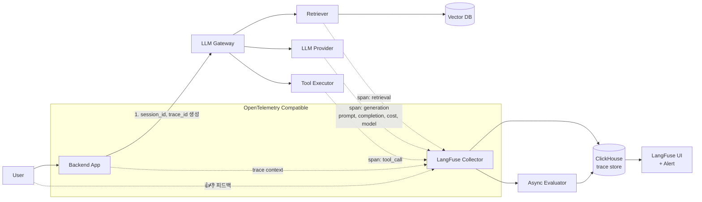

### AI Observability (LangSmith · LangFuse) — "Datadog 있는데 굳이?"라는 안일함, 그리고 프로덕션 챗봇의 hallucination이 3주째 12% → 34%로 올라가는데 아무도 눈치 못 챈 새벽

---

#### 1. 문제의 시작 — "HTTP 200 = 성공"이라는 오래된 착각

전통적인 APM(Datadog, New Relic, Grafana)은 이런 신호를 잘 잡는다.

- P99 latency
- Error rate (HTTP 5xx)
- Throughput
- CPU / memory / GC

그런데 LLM 시스템에서 이 지표들은 **전부 초록불인데 서비스가 죽어있는 상황**이 흔하다. 왜냐하면:

- **응답이 오긴 왔지만 틀렸다** (hallucination)
- **응답이 문법적으로 맞지만 tool call schema를 못 지켜서** downstream에서 조용히 fail
- **retrieval은 성공했지만 top-1 chunk가 질문과 무관** (semantic drift)
- **agent가 tool을 23번 호출했지만 결국 결론 못 냄** (loop divergence)
- **cost는 정상인데 token 낭비가 3배** (prompt bloat)

이 중 어느 것도 5xx로 잡히지 않는다. 그래서 **LLM 전용 관측(Observability)** 이 필요하다.

---

#### 2. 전통 APM vs LLM Observability — 관측 단위가 다르다

```
[전통 APM]                    [LLM Observability]
──────────────                ──────────────────────
Service                       Session (사용자 대화 전체)
  ├─ Request                    └─ Trace (한 turn = 한 질문에 대한 응답 전 과정)
  │    ├─ HTTP status                ├─ Span (retrieval)
  │    ├─ latency                    │    ├─ vector search
  │    └─ error                      │    └─ rerank
  └─ Log                             ├─ Span (agent step 1)
                                     │    ├─ Generation (LLM call)
                                     │    │    ├─ prompt (input tokens)
                                     │    │    ├─ completion (output tokens)
                                     │    │    ├─ model version
                                     │    │    ├─ latency
                                     │    │    └─ cost ($0.0032)
                                     │    └─ Tool call
                                     └─ Span (agent step 2)
                                          └─ ...
                                     [User Feedback: 👍/👎, score]
                                     [Eval Result: faithfulness=0.72]
```

핵심 차이: **LLM은 "한 번의 응답"이 단일 API call이 아니라 여러 LLM/tool/retrieval의 트리 구조**다. 그리고 각 노드마다 **비결정적(non-deterministic)** 이라 같은 입력에도 다른 결과가 나온다. 그래서 관측은 "이게 왜 이런 답을 만들었는가"를 **재구성(replay)** 할 수 있어야 한다.

---

#### 3. LangSmith vs LangFuse — 무엇이 다른가

| 항목 | LangSmith (LangChain 팀) | LangFuse (오픈소스) |
|---|---|---|
| 라이센스 | 상용 SaaS (self-host = Enterprise) | Apache 2.0, self-host 무료 |
| 통합 | LangChain / LangGraph 네이티브 | 프레임워크 무관 (SDK만 있으면 OK) |
| Trace 저장 | LangChain 클라우드 | ClickHouse (self-host 시) |
| Prompt Playground | 강력함 (dataset + eval 통합) | 있음 |
| Eval 프레임워크 | LangChain evaluators 내장 | Ragas, custom eval 연동 |
| PII / 데이터 주권 | 미국 SaaS에 프롬프트 원문 전송 | on-prem 배포 가능 |
| 가격 | 사용량 기반 ($0.50/1k trace 급) | self-host = infra 비용만 |
| 성숙도 | LangChain 생태계에 강함 | 프레임워크 중립, 커뮤니티 성장 중 |

**시니어의 선택 기준**:

- **금융 · 의료 · 국내 규제 산업** → LangFuse self-host. 프롬프트에 개인정보/거래정보 들어가는 순간 SaaS로 나가면 컴플라이언스 지옥.
- **스타트업 초기 · LangChain 스택 · 빠른 iteration** → LangSmith. dataset ↔ eval ↔ playground 왕복이 가장 매끄럽다.
- **멀티 프레임워크 (LlamaIndex + LangGraph + 직접 SDK 혼용)** → LangFuse. 프레임워크 lock-in 없음.

---

#### 4. 실전 아키텍처 — Trace가 만들어지는 흐름



핵심 설계 포인트:

1. **trace_id는 request 진입 시점에 발급하고 모든 하위 호출에 propagate**. OpenTelemetry context와 동일한 사상.
2. **Generation span에는 반드시 `model + version + params(temperature, max_tokens)` 포함**. 이게 없으면 "왜 어제는 잘 되던 게 오늘 이상하지?"에 답할 수 없다.
3. **비동기 flush**. LLM 호출 critical path에 관측 저장이 끼면 latency가 튄다. queue + background worker로 분리.
4. **User feedback(👍/👎, 별점)을 trace_id로 join**. 나중에 "낮은 평점 대화만 모아서 데이터셋으로" 뽑을 수 있다.

---

#### 5. 실제 사례 — 왜 이걸 안 넣으면 죽는가

**Klarna (2024)**: AI 어시스턴트가 CS 티켓 700명 상당의 업무를 대체한다고 발표. 뒤에는 LangSmith 기반 trace + 지속 eval 파이프라인이 있었다. 매일 수백만 대화에서 "고객이 결국 사람 상담사로 escalate 한 turn"을 자동 태깅 → 다음날 재학습 데이터로. 관측 없이는 이 loop이 불가능하다.

**Elastic**: 자사 AI 어시스턴트에 LangFuse self-host. 이유는 명확 — 고객이 자기네 로그(PII 포함)를 질의하는데, 그 prompt가 SaaS 관측 서비스로 나가면 계약 위반. self-host는 선택이 아니라 필수였다.

**국내 대형 커머스 챗봇 (익명)**: Datadog으로 latency만 보고 있다가, 3주 동안 hallucination이 12% → 34%로 올라간 걸 놓쳤다. 원인은 vendor가 GPT-4o의 minor version을 조용히 롤아웃 → prompt와 미묘하게 안 맞기 시작. 발견은 CS로 들어온 환불 요구 폭증 후. LangFuse 도입 후 첫 주에 잡아낸 이슈만 4건.

---

#### 6. 시니어가 반드시 챙겨야 할 4가지

##### (1) Sampling 전략 — 100% trace는 파산이다

하루 100만 turn * 평균 5 span = 500만 span/일. 그대로 저장하면 스토리지 + 인덱싱 비용이 LLM 비용을 넘는다.

```
- 100% trace: 에러/timeout/tool_error/user_downvote
- 20% trace: cost > $0.10 인 요청
- 5% trace: 정상 요청 (baseline)
- 100% trace: 특정 실험군 (A/B test cohort)
```

##### (2) PII 마스킹은 SDK 레이어에서

Trace에 주민번호, 카드번호가 그대로 들어가면 관측 시스템 자체가 개인정보 저장소가 된다. `beforeSend` hook에서 정규식/named entity로 마스킹. LangFuse SDK는 `mask` 함수 파라미터 제공.

##### (3) Eval을 trace에 붙여야 진짜 관측이 완성된다

Trace만 쌓으면 "무슨 일이 일어났는지"만 보인다. 여기에 **비동기 eval** — faithfulness, answer relevancy, context precision (Ragas 지표) — 을 붙여서 trace 옆에 score로 저장해야 "얼마나 잘 됐는지"가 보인다. 그래야 회귀 감지 가능.

##### (4) Prompt versioning과 연결하라

Trace에 `prompt_version: v2.3.1` 필드가 없으면, prompt 배포 후 품질이 떨어져도 "v2.3.0과 v2.3.1 중 뭐가 나빴는지"를 못 가른다. LangSmith/LangFuse 둘 다 prompt registry를 자체 제공 → **prompt는 코드가 아니라 배포 가능한 아티팩트**로 다뤄야 한다.

---

#### 7. 언제 쓰고, 언제 쓰면 안 되는가

**써야 할 때**:
- 프로덕션 LLM 서비스가 하루 1,000 turn 이상
- 응답 품질이 매출/컴플라이언스에 직결 (CS, 의료, 금융, 법률)
- Prompt · model · retriever를 자주 iterate 하는 팀
- Multi-agent / RAG / tool use 등 span이 여러 개인 복합 시스템

**안 써도 되는 때 (혹은 오버스펙)**:
- 사내 프로토타입, 데모용 챗봇
- 단순 wrapper (LLM 한 번 호출 → 그대로 반환)
- 이미 자체 ML platform(예: Uber Michelangelo급)이 성숙해서 커스텀이 유리한 조직
- 규제로 인해 모든 관측 데이터를 특정 리전에 묶어야 하는데 SaaS가 그 리전 미지원인 경우 (→ 이땐 self-host LangFuse만 답)

**흔한 실수**:
- APM(Datadog)에 LLM span까지 억지로 태워서 span 폭증 → Datadog 비용이 LLM 비용의 2배가 되는 사고. → 관측은 관측 전용 스택으로 분리.
- Trace는 쌓는데 아무도 안 봄. → 반드시 **quality regression alert**(예: 지난 7일 대비 faithfulness가 5%p 이상 하락 시 Slack)을 걸어야 관측이 살아있게 된다.

---

> 💡 **왜 중요한가**: LLM 시스템에서 "장애"는 5xx가 아니라 **품질의 조용한 하락**으로 온다 — Observability가 없으면 그 하락을 CS 티켓 폭증으로 뒤늦게 알게 된다.
