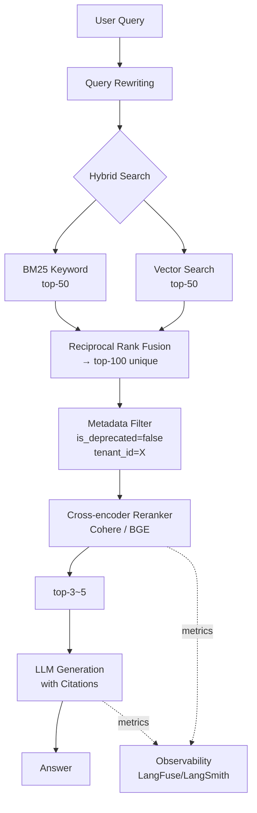

### Reranker (2-Stage Retrieval) — "top-k=20 뽑아서 컨텍스트에 다 밀어넣으면 되지"라는 낭비, 그리고 3개월 전 폐지된 환불 정책 문서가 top-3에 섞여 챗봇이 "30일 내 전액 환불 가능합니다"를 자신 있게 답변한 새벽

## 1. 사건: Vector Search만으로는 부족했다

한 D2C 커머스 스타트업. RAG 챗봇을 6개월 운영하며 자신 있게 이렇게 말했다.

> "우리 pgvector에 정책 문서 다 넣었고, top-k=10으로 뽑아서 GPT-4o에 넣습니다. Faithfulness 스코어 87%. 잘 돌아요."

**어느 새벽, CS 팀장이 전화한다.**

> "환불 요청 12건이 승인됐는데, 우리 3개월 전에 30일 환불 → 7일 환불로 바꿨잖아요. 챗봇이 왜 30일이라고 답한 거죠?"

로그를 열어본다. Vector search가 top-10으로 반환한 문서 중:
- **top-1**: `refund_policy_v3_deprecated_20260601.md` (cosine 0.89) ← **폐지된 문서**
- **top-2**: `refund_policy_v4_current.md` (cosine 0.87) ← **현행 문서**
- top-3~10: FAQ, 배송정책, 회원약관 등 관련 없는 문서

Cosine similarity 0.02 차이. Embedding model 입장에서 "폐지" 태그나 파일명은 의미 벡터에 거의 영향이 없었다. LLM은 top-1을 보고 정직하게 답변했다.

**Vector search는 "의미가 비슷한 것"을 찾는다. "정답인 것"을 찾지 않는다.** 이 둘은 다르다.

---

## 2. 왜 Single-Stage Retrieval이 무너지는가

Bi-encoder(embedding model)는 쿼리와 문서를 각각 **독립적으로** 벡터화한다.

```
Query:    "환불 얼마나 걸려?" ──[Bi-encoder]──► [0.12, 0.88, ...]
Doc A:    "환불은 7일 이내"  ──[Bi-encoder]──► [0.15, 0.85, ...]
Doc B:    "환불은 30일 이내" ──[Bi-encoder]──► [0.14, 0.86, ...]
                                                    │
                                                    ▼
                                          cosine(A) = 0.91
                                          cosine(B) = 0.93  ← 미묘한 차이
```

두 문서는 **의미론적으로 거의 같다**. Embedding space에서는 "7일"과 "30일"의 차이가 손실된다. 정확한 숫자, 날짜, 버전, 폐지 여부 같은 **discriminative signal**이 384~1536차원 벡터로 압축되면서 뭉개진다.

여기가 시니어가 알아야 하는 지점이다: **RAG의 병목은 "찾기(recall)"가 아니라 "고르기(precision)"다.** Vector search로 top-20을 뽑는 건 쉽다. 그중 진짜 정답인 top-3을 고르는 건 다른 문제다.

---

## 3. 해법: 2-Stage Retrieval (Retrieve → Rerank)

```
┌─────────────────────────────────────────────────────────────┐
│                     User Query                              │
│              "환불은 며칠 걸려요?"                            │
└──────────────────────┬──────────────────────────────────────┘
                       │
        ┌──────────────▼──────────────┐
        │  Stage 1: Retrieval (fast)  │
        │  Bi-encoder + Vector DB     │
        │  → top-100 candidates       │
        │  → ~50ms                    │
        └──────────────┬──────────────┘
                       │
        ┌──────────────▼──────────────┐
        │  Stage 2: Reranking (slow)  │
        │  Cross-encoder              │
        │  → top-3~5 (재정렬)         │
        │  → ~200ms                   │
        └──────────────┬──────────────┘
                       │
        ┌──────────────▼──────────────┐
        │      LLM Context Window     │
        │   (오염 없는 정확한 문서)    │
        └─────────────────────────────┘
```

**핵심 차이 — Bi-encoder vs Cross-encoder:**

```
┌─ Bi-encoder (Stage 1) ────────────────────────┐
│                                               │
│   Query ──► [Encoder] ──► Vec_Q               │
│   Doc   ──► [Encoder] ──► Vec_D               │
│                                               │
│   Score = cosine(Vec_Q, Vec_D)                │
│                                               │
│   ✓ 문서 임베딩은 미리 인덱싱 가능              │
│   ✓ Query time: dot product 한 번             │
│   ✗ Query-Doc 간 상호작용 정보 손실           │
└───────────────────────────────────────────────┘

┌─ Cross-encoder (Stage 2) ─────────────────────┐
│                                               │
│   [Query, Doc] ──► [Encoder] ──► Score        │
│                                               │
│   ✓ Query-Doc 토큰 간 attention 계산         │
│   ✓ 정확도 압도적으로 높음                    │
│   ✗ Query마다 모든 후보 문서로 forward pass  │
│   ✗ 100개 문서 = 100번 추론                  │
└───────────────────────────────────────────────┘
```

Cross-encoder는 쿼리와 문서를 **함께** 입력받아 attention을 계산한다. "환불 얼마나 걸려?"와 "환불은 7일 이내"가 매칭되는지, 어떤 토큰이 얼마나 관련 있는지를 직접 본다. 대신 문서마다 forward pass를 돌려야 하니 100만 문서에 대해 이걸 하면 죽는다. 그래서 **"많이 → 정확히"의 2단계 파이프라인**이 필요하다.

---

## 4. Production Reranker 옵션

| Reranker | 방식 | Latency (per query, 100 docs) | 비용 | 강점 |
|---|---|---|---|---|
| **Cohere Rerank 3.5** | API | ~150ms | $2 / 1K searches | 다국어 지원, 별도 인프라 X |
| **BGE-reranker-v2-m3** | 오픈소스 self-host | ~300ms (GPU) | GPU 비용 | 온프렘, 데이터 유출 X |
| **ColBERTv2** | Late interaction | ~50ms | 인덱스 저장공간 ↑↑ | 빠른 reranking, 인덱스 커짐 |
| **Cross-encoder/ms-marco-MiniLM** | 오픈소스 소형 | ~100ms (CPU) | 저렴 | 소규모, 영어 위주 |
| **Jina Reranker v2** | API | ~120ms | $ | 다국어, 코드 리랭킹 지원 |

**Cohere Rerank의 실측 개선치 (공개된 벤치마크 기준)**:
- Vector-only: NDCG@10 ≈ 0.42
- Vector + Rerank: NDCG@10 ≈ 0.61 (**+45%**)

숫자 하나에 안 넘어가도, 요지는 이거다: **top-100 → top-5로 좁혀낼 때 정확도가 극적으로 올라간다.**

---

## 5. 실제 사례: 누가 왜 이 패턴을 택했나

**① Perplexity AI**
- 웹 검색 결과(수천 개) → Cohere Rerank로 top-10 → LLM 답변 생성
- 왜? 웹 검색은 recall이 높지만 (관련 페이지 다 긁어옴) precision이 낮다. Rerank가 없으면 스팸/광고 페이지가 컨텍스트를 오염시킨다.

**② Notion AI Q&A**
- 워크스페이스 내 수만 개 문서에서 검색 → Reranker로 top-3
- 왜? 문서 제목, 태그, 최근 편집자 같은 signal이 embedding에 다 안 잡힌다. Reranker가 "질문에 대해 이 문서가 실제로 답이 되는가"를 다시 판단.

**③ GitHub Copilot Chat (repo 컨텍스트)**
- Repo 파일 검색 → semantic search → reranker → LLM
- 왜? "auth 함수 어디 있어?"에 대해 `authService.ts`와 `authService.test.ts`가 둘 다 top-5에 뜬다. Reranker가 "실제 구현 vs 테스트"를 구분해준다.

**④ Anthropic의 자체 문서 검색 (docs.anthropic.com)**
- Contextual Retrieval + BM25 + Reranking을 조합한 파이프라인 공개.
- Retrieval 실패율이 rerank 도입만으로 절반 이하로 떨어졌다는 리포트.

---

## 6. Tradeoff: 언제 쓰고 언제 쓰면 안 되는가

### 반드시 써야 하는 경우

- **문서 수가 많고 유사 문서가 많은 도메인**: 법률(조항 유사도 높음), 의료(증상 겹침), 상품 카탈로그(SKU 유사)
- **정확한 사실이 중요한 도메인**: 환불 정책, 규정 준수, 재무 데이터
- **버전이 있는 문서**: 폐지된 정책 vs 현행 정책 (앞서 본 사례)
- **Multi-hop 질문**: "A와 B의 차이는?" 같은 질문은 top-1만으로 답 못 함, 관련 문서 여러 개를 정확히 골라야 함

### 안 쓰거나 신중해야 하는 경우

- **초저지연 서비스 (P99 < 100ms 필요)**: Reranker가 100~300ms를 잡아먹는다. 채팅 UI는 괜찮지만 실시간 검색 자동완성은 무리.
- **문서 수가 극소수 (< 100개)**: 그냥 top-10 다 LLM에 넣는 게 저렴하고 정확할 수 있다.
- **Exact match가 지배적인 검색**: 상품코드, SKU, 사번, 주문번호 검색은 BM25 + Hybrid Search가 답이지 rerank가 답이 아니다.
- **Batch/background 작업**: 배치 파이프라인에서 top-k만 뽑아 후속 처리하는 경우, cross-encoder의 정확도 이득이 배치 시간 증가 대비 별로일 수 있음.

### 조합의 위험

- **Semantic Cache + Rerank 순서**: Semantic cache가 rerank 결과를 캐싱하는지, retrieval 결과를 캐싱하는지가 다르다. 잘못 캐싱하면 오래된 rerank 결과가 재사용되며 정책 변경이 반영 안 됨.
- **Hybrid Search + Rerank**: BM25 + Vector 결과를 reciprocal rank fusion으로 합친 뒤 rerank가 정석. 순서 바꾸면 이득 반감.

---

## 7. 시니어 관점 체크리스트

프로덕션 RAG에 rerank 도입 전 반드시 확인:

- [ ] **정확도 게이팅**: Reranker 도입 전/후 NDCG@k, MRR을 실제 QA 데이터셋으로 측정. "감으로 좋아졌다"는 금지.
- [ ] **Latency budget**: E2E P99 latency에서 rerank가 차지하는 몫을 명시. LLM 응답 3초 중 rerank 300ms는 괜찮음. 검색 API 500ms 예산에 rerank 300ms는 파산.
- [ ] **Fallback 경로**: Cohere/Jina API 장애 시 rerank 없이 vector-only로 degrade할 수 있는지. Reranker를 hard dependency로 만들면 SPOF.
- [ ] **비용 모델링**: API rerank는 쿼리당 비용. QPS 급증 시 청구서 폭발. Self-host는 GPU 인프라 비용. 손익분기 QPS 계산 필수.
- [ ] **top-k 튜닝**: retrieval top-k와 rerank output top-k를 별도 튜닝. retrieval=100, rerank=5가 관례지만 도메인마다 다름.
- [ ] **문서 메타데이터 활용**: `is_deprecated`, `version`, `updated_at` 같은 필드로 pre-filtering을 먼저 하고 rerank로 넘겨야 함. Rerank가 만능이 아니라 "이미 걸러진 후보 중 최적을 고르는 심판"임을 잊지 말 것.

---

## 8. 마무리 다이어그램: 완성된 프로덕션 RAG 파이프라인



Vector search 단일 스테이지는 데모용이다. 프로덕션은 **Retrieve → Filter → Rerank → Generate** 4단이 최소 골격이다. Rerank는 이 중 정확도의 대부분을 담당하는 스테이지다.

앞서 본 환불 정책 사고로 돌아가면 — 만약 rerank 이전에 `is_deprecated=false` metadata filter만 있었어도 사고는 안 났다. Rerank가 있었다면 폐지 문서와 현행 문서 사이 미묘한 표현 차이를 cross-attention으로 잡아냈을 것이다. 둘 중 하나라도 있었으면 됐다. 아무것도 없었기 때문에 새벽 3시에 CS 팀장의 전화를 받은 것이다.

> 💡 **왜 중요한가**: RAG의 정확도 병목은 "찾기(recall)"가 아니라 "고르기(precision)"이며, Bi-encoder만으로는 절대 이 병목을 못 뚫는다 — Cross-encoder Reranker는 선택이 아니라 프로덕션 RAG의 필수 스테이지다.
