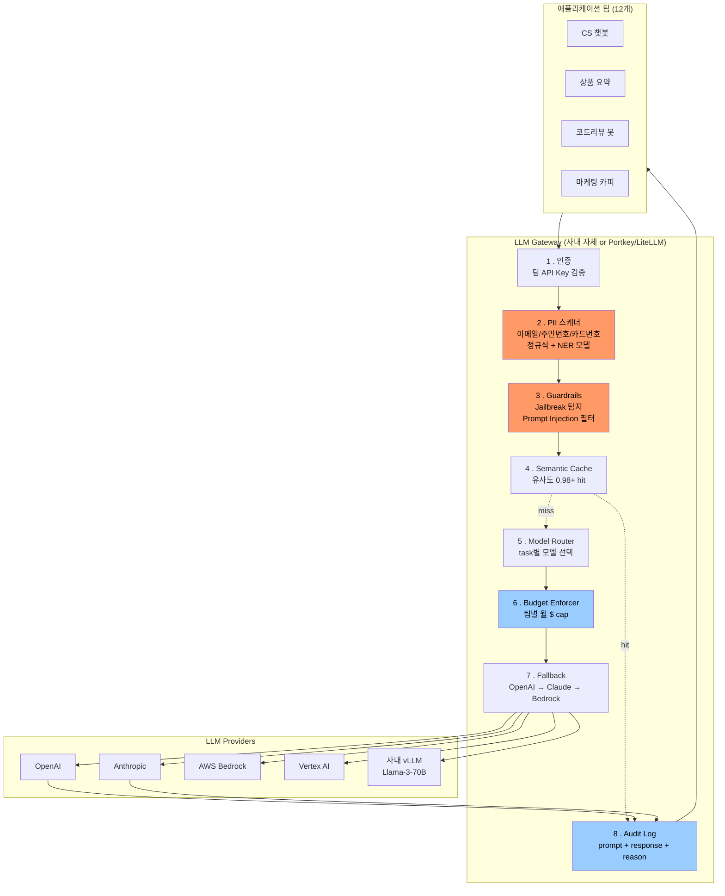

### LLM Gateway 패턴 — "각 팀이 OpenAI SDK 직접 쓰면 되지"라는 방임, 그리고 마케팅 인턴이 고객 이메일 12만 건을 GPT-4 프롬프트에 밀어넣어 GDPR 조사 3개월 + 로펌 비용 4억을 만든 새벽

## 사건 재구성 (2026-04-13, 유럽 D사, 이커머스 스타트업)

새벽 3시. 마케팅팀 인턴이 "이메일 개인화 캠페인" 프롬프트를 튜닝하다가 사무실 노트북 앞에서 이런 코드를 돌린다.

```python
# 인턴의 로컬 스크립트
import openai
df = pd.read_csv("customer_export_full.csv")  # PII 마스킹 안 됨

for row in df.itertuples():
    prompt = f"""
    다음 고객에게 보낼 재구매 유도 이메일 초안을 작성해줘.
    고객명: {row.name}
    이메일: {row.email}          # ← 여기가 지옥의 문
    최근 구매: {row.last_order}
    ...
    """
    openai.chat.completions.create(model="gpt-4o", messages=[...])
```

12만 건이 순차적으로 OpenAI 서버로 전송됨. 하필 그 시점 OpenAI Enterprise 아닌 일반 API 계정. 로그 보존 30일. **CSV의 email 컬럼이 프롬프트 본문으로 그대로 나감**.

3주 뒤 데이터 보호 담당자가 발견. GDPR Article 33 통보 의무 발동 (72시간 룰은 이미 지남 → 추가 위반).
- 조사 3개월, 사내 리소스 2 FTE 소모
- 로펌 비용 4억 5천
- 벌금 협상 진행 중 (연매출 4% 상한 = 잠재 최대 60억)
- 관련 임원 2명 사임

**근본 원인**: 12개 개발팀이 각자 OpenAI 키를 재무팀에 신청해서 직접 발급받음. 누가 언제 어떤 프롬프트를 보내는지 **아무도 모름**. PII 스캐너 없음, 팀별 사용량 캡 없음, 프롬프트 감사 로그 없음, 심지어 어떤 팀이 어떤 모델을 쓰는지도 파악 불가. AI 거버넌스는 "각자 알아서 잘 쓰세요" 그 자체.

인턴 한 명 실수가 아니다. **"각 팀이 SDK 직접 쓰면 되지"라는 아키텍처 선택이 이 사고를 예약해뒀을 뿐이다.**

---

## LLM Gateway란 무엇인가

한 문장 정의: **모든 LLM 호출을 강제로 통과시키는 사내 프록시 레이어**. 애플리케이션은 OpenAI/Anthropic/Bedrock SDK를 직접 쓰지 못하고, 사내 게이트웨이 엔드포인트만 호출한다.

전통적인 API Gateway (Kong, AWS API Gateway)와 컨셉은 같지만, LLM 도메인 특성 때문에 **추가로 해야 하는 일**이 많다:

| 전통 API Gateway | LLM Gateway 추가 책임 |
|---|---|
| 인증/인가 | + 프롬프트 PII 스캔·마스킹 |
| Rate limit (RPS) | + Token 기반 quota (RPM/TPM), 팀별 $ budget |
| 라우팅 | + 모델 라우팅 (task별 최적 모델 선택) |
| 로깅 | + 프롬프트·응답 전량 감사 로그, 이유(reason) 추적 |
| 캐시 | + Semantic cache (임베딩 유사도 기반) |
| Retry | + Provider 장애 시 cross-vendor fallback |
| — | + 프롬프트 템플릿 버전 관리 |
| — | + 응답 스트리밍 프록시 (SSE / WebSocket) |
| — | + Guardrails (jailbreak 탐지, 유해 발화 필터) |

**핵심**: 게이트웨이는 "SDK 갈아치우면 되는 것"이 아니라 **거버넌스·비용·컴플라이언스가 강제되는 유일한 관문**이다.

---

## 아키텍처 다이어그램



D사 사건이 이 다이어그램 안에서 어떻게 막혔을지 보자:
- **② PII 스캐너**: `\b[\w.-]+@[\w.-]+\.\w+\b` 정규식 + spaCy NER로 `email` 엔티티 탐지 → 마스킹 or 요청 reject
- **⑥ Budget Enforcer**: 마케팅팀 API key로 새벽 3시에 12만 request가 쏟아지면 hourly cap에서 즉시 차단
- **⑧ Audit Log**: 사고 발생 시 "누가 언제 뭘 보냈는지" 5분 내 회수 가능 → GDPR 72시간 통보 룰 준수

---

## Gateway가 제공해야 하는 7가지 기능 (심층)

### 1. Provider 추상화 (Unified API)

```python
# Before: 팀마다 각자 SDK
openai.chat.completions.create(model="gpt-4o", messages=[...])
anthropic.messages.create(model="claude-opus-4", messages=[...])
bedrock.invoke_model(modelId="anthropic.claude-3", body=...)

# After: 단일 SDK
gateway.complete(
    task="cs_reply",           # ← 팀은 모델명이 아닌 "task 이름"만 지정
    messages=[...],
    metadata={"user_id": "u123", "team": "cs"}
)
```

**핵심 이점**: 모델 교체를 애플리케이션 코드 변경 없이 게이트웨이 config로 처리. GPT-4o → Claude Opus 4.7 전환을 팀 12개에 부탁하지 않아도 됨.

**함정**: OpenAI의 `tools`, Anthropic의 `tool_use`, Gemini의 `functionDeclarations` — 스키마가 다 다르다. Gateway가 통일된 스키마를 정의하고 각 provider용 어댑터를 유지해야 하는데, **이게 진짜 유지보수 지옥이다**. LiteLLM/Portkey가 그 지옥을 대신 짊어주는 게 상용 게이트웨이의 존재 이유.

### 2. Semantic Cache 통합

이전에 다뤘던 semantic cache의 위험(0.94 유사도 오답으로 5,200만원 배상)을 기억한다면, cache는 **응답 발화가 아니라 "안전한 응답만"** 담아야 한다. Gateway 레벨에서 cache 정책을 강제:
- `task=cs_reply` (환불 판단 포함) → cache 금지
- `task=product_summary` (팩트 요약) → 유사도 0.98+ hit 허용
- `task=marketing_copy` → hit 허용 + 무작위성 강제 injection

이 정책이 각 팀 코드에 흩어져 있으면 통제 불가.

### 3. Model Router (task → model)

`task="cs_reply_simple"` → Haiku 4.5 ($0.25/1M in)
`task="cs_reply_complex"` → Sonnet 4.6 ($3/1M in)
`task="legal_review"` → Opus 4.7 ($15/1M in)

라우팅 결정 로직은 게이트웨이 안에서 A/B test하고, 팀은 task name만 안다.

### 4. Budget Enforcer

팀별 monthly $ cap을 Redis에 실시간 카운트. Soft limit 80% 도달 시 Slack alert, 100% 도달 시 429 reject. 이거 없으면 신입 개발자 한 명이 `while True: gateway.complete(...)` 로 하룻밤에 $30,000 태우는 사고를 막을 방법이 없다 (실제 발생 사례 다수).

### 5. Guardrails / Prompt Injection 방어

사용자 입력이 프롬프트에 concat되는 순간 injection 위험. Gateway 레벨에서:
- Input에 `Ignore previous instructions` 유사 패턴 탐지 (Rebuff, LlamaGuard 활용)
- Output에 사내 시스템 프롬프트 유출 탐지 (canary token 삽입 후 응답에서 검사)

### 6. Cross-vendor Fallback

이미 다룬 topic이지만 Gateway 안에서 통합 관리. **스키마 정규화 레이어**가 없으면 fallback 붙여봐야 tool call이 깨져서 "오류가 발생했습니다"만 반복하게 됨.

### 7. Audit Log (컴플라이언스의 심장)

모든 request/response를 write-once 스토리지(S3 Object Lock)에 저장. 최소 metadata:
```json
{
  "ts": "2026-04-13T03:14:22Z",
  "team": "marketing",
  "user_email": "intern@d.com",
  "task": "email_campaign",
  "prompt_hash": "sha256:...",
  "prompt_preview": "다음 고객에게 보낼...",  // truncated
  "pii_flags": ["email", "phone"],           // 스캐너 결과
  "model": "gpt-4o",
  "tokens_in": 1247,
  "tokens_out": 384,
  "cost_usd": 0.0184,
  "cache_hit": false,
  "fallback_from": null
}
```

GDPR/HIPAA/SOX 감사가 들어왔을 때 "우린 프롬프트 로그 없어요"라고 답하면 **가중처벌**이다.

---

## 실제 사례

### 사례 1: Uber "GenAI Gateway" (2024 발표)

- 사내 자체 구축. Python + Go 하이브리드
- 하루 수억 request 처리
- 이유: 100+ 팀이 각자 OpenAI/Vertex/사내 모델 쓰는 것을 통제해야 했음
- 핵심 제공: PII 필터 (특히 승객 위치 정보), 팀별 budget, 감사 로그 (승객 데이터가 external LLM에 나가면 개인정보보호법 위반)
- 교훈: **"내부 도구니까 나중에"**를 하다가는 규제 산업에서 못 시작한다

### 사례 2: DoorDash "DashAI Platform"

- LiteLLM 기반 + 자체 policy engine
- Semantic cache로 상품 요약 비용 40% 절감
- Model router로 "간단한 카테고리 분류"는 Haiku, "복잡한 배송 이슈 요약"은 Sonnet으로 자동 라우팅

### 사례 3: 상용 솔루션 landscape

| 제품 | 포지션 | 언제 |
|---|---|---|
| **Portkey** | SaaS + OSS, 관측성 강점 | 빠르게 시작, 팀 20개 미만 |
| **LiteLLM** | OSS, 100+ provider 어댑터 | 자체 호스팅 원하고 provider 다양 |
| **Kong AI Gateway** | Kong 사용 중 확장 | 이미 Kong으로 API 관리 중 |
| **AWS Bedrock** | AWS 락인 | AWS 전용 조직 |
| **자체 구축** | Uber/DoorDash 스타일 | 조직 규모 500+ engineer, 규제 산업 |

### 사례 4: Anthropic 내부 게이트웨이

Anthropic 자신도 사내 LLM 호출은 게이트웨이 경유. 이유는 dogfooding이 아니라 **직원 실수로 고객 데이터가 API 로그에 남는 것을 시스템적으로 차단**해야 하기 때문. Provider 자신도 이렇게 한다는 게 시사점이다.

---

## 트레이드오프

### 얻는 것
- **컴플라이언스 강제**: PII/감사/보존 정책이 코드가 아닌 인프라 레벨에서 강제됨
- **비용 통제**: 팀별 budget, semantic cache, 모델 라우팅으로 30-50% 절감 흔함
- **Provider 락인 해제**: 모델 교체가 config 변경으로 축소
- **관측성 일원화**: 모든 LLM 호출이 한 곳에 로깅됨 (Datadog/Grafana 대시보드 하나로 조직 전체 LLM 사용량 파악)

### 잃는 것
- **Latency 오버헤드**: +30~150ms (PII 스캐너·guardrails가 특히 무거움). 스트리밍 응답에서는 first token 지연이 UX 직격
- **Gateway 자체가 SPOF**: 게이트웨이 죽으면 조직의 모든 AI 기능 정지. Multi-region + active-active 필수
- **개발 편의성 하락**: 팀 개발자가 "OpenAI 콘솔에서 바로 테스트"를 못함. 게이트웨이 SDK로만 접근 → 초기 저항 강함
- **Gateway 팀의 병목**: 새 provider 지원, 새 task 정책 정의 등 요청이 게이트웨이 팀에 몰림. 이 팀이 없으면 게이트웨이가 stale해짐
- **디버깅 복잡도**: 사고 발생 시 "앱 버그인가 게이트웨이 버그인가 provider 버그인가" 3-way 분기. 게이트웨이 request-id 추적이 필수

### 조합의 위험
- **Gateway + Streaming**: SSE 프록시 잘못 짜면 응답 버퍼링 → 사용자는 "느린 응답"만 경험. `X-Accel-Buffering: no` + proxy_buffering off 필수
- **Gateway + Long context (200K)**: PII 스캐너가 200K 토큰 통째로 스캔하면 스캔에만 수 초. Sampling or chunk-parallel 필요
- **Gateway + Agent (multi-turn)**: agent가 tool을 20번 호출하면 게이트웨이도 20번 통과. Rate limit 계산을 "agent session" 단위로 재정의해야 함

---

## 언제 쓰고 언제 쓰면 안 되는가

### 반드시 써야 하는 경우
- **규제 산업** (금융/의료/공공/EU 서비스): PII·감사 로그가 법적 요구사항
- **팀 5개 이상이 LLM 사용**: 팀 개별 통제로는 카오스 확정
- **월 LLM 비용 $10,000 넘음**: budget 통제·caching 없이는 비용 폭주 시간문제
- **Multi-vendor 전략**: OpenAI + Anthropic + 사내 모델을 병행하려면 필수
- **B2B SaaS로 LLM 기능 판매**: tenant별 비용/사용량 분리가 계약 요건

### 안 쓰거나 신중해야 하는 경우
- **초기 스타트업, 팀 3명 이하**: 게이트웨이 구축이 프로덕트 개발보다 오래 걸림. Portkey/LiteLLM SaaS로 최소 형태만
- **레이턴시가 절대 요건인 실시간 서비스** (게임 내 NPC, 음성 통역): 100ms 오버헤드가 UX 파괴. 이 경우 앱과 provider를 직결하되 별도 sidecar로 비동기 로깅
- **단일 provider만 쓰고 앞으로도 그럴 예정**: 추상화 이점 없음. 대신 provider의 native 관리 도구 (OpenAI Enterprise dashboard) 활용
- **연구/실험 팀만 사용**: 게이트웨이가 실험 속도 저하. 별도의 "sandbox 키" (감사 로그만 있는 최소 게이트웨이) 제공이 절충안

### 조합의 위험 (다시 강조)
- Semantic Cache + Gateway + 개인화 응답: cache key에 user_id를 안 넣으면 A 고객의 응답이 B 고객에게 나감 (실제 사고)
- Model Router + Fallback + Streaming: fallback 발생 시 이미 스트리밍 시작된 응답 처리 정책 필요 (drop? retry from start? partial merge?)
- Gateway + Agent framework (LangGraph 등): agent 프레임워크가 자체 retry를 갖고 있으면 게이트웨이 retry와 이중으로 겹쳐 request 폭발. **Retry는 한 곳에서만**

---

## 시니어가 실수하는 지점

1. **"나중에 만들자"** — LLM PoC 3개월 만에 조직 전체로 퍼진 뒤 게이트웨이를 뒤에 끼워넣으려 하면, 12개 팀 마이그레이션이 6개월짜리 대공사가 된다. **첫 프로덕션 배포 전에 최소 형태(auth + audit log + budget)라도 세워라**
2. **"Portkey 붙였으니 끝"** — 상용 게이트웨이는 배관을 깔아줄 뿐, **정책(어떤 task에 어떤 모델, 어떤 데이터 마스킹)은 조직이 정의해야 함**. 정책 없는 게이트웨이는 그냥 비싼 프록시
3. **PII 스캐너를 정규식만으로** — 이메일·주민번호·카드는 잡히지만 "고객 이름 + 주소 조합"은 정규식으로 못 잡음. NER 모델 (Presidio, spaCy) 결합 필수
4. **Gateway 로그를 provider 로그와 동일 수준으로 취급** — provider 로그는 provider가 지우면 끝. **Gateway 로그가 컴플라이언스의 유일한 근거**. Object Lock으로 write-once 보장하고 최소 7년 보존 (SOX 기준)

---

> 💡 **왜 중요한가**: LLM은 "SDK 하나 붙이면 되는 라이브러리"가 아니라 조직 데이터가 외부로 새는 새로운 egress point이며, Gateway는 이 egress를 유일하게 통제할 수 있는 아키텍처 레이어다 — 없이 시작하면 D사 사건처럼 인턴 한 명 실수가 회사를 흔드는 사고로 예약된다.
