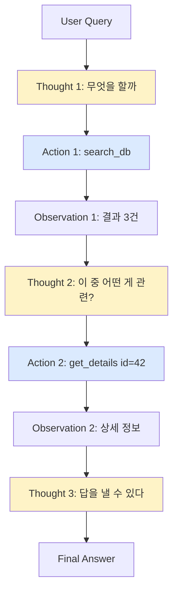
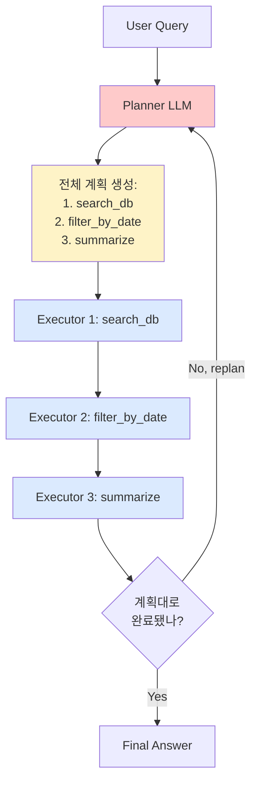

### Agent Loop 설계 — ReAct vs Plan-and-Execute, "LangChain AgentExecutor면 충분하다"는 순진함

> 고객 환불 자동화 agent가 새벽 3시에 12턴 동안 같은 결제 API를 7번 호출했다. 매번 다른 `refund_id`로. 중복 환불 3건, 손실 $8,400. 로그를 열어보니 agent의 사고 흐름은 이랬다.
>
> ```
> Thought: 결제 취소가 필요하다
> Action: refund_api(order_id=A123)
> Observation: {"status": "processing"}
> Thought: 아직 처리 중이다. 다시 시도해야 한다.
> Action: refund_api(order_id=A123)  ← 여기서 이미 죽었어야 했다
> ```
>
> LLM은 `"processing"`을 "실패"로 착각했다. 툴 정의에는 이 상태에 대한 설명이 없었다. AgentExecutor의 `max_iterations=15`가 마지막 방어선이었지만, 그때는 이미 환불이 세 번 나간 뒤였다.

---

#### 1. Agent Loop란 무엇인가

Agent = **LLM + 도구 + 루프**. 이게 전부다.

```
┌──────────────────────────────────────────────┐
│              Agent Loop 골격                    │
├──────────────────────────────────────────────┤
│  while not done:                              │
│    thought = llm.reason(context)              │
│    if thought.is_final_answer:                │
│        return thought.answer                  │
│    action = thought.tool_call                 │
│    result = execute_tool(action)              │
│    context.append(thought, action, result)    │
└──────────────────────────────────────────────┘
```

문제는 이 단순한 골격 아래에 **최소 다섯 개의 아키텍처 결정**이 숨어 있다는 것.

1. 언제 계획을 세우는가 (**ReAct vs Plan-and-Execute**)
2. Tool 스키마를 어떻게 정의하는가
3. Context를 어디까지 유지하는가 (memory)
4. 루프를 언제 강제로 끝내는가 (termination)
5. 실패한 tool call을 어떻게 다루는가 (recovery)

시니어가 자주 놓치는 것은 1번과 4번이다.

---

#### 2. ReAct Pattern — "매 스텝마다 다시 생각한다"

Yao et al. (2022)이 제안한 **Reasoning + Acting**의 결합. 매 턴 LLM이 사고(Thought)와 행동(Action)을 번갈아 만들어낸다.



**장점**
- 관찰(Observation)에 따라 유연하게 방향을 바꾼다
- 예측 불가능한 도메인(고객 문의, 코드 디버깅)에 강함
- 구현이 단순 — `while` 루프 하나

**단점**
- 매 턴 전체 context를 다시 처리 → 토큰 비용 폭발
- LLM이 근시안적으로 결정 → **전역 최적화 실패**
- 실패 시 무한 루프 위험 (위 사례)

---

#### 3. Plan-and-Execute Pattern — "먼저 다 짜고, 실행은 도구가 한다"

BabyAGI, LangGraph의 Planner 노드, Anthropic의 Computer Use에서 진화한 패턴. **계획 단계**와 **실행 단계**를 분리한다.



**장점**
- Planner는 강한 모델(Opus, GPT-4), Executor는 저렴한 모델(Haiku, GPT-4o-mini)로 분리 가능 → **비용 60~70% 절감**
- 계획을 미리 검증할 수 있음 (사람의 approve, guardrail 통과)
- 병렬 실행 가능한 스텝 식별 → latency 단축

**단점**
- 예상치 못한 결과가 나오면 replan 필요 → 오히려 더 느려질 수 있음
- 계획이 너무 rigid하면 오히려 실패
- 구현 복잡도 급증 (state machine, replan 조건 설계)

---

#### 4. 언제 뭘 쓰는가 — 시니어의 판단표

| 상황 | 권장 패턴 | 이유 |
|------|---------|------|
| 고객 문의 챗봇, 코드 디버깅 | **ReAct** | 다음 스텝이 관찰에 강하게 의존 |
| ETL 파이프라인, 리포트 생성 | **Plan-and-Execute** | 스텝이 예측 가능, 병렬화 가능 |
| 결제/환불/삭제 등 부작용 있는 작업 | **Plan + Human Approval** | 계획 단계에서 사람이 검토 |
| 프로토타입, POC | ReAct | 빠르게 만들고 뜯어보기 좋음 |
| 프로덕션 대량 처리 | Plan-and-Execute | 비용/latency 예측 가능 |
| 30초 이내 응답 필요 | ReAct (단, max_iter=5) | Plan 오버헤드가 오히려 손해 |

---

#### 5. Tool 스키마 설계 — 여기가 진짜 전장

Agent 실패의 **80%는 LLM 성능 문제가 아니라 tool 스키마 문제다**. 위 오프닝 사례가 그랬다.

**나쁜 tool 정의:**

```json
{
  "name": "refund_api",
  "description": "환불을 처리합니다",
  "parameters": {
    "order_id": {"type": "string"}
  }
}
```

이 정의를 본 LLM은 이렇게 추론한다.
- "환불을 처리한다" → **동기적으로 완료된다고 가정**
- 실패 시 재시도해도 안전하다고 가정 (**멱등성 불명확**)
- 응답 스키마 모름 → `"processing"` 같은 중간 상태 해석 실패

**좋은 tool 정의:**

```json
{
  "name": "refund_api",
  "description": "환불을 비동기로 시작합니다. 이미 처리 중인 환불이 있으면 중복 요청은 무시됩니다. status='processing'은 성공적으로 시작된 상태이며, 완료 확인은 refund_status_check를 사용하세요.",
  "parameters": {
    "order_id": {"type": "string", "description": "주문 ID"},
    "idempotency_key": {"type": "string", "description": "재시도 시에도 동일한 값을 사용. UUID 권장."}
  },
  "returns": {
    "status": "one of: 'processing', 'completed', 'already_refunded', 'failed'",
    "refund_id": "string, use with refund_status_check"
  },
  "side_effects": "돈이 이동합니다. 재시도 전 반드시 status_check로 상태 확인.",
  "cost_hint": "high"
}
```

**시니어의 tool 설계 체크리스트**
- [ ] description에 **성공 조건**과 **부작용**을 명시
- [ ] 응답 스키마와 각 상태의 의미를 서술
- [ ] 멱등성 여부와 idempotency_key 지원
- [ ] `cost_hint`(low/medium/high)로 LLM이 남용하지 않게
- [ ] 관련 tool 간 관계 명시 ("완료 확인은 X를 쓰세요")

---

#### 6. Termination 설계 — 마지막 방어선

```python
# Naive (위험)
executor = AgentExecutor(agent=agent, tools=tools, max_iterations=15)

# 시니어의 방어선
executor = AgentExecutor(
    agent=agent,
    tools=tools,
    max_iterations=15,              # 절대 상한
    max_execution_time=60,          # wall-clock 상한
    early_stopping_method="generate",
    # 아래는 커스텀 콜백으로
    callbacks=[
        DuplicateActionDetector(threshold=2),   # 같은 action 2번이면 중단
        CostBudgetGuard(max_usd=0.50),          # $0.50 초과 시 중단
        SideEffectCounter(max_writes=3),        # write 계열 tool 3회 초과 중단
    ]
)
```

위 오프닝 사례의 진짜 결함은 **DuplicateActionDetector가 없었던 것**이다. `max_iterations=15`는 무한 루프는 막지만, **같은 부작용을 반복하는 것**은 못 막는다.

---

#### 7. 실제 사례

**Anthropic Computer Use (2024)**
- Plan-and-Execute + ReAct 하이브리드
- Claude가 화면 스크린샷을 관찰(Observation)하며 다음 스텝을 결정 (ReAct 성격)
- 하지만 시작 시 상위 계획을 세우고, 계획 이탈 시 replan
- Tool: `computer_20241022`(스크린샷/클릭/키보드) — description에 **latency**와 **부작용**을 명시

**GitHub Copilot Workspace (2024)**
- **Full Plan-and-Execute**: 사용자가 계획을 승인한 뒤에만 실행
- 이유: 코드 수정은 부작용이 크고, 잘못된 방향의 대량 수정은 되돌리기 어려움
- Planner에 GPT-4 계열, Executor에 저렴한 모델

**Devin (Cognition Labs, 2024)**
- Long-horizon Plan-and-Execute
- 계획을 tree로 관리, 실패한 서브태스크만 replan
- 하지만 실제로 실 사용자에게서 나온 피드백: **너무 rigid해서 예상치 못한 에러 앞에서 무너진다**
- 이후 ReAct 요소를 강화한 하이브리드로 진화 중

**한국 커머스 A사 (2025 초 발표)**
- 상품 검색 챗봇에 ReAct 도입 → tool call 평균 4.2회, latency 8초, 만족도 하락
- Plan-and-Execute로 재설계 → 평균 2.1회, latency 3초, 비용 65% 감소
- 교훈: **검색 도메인은 스텝이 대체로 예측 가능하므로 planning이 유리했다**

---

#### 8. 안 쓰거나 신중해야 하는 경우

- **단일 tool 호출로 충분한 작업**: agent 아니라 그냥 function calling
- **응답 latency가 2초 이내여야 하는 UX**: agent loop 자체가 최소 5~10초
- **부작용이 극도로 큰 도메인**(금융 거래, 의료 처방): agent는 계획만, 실행은 사람
- **domain이 극도로 좁고 결정적**: rule engine + LLM 후처리가 오히려 낫다

---

#### 9. 시니어가 반드시 경계할 것

1. **"Agent를 붙이면 뭔가 지능적이 될 것 같다"** — 아니다. Agent는 **비결정성**을 도입한다. 결정적 로직으로 충분하면 agent 쓰지 마라.
2. **Tool description을 프롬프트로 취급하지 않는 태도** — Tool description은 **가장 중요한 프롬프트다**. 여기가 부실하면 아무리 좋은 LLM도 실패한다.
3. **비용을 tool 호출 수가 아니라 토큰으로만 측정** — ReAct는 매 턴 전체 context를 재처리한다. 10턴 대화면 context를 10번 다시 읽는다. **Prompt caching 없으면 곧 파산한다**.
4. **Replan 조건을 명시하지 않은 Plan-and-Execute** — 계획이 어긋났을 때 replan해야 할지, 그냥 실패로 처리할지 결정하지 않으면 agent는 rigid하게 실패하거나 무한 replan한다.
5. **부작용 있는 tool에 멱등성 미보장** — 오프닝 사례. `idempotency_key` 없는 결제/환불/삭제 tool은 프로덕션에 배포하지 마라.

> 💡 **왜 중요한가**: Agent는 "LLM + 도구"라는 단순한 조합처럼 보이지만, 루프 설계·Tool 스키마·Termination이라는 세 축을 시니어가 직접 통제하지 않으면 새벽 3시에 같은 API를 반복 호출하며 조용히 돈을 태운다.
