### Embedding Model 마이그레이션 & Zero-Downtime Re-indexing — "ada-002를 3-large로 갈아엎었더니 recall@10이 +8%p 올랐다"는 자랑, 그리고 2,300만 문서 중 62%만 새 임베딩으로 교체된 상태로 3일을 굴리다 챗봇이 "2018년 폐지된 대출 상품"과 "2026년 신규 상품"을 top-3에 나란히 노출해 금감원 민원 → 감독 조사 → 상품팀장 옷 벗은 새벽

---

Lv5의 함정 중 가장 조용하고 가장 오래 가는 것이 바로 이것이다. **임베딩 모델을 바꾸는 순간, 당신의 Vector DB는 두 개의 서로 다른 우주가 섞인 상태가 된다.** 코사인 유사도로 비교되는 두 벡터가 실은 다른 언어를 쓰고 있는데, 시스템은 그걸 알 방법이 없다. 그리고 이 사실을 알아채는 유일한 순간은 — 사장님 앞에서 챗봇이 자신 있게 잘못된 답변을 뱉을 때다.

---

## 1. 왜 "임베딩 교체 = 코드 한 줄" 이 아닌가

주니어의 착각은 이렇다:

```python
# Before
embedding = openai.embeddings.create(model="text-embedding-ada-002", ...)
# After
embedding = openai.embeddings.create(model="text-embedding-3-large", ...)
```

"한 줄만 바꾸면 되잖아요?"

**아니다. 이 순간 세 가지가 동시에 깨진다.**

### 1.1 벡터 차원 불일치 (Dimension Mismatch)

| 모델 | 차원 | 발매 |
|------|------|------|
| text-embedding-ada-002 | 1,536 | 2022 |
| text-embedding-3-small | 1,536 (또는 512 축소 가능) | 2024 |
| text-embedding-3-large | 3,072 (또는 256/1024 축소) | 2024 |
| Cohere embed-v3 | 1,024 | 2023 |
| Voyage-3 | 1,024 | 2024 |
| BGE-M3 | 1,024 | 2024 |

Pinecone/Weaviate/pgvector 모두 **인덱스 생성 시점에 차원이 고정**된다. `dim=1536`으로 만들어둔 인덱스에 `dim=3072` 벡터를 밀어넣으면 DB는 "타입 에러" 하나만 뱉고 끝. 재색인 없이는 절대 못 바꾼다.

### 1.2 벡터 공간의 의미 좌표계가 완전히 달라진다 (더 무서운 것)

**이게 진짜 재앙의 씨앗이다.** 차원이 같아도 (예: ada-002 → 3-small 둘 다 1536), 두 모델이 "은행"이라는 단어를 배치한 벡터는 완전히 다른 좌표에 있다. 코사인 유사도 0.87이라는 숫자가 두 모델 사이에서 같은 의미를 가지지 않는다.

즉 **query는 새 모델로 임베딩하고, DB 안 문서 중 62%는 새 모델·38%는 옛 모델**인 상태로 검색을 돌리면 — 옛 모델 벡터는 단순히 "조금 부정확한 이웃"이 아니라, **의미적으로 무작위 노이즈**가 된다. 그런데 코사인 스코어는 그냥 숫자니까 top-k에는 태연하게 끼어든다.

### 1.3 재색인 비용 (돈과 시간)

- 문서 2,300만 건 × 평균 800 토큰 = 184억 토큰
- text-embedding-3-large: $0.13 / 1M tokens → **약 $2,400** (돈은 그나마 싸다)
- 진짜 문제: **API rate limit**. Tier 5 계정 기준 5M TPM. 184억 / 5M = **60시간 순수 API 콜**
- 여기에 청크 재계산, 저장 write, 인덱스 rebuild 비용을 더하면 **실제 프로덕션에서 1주일**

---

## 2. 세 가지 마이그레이션 전략

```mermaid
graph TB
    subgraph "전략 A: Big Bang (죽음의 길)"
        A1[전체 서비스 중단] --> A2[전체 문서 re-embed]
        A2 --> A3[인덱스 swap]
        A3 --> A4[서비스 재개]
    end

    subgraph "전략 B: Dual Read + Sequential Rewrite (현실적)"
        B1[Old Index 유지] --> B2[New Index 생성]
        B2 --> B3[백그라운드 re-embed]
        B3 --> B4[문서별 완료 시 New Index로]
        B4 --> B5[Query: Old 또는 New 라우팅]
        B5 --> B6[100% 완료 → Old 파기]
    end

    subgraph "전략 C: Shadow Index + A/B (시니어의 길)"
        C1[Old Index 계속 서빙] --> C2[New Index 병렬 색인]
        C2 --> C3[Shadow Query: 둘 다 실행하되 응답은 Old]
        C3 --> C4[품질 지표 비교]
        C4 --> C5{Recall/nDCG 개선?}
        C5 -->|Yes| C6[트래픽 1% → 10% → 50% → 100%]
        C5 -->|No| C7[New 폐기, 원인 조사]
    end

    style A4 fill:#fee
    style B6 fill:#fef8dc
    style C6 fill:#e6f7e6
```



### 왜 Big Bang은 절대 안 되는가

Notion이 2023년 초에 시도했다가 [공개적으로 사과한 사건](https://www.notion.so/blog)이 있다 — 자세히는 안 밝혔지만, 검색이 3시간 완전 다운. 스타트업이면 몰라도 **B2B 서비스는 SLA 위반 = 페널티 조항**이다.

### 왜 Dual Read가 "현실적"이면서 "위험"한가

이게 대부분의 팀이 실제로 택하는 길이고, **첫머리 참사 시나리오의 정체가 바로 이것이다.** 62% 재색인된 상태에서 query는 새 모델로 던지는데, DB에는 두 우주가 섞여 있다. **"이건 새 벡터인지 옛 벡터인지"를 표시하는 metadata flag를 안 넣으면 지옥이 시작된다.**

### Shadow Index 패턴이 왜 시니어의 답인가

**옛 인덱스는 절대 건드리지 않는다.** 옆에 새 인덱스를 처음부터 완전히 만든다. 트래픽은 여전히 옛 인덱스만 본다. 하지만 매 쿼리를 새 인덱스에도 던져서 결과를 로그로 남긴다 (shadow mode). 오프라인에서 LLM-as-a-judge로 두 결과를 비교해 nDCG@10, recall@20 등을 찍는다. **품질이 검증되기 전까지 사용자는 새 벡터를 절대 만나지 않는다.**

100% 재색인 + 품질 검증 + 카나리 롤아웃 → 그제서야 스위치. 옛 인덱스는 최소 30일 유지 (롤백용).

---

## 3. Shadow Index 패턴 심층 — 실제 아키텍처

```
┌─────────────────────────────────────────────────────────────┐
│                        User Query                           │
└──────────────────────────┬──────────────────────────────────┘
                           │
                    ┌──────▼──────┐
                    │Query Router │
                    │ (with flag) │
                    └──────┬──────┘
              ┌────────────┴────────────┐
              │                         │
      ┌───────▼────────┐        ┌───────▼────────┐
      │Embed w/ Old    │        │Embed w/ New    │
      │(ada-002)       │        │(3-large)       │
      └───────┬────────┘        └───────┬────────┘
              │                         │
      ┌───────▼────────┐        ┌───────▼────────┐
      │Index_v1 (Old)  │        │Index_v2 (New)  │
      │Pinecone ns=v1  │        │Pinecone ns=v2  │
      └───────┬────────┘        └───────┬────────┘
              │                         │
              │  ┌──── Response ────┐   │
              └─▶│  (사용자에게)     │   │
                 └──────────────────┘   │
                                        │
                 ┌──── Shadow Log ─────┐│
                 │  offline eval,      │◀
                 │  cost tracking      │
                 └─────────────────────┘
```

### 핵심 설계 원칙 4개

1. **Namespace 분리**: Pinecone `namespace`, Weaviate `class`, pgvector `schema/table` — DB 인스턴스는 공유해도 인덱스는 물리적으로 격리. "실수로 섞이는" 경로를 아예 만들지 마라.

2. **모든 벡터에 `embedding_model_version` metadata**: 나중에 디버깅할 때 "이 문서 어떤 모델로 벡터화됐지?"를 답할 수 없으면 롤백도 불가능하다. 필드 하나 아끼려다 6개월 뒤에 대가를 치른다.

3. **Query에도 model version 태깅**: 로그에 `query_model=v2, doc_model=v1`인 라인이 하나라도 나오면 즉시 alert. 이 mismatch가 첫머리 시나리오의 근본 원인이다.

4. **점진적 롤아웃은 "사용자 단위"로**: request 단위 랜덤 라우팅은 같은 유저가 새로고침할 때마다 다른 결과 → CS 폭탄. 반드시 `user_id % 100 < rollout_pct`.

---

## 4. 함정 (시니어가 반드시 경계할 것)

### 함정 1. "차원 축소 옵션"에 대한 낙관 (Matryoshka Embeddings)

OpenAI가 2024년에 내놓은 `text-embedding-3-*`는 [Matryoshka Representation Learning](https://arxiv.org/abs/2205.13147) 기반이라 3072 차원을 256이나 1024로 잘라 써도 성능이 "그럭저럭 유지"된다. 여기서 "그럭저럭"에 속으면 안 된다.

- 3072 전체: MTEB 64.6
- 1024로 축소: MTEB 63.5 (−1.1)
- 256으로 축소: MTEB 60.3 (−4.3)

**−1.1 MTEB** 는 실제 서비스에서 top-3 정답률 **2~3%p 하락**을 뜻한다. 저장 공간 3배 아끼려다 recall 3%p를 태우는지, 계산해보고 결정하라.

### 함정 2. Query 임베딩과 Doc 임베딩의 모델 mismatch

Cohere `embed-v3`는 아예 **document용**과 **query용** 임베딩 API가 분리돼 있다 (`input_type=search_document` vs `search_query`). 이걸 안 지키면 recall이 15%p씩 날아간다. 주니어가 "다 같은 embed 함수 아니에요?"라고 물으면 그 자리에서 문서 보여줘라.

### 함정 3. 청크 크기가 바뀌었는데 모델만 바꾼 경우

임베딩 모델을 바꾸면서 "이왕 하는 김에 chunk_size도 500 → 800으로" 라는 유혹. **금물이다.** 마이그레이션은 **한 번에 한 변수만.** 벤치마크가 개선됐을 때 그게 모델 덕분인지 청크 크기 덕분인지 알 수 없으면 다음 개선을 못 한다. Anthropic Contextual Retrieval도 [블로그 포스트](https://www.anthropic.com/news/contextual-retrieval)에서 명시적으로 "모델과 chunking을 분리 실험했다"고 강조한다.

### 함정 4. 옛 인덱스를 너무 빨리 지운다

카나리 100% 도달 → 다음날 옛 인덱스 삭제 → 그 주말에 심각한 회귀 발견 → 롤백 불가. **최소 30일, 이상적으로 90일** 병렬 유지. 저장 비용이 아까우면 옛 인덱스를 "cold storage"로 옮겨서라도 남겨라.

### 함정 5. Semantic Cache를 안 무효화한다 (이거 진짜 자주 놓친다)

Semantic Cache는 "query 벡터 유사도"로 캐시 히트를 판단한다. 임베딩 모델을 바꾸면 **캐시 안의 모든 벡터가 다른 언어로 쓰인 상태**가 된다. 히트율은 유지되는데 히트 내용이 무작위 노이즈다. 마이그레이션 첫날 반드시 semantic cache flush. [[semantic-cache-integration]] 참고.

### 함정 6. Reranker와의 상호작용

Reranker (예: Cohere Rerank-v3, BGE-reranker)는 임베딩 모델과 독립적이라 재학습이 필요 없다고 생각하기 쉽다. **틀렸다.** 임베딩 모델이 바뀌면 top-k에 올라오는 후보 분포가 바뀌고, 그러면 reranker에게 들어가는 입력 분포가 바뀌고, 그러면 reranker의 실제 효과가 재측정돼야 한다. 최소 [[reranker-2stage-retrieval]]의 오프라인 eval은 다시 돌려야 한다.

---

## 5. 실제 사례

### 사례 1: LinkedIn (2024) — "Zero-Downtime Embedding Migration"

LinkedIn 엔지니어링 블로그에 공개된 케이스. 사내 검색 시스템의 임베딩을 자체 모델 v3 → v4로 교체하면서 **약 40억 개 문서**를 6주에 걸쳐 재색인. 핵심 결정 3가지:

1. Kafka로 "re-embed job"을 스트림 처리, 초당 15k QPS로 배치 임베딩
2. Elasticsearch에 `model_version` 필드를 넣고 **query time에 라우팅**
3. Shadow query 결과를 offline eval 파이프라인으로 자동 흘려보내 매일 nDCG 리포트

**교훈**: 대규모에서는 이벤트 스트림 없이는 재색인 조율이 불가능하다.

### 사례 2: Notion AI (2024) — 청크와 모델을 동시에 바꾸다 겪은 롤백

앞선 [[chunking-strategy]] 편에서 언급된 Notion의 Contextual Retrieval 도입 과정에서, 초기 실험은 **청크 전략 + 임베딩 모델을 동시에 교체**했다가 recall이 이유 없이 흔들려 3주간 원인 분석. 결국 **한 번에 한 변수만** 원칙으로 회귀. 청크 먼저 → 벤치 → 모델 교체 → 벤치. 이 순서가 "느려 보여도 가장 빠른 길"이라는 게 Notion 팀의 결론.

### 사례 3: 국내 B 증권사 — Big Bang의 대가

2025년 초, 컴플라이언스 챗봇 팀이 주말 점검 시간에 Big Bang re-index 시도. 예상 6시간, 실제 22시간. 월요일 오전 개장 시각까지 33%만 재색인. "그래도 옛 인덱스가 있으니까" 하고 오픈했는데, 이미 코드에서는 새 모델로 query 임베딩을 만들도록 배포된 상태. **query_model=new, doc_model=old** 트래픽이 3시간 흐르고 상담사가 "왜 관련 없는 상품이 나오냐"고 티켓 폭탄 → 롤백 → 사후 회고에서 shadow index 부재가 근본 원인으로 지목.

### 사례 4: Anthropic Contextual Retrieval 릴리즈 노트

Anthropic이 [Contextual Retrieval](https://www.anthropic.com/news/contextual-retrieval)을 발표할 때 명시적으로 "이 개선을 적용하려면 **전체 코퍼스 재색인이 필수**이며, 실제 프로덕션 도입 시에는 shadow index 병행 후 A/B 테스트로 검증하라"고 권고. 벤더가 직접 shadow 패턴을 문서화한 드문 케이스.

---

## 6. 언제 하고 언제 하지 말지

### 반드시 해야 하는 경우
- **재현율(recall@k)이 6개월간 지속적으로 정체**되고, 다른 개선(chunking, reranker, query rewriting)을 모두 시도한 뒤
- 벤더가 **현재 모델을 deprecate 예고** (OpenAI ada-002가 2024년에 겪은 일)
- **한국어/도메인 특화 모델**로의 전환처럼 명확한 근거가 있는 경우 (예: BGE-M3, KoE5, Solar-embedding)
- **비용이 극단적으로 다른** 경우 (Voyage-3 대비 자체 호스팅 BGE로 90% 절감 등)

### 하지 말아야 하는 경우
- "새 모델 나왔대요"만 근거인 경우 — MTEB 리더보드 1점 차이는 실제 서비스에서 안 느껴진다
- **아직 [[chunking-strategy]] 최적화도 안 했으면서** 임베딩부터 바꾸려는 경우 — 기저 chunking이 500자 fixed-size인데 모델만 3-large로 바꿔봐야 -3%p → +2%p 정도밖에 안 오른다. chunking 개선하면 +8%p가 나온다
- **트래픽이 하루 만 건 미만**인 초기 PoC — 재색인 비용/시간 대비 얻을 게 없다. Semantic cache 히트율 개선이 훨씬 남는 장사

### 신중해야 하는 경우
- **멀티테넌트 SaaS**: 테넌트별 인덱스면 마이그레이션이 N배. 롤백 실패 시 blast radius가 전 고객
- **규제 산업 (금융/의료/법률)**: 답변 변화가 규제 리스크. shadow 기간을 60일 이상 가져가야
- **Semantic cache에 강하게 의존**하는 서비스: cache 무효화 = 초기 며칠 비용 폭증

---

## 7. 조합의 위험

임베딩 마이그레이션은 **혼자 오지 않는다.** 다음이 동시에 얽힌다:

- [[hybrid-search-vector-bm25]]: BM25 인덱스는 임베딩 모델과 무관하지만, RRF fusion weight를 새 벡터 스코어 분포에 맞춰 **재튜닝** 필요
- [[reranker-2stage-retrieval]]: top-k 후보 분포가 변함 → reranker 효용 재측정
- [[semantic-cache-integration]]: 캐시 전량 무효화 필수
- [[llm-evaluation-regression]]: 회귀 테스트 골든셋의 정답 top-k가 바뀔 수 있음 → 골든셋 자체를 재검토
- [[ai-observability]]: `model_version` 태그가 트레이스 전 구간에 흘러야 사후 디버깅 가능

**한 번의 임베딩 교체가 5개 서브시스템의 재검증을 유발한다.** 이걸 계획에 안 넣으면 마이그레이션 견적이 실제의 1/3로 나오고, 팀장이 롤아웃 3주차에 주말 출근하게 된다.

---

> 💡 **왜 중요한가**: 임베딩 모델 교체는 "코드 한 줄"이 아니라 **벡터 공간 자체의 통화 개편**이다 — Shadow Index와 model version 태깅 없이 시도하는 순간, DB 안에서 두 우주가 조용히 섞이며 사용자는 정답과 노이즈를 코사인 유사도로 무작위 배급받는다.
