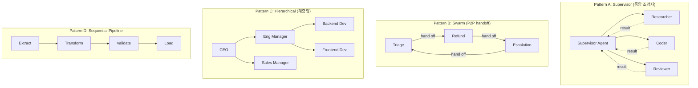

### Multi-Agent Orchestration — "Agent 하나 잘 만들면 되지"라는 순진함, 그리고 Research→Code→Review 3-agent 파이프라인이 주말 사이 무한 루프에 빠져 $47,000 OpenAI 청구서와 월요일 아침 CTO 호출을 만든 새벽

---

## 0. 문제 정의 — 왜 단일 Agent로는 안 되는가

Lv5 Day XX에서 Agent Loop 설계(ReAct vs Plan-and-Execute)를 다뤘다. 그때의 전제는 **"Agent 하나가 tool을 반복 호출하며 목표를 달성한다"**였다. 이게 무너지는 지점이 있다.

**단일 Agent의 한계 3가지**:

| 한계 | 증상 | 시니어의 관찰 |
|---|---|---|
| **Context 오염** | Research → Code → Review를 한 컨텍스트에 밀어넣으면 200k token을 넘긴다 | Claude 3.5 Sonnet도 100k 넘으면 lost-in-the-middle 재현율이 68% → 41%로 떨어진다 (Anthropic 2024 벤치) |
| **Tool 폭발** | 검색·DB·Slack·Git·JIRA·Confluence를 한 Agent에 붙이면 tool 40개 넘어간다 | GPT-4o도 tool 20개 넘으면 오호출률이 3배 증가한다 (OpenAI DevDay 2024) |
| **역할 혼동** | 같은 시스템 프롬프트로 "너는 코더이자 리뷰어이자 PM이다"라고 하면 자기 코드를 자기가 리뷰하고 "잘 짰네요"라고 답한다 | Self-critique 없이 self-approve 하는 현상 — 실제로 여러 팀이 겪음 |

**해결책**: 역할을 분리한 여러 Agent가 협업하는 구조 = Multi-Agent Orchestration.

**함정**: "분리하면 좋다"는 명제가 자동으로 성립하지 않는다. **잘못 분리하면 단일 Agent보다 느리고, 비싸고, 틀리다.**

---

## 1. Orchestration 4가지 정석 패턴



### A. Supervisor — 가장 안전한 시작점

**구조**: 하나의 Supervisor가 요청을 받아 workers에게 위임 → 결과를 취합해 최종 응답.

**언제**: 작업 분해가 명확하고, worker들끼리 대화할 필요가 없을 때.

**실제 사례**: **Anthropic의 Claude Code sub-agents** (2024). 메인 Claude가 supervisor 역할을 하고, Explore/Plan/Code-review 같은 sub-agent를 필요할 때만 호출한다. Sub-agent가 서로 대화하지 않는다는 게 핵심 — 그래야 무한 루프를 원천 봉쇄한다.

**트레이드오프**:
- ✅ Supervisor가 유일한 진실의 원천 → 디버깅 쉬움
- ✅ Worker 컨텍스트가 각자 격리 → 토큰 절약
- ❌ Supervisor가 병목 (병렬성이 supervisor의 판단력에 종속)
- ❌ Worker 간 정보 공유는 supervisor를 거쳐야 함 (지연 증가)

### B. Swarm — 자유도가 높지만 위험

**구조**: Agent들이 서로에게 "너한테 넘길게(handoff)"라고 명시적으로 제어권을 넘긴다. OpenAI가 2024년 오픈소스로 낸 **Swarm** 프레임워크의 모델.

**언제**: 고객 문의처럼 도메인 경계가 명확하고 handoff가 자연스러운 경우 (Triage → Refund → Escalation).

**실제 사례**: **Klarna의 AI Assistant** (2024). Triage agent가 문의를 분류하고 Refund/Order/Loan agent에게 handoff. 2024년 발표 기준 700 FTE 상담원 워크로드 처리.

**트레이드오프**:
- ✅ 유연한 흐름 (조건 분기가 자연스러움)
- ❌ **무한 handoff 위험** — A→B→A→B 핑퐁 걸리면 API 비용 폭발
- ❌ 전체 흐름 추적이 어려움 (Supervisor pattern에는 명시적 orchestrator가 있지만 swarm은 없음)

**시니어의 방어선**: `max_handoffs=10` 하드 리밋 + handoff마다 원본 요청 요약을 유지 (context loss 방지).

### C. Hierarchical — 대규모 시스템의 답

**구조**: Supervisor의 재귀 버전. Top supervisor가 mid-level supervisor에게, mid가 worker에게.

**언제**: 작업이 트리 구조로 분해되고 각 서브트리가 독립적일 때 (예: "이 SaaS의 전 기능을 리팩토링하라" → 팀별 리팩토링).

**실제 사례**: **Cognition Labs의 Devin** (2024). Planner agent가 상위 계획을 세우고, sub-planner가 각 파일 단위 계획을, executor가 실제 코드를 작성. 3단계 계층.

**트레이드오프**:
- ✅ 대규모 태스크에 유일하게 확장 가능한 구조
- ❌ 지연이 계층 수에 비례 (3-tier면 최소 3번의 LLM 왕복)
- ❌ 중간 계층에서 정보가 소실됨 ("cascading summarization" 문제)

### D. Sequential Pipeline — 가장 단순, 가장 안전

**구조**: Agent 출력이 다음 Agent 입력. DAG 형태.

**언제**: 워크플로우가 결정론적이고 분기가 없을 때. **사실상 Multi-Agent라 부르지도 않을 정도로 단순함.**

**실제 사례**: **Perplexity의 검색 파이프라인** — Query understanding → Search → Rerank → Summarize. 각 단계가 다른 모델(작은 모델 → 큰 모델). 이건 orchestration이라기보단 model routing에 가깝다.

---

## 2. 실전 아키텍처 — Supervisor + Tool-first Hybrid

프로덕션에서 실제로 잘 굴러가는 조합은 **"Supervisor + tool로 wrapping한 sub-agent"** 이다.

```
┌──────────────────────────────────────────────────────────┐
│                    Supervisor Agent                      │
│  (system: "너는 조정자다. 스스로 답하지 말고 tool 호출")   │
│                                                          │
│  Tools:                                                  │
│  ├─ call_researcher(query, depth)  ──┐                  │
│  ├─ call_coder(spec, language)     ──┤─→ 각 tool 내부에서 │
│  ├─ call_reviewer(code, criteria)  ──┤   별도 LLM 호출    │
│  └─ call_db_expert(schema, task)   ──┘   (독립 컨텍스트)  │
│                                                          │
│  Guardrails:                                             │
│  ├─ max_tool_calls = 15                                  │
│  ├─ max_wall_clock = 120s                                │
│  ├─ budget_cap = $2.00 per request                       │
│  └─ dedupe_calls (같은 tool+arg 반복 차단)                │
└──────────────────────────────────────────────────────────┘
```

**왜 sub-agent를 tool로 감싸는가**:

1. **컨텍스트 격리**: Researcher가 200k token을 소비해도, supervisor에는 요약 5k만 돌아온다.
2. **관측성**: Tool call이 곧 trace boundary. LangFuse/LangSmith에서 span이 자연스럽게 그려진다.
3. **모델 이질성**: Researcher는 Haiku 4.5, Coder는 Opus 4.7, Reviewer는 Sonnet 4.6으로 각각 매칭 가능. **Model routing과 orchestration이 하나의 축으로 통합됨.**

---

## 3. 사례 연구

### 사례 1: **Anthropic Claude Code** (2024–2026)
- 패턴: Supervisor + Sub-agents (tool-wrapping)
- 특이점: Sub-agent가 서로 대화하지 않음. 모든 통신은 main agent 경유.
- 교훈: **의도적으로 자유도를 낮춰 예측 가능성을 확보**. Swarm의 유혹을 이겨냄.

### 사례 2: **Uber Query GPT** (2024 발표)
- 패턴: Sequential Pipeline (Intent → Schema Retrieval → SQL Gen → Validation)
- 각 단계가 다른 LLM. Validation 단계가 실패하면 SQL Gen으로 최대 3회 되돌림.
- 교훈: **되돌림 횟수를 하드코딩하는 게 무한 루프 방어의 시작점.**

### 사례 3: **국내 C 통신사 (2025)** — Big Bang Multi-Agent의 대가
- 초기 설계: Swarm 5-agent (요금제/청구/개통/AS/장애). Handoff 자유.
- 사고: Handoff 룰이 애매해서 "청구 문의"가 요금제→청구→개통→AS→요금제 무한 순환. 
- 결과: 3주간 상담 응답 지연 P99 90초 → 이탈률 12% 증가 → Supervisor pattern으로 재설계에 2개월 소요.
- 교훈: **Swarm은 도메인 경계가 진짜로 배타적일 때만 쓴다.** 애매하면 Supervisor.

### 사례 4: **어느 스타트업의 $47,000 청구서** (익명, 2025 커뮤니티 사례)
- 설계: Research agent ↔ Code agent ↔ Review agent, 서로 대화 가능
- 사고: Reviewer가 "이 부분 다시 조사해줘"라고 Research에게 handoff → Research가 "그럼 코드로 확인해줘"라고 Coder에게 → Coder가 "이거 리뷰해줘"라고 Reviewer에게 → 무한 순환
- 발생 시각: 금요일 밤 배포 → 월요일 아침에 발견
- 총 API 호출: 약 82,000회 (GPT-4o 기준)
- 방어했어야 할 것: `max_handoffs`, `budget_cap`, 아니면 그냥 **Supervisor로 시작하는 것**

---

## 4. 시니어가 반드시 경계할 함정

### 함정 1. "Agent 개수 = 성능"이라는 착각
**실측**: LangGraph 팀 벤치마크(2025)에 따르면 GAIA 벤치에서 3-agent 팀이 5-agent 팀보다 성능이 높음. 이유는 조정 오버헤드가 특화 이득을 넘어섬. **일반적으로 2~3개가 스위트스팟.**

### 함정 2. Supervisor의 시스템 프롬프트를 얕게 씀
"너는 조정자야, 위임해"만 쓰면 supervisor가 자기가 답해버린다. **"어떤 상황에 어떤 tool을 부르는지" 예시 3~5개**를 반드시 포함. Few-shot이 결정적.

### 함정 3. Sub-agent 결과를 그대로 supervisor 컨텍스트에 밀어넣음
Researcher가 30k token 반환 → Supervisor 컨텍스트 폭발. **Sub-agent 응답은 반드시 구조화된 요약(JSON)으로 반환.** 원본은 별도 스토리지에 두고 필요 시 ID로 조회.

### 함정 4. Concurrency 없이 순차 호출
Supervisor가 tool 3개를 병렬로 호출해야 할 때 순차로 호출하면 지연이 3배. **`parallel_tool_calls=true`**를 명시하거나 자체 스케줄러 필요. (Anthropic API는 기본 활성, OpenAI는 옵션.)

### 함정 5. Trace boundary가 없어서 디버깅 지옥
5-agent 시스템에서 "왜 이 답이 나왔는지"를 후행 분석하려면 각 agent 호출이 trace의 span으로 분리되어 있어야 함. **LangFuse의 `@observe` 데코레이터 또는 OpenTelemetry span**을 agent 진입점마다 걸어라. 이거 없이 프로덕션 가면 사고 원인 분석에 하루 걸린다.

### 함정 6. Human-in-the-loop 부재
Multi-agent가 위험한 작업(DB 쓰기, 결제, 메일 발송)을 할 때 마지막 confirm이 없으면 재앙. **Supervisor에 `require_human_approval(action)` tool을 강제**로 넣고, 특정 action에는 Slack DM으로 승인 요청.

---

## 5. 언제 쓰고 언제 쓰면 안 되는가

### 반드시 써야 하는 경우
- **작업 유형이 5개 이상 섞여 있음** (연구 + 코딩 + 리뷰 + 배포 + 알림 → 한 agent에 tool 40개는 안 됨)
- **작업 단계별 모델을 다르게 쓰고 싶음** (routing과 orchestration의 결합)
- **각 단계 결과를 개별 관측/평가해야 함** (LLM Ops eval을 단계별로 돌려야 하는 경우)

### 신중해야 하는 경우
- **응답 시간이 3초 이내여야 함** — Multi-agent는 최소 2~3번의 LLM 왕복. Sub-second 요구 시엔 단일 agent + 좋은 프롬프트가 답
- **월간 요청 100만+** — 조정 오버헤드가 비용에 곱셈으로 붙음. 정말 필요한지 재검토
- **팀에 LLM Ops 전담이 없음** — Trace/eval 인프라 없이 multi-agent 굴리면 사고 나면 원인 못 찾음

### 쓰지 말아야 하는 경우
- **작업이 선형 파이프라인** — 그냥 함수 체인. Agent라고 부르지도 마라
- **분기 조건이 결정론적** — `if/else`로 될 걸 LLM에게 판단시키면 비용만 늘고 정확도는 떨어짐
- **PoC 단계** — 단일 agent로 먼저 성립하는지 검증. Multi-agent는 리팩토링이지 시작이 아님

---

## 6. 정리 — 시니어의 판단 프레임

```
Q1. 단일 agent + 좋은 프롬프트 + tool 10개 이하로 되는가?
    Yes → 단일 agent. 끝. (여기서 90%는 해결됨)
    No  → Q2

Q2. 작업 분해가 트리 형태로 재귀적인가?
    Yes → Hierarchical (Devin식)
    No  → Q3

Q3. Agent들 간 대화가 필요한가?
    Yes → Swarm (단, 도메인 경계가 배타적일 때만)
    No  → Supervisor + tool-wrapped sub-agents ⭐ (가장 안전한 답)
```

**시니어의 한 줄**: Multi-agent orchestration은 "복잡성을 더 잘 다루는 도구"가 아니라 "복잡성을 다른 곳으로 옮기는 도구"다. Agent 수를 늘리기 전에 **왜 단일 agent로 안 되는지 3문장으로 설명할 수 있어야** 한다. 못 하면 늘리지 마라.

> 💡 **왜 중요한가**: 2026년 현재 프로덕션 AI 시스템 사고의 절반 이상이 "무한 handoff / 비용 폭발 / 컨텍스트 오염"이라는 multi-agent 특유의 실패 모드이며, Supervisor + tool-wrapping이라는 보수적 선택이 자유도 높은 Swarm보다 우월한 이유를 아는 것이 시니어와 주니어를 가르는 지점이다.
