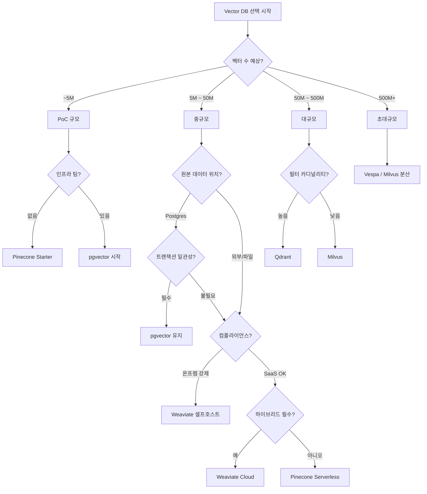

### Vector DB 아키텍처 결정 — "Pinecone이 표준이라던데"라는 안일함, 그리고 월 $8,400 청구서가 CFO 책상에 올라가 "이거 서비스 매출보다 많은데?"라는 이메일이 새벽 3시에 CTO에게 전달된 새벽

RAG를 처음 붙일 때 아무도 진지하게 고민하지 않는 결정이 하나 있다. **Vector DB를 뭘로 고를 것인가.** LangChain 튜토리얼에 `from langchain.vectorstores import Pinecone`이 첫 줄에 있으니 그냥 Pinecone. 아니면 "우린 이미 Postgres 쓰니까 pgvector". 이 두 문장이 6개월 뒤 아키텍처 회의의 폭탄이 된다.

시니어의 관점에서 Vector DB는 **하나의 결정이 아니라 5개 축의 조합**이다. 이걸 모르고 고르면 반드시 마이그레이션한다. 그리고 벡터 마이그레이션은 [[embedding-migration]] 편에서 봤듯 재색인 비용이 억 단위다.

---

#### 왜 이 결정이 시니어 레벨의 문제인가

주니어는 "Pinecone이 빠르고 관리형이라 편함" 한 문장으로 끝낸다. 시니어는 다음 5개 질문을 던진다.

1. **데이터가 어디 살고 있는가** — Postgres에 이미 있는 문서를 별도 Vector DB로 옮기면 두 개의 진실이 생긴다. 트랜잭션 경계가 깨진다.
2. **필터링 카디널리티가 얼마나 되는가** — `WHERE tenant_id = ? AND status = 'published' AND lang = 'ko'` 같은 pre-filter가 hot path에 있으면 순수 벡터 DB는 무너진다.
3. **벡터 규모가 언제 1억을 넘는가** — pgvector의 HNSW는 3천만이 편안한 상한이다. 그 이상은 Milvus/Vespa 영역.
4. **멀티테넌시를 인덱스 레벨에서 격리하는가, 메타데이터로 하는가** — 이걸 나중에 바꾸는 게 지옥이다.
5. **비용이 QPS로 지불되는가, 저장 용량으로 지불되는가, 벡터당인가** — Pinecone의 청구 모델이 트래픽 예측과 어긋나면 매출보다 인프라 비용이 커진다.

이 5개 축이 서로 다른 답을 요구한다. 그래서 "정답 DB"가 없다.

---

#### 3대 옵션 (그리고 나머지)

```
┌─────────────────────────────────────────────────────────────────┐
│                    Vector DB 스펙트럼 (2026)                      │
├─────────────────────────────────────────────────────────────────┤
│                                                                  │
│  관리형 SaaS ────────────────────────────── 셀프호스트/임베디드    │
│                                                                  │
│  Pinecone   Weaviate Cloud   Qdrant Cloud   Milvus/Zilliz        │
│     │            │                 │              │              │
│     │            │                 │              │              │
│     └────────────┴─────────────────┴──────────────┘              │
│                        │                                         │
│                    "벡터 전용 DB"                                 │
│                                                                  │
│  ─────────────────────────────────────────────────               │
│                                                                  │
│  Postgres+pgvector    Elastic dense_vector    OpenSearch k-NN    │
│                                                                  │
│                    "기존 DB 확장"                                 │
│                                                                  │
│  ─────────────────────────────────────────────────               │
│                                                                  │
│         Vespa (Yahoo)          FAISS (임베디드 lib)               │
│                                                                  │
│              "특수 목적"                                          │
└─────────────────────────────────────────────────────────────────┘
```

##### Pinecone — "그냥 되는 것"의 가격

- **강점**: 서버리스 티어(2024 GA)로 shard 관리 없음. 초기 latency 안정. Namespace로 멀티테넌시 격리 깔끔.
- **약점**: **가격 예측이 어렵다.** Read Units/Write Units 모델이 트래픽 스파이크에 취약. 온프렘 불가. **JOIN이 없다** — 문서 원본이 다른 DB에 있으면 두 번 왕복.
- **적합**: PoC → 초기 서비스 (10M 벡터 이하), 팀에 인프라 엔지니어 없음, 컴플라이언스가 SaaS 허용.
- **부적합**: 금융/의료 온프렘 강제, 벡터 원본이 Postgres에 있고 트랜잭션 일관성 필요, 월 100M+ 쿼리.

##### Weaviate — "모듈러하고 오픈"의 대가

- **강점**: 오픈소스 + 매니지드 둘 다 됨. **하이브리드 서치(BM25+벡터)가 네이티브** — [[hybrid-search]]를 별도로 구현할 필요 없음. GraphQL API가 스키마 강제해서 팀 사고 규율 잡힘. Multi-tenancy가 인덱스 레벨.
- **약점**: 운영이 만만치 않다. 클러스터 노드 죽으면 재색인 필요한 경우 있음. 스키마 마이그레이션이 뻣뻣.
- **적합**: 하이브리드 서치가 필수인 검색 서비스, 셀프호스트 하고 싶은 팀, 스키마가 안정적인 도메인.
- **부적합**: 스키마가 자주 바뀌는 스타트업, 인프라 인력 부족.

##### pgvector — "우린 이미 Postgres 쓰니까"의 함정과 축복

- **강점**: **트랜잭션 경계가 하나.** 문서 CRUD와 벡터 upsert가 같은 트랜잭션. RLS로 멀티테넌시 자연스러움. `WHERE tenant_id = ? AND ...` pre-filter가 인덱스로 최적화됨. HNSW/IVFFlat 지원. **비용이 예측 가능** — RDS 비용만 조금 늘어남.
- **약점**: **3천만~5천만 벡터가 실무 상한.** 그 이상은 인덱스 빌드가 시간 단위. HNSW 파라미터 튜닝이 tricky. `pg_dump/restore`가 무거워짐.
- **적합**: 이미 Postgres 중심 아키텍처, 벡터 수 5천만 이하 예상, 문서와 벡터 트랜잭션 일치 필요.
- **부적합**: 벡터 100M+ 예상, HNSW 파라미터 튜닝 인력 없음, Postgres에 이미 write 부하 높음.

##### 나머지 3개 (짧게)

- **Qdrant**: Rust 기반, 필터링 성능 뛰어남. Pinecone보다 저렴한 셀프호스트 대안. 국내 도입 사례 늘고 있음.
- **Milvus/Zilliz**: 억 단위 벡터, GPU 인덱스, 분산 아키텍처. 대신 운영 복잡도 폭발.
- **Vespa**: Yahoo가 만든 검색 엔진, 광고/추천 시스템의 표준. RAG용으로는 오버킬.

---

#### 결정 트리 (실무 버전)



**핵심 원칙**: **시작은 pgvector, 성장하면 Qdrant/Weaviate, 폭발하면 Milvus.** Pinecone은 "인프라 팀이 없고 예산이 있는 경우"의 답이지, 모두의 답이 아니다.

---

#### 트레이드오프 매트릭스

| 축 | Pinecone | Weaviate | pgvector | Qdrant | Milvus |
|---|---|---|---|---|---|
| **운영 부담** | 없음 | 중 | **매우 낮음** | 중 | 높음 |
| **비용 예측성** | 나쁨 | 중 | **좋음** | 좋음 | 중 |
| **최대 규모** | 100M+ | 100M+ | ~50M | 100M+ | **10억+** |
| **필터 성능** | 중 | 좋음 | **매우 좋음** | **매우 좋음** | 중 |
| **하이브리드** | 별도 구현 | **네이티브** | 별도 구현 | 있음 | 별도 |
| **트랜잭션** | 불가 | 불가 | **가능** | 불가 | 불가 |
| **온프렘** | 불가 | 가능 | 가능 | 가능 | 가능 |
| **커뮤니티** | 상용 | 큼 | **가장 큼** | 성장중 | 큼 |

---

#### 실제 사례

##### 사례 1: **Notion AI (2024)** — pgvector로 시작, Turbopuffer로 이전

Notion은 초기 AI 검색을 pgvector로 구현했다. 이유는 "이미 Postgres 대세 아키텍처"였기 때문. 그러나 문서 수가 5억 개를 넘어가면서 HNSW 인덱스 빌드가 12시간을 넘겼고, 결국 2024년 Turbopuffer(Rust 기반 신흥 벡터 DB)로 이전. 교훈: **pgvector는 시작으로 완벽하지만, 성장을 예측하고 exit plan을 미리 세워야 한다.**

##### 사례 2: **Perplexity AI (2024)** — 여러 인덱스를 병렬로

Perplexity는 단일 Vector DB가 아니라 **Turbopuffer + custom sparse index + BM25**를 병렬로 돌린다. 하나의 DB에 올인하지 않은 이유는 "쿼리 종류마다 최적 인덱스가 다르기 때문". 시니어 관점: **"Vector DB 하나 = 아키텍처 하나"가 아니라, 여러 인덱스를 orchestrate하는 게 대규모의 정답.**

##### 사례 3: **국내 A 커머스 (2025)** — Pinecone 청구서가 매출을 넘긴 사건

- 상품 검색 챗봇을 Pinecone Serverless로 런칭. 벡터 8M, QPS 평균 40, 피크 400.
- 3개월 후: **월 $8,400 청구서.** 서비스 매출은 월 $6,000.
- 원인: 피크 트래픽이 Read Units를 폭발시켰고, `metadata filter`가 서버리스에서 예상보다 비쌌음.
- 조치: Qdrant 셀프호스트로 마이그레이션, 월 비용 $1,200으로 감소. 하지만 **마이그레이션에 6주, 엔지니어 2명.**
- 교훈: **Pinecone Serverless 청구 시뮬레이션을 반드시 3개월 트래픽 예측으로 돌려봐야 한다.**

##### 사례 4: **국내 B 로펌 (2025)** — 컴플라이언스가 결정한 아키텍처

- 판례 검색 챗봇. 컴플라이언스팀이 "판례 데이터는 절대 외부 SaaS로 못 나감" 결정.
- Pinecone/Weaviate Cloud 즉시 제외. 후보: Weaviate 셀프호스트 vs pgvector vs Qdrant 셀프호스트.
- 최종 결정: **pgvector.** 이유: 이미 판례 원본이 Postgres에 있고, DBA가 Postgres 전문가. 벡터 수는 200만 정도로 pgvector 넉넉히 감당.
- 교훈: **컴플라이언스가 실질적 결정자다.** 기술 비교 이전에 이걸 먼저 확인해야 한다.

---

#### 시니어가 반드시 경계할 함정

##### 함정 1. "나중에 바꾸면 되지"

Vector DB는 [[embedding-migration]]과 유사하게 데이터 이전 비용이 크다. 2천만 벡터를 Pinecone → Qdrant로 옮기려면 **재색인 아님, dump/restore이지만** ID 매핑, 메타데이터 스키마 재정의, 애플리케이션 SDK 변경, 검증 A/B 테스트까지 최소 4~8주. "PoC 끝나고 진짜 결정하자"가 아니라, **PoC 시점에 exit path를 문서화**해야 한다.

##### 함정 2. Metadata 필터를 "그냥 되는 것"으로 가정

`vector.query(filter={"tenant_id": "abc", "status": "published"})`가 각 DB마다 성능 특성이 완전히 다르다. Pinecone은 필터 카디널리티가 높을수록 느려짐(사후 필터링에 가까움). pgvector는 인덱스 결합이 잘 되어 빠름. **Qdrant는 payload index를 명시적으로 만들어야 필터가 빠름.** 벤치마크 없이 "될 것 같아서" 고르면 프로덕션 latency가 폭발한다.

##### 함정 3. 멀티테넌시를 뒤늦게 격리

B2B SaaS에서 초기에 `metadata: {tenant_id: "..."}` 로 시작했다가, 나중에 "테넌트 A 데이터가 테넌트 B 검색에 절대 안 나와야 한다"는 요구가 들어오면 지옥이 시작된다. Pinecone/Weaviate/Qdrant는 **namespace/collection 레벨 격리**를 지원한다. pgvector는 **schema 분리 + RLS**. 이걸 나중에 바꾸면 전체 재색인이다. **초기부터 결정해야 한다.**

##### 함정 4. HNSW 파라미터를 기본값으로 두기

`m`, `ef_construction`, `ef_search`. 이 세 개가 recall과 latency의 균형을 결정한다. 기본값은 "적당히 다 되게" 튜닝되어 있고, 도메인에 맞지 않는다. 특히 한국어 문서 + 소규모 청크는 `ef_search`를 올려야 recall이 잡힌다. **벤치마크 스크립트를 인프라 코드로 관리**해야 한다. 나중에 임베딩 모델 바꿀 때 다시 튜닝해야 하니까.

##### 함정 5. 백업/복구 계획 없음

관리형 SaaS는 백업이 자동이라고 믿는다. **Pinecone은 2024년까지 인덱스 스냅샷/복원 API가 제한적**이었다(이후 개선). 실수로 인덱스 지우면 재색인. 셀프호스트는 더 심각 — pgvector는 pg_dump 잘 되지만, Milvus/Weaviate는 데이터 볼륨 크면 snapshot 시간이 하루 단위. **DR 시나리오를 아키텍처 결정 시점에 검증**해야 한다.

##### 함정 6. "하나의 DB에 모든 벡터"

Chunk 벡터, 문서 요약 벡터, 사용자 프로필 벡터, 이미지 벡터를 다 한 인덱스에 넣으려는 유혹. 각각 차원이 다르고, 쿼리 패턴이 다르고, 업데이트 빈도가 다르다. **인덱스는 도메인 단위로 분리**해야 한다. 이건 [[parent-child-chunking]]에서 배운 "검색 단위와 전달 단위 분리"의 인프라 버전이다.

---

#### 언제 어떻게 결정할 것인가

**반드시 pgvector로 시작해야 하는 경우**
- 이미 Postgres 중심 아키텍처
- 팀 규모 5명 이하
- 벡터 수 예측 5천만 이하
- 컴플라이언스가 SaaS 제한
- 문서-벡터 트랜잭션 일관성 필요

**Pinecone/Weaviate Cloud가 답인 경우**
- 인프라 엔지니어 없음, 예산 있음
- 5분 안에 서비스 붙여야 함 (진짜 5분)
- 컴플라이언스가 SaaS 허용
- 트래픽이 예측 가능하고 크지 않음

**Qdrant 셀프호스트가 답인 경우**
- pgvector 상한 넘김
- 필터링 성능 중요
- 셀프호스트 운영 가능
- Pinecone 청구서에 데임

**Milvus/Vespa가 답인 경우**
- 벡터 억 단위
- 전담 인프라 팀 존재
- 다중 벡터 필드, 복잡한 랭킹 필요

**절대 하지 말아야 할 것**
- "다 지원하는 DB 하나"를 찾는 것 — 그런 건 없다.
- Vector DB 결정을 나중으로 미루는 것 — 나중이 되면 데이터가 너무 많다.
- 관리형 서비스라고 백업/복구 검증 안 하는 것.
- 벤치마크 없이 카달로그 스펙 비교로 결정하는 것.

---

#### 시니어의 결정 원칙 4개

1. **작게 시작해도 큰 exit path를 문서화한다** — pgvector로 시작하되, Qdrant 마이그레이션 시나리오를 아키텍처 문서에 함께 쓴다.
2. **비용은 QPS/저장/벡터당 세 가지 축으로 시뮬레이션한다** — 청구서 폭탄은 대부분 축 하나만 보다가 발생한다.
3. **필터링과 멀티테넌시는 Day 1에 결정한다** — 이 두 개는 나중에 못 바꾼다.
4. **Vector DB는 검색 시스템의 일부일 뿐이다** — 하이브리드 서치, 리랭커, 캐시와 함께 설계한다. 단독 최적화는 의미 없다.

> 💡 **왜 중요한가**: Vector DB 선택은 "기술 선호"의 문제가 아니라 향후 3년의 인프라 비용·컴플라이언스·마이그레이션 부채를 결정하는 아키텍처 결정이며, 시니어의 역할은 "가장 좋은 DB"가 아니라 "이 조직·이 데이터·이 성장곡선에 맞는 DB"를 고르는 것이다.
