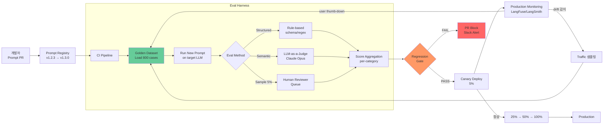

### LLM Evaluation & Prompt Versioning — "우리 챗봇 좋아졌나요?"라는 CEO 질문에 벙어리가 된 새벽, 그리고 프롬프트 한 줄 바꿨더니 CS 만족도가 4.2 → 3.1로 떨어져도 3주간 원인을 못 찾은 채 "요즘 왜 이래?"만 반복하다 결국 git blame 대신 Slack 스크롤을 뒤진 새벽

시니어 백엔드가 LLM 시스템에서 가장 늦게 깨닫는 진실은 이것이다.

> **"프롬프트는 코드다. 그런데 우리는 프롬프트를 로그 없이, 테스트 없이, 버저닝 없이, PR 없이 배포하고 있다."**

전통 백엔드는 `if (user.age > 18)` 한 줄 바꾸면 PR 리뷰, 유닛 테스트, 통합 테스트, 카나리, 롤백까지 자동으로 굴러간다. 그런데 프롬프트에서 `"You are a helpful assistant"`를 `"You are a professional customer service agent"`로 바꾸는 순간 — 이건 **모델 가중치를 바꾸는 것과 동등한 행위**임에도 — 대부분의 회사에서는 Slack에 "프롬프트 살짝 튜닝했어요 ㅎㅎ"로 끝난다.

그 결과가 위 부제의 새벽이다.

---

## 1. 왜 LLM MLOps는 전통 MLOps와 다른가

전통 ML은 `학습 → 지표 → 배포`의 사이클이 명확하다. Accuracy, F1, AUC 같은 숫자가 있고, 학습 데이터가 곧 정답이다.

LLM은 다르다.

| 축 | 전통 ML | LLM |
|---|---|---|
| 정답 | 라벨 (0/1, class) | **정답이 여러 개** ("고객이 만족했는가?"의 정답은 3개도, 30개도 가능) |
| 지표 | Accuracy, F1 | Faithfulness, Relevance, Toxicity — **모두 주관적** |
| 재현성 | Seed 고정 → 100% 재현 | Temperature 0이어도 provider 업데이트로 **어제와 다른 답** |
| 변경 단위 | 코드 + 모델 가중치 | **프롬프트, 모델 버전, RAG 컨텍스트, 툴 스펙** — 4축이 동시에 움직임 |
| 회귀 감지 | 테스트 셋 재실행 | LLM-as-a-Judge — **평가자도 LLM이라 평가자가 편향** |
| 배포 승인 | CI 초록불 | **"이거 어제보다 나아졌다"를 증명할 방법 자체가 어려움** |

이 표에서 시니어가 꽂혀야 할 곳은 마지막 줄이다. **"어제보다 좋아졌다"를 어떻게 증명하는가?** 이 질문에 답 못 하면, 팀은 프롬프트 변경 = 도박이 된다.

---

## 2. 핵심 구조 — 4개의 축

LLM Eval 파이프라인은 4개의 축이 맞물려야 한다. 하나라도 빠지면 새벽이 온다.

```
┌────────────────────────────────────────────────────────────────────┐
│                     LLM MLOps 4-Axis                                │
├────────────────────────────────────────────────────────────────────┤
│                                                                     │
│  ① Prompt Registry       ② Golden Dataset                          │
│  ────────────────        ─────────────────                         │
│  - Git-backed            - 200~2,000 케이스                         │
│  - Semantic Version      - 도메인 전문가 큐레이션                    │
│  - Rollback 지원          - 정답/오답/엣지케이스 태그               │
│  - Approval Workflow     - "Production Traffic에서 샘플링" 필수     │
│                                                                     │
│  ③ Eval Harness          ④ Regression Gate                         │
│  ───────────────         ──────────────────                        │
│  - LLM-as-a-Judge        - CI에 통합                                │
│  - Rule-based (regex)    - Baseline 대비 -N% 이상 하락 시 block    │
│  - Human-in-the-loop     - Per-category 지표 (전체 avg만 보면 함정) │
│  - Reference-based/free  - Canary → 5% → 25% → 100%                │
│                                                                     │
└────────────────────────────────────────────────────────────────────┘
```

### ① Prompt Registry — "프롬프트는 코드다"의 실체화

프롬프트를 코드베이스 안에서 `.md`나 `.jinja`로 관리하고, **Semantic Versioning**을 붙인다.

```
prompts/
  customer-service/
    v1.2.3/
      system.jinja
      few-shot-examples.yaml
      metadata.yaml   # model: claude-sonnet-4-6, temperature: 0.2, max_tokens: 1024
    v1.3.0-canary/
      ...
```

**금기 사항**:
- ❌ 프롬프트를 DB에 저장하고 어드민에서 실시간 편집 (git blame 불가, 롤백 불가)
- ❌ 프롬프트를 environment variable로 (300줄 프롬프트가 env에 들어가 있으면 그 회사는 반쯤 망한 상태)
- ❌ 프롬프트에 f-string으로 사용자 입력 직접 삽입 (Prompt Injection의 원흉)

### ② Golden Dataset — "우리가 뭘 잘하고 싶은가"의 진술

Golden Set은 두 원천에서 만든다.

1. **도메인 전문가 큐레이션** (100~500건): "이런 질문에는 이렇게 답해야 한다"의 정답셋
2. **Production Traffic 샘플링** (500~2,000건): 실제 사용자가 물은 것 + CS팀이 "챗봇이 이거 못 답한다"고 지목한 것

여기서 시니어가 반드시 지켜야 할 것: **Golden Set은 카테고리별로 균형 맞춰라.**

전체 평균 점수만 보면 "결제 카테고리에서 30% 하락, 배송 카테고리에서 40% 상승" → 평균 +5%로 나와서 배포 승인이 나고, 결제 CS는 다음 주 폭발한다.

### ③ Eval Harness — "누가 채점하는가"

세 가지 방식이 있고, **혼합해서 써야** 한다.

| 방식 | 장점 | 함정 | 언제 |
|---|---|---|---|
| **Rule-based** (regex, JSON schema 검증) | 빠름, 결정적, 무료 | 의미 평가 불가 | Structured Output, 특정 키워드 존재 |
| **LLM-as-a-Judge** | 의미 평가 가능, 확장 가능 | 평가 모델의 편향, 자기 자신 편애 (self-preference bias), 비용 | Faithfulness, Relevance, Tone |
| **Human Eval** | 최종 진실, 도메인 판단 | 느림, 비쌈, 라벨러 편차 | Golden Set 큐레이션, 분기별 캘리브레이션 |

**LLM-as-a-Judge의 시니어 함정** (매우 중요):

- 챗봇에 GPT-4를 쓰는데 평가자도 GPT-4로 하면 → **자기 자신 편애**로 실제보다 점수가 15~20% 높게 나온다.
- 평가자는 **더 강한 모델**(Claude Opus 4.7 등)이나 **다른 계열 모델**을 써야 한다.
- Chain-of-Thought 평가 프롬프트를 강제하라: `"먼저 근거를 3가지 열거하고, 그 후 1~5점을 매겨라"`. 그냥 점수만 뽑으면 편향이 크다.

### ④ Regression Gate — "CI가 프롬프트 변경을 막을 수 있는가"

프롬프트 PR을 열면, CI가 자동으로:

1. Golden Set 전체를 새 프롬프트로 실행
2. 카테고리별 지표를 baseline과 비교
3. 어느 카테고리라도 baseline 대비 임계치(-3%p 등) 이상 하락 시 **PR block**

이걸 안 하면 "프롬프트 살짝 튜닝"이 실서비스 붕괴로 이어진다.

---

## 3. 전체 파이프라인 다이어그램



핵심은 **하단의 루프**다. 프로덕션에서 잡힌 실패 사례(사용자 👎, drift alert, human sampling)가 **자동으로 Golden Set을 키운다**. 이 루프가 없으면 Golden Set은 첫날의 낡은 유물이 되고, 3개월 후엔 실서비스와 무관한 지표가 된다.

---

## 4. 실제 사례

### 사례 1: **GitHub Copilot의 "Prompt Eval Framework"** (2023 발표, 2025 재조명)

Copilot 팀은 초기에 "코드 완성이 좋은지는 사람이 보면 안다"고 판단했다가, 100명 규모로 커지면서 프롬프트 변경 → 회귀 문제가 폭발했다. 그래서 만든 것이:

- **7,000개 코드 완성 Golden Case** (언어별, 컨텍스트 길이별, 태스크별 균형)
- **Rule-based**: 컴파일 성공 여부, 테스트 통과 여부
- **LLM-as-a-Judge**: 코드 스타일, 관용구 준수 (다른 모델이 채점)
- **모든 프롬프트 변경은 이 파이프라인을 통과해야 PR 머지**

교훈: "사람이 보면 안다"는 스타트업 스케일까지만 유효하다. 팀이 20명 넘어가면 그 사람이 누구인지가 안 정해진다.

### 사례 2: **Anthropic Constitutional AI 팀의 Golden Set 운영** (공개 리서치)

Anthropic은 Claude 학습 과정에서 수만 건의 Golden Set을 유지하는데, 여기서 시니어가 배울 부분은 **"Category별 회귀 감지"**다.

새 모델이 전체 평균으로는 +2% 올랐어도 "의료 조언" 카테고리에서 -8% 하락 → 릴리즈 블록 → 재훈련. 이걸 전체 평균만 봤으면 릴리즈 → 의료 오조언 → 뉴스.

### 사례 3: **국내 D 금융사 (2025)** — Prompt Version 관리 부재의 대가

- 챗봇 프롬프트를 관리자 페이지에서 실시간 편집 가능하게 만듦 ("빠른 대응 필요"라는 명분)
- CS팀 매니저가 "환불 관련 답변이 딱딱하다"며 프롬프트에 `"친근하게, 이모지를 사용해"` 한 줄 추가
- 다음 날부터 **금융 상품 안내에도 🎉 이모지가 붙기 시작** → 금감원 민원 → 3주 조사
- git blame 불가, 롤백 불가 → 관리자 페이지 편집 이력을 DB에서 파내는 데 2일 소요
- 결국 프롬프트를 코드베이스로 옮기고, PR 승인 워크플로우 도입

교훈: **"실시간 편집 가능"은 편의가 아니라 무기고에 CCTV를 끄는 행위다.**

### 사례 4: **LinkedIn (2024) — "LLM Eval Platform"**

LinkedIn은 사내 10+ LLM 애플리케이션을 통합 관리하기 위해 Eval Platform을 만들었는데, 핵심 결정 3개:

1. **모든 프로덕션 트래픽의 1%를 자동 샘플링** → Golden Set으로 승격 검토
2. **LLM-as-a-Judge는 서로 다른 2개 모델의 합의** (GPT-4 + Claude Opus 둘 다 통과해야 인정)
3. **Human Eval은 분기별 캘리브레이션용**으로만 (LLM Judge의 편향을 보정)

이 세 가지는 스타트업이라도 그대로 훔쳐 쓸 만한 패턴이다.

---

## 5. 트레이드오프

| 결정 | 얻는 것 | 잃는 것 |
|---|---|---|
| **LLM-as-a-Judge 도입** | 수천 케이스 자동 채점 | 채점 비용 (Golden Set × PR 횟수 × 채점 모델 토큰), 편향 리스크 |
| **Golden Set 크기 확장 (200 → 2,000)** | 회귀 감지 정밀도 ↑ | Eval 시간 ↑ (CI가 10분 → 90분), 유지보수 부담 |
| **Prompt Registry (Git-based)** | 완전한 감사 추적, 롤백 | 비개발자(CS/기획)가 프롬프트 못 고침 → 병목 |
| **Regression Gate 엄격화 (-1%p block)** | 서비스 품질 안정 | 실험 속도 저하, "이번 배포는 예외" 문화 생성 위험 |
| **프로덕션 자동 샘플링** | Golden Set이 실서비스와 동기화 | PII/보안 이슈 (샘플링 데이터에 주민번호 섞이면 감사에서 폭발) |

---

## 6. 언제 도입하고 언제 미루는가

### 반드시 도입해야 하는 경우
- 프로덕션 LLM 애플리케이션 사용자 **> 1,000 DAU**
- 프롬프트를 만지는 사람이 **> 3명**
- 답변 오류가 **규제/법률/재무 리스크**로 직결 (금융, 의료, 법률, HR)
- 이미 프롬프트 변경 후 "왜 갑자기 이래?" 사건을 겪은 적 있음

### 도입은 하되 가볍게 시작해도 되는 경우
- PoC 단계 (Golden Set 20~50건 + 수동 실행)
- 내부 도구 (사고 나도 사용자 = 동료라 즉시 피드백)
- 단일 유스케이스 (챗봇 하나만)

### 아직 도입할 필요 없는 경우
- 완전 PoC, 사용자 = 개발자 본인 5명 이내
- 프롬프트 자체가 거의 변경되지 않는 단순 요약/번역 태스크
- 팀이 2명 이하 (오버엔지니어링)

**시니어의 판단 기준**: "다음 프롬프트 변경이 두려운가?" — Yes면 이미 늦었다.

---

## 7. 시니어가 반드시 경계할 함정

### 함정 1. Golden Set을 만들고 다시는 안 본다
- 3개월 후 Golden Set은 실서비스와 무관한 유물이 된다.
- **해결**: 프로덕션 트래픽 자동 샘플링 + 분기별 리큐레이션.

### 함정 2. LLM-as-a-Judge를 같은 모델로 채점
- GPT-4 챗봇을 GPT-4로 채점 → 자기 자신 편애로 점수 15~20% 부풀림.
- **해결**: 다른 계열 모델, 이상적으로는 2개 모델 합의.

### 함정 3. 전체 평균 지표만 본다
- 카테고리별로 쪼개지 않으면 "결제 30% 하락 + 배송 40% 상승 = 평균 +5%" 함정.
- **해결**: Per-category 대시보드, 카테고리별 회귀 게이트.

### 함정 4. Regression Gate가 없다
- Eval Pipeline은 있는데 "결과 보고 사람이 판단"이면 배포 압박에 밀려 무시된다.
- **해결**: CI에서 baseline 대비 임계치 초과 하락 시 **PR 자동 block**.

### 함정 5. 프롬프트를 DB에 저장한다
- 실시간 편집 가능 = 롤백 불가, git blame 불가, 감사 불가.
- **해결**: Git-backed Prompt Registry + PR 워크플로우. CS팀이 편집해야 한다면 별도 UI에서 "PR 자동 생성" 방식으로.

### 함정 6. 모델 버전 업그레이드를 Eval 없이 한다
- OpenAI/Anthropic이 모델 릴리즈하면 "새거 좋다니 바로 갈아탐" → 특정 도메인에서 성능 저하.
- **해결**: 모델 버전도 Prompt Registry에 metadata로 명시. 모델 교체도 **Eval Pipeline 통과 필수**.

### 함정 7. Human Eval을 안 한다
- 100% LLM-as-a-Judge → 판사가 편향된 걸 감지할 방법 없음.
- **해결**: 분기별로 최소 100건 Human Eval → LLM Judge와의 상관계수 측정 → 상관계수가 떨어지면 Judge 프롬프트 재튜닝.

---

> 💡 **왜 중요한가**: 프롬프트는 코드지만 대부분의 팀은 프롬프트를 코드처럼 다루지 않는다 — Eval Pipeline과 Prompt Registry가 없으면 "이 챗봇이 어제보다 좋아졌는지"에 답할 방법 자체가 없고, 그 순간 팀은 도박을 하고 있는 것이다.
