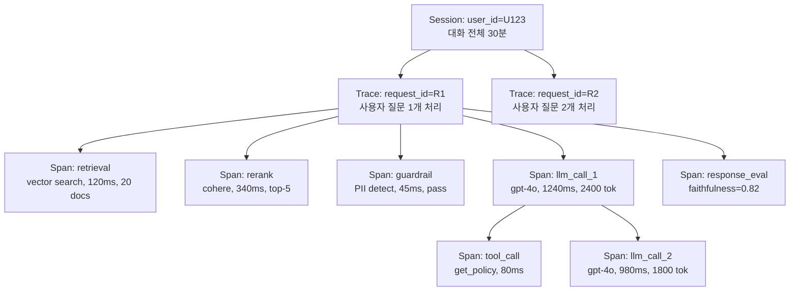

### LLM Observability & Distributed Tracing — "로그 남기면 되는 거 아니야?"라는 순진함, 그리고 챗봇이 3주간 "죄송합니다, 답변드릴 수 없습니다"만 반복하는 원인을 찾지 못한 채 CS팀장이 "이거 서비스 접자"고 임원 회의에 안건을 올린 새벽

Lv5 Day 94의 주제는 **LLM Observability**다. Lv3에서 배운 마이크로서비스 분산추적(OpenTelemetry, Jaeger)은 요청 하나가 서비스 A→B→C를 지나가는 걸 시각화한다. 그런데 LLM 시스템은 **한 요청 안에 비결정적 호출이 20~50번** 일어난다. Retrieval → Rerank → Prompt 조립 → Guardrail → LLM 호출 → Tool 호출 → LLM 재호출 → Parser → Validator. 각 단계가 확률적으로 실패하고, 실패해도 200 OK로 응답이 나온다. **HTTP status로는 아무것도 안 보인다.**

---

## 왜 기존 APM으로는 안 되는가

Datadog·New Relic·Elastic APM은 "요청 → 응답 시간, 에러율, DB 쿼리 수"를 본다. LLM 시스템에서 이걸로 잡히지 않는 것들:

| 사고 유형 | 기존 APM 신호 | 실제 원인 |
|---|---|---|
| 챗봇이 "모른다"만 반복 | 200 OK, p95 1.2s (정상) | Retrieval top-3에 폐지 문서만 잡힘 |
| 응답 품질 저하 | 아무 알람 없음 | Prompt v2.3.1에서 few-shot 3개 중 1개가 오타 |
| OpenAI 청구서 3배 | latency는 정상 | Agent loop가 tool call 12회 반복 |
| 특정 사용자만 이상한 답 | 요청 성공률 100% | 그 사용자 session에만 이전 대화가 오염됨 |
| Reranker가 죽어도 서비스는 정상 | 5xx 없음 | Fallback으로 raw vector search가 나가는 중 |

**핵심 통찰**: LLM 시스템의 장애는 "실패"가 아니라 "**품질 저하**"로 나타난다. 200 OK인데 답이 이상하다. 이걸 감지하려면 **요청 하나의 전체 여정 + 각 단계의 입출력 + 품질 지표**를 함께 저장해야 한다.

---

## 관측의 3계층 모델 (Session / Trace / Span)

LLM 관측은 3-tier 계층으로 설계한다. OpenTelemetry의 Trace/Span 개념을 확장한 것.



- **Session**: 사용자 대화 단위. 이전 turn의 컨텍스트 오염을 추적한다.
- **Trace**: 사용자 발화 1개에 대한 처리 전체. Root span 하나.
- **Span**: 개별 단계. Retrieval, Rerank, LLM 호출, Tool 호출, Guardrail 각각이 span.

각 span에 반드시 실어야 하는 필드:

```json
{
  "span_id": "sp_a3f2",
  "trace_id": "tr_9b81",
  "session_id": "sess_U123",
  "name": "llm_call_1",
  "start_ts": "2026-09-26T14:22:11.234Z",
  "duration_ms": 1240,
  "input": { "messages": [...], "tools": [...] },
  "output": { "content": "...", "tool_calls": [...] },
  "model": "gpt-4o-2024-11-20",
  "prompt_version": "policy_v2.3.1",
  "usage": { "prompt_tokens": 1820, "completion_tokens": 580, "cost_usd": 0.0121 },
  "metadata": { "user_tier": "enterprise", "route_reason": "high_stakes" },
  "eval": { "faithfulness": 0.82, "relevance": 0.91 }
}
```

**시니어가 놓치는 부분**: `input`/`output`을 **원문 그대로** 저장해야 한다. 요약본이나 hash로는 재현이 불가능하다. 이 때문에 저장소 비용이 폭발한다 → 뒤에서 샘플링 전략으로 다룬다.

---

## 왜 별도 툴이 필요한가 — Jaeger로 하면 안 되는 이유

"OpenTelemetry로 span 찍고 Jaeger에 보내면 되지 않나?" — 이론적으로 가능하다. 실무에서 실패하는 이유:

1. **Payload 크기**: Jaeger는 span attribute를 보통 8KB 이하로 가정한다. LLM prompt는 20KB~200KB. 잘려나간다.
2. **품질 지표 부재**: Jaeger는 latency 중심 UI다. `faithfulness=0.82`, `hallucination_score=0.31` 같은 지표를 diff/트렌드로 보여주는 화면이 없다.
3. **Prompt playground 부재**: 문제 있는 span을 발견했을 때 그 자리에서 프롬프트를 수정하고 재실행하는 UX가 없다.
4. **Dataset 연결**: "이 span의 입출력을 golden dataset에 넣기" 버튼이 없다. 관측 데이터가 eval 데이터로 흐르지 않는다.

이래서 **LangSmith / Langfuse / Arize Phoenix / Helicone** 같은 LLM 전용 관측 툴이 존재한다.

---

## 3대 솔루션 비교 (2026년 기준)

| 항목 | LangSmith | Langfuse | Arize Phoenix |
|---|---|---|---|
| 라이선스 | 상용 SaaS (self-host 유료) | **오픈소스** + 상용 클라우드 | 오픈소스 + 상용 |
| Native SDK | LangChain 최적화 | 프레임워크 중립 | OpenTelemetry 기반 |
| Dataset/Eval | 강력 (in-place eval) | 강력 (v3 이후) | Eval에 강점 (Arize의 본업) |
| Prompt Registry | ✅ | ✅ | ❌ (별도 필요) |
| Self-host 난이도 | 어려움 | **쉬움** (Docker Compose) | 중간 |
| 국내 도입 사례 | 스타트업 소수 | **금융권 자체구축 다수** | AI 리서치팀 |

**시니어의 선택 기준**:
- 데이터가 회사 밖으로 나가면 안 됨 → **Langfuse self-host** (금감원 규제 대응)
- LangChain 100% 스택, 팀이 작음 → **LangSmith SaaS**
- Eval이 최우선, 이미 Arize 쓰고 있음 → **Phoenix**
- 위 조건 다 애매하면 → **Langfuse**. 오픈소스라 락인 없음.

---

## 샘플링 전략 — 100% 저장하면 파산한다

일 100만 requests × 평균 30KB payload = 30GB/일 = 11TB/년. 여기에 인덱싱 오버헤드 3~5배. **다 저장할 수 없다.**

### 잘못된 접근: Uniform Sampling 10%
"랜덤 10%만 저장" → **정상 트래픽만 걸리고 이상 요청은 놓친다.** 사용자 컴플레인이 들어왔을 때 그 사용자의 trace가 없다.

### 시니어가 쓰는 4-tier 샘플링

```
Tier 1 (100% 저장): 에러 발생 / guardrail 차단 / eval score < threshold
Tier 2 (100% 저장): VIP 사용자 / 특정 tenant / 특정 prompt version 카나리
Tier 3 (100% 저장): 최근 24h 동안 컴플레인 온 user_id
Tier 4 (10% 샘플):  나머지 정상 트래픽
```

핵심은 **Tail-based sampling** — trace가 끝난 뒤 저장 여부를 결정한다. Head-based(시작할 때 결정)로 하면 이상 신호를 놓친다. Langfuse는 이걸 SDK 레벨에서 지원, LangSmith는 project 단위 필터로 유사 구현.

---

## 실제 사례

### 사례 1: **Anthropic** 내부 관측 스택 (공개된 부분)

Claude를 서빙하는 내부 시스템은 OpenTelemetry 기반의 자체 trace 시스템을 쓴다. 특징:
- **모든 tool call에 trace_id 전파** (Claude Code의 sub-agent도 parent trace에 붙는다)
- **Prompt version이 span attribute로 필수 태깅** — 어느 버전이 어느 지역에서 배포됐는지 실시간 추적
- 품질 지표(refusal rate, hallucination signal)를 latency와 **동일 대시보드**에 놓음

시사점: 시니어는 "관측 = 로그"가 아니라 "관측 = 배포 시스템의 피드백 루프"로 본다.

### 사례 2: **국내 E 은행 (2026)** — Langfuse Self-host로 금감원 감사 대응

RAG 챗봇 도입 후 3개월 만에 금감원이 "AI 응답 재현성"을 요구. 요구사항:
- 특정 고객이 X월 Y일 Z시에 받은 답변을 **재현 가능**해야 함
- 그 답변 생성에 쓰인 검색 문서, 프롬프트, 모델 버전이 **감사 시점에 조회 가능**해야 함 (5년 보관)

기존 ELK 스택으론 불가능. **Langfuse self-host + S3 archive**로 구축:
- Hot storage(90일): PostgreSQL
- Cold storage(5년): S3 Parquet
- 감사 조회는 Trino로 S3 직접 쿼리

**교훈**: 금융권/의료 도메인에서는 관측이 감사 인프라다. LangSmith SaaS는 데이터 국외 반출 이슈로 탈락.

### 사례 3: **Uber** GenAI Platform (2024 tech blog)

Uber는 Langfuse 오픈소스를 fork해서 자체 확장. 이유:
- 하루 수십억 span → 자체 데이터 파이프라인(Kafka + Pinot) 필요
- 팀별 cost attribution을 위해 **span 태그에 team/project 강제**
- 잘못된 프롬프트 배포 시 5분 내 롤백을 위해 관측 데이터 → 배포 시스템 자동 알람

시사점: **관측은 규모가 커지면 자체구축한다.** 하지만 처음부터 자체구축은 자살 행위.

---

## 함정 (시니어가 반드시 경계할 것)

### 함정 1. Trace boundary가 async 경계에서 끊긴다
Agent가 `asyncio.gather()`나 Celery task로 fan-out 하면 context propagation이 깨진다. Sub-span이 orphan이 되고, 대시보드에서 "이 tool_call이 어느 요청에서 나왔는지" 못 찾는다. → **OpenTelemetry Context를 명시적으로 주입**해야 한다. Langfuse는 `@observe` 데코레이터가 이걸 자동화하지만, custom async 코드에선 여전히 놓친다.

### 함정 2. PII를 그대로 저장한다
사용자 발화 원문에 주민번호·카드번호가 섞여 들어온다. 관측 저장소가 곧 개인정보 유출 벡터가 된다. → **Ingestion pipeline에 masking 필터** 필수. Langfuse는 SDK 레벨 `mask_sensitive_data` 훅 제공.

### 함정 3. 관측 시스템이 서비스보다 먼저 죽는다
Langfuse 서버가 응답 안 하면 애플리케이션이 blocking → 챗봇 전체 다운. → **반드시 async + 로컬 buffer + 실패 시 drop** 정책. 관측은 best-effort여야 한다. "관측 실패 = 요청 실패"는 안 된다.

### 함정 4. Prompt version을 span에 안 태그
프롬프트 v2.3.1 배포 후 응답 품질이 떨어졌는데, span에 version 태그가 없어서 "언제부터 이상해졌지?"를 추적 못한다. → **모든 LLM span에 `prompt_version`, `model_version`, `deployment_id` 3종 세트 필수**. 이거 안 하면 관측 시스템 있어도 없는 것과 같음.

### 함정 5. Cost를 실시간으로 안 본다
"월말에 청구서 보고 놀란다"는 안티패턴. → Cost를 span-level에서 집계 → **팀/프로젝트/사용자 단위로 실시간 dashboard**. 이상 급증(하루 예산의 3σ 초과) 시 자동 rate limit. Anthropic Console, LangSmith, Langfuse 모두 이 기능 있음.

### 함정 6. Eval score를 관측에 흘려보내지 않는다
"우린 오프라인 eval을 CI에서 돌린다" → 프로덕션에서 실제 사용자 요청에 대한 품질은 모른다. → **Online eval**: 프로덕션 응답의 5~10%를 LLM-as-judge로 실시간 채점 → span attribute에 실어서 시계열로 관찰. 품질 저하 조기 경보의 유일한 방법.

---

## 언제 도입하고 언제 미룰 것인가

### 반드시 도입해야 하는 경우
- **프로덕션 LLM 트래픽이 있는 모든 시스템** (예외 없음)
- Agent 시스템 (span 없이 디버깅 불가능)
- 금융·의료·법률 도메인 (감사 요건)
- 다중 프롬프트 버전을 A/B 하는 시스템

### 최소 구성만으로 시작해도 되는 경우
- MVP/PoC 단계 → Langfuse Cloud 무료 티어로 시작, 트래픽 늘면 self-host
- 팀이 2명 이하 → 자체구축 절대 금지, SaaS 써서 시간 벌기

### 아직 도입하지 않아도 되는 경우
- LLM 호출이 배치 잡 하나뿐 (span 계층이 없음) → CloudWatch Logs로 충분
- 완전 내부 도구, 사용자 없음 → print()로 시작해도 됨

### 하지 말아야 하는 경우
- **Jaeger/Datadog APM만으로 LLM 관측 커버하려는 시도** → 3개월 뒤 다시 만든다
- **자체구축부터 시작** → 90%는 실패. Langfuse OSS 먼저 써보고 부족한 부분만 확장

---

## 핵심 설계 원칙 4개

1. **Session > Trace > Span 3-tier 필수**. Session 없으면 대화 오염 못 잡는다.
2. **관측 시스템은 async + best-effort**. 서비스 latency에 절대 영향 주면 안 된다.
3. **Prompt version / Model version은 모든 LLM span의 필수 태그**. 없으면 관측 무의미.
4. **Cost와 Quality는 latency와 동급 지표**. 셋 다 같은 대시보드에 놓는다.

---

> 💡 **왜 중요한가**: LLM 시스템의 장애는 500 에러가 아니라 "200 OK인데 답이 이상함"으로 나타나기 때문에, 요청의 전체 여정과 각 단계의 입출력·품질·비용을 함께 저장하는 관측 인프라 없이는 근본 원인 분석 자체가 불가능하다.
